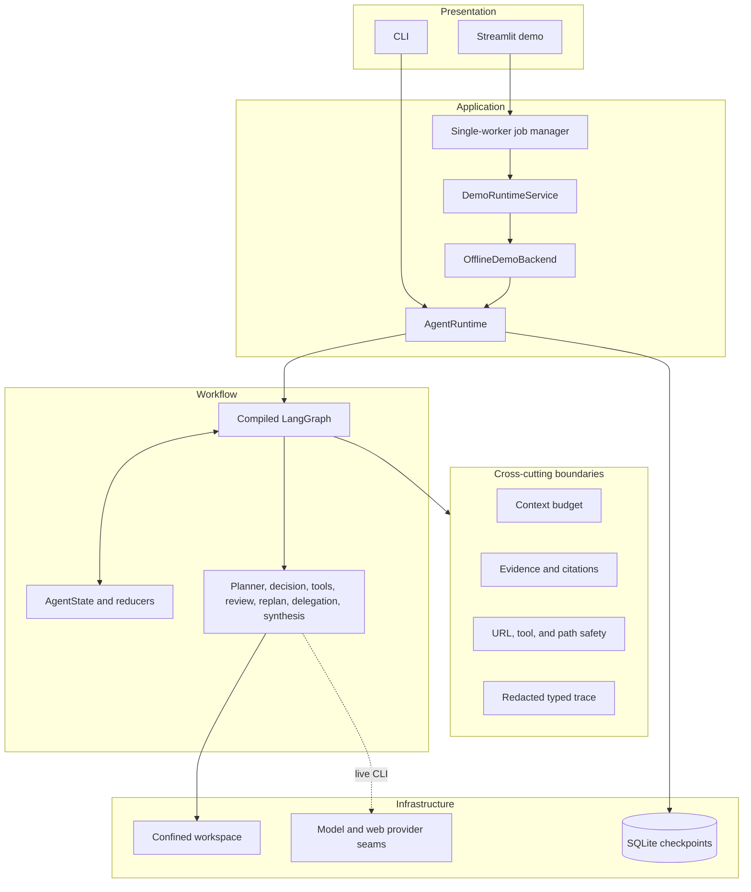
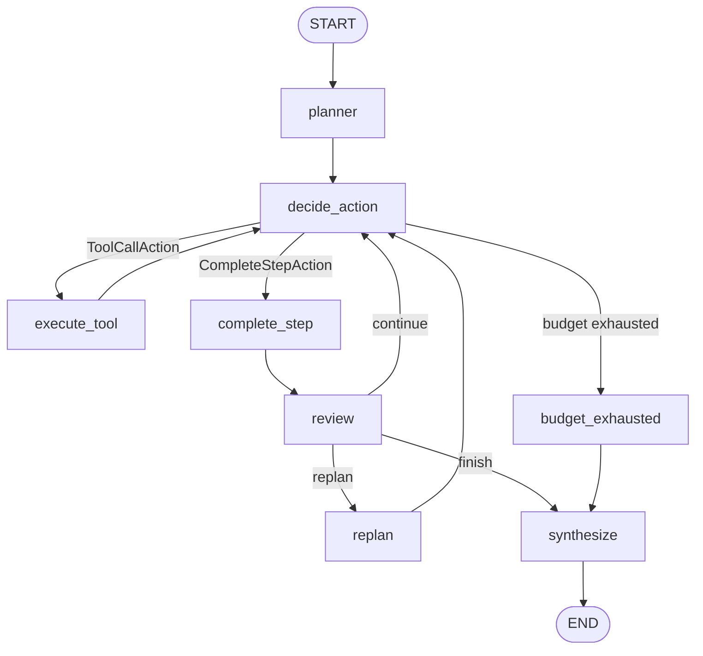
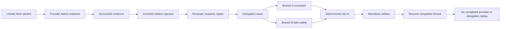

# Mini DeerFlow

> A bounded research-agent learning MVP, independently implemented to explore DeerFlow-style concepts: planning, typed tool execution, evidence, review and replanning, delegation, checkpoint/resume, safety, tracing, and deterministic evaluation.

Mini DeerFlow is a local Python project with two entry points:

- a live-capable CLI composed with an OpenAI-compatible model and Jina web provider;
- a deterministic offline Streamlit mentor demo that needs no API key or network.

It is a completed learning MVP—not a production platform, DeerFlow clone, or upstream-compatible implementation.

## Project Status

| Area | Status |
| --- | --- |
| Core research-agent runtime | Complete |
| Planning and typed action loop | Complete |
| Evidence and citation membership | Complete |
| Review and bounded replanning | Complete |
| Depth-one bounded delegation | Complete |
| SQLite checkpoint and resume | Complete |
| Tool, workspace, and fetch safety boundaries | Complete |
| Redacted execution tracing | Complete |
| Deterministic Streamlit mentor demo | Complete |
| Production deployment | Deferred |
| Upstream DeerFlow parity | Not claimed |

## What It Does

```text
Goal
  ↓
Structured Plan
  ↓
Typed Action
  ↓
Allowlisted Tool
  ↓
Observation
  ↓
Evidence
  ↓
Citation Membership Check
  ↓
Review ──→ Continue / Replan / Finish
  ↓
Optional Delegation and Fan-in
  ↓
Deterministic Synthesis
  ↓
Markdown Artifact
```

1. The planner creates a validated plan with 3–7 consecutively numbered steps.
2. The action selector emits either a typed tool call or a step-completion action.
3. The runtime validates the selected tool, arguments, timeout, and remaining budgets.
4. Successful web observations can become bounded `EvidenceRecord` values with provenance.
5. Proposed citations are canonicalized and checked against successful evidence.
6. The reviewer chooses `continue`, `replan`, or `finish`; replan replaces only unfinished work.
7. The parent may run a bounded, depth-one research wave and deterministically fan results in.
8. Synthesis produces deterministic Markdown and can optionally write it through the workspace boundary.

### Evidence is not a raw provider result

Evidence is a structured, bounded record extracted from a successful `web_search` or `web_fetch` observation. It retains source-tool, step, call, and optional delegation provenance.

### Citation validation is not fact checking

Citation validation establishes one narrow property: the proposed citation's canonical URL is a member of successful evidence. It does not prove factual correctness, semantic entailment, or absolute source quality.

## Architecture



The canonical runtime graph is [`src/mini_deerflow/agent_workflow.py`](src/mini_deerflow/agent_workflow.py). [`src/mini_deerflow/workflow.py`](src/mini_deerflow/workflow.py) is a smaller scaffold used by focused workflow tests; it is not the final runtime graph.

Dependency injection is explicit through constructors and factories. There is no REST API or service container in the current project.

## Core Workflow



`AgentState` is a checkpointed `TypedDict` with mutable container semantics. Graph nodes return partial updates, and reducers merge messages, lists, evidence, and citation sources. It is not an immutable state object.

## Key Features

| Area | Implemented capability | Boundary |
| --- | --- | --- |
| Agent execution | Structured planning, typed actions, controlled termination | Per-step, total-call, replan, and recursion limits |
| Tools | Exact-name registry and validated input models | No arbitrary tool execution |
| Evidence | Structured records, canonical URLs, provenance | Only successful schema-shaped web observations qualify |
| Citations | Membership validation and invented-URL rejection | Does not prove truth or entailment |
| Adaptation | Review and bounded replanning | Completed steps and durable evidence are preserved |
| Delegation | 2–3 branches, depth one, budget 1–5 per branch | Web-only branches; no nested delegation or writes |
| Fan-in | Stable branch ordering and citation revalidation | Failed-branch findings are not promoted |
| Persistence | SQLite checkpoint and thread-based resume | No exactly-once guarantee for external effects |
| Context | Deterministic LLM-facing projections | Character budget; token count is only `ceil(chars / 4)` |
| Safety | Tool, workspace, fetch-target, and rendering boundaries | Application-level controls, not a production sandbox |
| Observability | Typed ordered trace and safe projections | No raw payload or production telemetry backend |
| Artifact | Deterministic Markdown and optional confined write | No production artifact serving |

## Deterministic Mentor Demo

The default Streamlit experience is **offline**, **deterministic**, **localhost-oriented**, and designed for a 5–7 minute mentor walkthrough. It uses the real runtime, workflow, SQLite checkpointer, evidence/citation logic, reviewer/replanner, delegation fan-in, tracing, workspace, and artifact boundary.

External decision/data seams are replaced with scripted model, provider, resolver, and researcher behavior; trace identity/time is also deterministic. The offline backend constructs settings with `_env_file=None`, needs no model credentials, and does not fall back to a live provider.



This scenario demonstrates contracts and failure handling. It is not a benchmark of live research quality.

## Streamlit UI

| Tab | Purpose |
| --- | --- |
| Overview | Goal, plan, current step, budgets, and limitations |
| Evidence & Citations | Bounded evidence, provenance, accepted citations, and rejected count |
| Delegation | Wave/branch status, budget accounting, and fan-in limitations |
| Trace | Filtered, ordered, safe execution timeline |
| Artifact | Structured preview, exact Markdown source, and download |

```text
Runtime state and trace
        ↓
Explicit projector
        ↓
Frozen, allowlisted view models
        ↓
Streamlit renderer
```

The UI does not directly receive raw messages, prompts, model responses, provider exception bodies, arbitrary tool arguments, checkpoints, SQLite internals, credentials, `.env` content, machine paths, rejected URLs, or raw trace payloads. This is a tested local-demo boundary, not a production frontend security claim.

## Requirements and Setup

- Python 3.12 or newer
- [uv](https://docs.astral.sh/uv/)
- API credentials only for live CLI commands; the offline demo needs none

```bash
git clone https://github.com/hhtuann/mini-deerflow.git
cd mini-deerflow
uv sync
```

For the live-capable CLI, copy the checked-in example and provide credentials:

```bash
cp .env.example .env
```

PowerShell:

```powershell
Copy-Item .env.example .env
```

Minimum live-model configuration:

```dotenv
MINI_DEERFLOW_API_KEY=replace-with-your-api-key
```

The live CLI also supports model endpoint/name, request/retry settings, and an optional `MINI_DEERFLOW_JINA_API_KEY`. See [`.env.example`](.env.example). Never commit `.env`.

## Run the Streamlit Demo

```bash
uv run streamlit run src/mini_deerflow/demo/app.py \
  --server.address 127.0.0.1 \
  --server.headless true \
  --browser.gatherUsageStats false
```

PowerShell:

```powershell
uv run streamlit run src/mini_deerflow/demo/app.py `
  --server.address 127.0.0.1 `
  --server.headless true `
  --browser.gatherUsageStats false
```

The bind address is a launch configuration; the app does not enforce localhost by itself. The repository also disables Streamlit usage-stat gathering in `.streamlit/config.toml`.

## CLI

Verified commands:

```bash
uv run mini-deerflow --help
uv run mini-deerflow plan --help
uv run mini-deerflow run --help
uv run mini-deerflow resume --help
uv run mini-deerflow threads --help
```

```bash
# Create a validated plan.
uv run mini-deerflow plan "Compare two agent orchestration approaches."

# Run a new persisted thread.
uv run mini-deerflow run \
  "Inspect the workspace and summarize verified evidence." \
  --thread-id research-001

# Resume without supplying a new goal.
uv run mini-deerflow resume --thread-id research-001

# List persisted thread IDs.
uv run mini-deerflow threads
```

`run` and `resume` also expose checkpoint/workspace paths, write opt-in, execution limits, delegation concurrency, and `--trace-json`. Use `uv run mini-deerflow <command> --help` for the verified option list. `write_file` is not model-selectable; when `--allow-write` is enabled, synthesis writes the fixed report artifact through the workspace boundary.

## Persistence and Resume

### Run

`run` creates a new initial state for a validated thread ID. It rejects the request if that thread already has a checkpoint in the selected SQLite database.

### Resume

`resume` restores the checkpointed LangGraph state without replacing the goal. Tests verify that completed work, including completed delegation, is not replayed on the exercised resume path. Resume is not retry semantics.

### External-effect limitation

Checkpoint reuse is not an exactly-once guarantee:

```text
external effect succeeds
        ↓
process crashes before checkpoint persistence
        ↓
resume may repeat the effect
```

Fresh-backend resume is tested in-process. A separate OS-process restart has not been directly verified by the current suite.

## Safety Boundaries

### Tool boundary

Tool input/result models reject unknown fields, the registry is an exact-name allowlist, the runner applies timeouts, and failures are normalized. These are validated closed schemas, not arbitrary execution.

### Workspace boundary

The workspace rejects absolute paths, traversal, symlink/junction escapes, and oversized reads/writes. This confines project file tools; it is not an OS sandbox or production artifact service.

### Web boundary

`web_fetch` accepts HTTP(S), rejects userinfo and local/non-public targets, requires resolved addresses to be public, and validates provider-declared redirect/final URL metadata before accepting content into a successful result. Search-result URLs use typed schema and canonicalization but do not pass through the fetch target validator.

This is an implemented application-level URL safety boundary, not a claim of complete SSRF, DNS-rebinding, redirect, or production egress protection.

### Trace boundary

Execution traces use a closed typed schema and exclude prompts, queries, URLs, response bodies, excerpts, artifact content, arbitrary payloads, exceptions, and tracebacks. The CLI can emit redacted JSON Lines to stderr; Streamlit consumes a projected FIFO trace queue.

## Testing and Evaluation

```bash
uv run pytest -q
uv run ruff check .
uv run ruff format --check .
uv lock --check
uv run python evals/run_evals.py --dataset evals/dataset.json
```

| Check | Latest verified result |
| --- | --- |
| Full pytest | 526 passed, 2 skipped |
| Deterministic evaluator | 9/9 cases |
| Evaluator invariants | 36/36 |
| Ruff check | Pass |
| Ruff format check | Pass |
| Lock check | Pass |

The two skipped tests require Windows symlink creation unavailable in the exercised environment. Results demonstrate tested contracts and failure behavior; they do not prove production readiness, live-provider quality, factual correctness, or absence of all bugs.

Coverage includes unit contracts, graph integration, persistence/resume, URL and workspace safety, context pressure, delegation, trace redaction, final acceptance, Streamlit `AppTest`, offline no-network behavior, and deterministic evaluator cases.

## Project Structure

```text
mini-deerflow/
├── src/mini_deerflow/
│   ├── cli.py                     # CLI entry point
│   ├── runtime.py                 # composition and runtime lifecycle
│   ├── agent_workflow.py          # canonical LangGraph workflow
│   ├── state.py, actions.py       # state and typed actions
│   ├── evidence.py                # evidence, citations, report rendering
│   ├── review.py, replanner.py    # quality loop
│   ├── delegation.py              # bounded research waves and fan-in
│   ├── persistence.py             # SQLite checkpoint boundary
│   ├── web_safety.py              # fetch-target validation
│   ├── tracing.py, workspace.py   # observability and file boundary
│   ├── tools/                     # contracts, registry, runner, tools
│   └── demo/                      # Streamlit facade, jobs, projection, UI
├── tests/                         # unit, integration, system, AppTest
├── evals/                         # deterministic evaluator and dataset
├── docs/                          # technical and learning documentation
├── pyproject.toml
├── uv.lock
└── README.md
```

## Technology Stack

| Layer | Technology and actual use |
| --- | --- |
| Language | Python 3.12+ and `asyncio` |
| Agent orchestration | LangGraph 1.2.11+ |
| Model integration | LangChain OpenAI 1.6+ |
| Contracts/config | Pydantic 2.13+, pydantic-settings 2.15+ |
| Persistence | SQLite, aiosqlite 0.22+, LangGraph SQLite checkpointer 3.1+ |
| Frontend | Streamlit 1.64+ |
| Background execution | Single-worker `ThreadPoolExecutor` |
| Tests | pytest 9.1+ and Streamlit `AppTest` |
| Quality/package management | Ruff 0.16+ and uv |

## Important Engineering Decisions

| Decision | Why | Trade-off |
| --- | --- | --- |
| LangGraph | Conditional durable workflow and resume | Framework coupling |
| Typed actions/tools | Reject malformed decisions and inputs | More schema maintenance |
| SQLite checkpoints | Simple local durability | Single-host lifecycle |
| Bounded budgets | Deterministic termination | May stop before ideal evidence depth |
| Context projections | Control exact serialized context size | Character-based, not semantic compression |
| Citation membership | Reject URLs absent from evidence | Does not prove truth or entailment |
| Depth-one delegation | Control amplification and capability | Limited specialization |
| Deterministic fan-in | Stable ordering and failure semantics | Fixed aggregation policy |
| Explicit UI projector | Keep raw runtime data behind an allowlist | Mapping maintenance |
| One worker per session | Clear non-blocking demo state | No distributed throughput or cancellation |
| Offline scenario | Reproducible mentor walkthrough | Does not validate live-provider quality |

## DeerFlow Relationship

Mini DeerFlow is an independent learning implementation inspired by DeerFlow-style research-agent concepts: planning, plan-act-observe, tool-mediated execution, evidence-backed synthesis, review/replanning, bounded delegation, checkpoint/resume, tracing, and artifact generation.

It deliberately simplifies the problem to one local workflow, SQLite persistence, depth-one homogeneous web branches, deterministic fixtures, and a single-worker Streamlit demo. It has no browser/shell execution, production scheduler, tenancy layer, or upstream conformance suite.

No claim is made about source compatibility, behavioral equivalence, feature parity, current upstream architecture, or production readiness.

## Production Boundary

| Current MVP | Production direction |
| --- | --- |
| Local SQLite | Managed persistence, migration, backup, retention, HA |
| In-process worker | Durable queue, leases, and distributed workers |
| One active job per session | Multi-user concurrency and quotas |
| No authentication/authorization | Identity and resource policy |
| Local workspace | Isolated, access-controlled artifact storage |
| Offline Streamlit demo | Explicit live-backend and credential policy |
| Local typed trace | Centralized telemetry and retention controls |
| Application validation | Stronger sandbox and network egress enforcement |
| No cancellation | Cooperative cancellation and compensation |
| Local artifact download | Access-controlled artifact delivery |

## Learning Outcomes

This project exercises:

- stateful agent architecture and LangGraph routing;
- structured model output and tool contracts;
- explicit dependency injection and async resource ownership;
- bounded context projection and execution budgets;
- evidence/citation provenance and deterministic synthesis;
- reviewer-driven replanning and completed-work preservation;
- bounded delegation, partial failure, and fan-in;
- SQLite persistence and resume semantics;
- application-level security boundaries and redacted observability;
- Streamlit frontend/runtime separation;
- deterministic failure-oriented tests and evaluation.

## Documentation

- [Project-level technical report](docs/project-report-mini-deerflow.md)
- [Day 15 learning report](docs/report-ngay-15-mini-deerflow.md)
- [Local deterministic Streamlit demo guide](docs/streamlit-local-demo-day-15.md)

The project report is the architecture deep dive; this README is the GitHub entry point.

## Current Limitations

- Live-provider research quality, cost, and latency are not benchmarked by acceptance tests.
- Citation membership does not establish factual correctness or semantic entailment.
- Context accounting is character-based; exact tokenizer accounting is not implemented.
- Semantic context compression or vector memory is not implemented.
- External side effects do not have an exactly-once guarantee.
- Distributed execution, durable queues, cancellation, auth, and multi-tenancy are absent.
- Production artifact serving, access control, egress isolation, and telemetry are absent.
- Separate OS-process restart behavior has not been directly exercised.
- Two workspace symlink tests were skipped in the verified Windows environment.
- Complete SSRF/DNS-rebinding protection is not claimed.

Mini DeerFlow has met its learning and mentor-demo goals. Production readiness and DeerFlow parity remain explicitly outside the verified scope.
