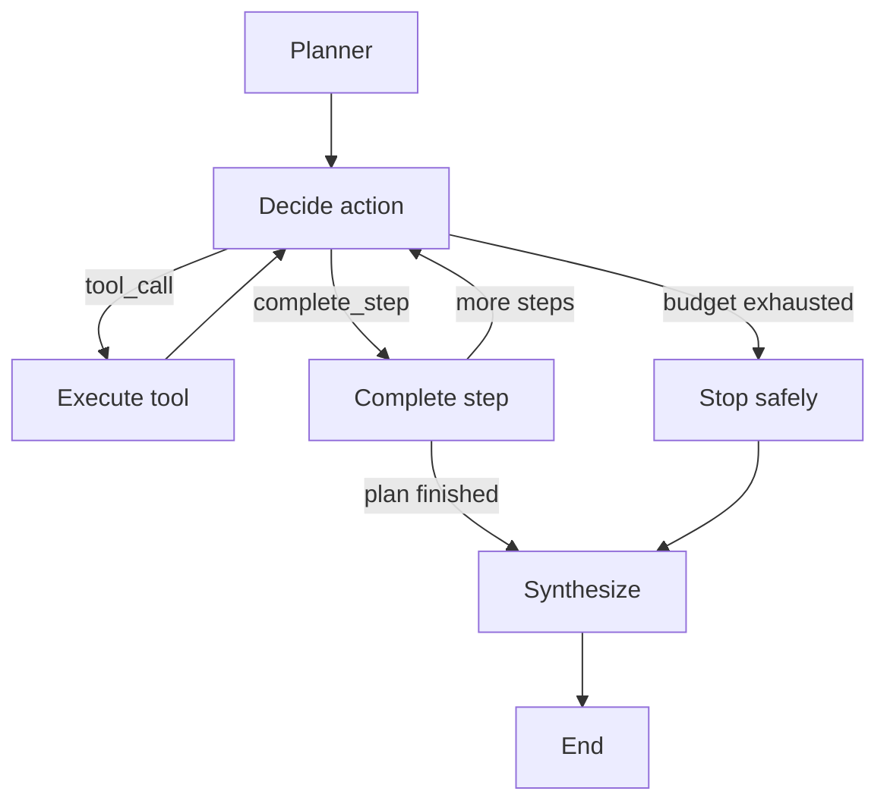

# Bounded Agent Action Loop — Day 06

## Purpose

Day 06 replaces the deterministic execution stub with a bounded agent loop.

The loop allows an LLM to choose between two actions:

- call one registered tool;
- complete the current plan step.

Every decision is validated, recorded in shared state, constrained by tool-call
budgets, and routed through the secure execution layer implemented on Day 05.

The workflow does not allow the LLM to invoke arbitrary Python functions or
skip the registered tool boundary.

## Architecture



## Action contract

An agent decision is represented by one of two strict Pydantic models.

### Tool call

```json
{
  "action_type": "tool_call",
  "tool_name": "list_files",
  "arguments": {
    "directory": "."
  }
}
```

A tool call requests one concrete operation.

It does not execute anything by itself. The action must still pass through the
tool registry, input validation, timeout handling, and the tool runner.

### Step completion

```json
{
  "action_type": "complete_step",
  "summary": "The controlled workspace files were identified.",
  "sources": []
}
```

A completion action records the result of the current plan step and advances
the workflow.

The LLM cannot directly modify `current_step`.

## Domain and transport fields

Internally, actions use the field named `type`:

```python
{
    "type": "tool_call",
    "tool_name": "list_files",
    "arguments": {"directory": "."},
}
```

The OpenAI-compatible transport schema uses `action_type`:

```python
{
    "action_type": "tool_call",
    "tool_name": "list_files",
    "arguments": {"directory": "."},
}
```

Pydantic aliases translate between these two representations.

This keeps the internal domain terminology stable while remaining compatible
with the configured GLM gateway.

## Strict validation

The action models are configured with:

- `extra="forbid"`;
- frozen instances;
- discriminated unions;
- bounded strings and collections;
- JSON-compatible tool arguments.

Structured output reduces malformed model responses, but it does not eliminate
hallucination.

The following runtime checks are still required:

- the requested tool must exist in the registry;
- its arguments must pass the tool input model;
- the workflow must enforce its budgets;
- tool output must be treated as untrusted evidence.

## JSON mode compatibility

The configured OpenAI-compatible GLM gateway returned semantically correct JSON
inside a Markdown JSON fence.

Provider-native structured parsing rejected that response before Pydantic
validation.

`LLMActionSelector` therefore configures structured output with:

```python
method = "json_mode"
```

The system prompt describes the expected action schema, LangChain parses the
JSON response, and Pydantic performs the final client-side validation.

Invalid or hallucinated fields still fail closed.

## Action context

The model does not receive the complete `AgentState`.

Instead, `ActionContext` contains only information needed for the current
decision:

- research goal;
- current `PlanStep`;
- available registered tools and their input schemas;
- observations from the current step;
- remaining per-step tool calls;
- remaining total tool calls.

This reduces token usage and prevents observations from unrelated steps from
polluting the current decision.

## Execution state

Day 06 adds these fields to `AgentState`:

- `pending_action`;
- `tool_observations`;
- `tool_calls_in_current_step`;
- `total_tool_calls`.

`pending_action` allows the selected action to be checkpointed before it is
executed.

`tool_observations` uses an append reducer so observations from previous tool
calls are preserved.

The counters use replacement semantics because each node returns the complete
new counter value.

## Tool observation

A `ToolObservation` records:

- plan step number;
- tool-call number within that step;
- tool-call number within the run;
- validated action;
- structured `ToolResult`.

This information supports:

- debugging;
- checkpoint recovery;
- user-interface progress;
- audit trails;
- deterministic tests.

Both successful and failed tool calls become observations.

## Budget enforcement

The workflow uses two independent limits.

### Per-step budget

This limit prevents one plan step from repeatedly calling tools without making
progress.

It resets when the workflow advances to the next step.

### Total-run budget

This limit bounds total execution cost across the entire plan.

It never resets during the run.

A failed tool call consumes both budgets because it still used time and
infrastructure resources.

When no budget remains, the model may still complete the current step. It may
not execute another tool.

A tool request made after budget exhaustion is routed to safe termination and
partial synthesis.

## Error semantics

A tool failure is not automatically a workflow failure.

Expected tool failures are represented as:

```python
ToolResult.fail(...)
```

The failure is recorded as an observation and the model may decide whether
enough evidence remains to complete the step.

Unexpected state corruption or invalid internal action types still raise
exceptions because they indicate programming errors rather than research
outcomes.

External task cancellation is allowed to propagate so callers can stop a run
correctly.

## Node responsibilities

### Planner

Creates a bounded and validated `Plan`.

### Decide action

Builds `ActionContext`, invokes the selector, and stores `pending_action`.

### Execute tool

Validates the pending tool action, calls `ToolRunner`, records the observation,
increments both counters, and clears `pending_action`.

### Complete step

Records the completion summary and sources, advances `current_step`, resets the
per-step counter, and clears `pending_action`.

### Budget exhausted

Records a controlled execution error and routes the partial state toward
synthesis.

### Synthesize

Produces a deterministic summary containing:

- research goal;
- completed step summaries;
- recorded sources;
- successful and failed tool-call counts;
- execution errors.

## Controlled integration smoke test

The integration smoke test used:

- one real GLM decision;
- one registered `list_files` tool;
- one temporary workspace;
- one per-step tool-call allowance;
- one total tool-call allowance;
- deterministic completion for the remaining decisions.

Observed result:

```text
REAL_MODEL_CALLS=1
DECISION_COUNT=4
CURRENT_STEP=3
TOTAL_TOOL_CALLS=1
OBSERVATION_COUNT=1
ERRORS=[]
```

The tool observation contained:

```text
notes/integration.txt
```

The final state reported one successful tool call and zero failed tool calls.

## Test coverage

The Day 06 tests cover:

- strict action schemas;
- transport aliases;
- discriminated action parsing;
- observation invariants;
- state initialization and reducers;
- context minimization;
- tool visibility;
- counter validation;
- budget calculation;
- routing between workflow nodes;
- successful and failed tool calls;
- unknown tools;
- per-step and total budgets;
- step completion;
- cancellation behavior;
- GLM structured-output configuration;
- selector response validation.

The completed suite result was:

```text
219 passed, 2 skipped
```

## Current limitations

The current implementation still has these limitations:

- the CLI only exposes the standalone planner;
- the production CLI does not yet run the action workflow;
- synthesis is deterministic rather than LLM-generated;
- no durable checkpointer is configured;
- no real web provider is wired into a production runtime;
- source quality and citation consistency are not yet evaluated;
- the controlled smoke test used only one real LLM decision.

## Next step

The next phase will create a runtime composition layer that wires together:

- settings;
- chat model;
- planner;
- LLM action selector;
- workspace;
- registered tools;
- bounded LangGraph workflow.

This composition root will allow the CLI to run the actual agent without
placing construction logic inside individual workflow nodes.