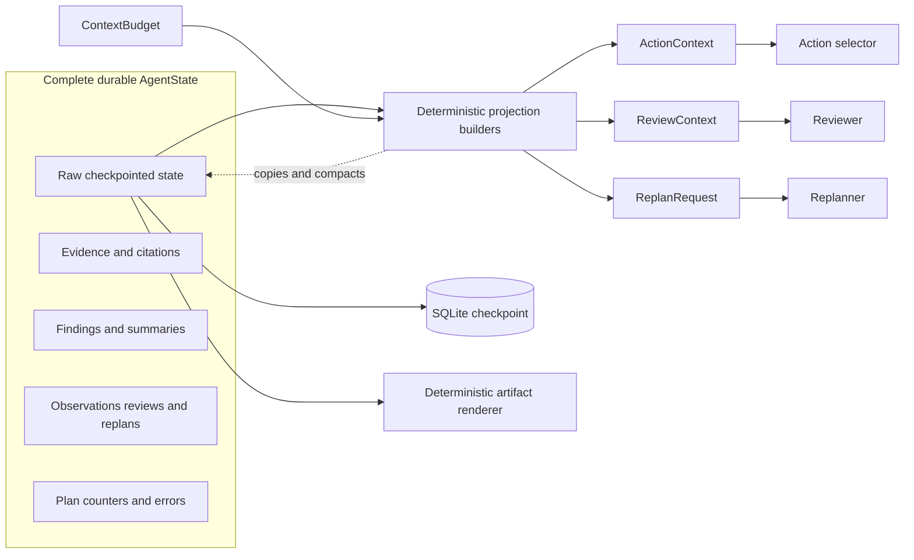
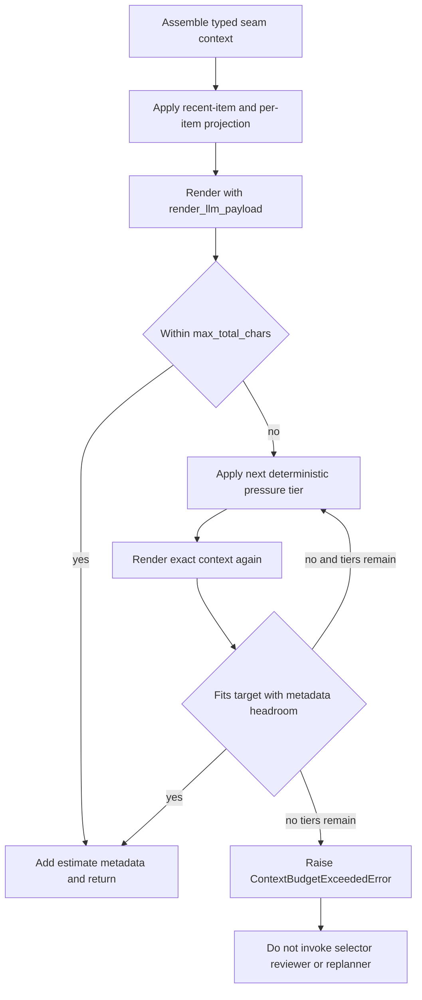
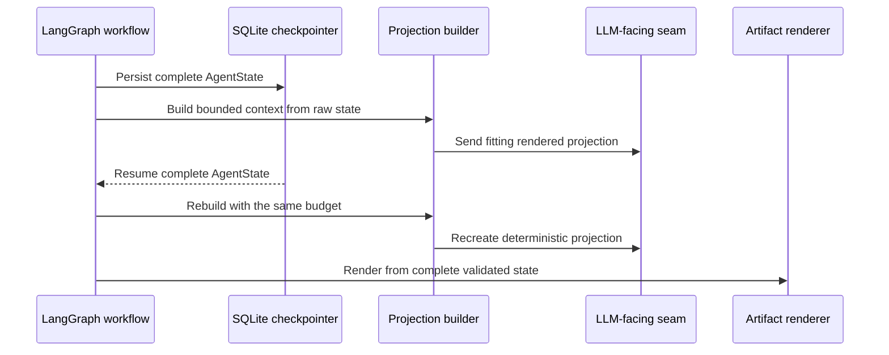

# Bounded Context Management - Day 11

## Purpose

Day 11 adds a hard, deterministic size boundary to the state projected into
Mini DeerFlow's action selector, evidence reviewer, and replanner. The runtime
can accumulate complete research history while ensuring that each serialized
LLM-facing context stays within its configured character budget. If required
fields cannot fit, the runtime fails before invoking that seam instead of
sending an oversized projection.

This is an agent-runtime design, not a generic prompt-writing technique. The
important boundary is between durable, auditable workflow state and an
ephemeral projection built for one model decision. Mini DeerFlow remains a
learning-oriented prototype; Day 11 does not establish production readiness.

## Day 10 baseline

Day 10 introduced the bounded reviewer/replanner loop documented in
[Bounded Reviewer/Replanner Loop - Day 10](bounded-reviewer-replanner-day-10.md).
After a step completes, the reviewer returns `continue`, `replan`, or `finish`.
A valid `replan` replaces only unfinished work, and deterministic guards retain
the tool-call, replan-cycle, plan-length, and recursion limits.

That design made context pressure more visible. The reviewer could receive
many evidence excerpts, completed summaries, findings, and limitations. The
replanner added review rationale, review findings, replacement-step detail, and
tool definitions. The selector continued to receive observations, evidence,
summaries, the current step, and tool schemas. Those inputs were structurally
bounded by domain schemas, but their combined serialized size did not yet have
one shared hard limit.

Day 11 adds that missing runtime concern without changing the Day 10 routing
contract or weakening the Day 09 evidence and citation invariants.

## Why bounded context is a separate runtime concern

Execution budgets and context budgets constrain different resources:

- tool-call limits bound how many actions can reach tools;
- the replan-cycle limit bounds how often unfinished work can be replaced;
- the LangGraph recursion limit bounds graph super-steps; and
- `ContextBudget` bounds the context JSON supplied to one LLM-facing seam.

A run can respect every execution budget and still assemble an oversized
prompt. One successful fetch may return a long page; several successful calls
may produce many evidence records; failures can carry lengthy diagnostics; and
review/replan history adds more text without executing another tool. Prompt
size therefore cannot be inferred from tool-call count or recursion depth.

The runtime owns this concern because it knows the current decision, the state
fields needed at that seam, and the exact serializer used immediately before
the model call. Tools should not truncate durable evidence to satisfy a future
prompt, and checkpoints should not discard history merely because one decision
needs a smaller view.

## Raw state versus LLM-facing projections

`AgentState` remains the source of truth. It retains the complete validated
evidence, accepted citation sources, findings, completed summaries,
observations, errors, review verdicts, replan records, plan, counters, and final
artifact data. LangGraph checkpoints persist that state.

For each selector, reviewer, or replanner invocation, the workflow derives a
new typed context. Projection functions copy and compact values; they do not
mutate the lists or models owned by `AgentState`. The compacted context is used
for one decision and is not substituted for the durable state used by resume,
audit, or deterministic report rendering.



The dashed edge denotes observation of state, not a write back into it.

### Component responsibilities

| Component | Responsibility | Preserved boundary |
| --- | --- | --- |
| `AgentState` | Complete workflow history and current execution state | Never compacted for prompt size |
| `ContextBudget` | Validate four projection limits | Independent of execution budgets |
| Projection helpers | Bound excerpts, item text, recent collections, and metadata | Copy values; retain raw caller-owned state |
| `fit_context_to_budget` | Apply ordered pressure tiers and enforce the hard total | Returns a fitting typed context or raises |
| `ProjectionMetadata` | Report omitted items, truncated items, and estimated tokens | Travels inside the untrusted context |
| `render_llm_payload` | Produce the shared serialized context JSON | Same renderer at measurement and LLM seams |
| Selector, reviewer, replanner | Consume only their typed bounded projection | Cannot turn projection text into durable evidence |
| SQLite checkpointer | Persist complete workflow state | Does not replace raw state with a projection |
| Report renderer | Build the artifact from validated state | Does not render from compacted prompt context |

## ContextBudget contract

`ContextBudget` is a frozen Pydantic model with forbidden extra fields and
strict positive integers. Its four limits and defaults are:

| Limit | Default | Contract |
| --- | ---: | --- |
| `max_total_chars` | `60000` | Hard ceiling for the serialized context JSON returned by `render_llm_payload` |
| `max_item_chars` | `4000` | Maximum projected length for general per-item text |
| `retained_recent_items` | `30` | Initial recent-item retention for evidence and observations |
| `max_excerpt_chars` | `1500` | Maximum projected evidence-excerpt length |

Validation also requires `max_excerpt_chars <= max_item_chars` and reserves
room for one bounded item, one bounded excerpt, and fixed context fields. The
budget does not promise that every valid configuration can fit every context:
the fixed values in a particular goal, step, or request may still be too large.
That irreducible case is handled by `ContextBudgetExceededError`.

A custom budget is supported through the runtime composition boundary:

```python
from mini_deerflow.context_budget import ContextBudget
from mini_deerflow.runtime import build_agent_runtime

budget = ContextBudget(
    max_total_chars=15_000,
    max_item_chars=1_200,
    retained_recent_items=8,
    max_excerpt_chars=800,
)

runtime = build_agent_runtime(
    planner,
    action_selector,
    registry,
    reviewer=reviewer,
    replanner=replanner,
    checkpointer=checkpointer,
    context_budget=budget,
)
```

The names in this example are dependencies supplied by the embedding
application. `create_default_agent_runtime` and `open_default_agent_runtime`
also accept `context_budget`. There is currently no CLI budget flag.

## Conservative token estimation

Day 11 enforcement is character-based. `estimate_token_count` reports
`ceil(characters / 4)` in `ProjectionMetadata.estimated_tokens`. This figure is
a conservative planning heuristic for reporting only. It is not an exact
token count, it is not GLM tokenizer accounting, and it does not decide whether
a context passes the hard limit.

This distinction matters because tokenization depends on the selected model,
encoding, language, punctuation, and message framing. The implemented
invariant is reproducible without a model-specific tokenizer:

```text
hard decision: len(render_llm_payload(context)) <= max_total_chars
reported estimate: ceil(len(render_llm_payload(context)) / 4)
```

The static system prompt, role-message structure, and wrapper text are outside
this projection measurement. The hard Day 11 contract covers the exact context
JSON produced by `render_llm_payload`, not an exact token count for the entire
provider request.

## Exact wire-format measurement

All three LLM-facing implementations call the same renderer used by the
budgeting code. `render_llm_payload` serializes `model_dump(mode="json",
by_alias=True)` with UTF-8-capable JSON settings, preserved non-ASCII text, and
two-space indentation. `payload_size` measures the Python character length of
that exact string.

This avoids comparing a compact or approximate serialization during fitting
with a different pretty-printed serialization at the seam. The final context
also contains `ProjectionMetadata`; fitting leaves small deterministic headroom
so adding the reported estimate cannot push the final serialized projection
over the configured maximum.

The selector and reviewer insert the rendered JSON into explicitly untrusted
human-message blocks. The replanner supplies the same rendered JSON as its
human message and its system prompt declares every request field untrusted.
Measurement remains shared even though the surrounding messages differ.

## Selector context projection

`build_action_context` constructs `ActionContext` for the current plan step.
It preserves the goal, complete current-step identity, available action-tool
identity, remaining per-step and total tool-call budgets, completed-summary
continuity, successful evidence, and observations belonging to the current
step.

Before fitting the total:

- evidence is limited to the most recent configured records;
- evidence excerpts use `max_excerpt_chars`, while titles use
  `max_item_chars`;
- current-step observations are limited to the most recent configured items;
- strings nested in observation result data and error text use
  `max_item_chars`; and
- completed summaries are individually bounded but initially retained.

Evidence URLs and `EvidenceProvenance` are copied unchanged for retained
records. Observation identity includes the tool action, success state,
structured error metadata, and step/call coordinates. Under stronger total
pressure, older evidence and observations are removed before higher-priority
continuity fields. At least the most recent observation is retained by the
total-pressure tier.

The selected action is still validated against the structured action schema
and normal tool registry. Context compaction does not grant a capability or
change a remaining budget.

## Reviewer context projection

`review_node` derives `ReviewContext` only after a completed step. It carries
the goal, remaining plan steps, completed summaries, `StepFinding` values,
successful evidence, bounded limitations, remaining total tool calls, and
remaining replan cycles.

Finding summaries use `max_item_chars`, but citations on retained findings are
not text-truncated. Evidence follows the same recent-record and excerpt rules
as selector context. Limitations are derived from failed observations and
recorded errors, initially bounded per item; under total pressure the oldest
limitations are removed and the newest may be reduced to a short marked form.

The reviewer's output remains a strict `ReviewVerdict`. The context budget
does not alter the deterministic guards that may coerce an unsafe `continue`
or `replan` request to `finish`, and it does not add citation fields to review
output.

## Replanner context projection

`replan_node` creates `ReplanRequest` from the latest triggering verdict and
the current durable state. The request contains the goal, review verdict,
completed summaries, remaining steps being replaced, available action tools,
remaining total tool calls, remaining replan cycles, and computed minimum and
maximum replacement-step counts. Full evidence records are not part of this
Day 10/11 replanner contract.

When the initial serialized request is under pressure,
`compact_replan_request` first limits the triggering rationale to at most 400
characters, subject to `max_item_chars`. Older review findings become explicit
markers that retain category and related step numbers; if necessary, the
oldest marked findings are removed while the newest finding remains. The
generic pressure pass can then compact completed summaries, verbose tool
schemas, and replaced-step descriptions.

The fields that define the replan operation remain available: verdict identity,
replacement bounds, remaining budgets, tool names, and step number/title for
each retained or markered replaced step. The replanner can propose replacement
work only; deterministic merge logic still preserves the completed prefix and
renumbers the replacement steps.

## Priority and deterministic compaction policy

Compaction is stable and ordered. The same input state and budget produce the
same typed projection and the same rendered JSON. Current and recent material
has priority; older lower-priority material is compacted or omitted with
explicit markers and aggregate metadata.

| Order | Material under pressure | Deterministic action | Identity retained |
| ---: | --- | --- | --- |
| Initial | Evidence and observations beyond retention | Keep newest `retained_recent_items` | Retained URL/provenance or call coordinates |
| Initial | Long excerpts and item strings | Head-truncate with original-length marker | Opening text and structural fields |
| 1 | Evidence | Remove oldest records, possibly all | Metadata counts omissions |
| 2 | Observations | Remove oldest while keeping the newest | Newest tool/call/success identity |
| 3 | Completed summaries | Replace oldest text with step-position markers, then omit oldest markers if needed | Recent summary and marked step positions |
| 4 | Findings | Replace oldest prose with step-number markers, then omit oldest markers if needed | Recent finding and retained step identity |
| 5 | Limitations | Remove oldest; bound the newest to the pressure cap | Most recent failure remains visible when possible |
| 6 | Tool definitions | Strip `input_schema` oldest-first | Tool name and description |
| 7 | Replaced steps | Replace objective and success criteria with markers | Step number and title |

Fixed seam-specific fields are not part of these drop tiers. Examples include
the selector's current step and remaining tool budgets, the reviewer's
remaining budgets and plan position, and the replanner's verdict and
replacement bounds. If those mandatory fields are themselves too large, the
safe result is an exception rather than silent loss.

`ProjectionMetadata.omitted_items` and `truncated_items` make pressure visible
inside the untrusted context. Individual shortened values also include markers
such as `truncated at ...` or `omitted: ...`; omission is not represented as if
the complete content had been seen.



## Provenance, citations, and trust boundaries

Projection is subtractive: it can copy, truncate, marker, or omit existing
content. It has no operation that constructs a new `EvidenceRecord`, accepts a
new source URL, or promotes a summary, review statement, tool schema, local
path, or arbitrary observation text into evidence.

For retained evidence, the canonical URL and `EvidenceProvenance` remain the
record identity. Projected evidence URLs must therefore be a subset of raw
successful-evidence URLs. Later citation validation still accepts a URL only
when it is a member of successful evidence. The deterministic report renders
accepted citations from raw validated state, not from prose found in a
projection.

Malicious instructions embedded in fetched content, observations, summaries,
findings, or review rationale remain untrusted data. The selector and reviewer
wrap their JSON in labeled untrusted context blocks; the replanner system
instruction applies the same rule to its human-message data. Truncation does
not move any text into trusted system instructions.

The precise non-claim is: **provenance/citation membership does not verify
source truth**. Membership establishes that the workflow successfully observed
the URL and retained its lineage. It does not establish factual correctness,
freshness, source quality, claim-level entailment, or absence of contradiction.

## Hard-limit failure behavior

`fit_context_to_budget` performs the final exact-size check after exhausting
all deterministic pressure tiers. If the projection still exceeds
`max_total_chars`, it raises `ContextBudgetExceededError`. The workflow does
not call the selector, reviewer, or replanner with that oversized context.

This exception is a safe refusal to send an oversized projection. It is not a
model failure, provider failure, output-format failure, or tool failure. No
retry at those layers can make mandatory context smaller, so relabeling it as
one of those failures would hide the configuration/runtime cause.

The error message identifies the configured total and the inability to fit
after deterministic compaction. It does not need to include the context,
checkpoint contents, credentials, or machine paths.

## Checkpoint and resume guarantees

SQLite checkpoints persist the raw `AgentState`, including full long evidence
and summaries. Context projections are derived values. A completed or resumed
thread can rebuild them from the same durable state and `ContextBudget` without
having stored a lossy replacement in the checkpoint.

Determinism gives resume a useful equality property: when the raw state,
registry definitions, current node, and budget are unchanged, rebuilding a
projection produces the same serialized bounded payload. At the same time,
artifact rendering can still use the full evidence excerpt or summary that was
shortened for a prior model decision.



Resume does not make external side effects exactly-once; that broader
persistence limitation predates Day 11. The Day 11 guarantee is narrower:
context compaction does not damage checkpointed research history.

## Runtime composition boundary

`context_budget` is an optional keyword at three composition layers:
`build_agent_workflow`, `build_agent_runtime`, and the default runtime
constructors. If omitted, the workflow creates the default `ContextBudget`.
If supplied, it must be a validated `ContextBudget` instance and the same value
is shared by selector, reviewer, and replanner projection construction.

The real composition and execution path is:

```text
build_agent_runtime
  -> build_agent_workflow
  -> AgentRuntime with compiled graph

AgentRuntime.run
  -> compiled workflow
  -> selector, reviewer, and replanner projection builders
```

The CLI still exposes tool-call, replan-cycle, and recursion limits, for
example:

```bash
uv run mini-deerflow run \
  "Research the stated topic and report observed evidence." \
  --thread-id "bounded-context-example" \
  --max-total-tool-calls 8 \
  --max-replan-cycles 2 \
  --recursion-limit 100
```

There is no `--context-budget`, `--max-context-chars`, or equivalent CLI flag.
Changing the four Day 11 limits currently requires programmatic composition.

## Deterministic context-pressure verification

The external Day 11 smoke exercised the real integration route without a real
model or external web provider. It used deterministic fakes only at the
planner, action-selector, reviewer, replanner, and web-provider seams. The real
`AgentRuntime`, workflow builder, SQLite checkpointer, `WebSearchTool`, evidence
extraction, citation validation, reviewer/replanner routing, and deterministic
artifact rendering remained in the path.

Scenario A used `max_total_chars=15_000`. Long evidence, observations, failed
observation text, summaries, findings, review rationale, replacement-plan
content, and a verbose tool schema forced compaction. The route was:

```text
step 1 web search
  -> reviewer requests replan
  -> replanner returns valid replacement work
  -> remaining work continues
  -> reviewer requests finish
```

Captured selector, reviewer, and replanner payloads respected the 15,000
character ceiling while the workflow completed. The smoke also checked the
separation between bounded projections and full checkpointed state, citation
membership, deterministic artifact count, and repeatable projections after
SQLite resume.

Scenario B used a valid but irreducible 1,026-character budget. Mandatory
context could not fit after every compaction tier, so
`ContextBudgetExceededError` was raised before any payload reached a model
seam. No oversized captured payload and no later fake model/provider call
occurred. Any checkpoint written before that failing seam remained readable.

The deterministic hard-bound/context-pressure smoke passed. No real model and
no external provider was called by it.

## Defect discovery and correction

The pressure work exposed a hard-bound defect: successful compaction was not,
by itself, sufficient evidence that the exact final serialized context sent at
an LLM seam respected the configured ceiling. Serialization shape and the
projection metadata added to the context are part of the measured payload.

The correction made `render_llm_payload` the single serializer shared by
measurement and all three seams, measured after deterministic compaction, kept
headroom for final metadata, and added a final refusal path. Regression tests
now assert the exact rendered size rather than relying on approximate object
sizes or a different JSON representation.

This matters architecturally: a hard limit is an end-to-end property at the
consumer boundary. A truncation helper can satisfy its own per-item limit while
the assembled, indented, metadata-bearing context still exceeds the total.

## Test strategy

Day 11 verification is layered:

- model validation tests cover defaults, strict positive values, frozen
  configuration, limit relationships, and irreducible valid budgets;
- projection unit tests cover deterministic markers, recent-item retention,
  nested observation data, failed observations, evidence provenance,
  citations, and raw-input immutability;
- all-tier pressure tests force evidence, observation, summary, finding,
  limitation, tool-schema, and replaced-step compaction;
- workflow tests verify bounded selector/reviewer contexts while full evidence
  remains available to final rendering;
- review-loop tests exercise review and replan identities under pressure;
- runtime-composition tests verify programmatic budget propagation; and
- the external deterministic smoke covers real SQLite checkpoint/resume and
  the real web-evidence/citation/artifact integration route with fake seams.

The verified repository suite result is **459 passed, 2 skipped**. The
deterministic workflow context-pressure smoke also passed. Tests and the smoke
do not make a production-readiness claim.

## Current limitations

- There is no tokenizer integration or model-specific token accounting.
- The reported token value is only the `ceil(characters / 4)` estimate.
- Old context is truncated, markered, or omitted deterministically; it is not
  summarized by an LLM.
- Context-budget configuration is programmatic only; no CLI budget flags
  exist.
- The hard limit covers rendered projection JSON, not the complete provider
  request including static prompts and protocol overhead.
- No real-model context-pressure smoke has run, so behavior near an actual
  model context window remains untested.
- Provenance membership does not check truth or claim-level support.
- Mini DeerFlow has no live sub-agent or fan-out/fan-in implementation yet.
- Operational concerns such as production telemetry, multi-tenant isolation,
  and provider-specific context-window discovery remain outside Day 11.

## Architectural decisions and rejected alternatives

1. **Preserve raw state; project at the consumer seam.** Truncating evidence in
   `AgentState` was rejected because it would make audit, resume, and artifact
   output lossy.
2. **Use one deterministic character contract.** Approximate token counts were
   rejected as an enforcement boundary because no tokenizer is integrated and
   a heuristic cannot prove an exact provider-token limit.
3. **Measure the real shared JSON representation.** Measuring Pydantic objects,
   compact JSON, or selected fields was rejected because formatting and
   metadata also consume characters at the seam.
4. **Prefer recent/current material.** Uniform truncation was rejected because
   an agent needs the current step, remaining budgets, latest failure, and
   triggering review/replan identity to make the next valid decision.
5. **Expose honest loss.** Silent deletion was rejected; explicit text markers
   and `ProjectionMetadata` let the consumer distinguish complete from reduced
   context.
6. **Keep provenance structural.** Generating replacement citations or
   reconstructed evidence from summaries was rejected because compaction must
   not elevate untrusted prose.
7. **Fail irreducible projections.** Sending the oversized request, clipping
   arbitrary JSON, or relabeling the condition as a provider failure was
   rejected. A typed pre-seam exception preserves schema validity and diagnosis.
8. **Avoid LLM-generated compression for Day 11.** A summarizer would add cost,
   nondeterminism, another model failure surface, and new provenance questions.
9. **Inject at composition rather than add CLI flags prematurely.** The
   programmatic boundary makes the policy testable while the operational CLI
   contract remains small.

## Day 12 handoff

The roadmap's next concern is bounded sub-agent delegation. Day 11 provides a
necessary input boundary for that work, but it does not implement sub-agents.
Any Day 12 design should define separate per-branch raw state, projection
budgets, concurrency limits, timeouts, and a deterministic merge contract.

Fan-out must not bypass the citation invariant or convert a sub-agent summary
into evidence. Branch results should carry explicit provenance, partial failure
must remain visible, and the lead agent should receive a bounded projection
while durable branch records remain auditable. The combined context cost must
be bounded independently from concurrency and tool-call budgets.

Real-model context-pressure testing remains an explicit gap before using Day
11 behavior as evidence for model-specific sizing decisions.

## Related documentation

- [Project README](../README.md)
- [Bounded Reviewer/Replanner Loop - Day 10](bounded-reviewer-replanner-day-10.md)
- [Web Evidence and Citation Runtime - Day 09](web-evidence-citation-runtime-day-09.md)
- [Persistent Thread Runtime - Day 08](persistent-thread-runtime-day-08.md)
- [Executable Research Agent Runtime - Day 07](executable-agent-runtime-day-07.md)
- [Bounded Agent Loop - Day 06](bounded-agent-loop-day-06.md)
- [14-day Mini DeerFlow roadmap](roadmap-deep-agent-deerflow-14-ngay.md)
- [`context_budget.py`](../src/mini_deerflow/context_budget.py)
- [`decision.py`](../src/mini_deerflow/decision.py)
- [`review.py`](../src/mini_deerflow/review.py)
- [`agent_workflow.py`](../src/mini_deerflow/agent_workflow.py)
- [Day 11 context-budget tests](../tests/test_context_budget.py)
- [Day 11 all-tier pressure tests](../tests/test_context_pressure.py)
