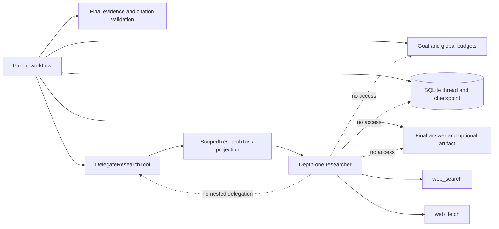
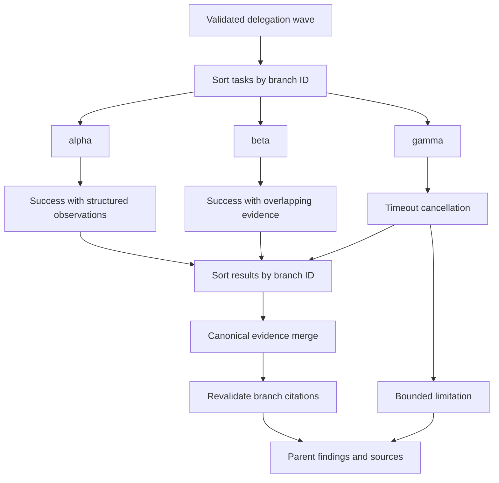
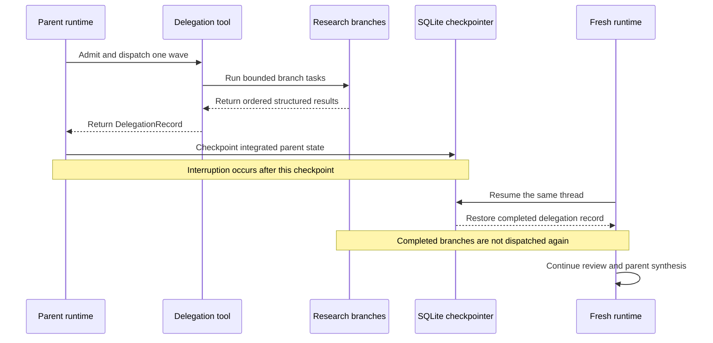

# Bounded Researcher Delegation - Day 12

## Purpose

Day 12 adds one bounded researcher-delegation wave to Mini DeerFlow's existing
plan-act-observe-review workflow. The parent agent can split a research step
into a small set of independent web-research tasks, run those tasks with
limited concurrency, and merge their structured results back into the parent
state.

This is an implementation document for the actual MVP. It describes the
contracts in `delegation.py`, their integration into the runtime and workflow,
and the verified behavior of the deterministic smoke. It is not a general
multi-agent design survey and it does not make a production-readiness claim.

The central invariant is that delegation expands research execution without
expanding authority. The parent still owns the goal, global budgets, durable
thread, final evidence and citation decisions, and optional artifact. A branch
is a short-lived, depth-one worker with a narrow projected context and
read-only web tools.

## Day 11 baseline

Day 11 established a strict separation between complete durable state and the
bounded context sent to an LLM-facing seam. `AgentState` remains complete for
audit, checkpoint resume, and deterministic rendering. The action selector,
reviewer, and replanner receive typed projections created by
`fit_context_to_budget`.

Day 12 preserves that rule. It adds `ResearchTaskContext` as another projected
context rather than copying parent state into each branch. A branch task is
passed through the same `ContextBudget` mechanism before the researcher seam
is invoked. If the mandatory branch context cannot fit after deterministic
compaction, the oversized context is not sent onward.

The Day 11 execution limits also remain distinct:

| Boundary | Resource constrained | Day 12 relationship |
| --- | --- | --- |
| `ContextBudget` | Serialized LLM-facing context | Applied independently to every branch projection |
| Per-step tool-call limit | Tool work in the current parent step | Includes the parent delegation call and admitted branch work |
| Total tool-call limit | Tool work in the full parent run | Includes the same delegation charges globally |
| Replan-cycle limit | Replacement of unfinished plan steps | Still owned by the parent review loop |
| Recursion limit | LangGraph execution steps | Still bounds the parent graph |

The detailed baseline is documented in
[Bounded Context Management - Day 11](bounded-context-management-day-11.md).

## Why delegation needs a parent-owned boundary

Naive fan-out can accidentally multiply authority as well as throughput. If
each branch received the full parent state and tool registry, three branches
could each consume the apparent remaining budget, write competing artifacts,
start more branches, or introduce citations that were never backed by a
successful observation.

Day 12 prevents that multiplication at composition and validation boundaries.
The parent does not hand a branch its `AgentState`, thread identifier,
checkpointer, workspace tools, reviewer, replanner, or artifact path. It sends
one `ScopedResearchTask`, definitions for an allowlisted web registry, a local
remaining-call count, and projection metadata.

The parent also performs admission before dispatch. It evaluates the sum of
all requested branch budgets against the current parent step and run budget.
Fan-out therefore cannot turn one parent action into unaccounted aggregate
work.

| Parent-owned concern | Why it stays at the parent |
| --- | --- |
| Original goal and plan step | Branches receive narrow objectives, not authority to rewrite the run |
| Per-step and total budgets | Aggregate work must be admitted once against global counters |
| SQLite thread and checkpoint | One durable execution history owns resume behavior |
| Evidence and final citations | Successful structured observations remain the trust root |
| Reviewer and replanner | Evidence-quality routing remains one parent decision loop |
| Final answer and artifact | The parent synthesizer is the only rendering authority |

## Delegation domain model

The delegation module uses frozen Pydantic models with forbidden extra fields.
The models make scope, accounting, status, and merge output checkpoint-safe
and auditable.

| Model | Role | Important guarantees |
| --- | --- | --- |
| `ScopedResearchTask` | One branch assignment | Valid branch ID, bounded objective and criteria, branch budget from 1 through 5, `delegation_depth` fixed to `1` |
| `DelegationInput` | One parent fan-out request | Delegation ID plus exactly 2-3 tasks with unique branch IDs |
| `BranchFinding` | Successful branch conclusion | Bounded summary and structurally valid HTTP or HTTPS citation candidates |
| `BranchResult` | One auditable branch outcome | Status is `success`, `controlled_failure`, or `cancelled`; observation count equals used calls |
| `FanInSummary` | Deterministic merged view | Ordered success/failure groups, findings, evidence, citations, and limitations |
| `DelegationRecord` | Durable wave record | Original tasks, ordered results, fan-in, and reserved/used/charged accounting |
| `ResearchTaskContext` | Branch-visible parent projection | Only task, web-tool definitions, remaining local calls, and projection metadata |

A successful `BranchResult` must contain a finding and no error. A failed or
cancelled result must contain a bounded error. Resource accounting enforces:

```text
used_tool_calls <= charged_tool_calls <= reserved_tool_calls
```

These checks reject malformed result shapes before they can become normal
parent state.

## Parent and researcher capability separation

The default runtime constructs two registries. The parent action registry can
include workspace reads, web tools, and the parent-only `delegate_research`
tool. The execution registry may also include `write_file` when writing is
explicitly enabled. The researcher registry is separate and may contain only
`web_search` and `web_fetch`.



The dashed edges describe denied capability, not runtime calls. Branches
cannot write files, create artifacts, mutate parent state, or start another
delegation wave. The researcher constructor rejects registries containing
file or delegation tools, and the branch loop explicitly converts a selected
`delegate_research` action into a controlled failure without a tool call.

This separation is stronger than asking a model not to use a capability. The
capability is absent from the branch registry and absent from its context.

## Scoped branch context

`build_research_task_context` assembles the only parent-derived value exposed
to the researcher. It contains:

| Field | Meaning |
| --- | --- |
| `task` | One validated `ScopedResearchTask` |
| `available_tools` | At most two definitions from the branch web registry |
| `remaining_branch_tool_calls` | The local branch budget before execution |
| `context_projection` | Day 11 omission, truncation, and estimated-size metadata |

The context deliberately omits parent evidence, review history, replan
history, checkpoint identity, artifact path, workspace, and mutable counters.
The Pydantic model is frozen, so the branch receives a value rather than a
shared mutable view.

Inside a branch, every action-selection iteration builds another bounded
`ActionContext`. It contains only the branch objective, a synthetic one-step
plan step, the branch web-tool definitions, projected branch observations,
projected branch evidence, and the remaining local budget. Raw branch history
stays local while each selector call receives a bounded projection.

Day 11 compaction never invents claims or evidence. It may shorten or omit
untrusted projected material, but durable observations and evidence remain
structured values used by the parent merge.

## Fan-out validation and concurrency control

One delegation wave must contain exactly two or three tasks. Every task has a
unique branch ID, and every task is fixed at depth one. Four-task waves,
duplicate IDs, or a different depth fail input validation.

Before dispatch, tasks are sorted by `branch_id`. This establishes a stable
order independent of the order authored by the action selector. Dispatch then
uses one `asyncio.Semaphore` configured with the delegation concurrency limit.
All task coroutines may be created together, but at most the configured number
can enter researcher execution concurrently.

The concurrency setting defaults to `2`. Both runtime validation and the CLI
restrict it to values from `1` through `3`. The upper bound matches the maximum
wave size; it is not an open-ended worker-pool setting.

Concurrency and determinism solve different problems:

- the semaphore bounds simultaneous branch work;
- sorted task and result handling stabilizes recorded order; and
- deterministic fan-in prevents completion timing from changing merged state.

## Budget admission and reservation

The parent workflow calculates `remaining_tool_calls` as the smaller of the
remaining per-step and total-run allowances. It then calls
`run_with_parent_budget`; direct `run` rejects execution because delegation
requires this admission boundary.

The tool sums every task's `tool_call_budget`:

```text
reserved = sum(task.tool_call_budget for task in ordered_tasks)
admit only when reserved <= remaining_tool_calls - 1
```

The subtraction reserves one call for the parent `delegate_research` action
itself. If the aggregate reservation does not fit, the wave fails before any
researcher context is dispatched.

| Counter | Meaning |
| --- | --- |
| `reserved_tool_calls` | Maximum branch work admitted for the complete wave |
| `used_tool_calls` | Observations actually returned by branches |
| `charged_tool_calls` | Calls charged to the parent, including conservative cancellation charges |

A successful or controlled-failure branch is charged for its recorded used
calls. A cancelled branch is charged its full reserved branch budget because
the parent cannot prove how much external work completed before cancellation.
When the record enters parent state, the workflow advances counters for the
parent call, remapped branch observations, and any charged amount that has no
observation.

Reservation is intentionally conservative. It protects the parent limits
even when a branch times out after beginning an external operation.

## Researcher execution and timeout behavior

`BoundedResearcherSubagent` runs a local plan-act-observe loop for at most the
task's branch budget. On each iteration it asks its branch action selector for
one structured action.

For a web tool call, the real `ToolRunner` validates the input, enforces the
tool timeout, and returns a structured `ToolResult`. The branch records a
`ToolObservation` carrying branch identity and local call number, then extracts
evidence only from successful schema-shaped web results.

For `CompleteStepAction`, the branch validates proposed citations against its
own successful evidence. Unsupported citations make the branch a controlled
failure. A supported completion returns a sanitized `BranchFinding`. If the
branch consumes its call budget without completing, it returns a controlled
budget-exhaustion failure.

`DelegateResearchTool` additionally wraps each researcher call in
`asyncio.wait_for`. The default branch timeout is 30 seconds and is currently
a programmatic setting. A timeout becomes a `cancelled` result with a bounded
error. An invalid result, branch-ID mismatch, or over-budget result also
becomes `cancelled`. Other branch exceptions become `controlled_failure`;
external cancellation of the orchestration task is propagated rather than
silently normalized.

## Deterministic fan-in

Fan-in sorts `BranchResult` values by branch ID before any merge. It processes
structured observations, not free-form branch prose, and rebuilds successful
evidence through the Day 09 extraction functions.



`merge_evidence_records` canonicalizes URL identity and deduplicates overlap.
The merge keeps evidence from successful observations even when another branch
fails or is cancelled. Citation candidates are then checked against the merged
successful evidence set. Unsupported candidates are rejected and counted as
limitations.

The parent workflow does not blindly trust a precomputed summary. When it
integrates the delegation record, it remaps branch observations into parent
step and total call numbering, extracts delegated evidence again, validates
citations again, sanitizes branch summaries, and records parent findings,
sources, notes, and errors.

## Evidence, citations, and artifact guarantees

Day 12 reuses the Day 09 trust chain:

```text
successful structured web observation
-> EvidenceRecord with provenance
-> canonical evidence merge
-> citation membership validation
-> deterministic parent report
```

Branch summaries are not evidence. A URL written into a summary does not
become a citation. Branch citation candidates are accepted only when their
canonical URL exists in successful merged evidence. The parent repeats this
validation while integrating the record and when completing its own step.

Delegated evidence retains tool, step, observation, delegation, branch, and
branch-call provenance after remapping into parent state. Canonical overlap is
deduplicated without removing the surviving record's provenance.

Only the parent synthesizer renders `final_answer`. When writes are enabled,
only the parent uses `write_file` to create the research artifact. Branches do
not receive a workspace write tool or artifact path, so a branch cannot create
its own report or replace the parent artifact.

These guarantees preserve the architecture documented in
[Web Evidence and Citation Runtime - Day 09](web-evidence-citation-runtime-day-09.md).

## Partial failure and cancellation semantics

Delegation is not all-or-nothing after admission. Each branch produces an
independent status, and fan-in preserves useful successful work.

| Status | Meaning | Parent treatment |
| --- | --- | --- |
| `success` | Valid finding with no error | Keep observations, validated evidence, finding, and supported citations |
| `controlled_failure` | Bounded expected or normalized failure | Keep any recorded observations and add a bounded limitation/error |
| `cancelled` | Timeout or invalid/over-budget result | Add a bounded limitation/error and charge the full branch reservation |

One branch failure does not erase successful sibling evidence. Conversely, a
successful sibling does not hide the failure: the failed or cancelled branch
remains visible in `FanInSummary` and in parent errors used by final report
rendering.

This design supports honest partial answers. It does not claim that a partial
answer is complete, and it does not convert an error string into evidence.

## State, checkpoint, and resume

`AgentState` stores `delegations` as an append-only reduced list of typed
`DelegationRecord` values. The SQLite serializer allowlist includes the task,
finding, result, fan-in, and record models, so the complete delegation history
can cross a process boundary without degrading into unchecked dictionaries.



The important reuse boundary is the completed parent tool-node checkpoint.
Once the integrated delegation result is durable, resume continues from the
next graph work rather than invoking the completed node again. Evidence,
citations, limitations, provenance, and accounting therefore remain stable
across the verified resume path.

## Exactly-once boundary

Checkpoint reuse is not the same as exactly-once execution. The implementation
does not claim exactly-once safety for a crash after a web effect has started
or completed but before the parent tool-node checkpoint records the completed
delegation.

In that window, a later resume may have no durable record proving that the
external effect occurred. Re-execution can therefore repeat the effect. The
delegation tool is marked non-idempotent, and its docstring states this
boundary explicitly.

The Day 12 guarantee is narrower:

- completed, checkpointed delegation records are reused on resume; and
- no guarantee is made for uncheckpointed external effects.

Production exactly-once behavior would require a stronger external protocol,
such as durable idempotency keys or an effect ledger coordinated with the
provider. Those mechanisms are not part of this MVP.

## Runtime and CLI configuration

`create_default_agent_runtime` creates the web tools, a web-only branch
registry, the bounded researcher, and `DelegateResearchTool`. The delegation
tool is then included in the parent action and execution registries. A custom
researcher can be injected at the same composition seam for deterministic
testing.

| Setting | Default | Valid range or behavior |
| --- | ---: | --- |
| `RuntimeLimits.max_delegation_concurrency` | `2` | Integer from `1` through `3` |
| `--max-delegation-concurrency` | `2` | Available to both `run` and `resume`; choices `1`, `2`, or `3` |
| Task `tool_call_budget` | `2` | Integer from `1` through `5` per branch |
| Branch timeout | 30 seconds | Positive finite programmatic value |
| Tasks per wave | N/A | Exactly `2` or `3`, with unique branch IDs |
| Delegation depth | `1` | Literal depth one only |

The concurrency option limits simultaneous branches; it does not enlarge the
parent tool budget. The parent must still admit every branch reservation under
both remaining global tool-call limits.

## Deterministic delegation smoke

The verification-only Day 12 smoke exercised the real runtime composition,
workflow, delegation orchestrator, tool execution/evidence path, citation
validation, SQLite checkpointer, review routing, and deterministic rendering.
Planner, selector, reviewer, researcher, and provider seams were deterministic
fakes; no real model or external provider was called.

| Observation | Verified result |
| --- | --- |
| Branch IDs | Exactly `alpha`, `beta`, and `gamma`; no duplicates |
| Peak concurrency | `2` |
| `alpha` | Success |
| `beta` | Success |
| `gamma` | Cancelled through the delegation timeout path |
| Fan-in | Successful overlapping evidence was canonically deduplicated |
| Citations | Remained a subset of successful merged evidence URLs |
| Resume | Reopened SQLite state reused completed delegation work |
| Artifact ownership | Parent artifact remained the only artifact |

The smoke deliberately interrupted execution after the delegation result was
checkpointed but before terminal completion. A fresh runtime resumed the same
thread without redispatching the completed branches. The final evidence,
citations, delegation history, and artifact remained deterministic and valid.

This smoke verifies the deterministic boundary, not live-model research
quality, provider behavior, latency, or production throughput.

## Test strategy

The Day 12 tests cover the domain and integration layers separately.

| Test area | Behaviors covered |
| --- | --- |
| Input contracts | Depth one, 2-3 tasks, unique branch IDs, bounded task fields and budgets |
| Context projection | Hard size limit, deterministic compaction, no parent-state fields, irreducible-context failure |
| Capability registry | Web-only tools, rejection of file/delegation tools, explicit nested-delegation failure |
| Fan-out | Stable branch ordering and configured semaphore cap |
| Budget admission | Aggregate rejection before dispatch and conservative cancellation charges |
| Research loop | Structured actions, real `ToolRunner`, evidence extraction, citation checks, budget exhaustion |
| Fan-in | Canonical evidence deduplication, unsupported citation rejection, partial-success preservation |
| Timeout | Conversion to bounded cancelled results |
| Workflow integration | Parent observation remapping, provenance, counters, findings, sources, and errors |
| Persistence | SQLite round trip and completed-work reuse on resume |

The verified full suite result is **473 passed, 2 skipped**. The deterministic
three-branch smoke also passed with peak concurrency `2`. These results support
the bounded MVP contract but do not establish production readiness.

## Current limitations

- No real-model or real-provider delegation smoke has run.
- There is no live-model/network benchmark for answer quality, latency,
  provider throttling, or cancellation timing.
- All branches use the same researcher role and web capability set; there are
  no heterogeneous planner, critic, coder, or specialist branch roles.
- Delegation depth is exactly one. Branches cannot create nested waves.
- Each wave is fixed at two or three tasks; there is no unbounded queue,
  dynamic worker pool, or open-ended scheduling policy.
- The branch timeout is configured programmatically rather than through a CLI
  flag.
- Completed checkpointed work is reusable, but external effects before the
  checkpoint do not have exactly-once semantics.
- SQLite is the local MVP checkpoint store; this design does not claim
  distributed scheduling or multi-process orchestration safety.
- Canonical citation membership proves provenance membership, not factual
  truth or claim-level entailment.

## Architectural decisions and rejected alternatives

1. **Keep the parent authoritative.** Shared mutable parent state was rejected
   because it would let branches bypass reducers, budgets, and rendering
   ownership.
2. **Use typed branch tasks and results.** Free-form prompts and summaries as
   the merge protocol were rejected because they cannot enforce status,
   accounting, provenance, or citation structure.
3. **Restrict branches by registry composition.** Copying the parent registry
   and relying on prompt instructions was rejected because write and delegation
   authority should be absent, not merely discouraged.
4. **Fix depth at one.** Recursive delegation was rejected for the MVP because
   it would require hierarchical budget reservation, recursive checkpoint
   identity, and a more complex cancellation policy.
5. **Admit aggregate cost before dispatch.** Charging only after completion was
   rejected because concurrent branches could collectively exceed the budget
   before the parent observed their usage.
6. **Charge cancellation conservatively.** Assuming zero work on timeout was
   rejected because an external call may have started without producing a
   checkpointable observation.
7. **Sort before merge.** Completion-order fan-in was rejected because timing
   would change evidence order, findings, and checkpoint state.
8. **Rebuild trust at the parent.** Accepting branch-authored citations or a
   precomputed summary without validation was rejected because summaries are
   untrusted and evidence must come from successful structured observations.
9. **Preserve partial success.** Failing the whole wave when one branch fails
   was rejected because successful sibling evidence remains useful, provided
   the limitation stays visible.
10. **State the checkpoint boundary honestly.** An exactly-once claim was
    rejected because the local checkpoint cannot atomically commit an external
    provider effect.

## Day 13 handoff

Day 12 provides a deterministic baseline for evaluating delegated research
without relaxing authority boundaries. Day 13 work should preserve the same
typed tasks, aggregate admission, web-only branch registry, deterministic
fan-in, citation validation, and checkpoint semantics while evaluating the
remaining gaps.

Useful next measurements include per-branch duration, queue time at the
semaphore, reservation utilization, cancellation timing, evidence overlap,
and contribution of each successful branch to final citations. Any live-model
or live-provider evaluation should be reported separately from deterministic
contract tests and must not be presented as production readiness.

Heterogeneous roles or broader scheduling would be a new architecture change,
not a configuration tweak. Such work would need explicit capability profiles,
hierarchical budgets, merge contracts, and checkpoint identities before the
current bounds could be widened safely.

## Related documentation

- [Project README](../README.md)
- [Bounded Context Management - Day 11](bounded-context-management-day-11.md)
- [Bounded Reviewer/Replanner Loop - Day 10](bounded-reviewer-replanner-day-10.md)
- [Web Evidence and Citation Runtime - Day 09](web-evidence-citation-runtime-day-09.md)
- [Persistent Thread Runtime - Day 08](persistent-thread-runtime-day-08.md)
- [14-day Mini DeerFlow roadmap](roadmap-deep-agent-deerflow-14-ngay.md)
- [`delegation.py`](../src/mini_deerflow/delegation.py)
- [`agent_workflow.py`](../src/mini_deerflow/agent_workflow.py)
- [`runtime.py`](../src/mini_deerflow/runtime.py)
- [`persistence.py`](../src/mini_deerflow/persistence.py)
- [Day 12 delegation unit tests](../tests/test_delegation.py)
- [Day 12 delegation workflow tests](../tests/test_delegation_workflow.py)
