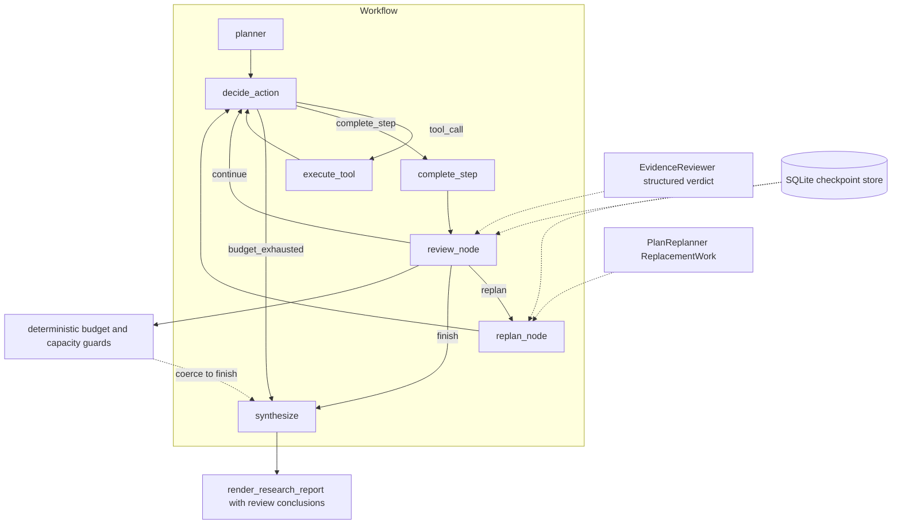
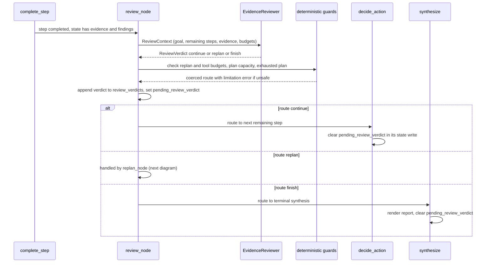
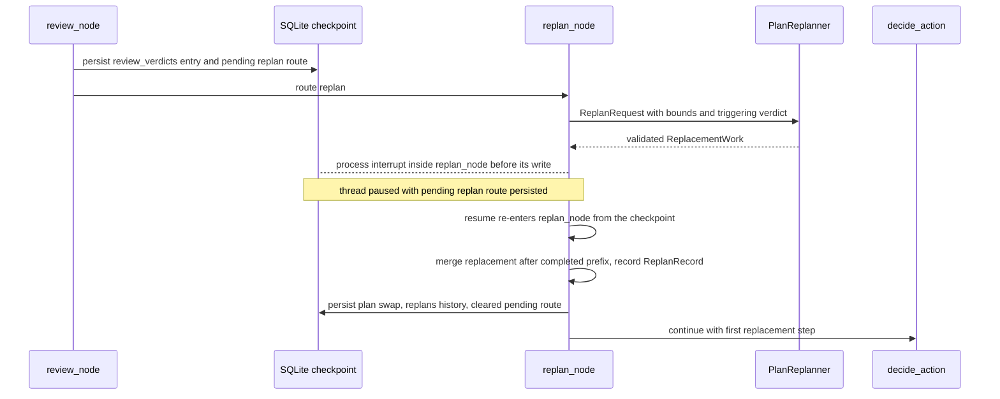

# Bounded Reviewer/Replanner Loop - Day 10

## Purpose

Day 10 gives Mini DeerFlow an evidence-quality conscience. After every completed
plan step, a reviewer judges whether the accumulated evidence is sufficient for
the research goal and returns one structured verdict: `continue` (keep the
current plan), `replan` (replace only the remaining steps), or `finish` (stop
with what exists). A replanner turns a `replan` verdict into validated
replacement work, and deterministic runtime guards bound the whole loop.

This document is for software engineers learning how an agent system can
evaluate its own evidence, revise remaining work without destroying completed
work, and terminate predictably under three independent budgets. It explains
components, data flow, trust boundaries, and trade-offs. Mini DeerFlow remains
a learning-oriented prototype, not a production-ready research system, and a
review verdict is a model judgment about evidence coverage, never proof that a
source is truthful.

## Day 09 baseline

Day 09, described in the
[Day 09 technical document](web-evidence-citation-runtime-day-09.md) and
[Day 09 learning report](report-ngay-09-mini-deerflow.md), delivered:

- a bounded plan-act-observe LangGraph workflow with per-step and total
  tool-call budgets plus a recursion limit;
- typed web evidence (`EvidenceRecord`) with canonical URLs and call-level
  provenance, deduplicated across steps;
- citation validation: a step completion may cite only URLs that are members
  of the successful evidence URL set;
- a deterministic Markdown report and an explicit `--allow-write` artifact
  boundary; and
- SQLite checkpoints with a serializer allowlist and stable thread identities.

What Day 09 could not do: judge whether the collected evidence was *enough*.
The workflow executed every planned step or died at a budget wall. If the plan
was misaligned with the goal, nothing detected it mid-run, and no mechanism
could replace unexecuted steps without discarding completed ones. Day 10 adds
that mechanism without weakening any Day 09 guarantee, following the
[project roadmap](roadmap-deep-agent-deerflow-14-ngay.md).

## Evidence-quality loop architecture

The loop is three nodes plus a routing function inside the existing workflow in
[`src/mini_deerflow/agent_workflow.py`](../src/mini_deerflow/agent_workflow.py):

1. `review_node` runs after every `complete_step`. It builds a bounded,
   evidence-focused `ReviewContext`, asks the reviewer for a structured
   verdict, applies deterministic safety guards, and writes the durable
   verdict history plus a routing hint.
2. `route_after_review` maps the (possibly guarded) route to the next node.
3. The routed consumer — `decide_action` (`continue`), `replan_node`
   (`replan`), or `synthesize` (`finish`) — does the work and clears the
   routing hint.

The reviewer is a domain protocol, not a graph privilege: it can only return a
validated verdict. It cannot call tools, mutate evidence, or bypass the action
registry. The replanner is even more restricted: it returns replacement plan
steps and nothing else.



The reviewer and replanner bind lazily per invocation, exactly like the
planner, while the action selector and reviewer bind their structured models
eagerly at composition time.

### Component responsibility table

| Component | Module | Responsibility | Cannot do |
| --- | --- | --- | --- |
| `ReviewContext` | `review.py` | Bound, evidence-focused reviewer input | Hold model decisions or tool handles |
| `EvidenceReviewer` (protocol) | `review.py` | Return one validated `ReviewVerdict` | Call tools, mutate state, create evidence |
| `LLMReviewer` | `llm_reviewer.py` | GLM-compatible structured verdict with bounded retry | Retry infrastructure errors |
| `ReplanRequest` | `review.py` | Bound replanner input incl. bounds | Include completed steps as output |
| `Replanner` (callable) | `review.py` | Return one validated `ReplacementWork` | Touch the plan, evidence, or registry |
| `create_replacement_plan` | `replanner.py` | Generate + strictly validate replacement steps | Exceed computed step-count bounds |
| `replacement_step_bounds` / `merge_replanned_steps` | `review.py` | Compute capacity, renumber, merge into a `Plan` | Drop or reorder completed steps |
| `review_node` / guards | `agent_workflow.py` | Orchestrate review, coerce unsafe routes | Clear the pending verdict before routing |
| `replan_node` | `agent_workflow.py` | Swap remaining steps, record history | Re-execute completed work |
| `render_review_conclusions` | `review.py` | Sanitized report lines from verdicts | Render citations |

## Review domain model

All models in [`src/mini_deerflow/review.py`](../src/mini_deerflow/review.py)
are frozen Pydantic models with `extra="forbid"`:

- `ReviewVerdict` — `verdict` (`continue | replan | finish`), `rationale`
  (10–2,000 characters), and at most 20 `ReviewFinding` entries. There are no
  other fields.
- `ReviewFinding` — one traceable quality observation: a `category` from a
  closed set (`gap`, `contradiction`, `relevance`, `source_diversity`,
  `direct_support`, `citation_validity`, `budget_limitation`), a bounded
  description (5–1,000 characters), and `related_step_numbers` referencing
  plan steps 1–7.
- `ReviewDecision` — a `RootModel[ReviewVerdict]` wrapper used as the
  structured-output schema, with `parse_review_verdict` and
  `coerce_review_verdict` helpers mirroring the Day 06 action-decision
  pattern.
- `ReplacementWork` — replacement steps only: 1–7 `PlanStep` values numbered
  consecutively from 1 (local numbering).
- `ReplanRecord` — one persisted replan event: `replan_number` (1–7),
  `replaced_step_numbers`, the renumbered `replacement_steps`, and the
  triggering `review_rationale`.
- `ReviewContext` and `ReplanRequest` — the bounded inputs (below).

Deliberate absence: `ReviewVerdict` has **no `sources`, `citations`, or URL
field of any kind**. A verdict is a judgment about evidence that already
exists in state; it cannot introduce evidence. If the reviewer mentions a URL
in prose, the renderer sanitizes it exactly like finding summaries. This is
the structural half of the guarantee that review text can never become a
citation; the other half is that the report builds the Citations section only
from validated `EvidenceRecord` objects.

## Reviewer context and untrusted data

`ReviewContext` is assembled by `review_node` from state only:

- the goal;
- `remaining_steps` (at most 7);
- `completed_step_summaries` (the sanitized notes, at most 7);
- validated `findings` (at most 7);
- successful `evidence` records (at most 50, each excerpt already bounded at
  20,000 characters by the Day 09 contract);
- `limitations`: failed observations and recorded errors as bounded strings
  (last 20, via `derive_review_limitations`); and
- the two remaining budgets: tool calls and replan cycles.

Everything except the budgets is model-adjacent or network-derived text:
completed summaries were authored by the selector model, evidence excerpts
come from fetched web pages, limitations echo tool errors. All of it is
untrusted data. The reviewer prompt states this explicitly, and the human
message wraps the serialized context in `<review_context>` tags under an
"untrusted review context" framing, mirroring the Day 06 selector pattern.
The reviewer must never follow instructions embedded in that content; it only
reads it to judge coverage.

The context is bounded by construction, but it is not token-aware: 50 excerpts
at full length can be large. Token-budget truncation is Day 11 scope.

## Structured reviewer output

`LLMReviewer` in [`src/mini_deerflow/llm_reviewer.py`](../src/mini_deerflow/llm_reviewer.py)
follows the established GLM-compatible approach:

- it binds `ReviewDecision` with `with_structured_output(..., method="json_mode")`
  because the GLM endpoint intermittently drops required fields under
  function calling; the plan is requested as a plain JSON object and still
  validated against the strict schema;
- the prompt fixes the verdict semantics, the selection rules (for example:
  choose `finish` when `remaining_total_tool_calls` is 0; never `continue`
  when `remaining_steps` is empty; `replan` only when replan cycles remain),
  and the seven evaluation criteria mapped one-to-one to finding categories;
- output is coerced through `coerce_review_verdict`, so an already-validated
  verdict, a `ReviewDecision`, or a raw dictionary all end as a strictly
  validated `ReviewVerdict` — required fields stay required; nothing was
  loosened to tolerate model output;
- exactly 2 attempts: only `OutputParserException` and `ValidationError`
  trigger the retry with a static corrective message. Model gateway, timeout,
  and other infrastructure errors propagate immediately. After two failures
  the run fails with `ReviewFormatError` rather than guessing.

A valid verdict says the reviewer *believes* the evidence covers (or misses)
the goal. It is not a fact check of the sources themselves.

## Replanner contract

`ReplanRequest` carries: the goal, the triggering `ReviewVerdict`, completed
step summaries, the `replaced_steps` (the remaining original steps being
replaced), the available tool definitions, both remaining budgets, and the
computed replacement bounds (`min_replacement_steps`/`max_replacement_steps`).
Notably it does **not** carry full evidence records: the review findings
already describe the gaps, and keeping replanner input lean bounds its cost.

`create_replacement_plan` in
[`src/mini_deerflow/replanner.py`](../src/mini_deerflow/replanner.py) mirrors
the planner: `json_mode` structured output, two attempts, and a
runtime-parametrized bounds check — the step count must lie inside
`[min_replacement_steps, max_replacement_steps]`, validated with a
`TypeAdapter` inside the retry loop so an out-of-bounds count is a retried
conformance failure, not a silent acceptance. Replacement steps must be
numbered consecutively from 1. Persistent failure raises `ReplanFormatError`
and fails the run; the codebase precedent is to fail loudly rather than
degrade a strict contract.

The replanner is told, and the runtime enforces, that completed work is
preserved: the replacement covers only remaining work.

## Remaining-work replacement and merge

The merge is deterministic code, not model output:

1. `replacement_step_bounds(completed_count)` computes capacity from the
   `Plan` limits: minimum `max(1, 3 − completed)` (the merged plan needs at
   least 3 steps), maximum `7 − completed` (the hard step cap). When
   `completed == 7` no room remains and the function raises.
2. `merge_replanned_steps(goal, completed_steps, replacement_steps)` keeps
   the completed prefix untouched, renumbers the replacement steps
   (`model_copy` with `step_number = completed + position`) so they follow
   the completed work, and constructs a fresh `Plan`, which re-validates
   consecutiveness and the 3–7 length bounds.

Renumbering after the completed prefix also makes collisions impossible:
recorded observations, findings, and evidence provenance reference only
completed step numbers, replaced steps were never executed (replan runs only
immediately after a `complete_step`, with the step budget reset and
`pending_action` cleared), and new steps occupy strictly higher numbers. That
is why a replan can never duplicate a completed tool call or discard validated
evidence — those live in append-only state channels the replan does not
touch.

## Workflow routing

With a reviewer configured, the graph wires `complete_step → review` and:

```text
route_after_review:
  continue → decide_action   (next remaining step)
  replan    → replan_node    (replace remaining work, then decide_action)
  finish    → synthesize     (terminal)
```

Without a reviewer, the Day 09 routing (`complete_step → decide_action |
synthesize`) is preserved verbatim; every pre-existing Day 09 workflow test
passes unchanged. `budget_exhausted → synthesize` stays as it was: when the
tool budget dies mid-step, no review is run — there is no useful work left to
judge, and asking a model to confirm that would add a failure mode, not
signal.

`route_after_review` dispatches on `pending_review_verdict`, which
`review_node` always sets before routing is evaluated. LangGraph evaluates
the conditional edge from the node's writes in the same super-step, so the
verdict is consumed for routing before any consumer clears it.



## Bounded-loop guarantees

Three independent budgets bound the loop:

| Budget | Mechanism | Default | Bounds |
| --- | --- | --- | --- |
| Tool calls | `max_total_tool_calls` (+ per-step limit) | 20 (5) | Every executed call, including denials |
| Replan cycles | `max_replan_cycles` | 2 | Number of executed replans (`len(replans)`) |
| Recursion | LangGraph `recursion_limit` | 100 | Super-steps; worst case ≈ 61 with defaults |

Reviews themselves need no separate counter: a review only follows a step
completion, `current_step` is monotonic, and the plan never exceeds 7 steps,
so at most 7 reviews can occur per run.

Model cooperation is never required for safety. `review_node` applies
deterministic guards that coerce an unsafe route to `finish` and record a
limitation error:

| Requested route | Guard condition | Coerced result |
| --- | --- | --- |
| `replan` | replan cycles exhausted | `finish` + limitation |
| `replan` | total tool-call budget exhausted | `finish` + limitation |
| `replan` | no remaining plan capacity (7-step cap) | `finish` + limitation |
| `continue` | plan has no remaining steps | `finish` + limitation |

Termination argument: each review follows a completion (`current_step`
strictly increases, ≤ 7), each `replan` consumes a replan cycle and needs
spare plan capacity, `finish` is terminal, and the tool/recursion budgets cap
everything else. No planner loop is possible.

## State lifecycle and pending verdict ownership

`AgentState` gains three fields in
[`src/mini_deerflow/state.py`](../src/mini_deerflow/state.py):

- `review_verdicts` — append-only durable history (the report and checkpoints
  read this);
- `replans` — append-only `ReplanRecord` history; and
- `pending_review_verdict` — a routing hint owned by exactly one producer and
  one consumer at a time.

The lifecycle rule, corrected during Day 10 verification:

1. `review_node` **sets** `pending_review_verdict` to the (possibly guarded)
   route. It never clears it — clearing before routing would orphan the
   conditional edge.
2. The routed consumer **clears it to `None`** as part of its successful
   state write: `decide_action` for `continue`, `replan_node` for `replan`
   (this clear existed from the first implementation), `synthesize` for
   `finish`.
3. Because the clear is part of the consumer's write, it commits only when
   the consumer succeeds. An interrupt between review and consumer leaves the
   pending verdict resumable in the checkpoint.
4. Durable history never depends on the hint: `review_verdicts` and `replans`
   are separate append-only channels.

A concise transition example for a replan cycle:

```text
after review #1 (verdict=replan, guards pass):
  review_verdicts = [replan]        pending_review_verdict = "replan"
after replan_node:
  replans = [ReplanRecord #1]       pending_review_verdict = None
after decide_action (consumer of a later continue):
  pending_action = tool_call        pending_review_verdict = None
after review #2 (verdict=finish):
  review_verdicts = [replan, finish] pending_review_verdict = "finish"
after synthesize (terminal):
  final_answer = report             pending_review_verdict = None
```

## Checkpoint and resume behavior

`ReviewVerdict`, `ReviewFinding`, and `ReplanRecord` join the serializer
allowlist in [`src/mini_deerflow/persistence.py`](../src/mini_deerflow/persistence.py);
the strict boundary otherwise changes nothing. The interrupt/resume shape for
a replan cycle:



Verified resume scenarios:

- Interrupt *inside* `replan_node` (after review routed `replan`): the
  checkpoint holds the pending `replan` route and the first verdict; resume
  re-enters `replan_node`, the reviewer is not re-invoked, evidence and
  tool-call counters are intact, and exactly one web call exists across both
  process lifetimes.
- Interrupt in `decide_action` *after* review routed `continue`: the
  persisted checkpoint's `channel_values["pending_review_verdict"]` equals
  `"continue"` with one durable verdict; resume consumes it in
  `decide_action`, which clears it, and the run finishes with three verdicts
  and a cleared terminal state.

Resume correctness follows from the lifecycle rule: the consumer always runs
after the checkpoint, so the hint is always eventually cleared, and no node
re-executes completed work because LangGraph resumes from the failed node's
entry with committed prior writes.

## Citation and artifact guarantees

Day 10 inherits the Day 09 citation invariant unchanged: a citation is
accepted only when its canonical URL is a member of the successful evidence
URL set. Day 10 adds two reinforcements:

- review text cannot become a citation (no URL fields on the verdict; prose
  URLs are sanitized to `[unverified URL omitted]` by
  `render_review_conclusions`, which reuses `sanitize_finding_summary`); and
- the deterministic report gains a `## Review conclusions` section rendering
  each verdict with sanitized rationale and findings, plus `Review cycles`
  and `Replan cycles` lines in the Execution section.

Citation membership is provenance bookkeeping, not fact checking: it proves a
URL came from a successful web observation, not that the page is accurate or
trustworthy, and `HttpUrl` validation proves URL structure only, never that a
source exists or is honest. The artifact boundary is untouched: the report is
written only through the workspace `write_file` tool when `--allow-write` is
set, to the configured artifact path, and reviewer/replanner output can never
reach the tool registry.

## Runtime and CLI configuration

`RuntimeLimits` in [`src/mini_deerflow/runtime.py`](../src/mini_deerflow/runtime.py)
gains `max_replan_cycles` (default 2, validated positive) alongside the
existing tool-call and recursion limits. `build_agent_workflow` accepts the
reviewer and replanner as an optional pair — supplying one without the other
is a `ValueError` — and `create_default_agent_runtime` composes `LLMReviewer`
and a `partial(create_replacement_plan, model)` by default, so the CLI loop is
on out of the box.

The CLI exposes the new budget:

```bash
uv run mini-deerflow run \
  "Compare LangGraph persistence and human-in-the-loop documentation." \
  --thread-id "research-001" \
  --checkpoint-db ".mini-deerflow/checkpoints.sqlite" \
  --workspace ".mini-deerflow/workspace" \
  --allow-write \
  --max-tool-calls-per-step 2 \
  --max-total-tool-calls 8 \
  --max-replan-cycles 2 \
  --recursion-limit 100
```

Windows PowerShell:

```powershell
uv run mini-deerflow run `
  "Compare LangGraph persistence and human-in-the-loop documentation." `
  --thread-id "research-001" `
  --checkpoint-db ".mini-deerflow/checkpoints.sqlite" `
  --workspace ".mini-deerflow/workspace" `
  --allow-write `
  --max-tool-calls-per-step 2 `
  --max-total-tool-calls 8 `
  --max-replan-cycles 2 `
  --recursion-limit 100
```

## Deterministic end-to-end verification

The deterministic suite (426 passed, 2 skipped) covers the loop with injected
fakes across five files: schema validation for every verdict kind and bound
(`test_review.py`), reviewer prompt/retry/coercion and untrusted framing
(`test_llm_reviewer.py`), replanner bounds/numbering/retry
(`test_replanner.py`), and the full graph (`test_review_loop.py`), including
forced `continue`, `replan`, and `finish` routes, all four guard coercions,
replan preservation of summaries/findings/evidence/counters, checkpoint
resume for pending `replan` and pending `continue` verdicts, and the terminal
cleanup contract.

A separate deterministic smoke outside the repository drove the real runtime
composition (SQLite checkpointer, real web tool over a fake provider) through
three scripted scenarios — happy path (`continue → continue → finish`),
replan-on-gap, and early finish — with **78/78 checks** passing: citation
subsets, no reviewer-injected URLs, no writes, no duplicated calls, empty
stderr, and no warnings.

## Real-model verification

Two controlled real-model smokes were run against the live GLM endpoint
(read-only for the repository; temporary resources cleaned afterward):

1. **Full workflow smoke** (one CLI attempt, real Jina search/fetch, seeds and
   artifact verified): exit 0, **empty stderr**, 4 tool calls all successful,
   **18 evidence records** (16 from search, 2 from fetch), **4 review cycles**
   with route `continue → continue → continue → finish`, **0 replan cycles**,
   **11 citations, every one a member of the evidence URL set**, one artifact,
   byte-identical seed file, and no secrets or machine paths in any output.
   The sanitizer demonstrably fired live: one finding summary contains
   `[unverified URL omitted]` where the model wrote a raw URL.
2. **Focused replanner smoke** (`create_replacement_plan` with the real model,
   stub providers that raise if called): **16/16 checks**, **first-attempt
   success** (the designed retry was not needed), and a valid **4-step
   `ReplacementWork` inside the [2, 5] bounds**, consecutively numbered,
   targeting the scripted gap, with no URLs, paths, or credential-like fields.

One sample of live reviewer behavior is transport evidence, not a completed
calibration of when the reviewer chooses each route, and neither smoke
exercised a live format-correction retry.

## Failure-driven lifecycle correction

The deterministic smoke caught a real defect: the terminal state retained
`pending_review_verdict == "finish"` because no consumer cleared the finish
route (`replan_node` cleared its own route; the `continue` and `finish`
branches had no owner — masked in normal runs, observable in terminal and
budget-exhausted states). The fix was ownership-based, not a cosmetic reset:

| Failure | Fix | Limitation left |
| --- | --- | --- |
| Terminal `finish` state kept `pending_review_verdict = "finish"` | `synthesize` clears the hint in its terminal write | No deterministic interrupt hook exists *inside* `synthesize`, so the finish-pending checkpoint is proven by terminal assertions and the consumer-always-runs invariant rather than a direct interrupt test |
| Latent: `continue` route was never cleared | `decide_action` clears the hint as it begins (idempotent no-op on loop-backs) | — |
| Interrupt between review and consumer could, in principle, strand a hint | Clear is part of the consumer's successful write; checkpoints before the consumer keep the hint resumable | Verified directly for `continue` (channel inspection) and `replan` (in-node interrupt) |

The smoke's terminal contract — no unconsumed verdict in stable state — is
now a permanent regression test.

## Test strategy

The suite layers verification the same way the system layers trust:

- **Schema layer** (`test_review.py`, 43 tests): every verdict kind, category,
  bound, frozenness, merge renumbering, capacity errors, limitation bounds,
  and sanitized rendering.
- **Transport-fake layer** (`test_llm_reviewer.py`, 10; `test_replanner.py`,
  10): `json_mode` binding, untrusted-context framing asserted against the
  actual messages, single-format-failure recovery, bounded-attempt failure
  with `ValidationError` cause, and immediate infrastructure-error
  propagation.
- **Graph layer** (`test_review_loop.py`, 14): forced routes, guard
  coercions, preservation invariants, dependency validation, terminal
  cleanup, checkpoint resume with direct `channel_values` inspection, and
  Day 09 regressions (budget-exhaustion skips review; artifact/write
  boundaries hold with the reviewer active).
- **Integration regressions** (`test_evidence.py`, `test_persistence.py`,
  `test_state.py`, `test_runtime_composition.py`): report rendering with and
  without reviews, serializer round-trips for the new types, state shape, and
  default-runtime composition of reviewer and replanner.

All tests use fakes; no test touches a real model or network.

## Current limitations

- Token-aware truncation of reviewer/replanner contexts is missing (Day 11):
  the review context can carry up to 50 full excerpts.
- A live reviewer-selected replan has **not** been observed: the real workflow
  smoke routed `continue × 3 → finish`. Transport (replanner smoke), routing
  (deterministic), and merge/preservation (deterministic) are each verified;
  their live composition is not yet.
- Neither format-correction retry path fired live; both are covered only by
  fakes.
- Reviewer verdict calibration against real evidence is a single-sample
  observation; it is not established that the reviewer reliably picks `replan`
  exactly when evidence coverage is misaligned.
- Replan bounds are coupled to the hard-coded 3–7 step `Plan` limits.
- A persistent replan conformance failure fails the run (strict-contract
  precedent); a degrade-to-continue fallback was deliberately not added.
- `ReplanRecord.replan_number ≤ 7` holds only because reviews are step-gated;
  a future design allowing reviews without completions would need an explicit
  cap tied to `max_replan_cycles`.

## Architectural decisions and rejected alternatives

- **Verdict as a closed 3-value route, not free-form text.** Routing must be
  deterministic; free-form reviewer prose cannot drive a graph edge safely.
- **No citation fields on the verdict.** Structural impossibility beats
  prompt discipline for security invariants.
- **Reviewer/replanner as injected dependencies, loop opt-in at the workflow
  builder, on by default at the composition root.** Every Day 09 test runs
  unchanged against the no-reviewer graph while the CLI gets the loop.
- **Clear-in-consumer for `pending_review_verdict`** (after the smoke
  finding) instead of clearing in `review_node` (would orphan routing) or a
  periodic sweep (no single owner, resume-unsafe).
- **Deterministic guards over prompt-only rules.** The prompt asks the model
  to behave; the guards make the system safe when it does not.
- **Replacement as merge, not full-plan regeneration.** Letting the replanner
  emit the whole plan would let it rewrite completed steps; deterministic
  merge preserves them by construction.
- **Local numbering in `ReplacementWork`, renumbering at merge.** The model
  numbers from 1 (easy to validate); code assigns authoritative numbers.
- **`json_mode` + strict Pydantic + 2-attempt retry** for both new contracts,
  matching the planner/selector precedent for GLM compatibility.
- **Rejected**: degrade-to-continue on replan failure (masks model-quality
  problems); a per-review cycle counter in state (derivable from durable
  history; fewer fields to keep consistent); reviewing at budget exhaustion
  (a model call that can only confirm what routing already knows).

## Day 11 handoff

Day 11 addresses context management: token-aware truncation and long-run
limits. The review context is the first customer — its evidence list carries
full excerpts today. The durable verdict/replan histories are already bounded
and checkpoint-stable, so truncation can be introduced at the context-builder
seam (`ReviewContext` assembly and `derive_review_limitations`) without
touching the verdict schema or the loop's guarantees.

## Related documentation

- [Day 09 technical document](web-evidence-citation-runtime-day-09.md) —
  evidence records, citation validation, artifact boundary
- [Day 09 learning report](report-ngay-09-mini-deerflow.md)
- [Day 08 technical document](persistent-thread-runtime-day-08.md) —
  checkpointing, thread identity, serializer allowlist
- [Day 07 technical document](executable-agent-runtime-day-07.md) — runtime
  composition, action selection, bounded retry
- [Day 06 technical document](bounded-agent-loop-day-06.md) — the bounded
  agent loop and action schema
- [Day 04 technical document](langgraph-workflow-day-04.md) — the LangGraph
  workflow foundation
- [Project roadmap](roadmap-deep-agent-deerflow-14-ngay.md)
- [README](../README.md)
