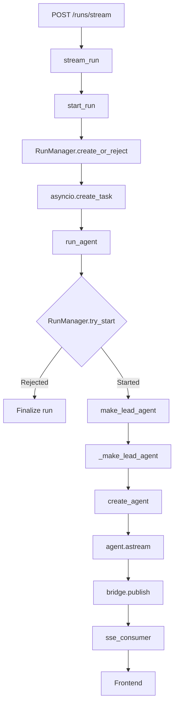

# DeerFlow Request Lifecycle

## Purpose

Tài liệu này ghi lại request lifecycle của DeerFlow và cách kiến trúc đó
định hướng việc xây dựng Mini DeerFlow.

DeerFlow được sử dụng như một reference implementation. Mini DeerFlow không
import hoặc phụ thuộc trực tiếp vào source code DeerFlow.

## End-to-end lifecycle



## Layer responsibilities

| Layer           | DeerFlow component   | Responsibility                               |
| --------------- | -------------------- | -------------------------------------------- |
| Transport       | `thread_runs.py`     | Receive HTTP requests and return SSE         |
| Run setup       | `start_run()`        | Validate input, create run and attach worker |
| Lifecycle       | `RunManager`         | Manage pending, running and terminal states  |
| Execution       | `run_agent()`        | Execute the compiled graph                   |
| Composition     | `make_lead_agent()`  | Resolve runtime configuration                |
| Agent assembly  | `_make_lead_agent()` | Assemble model, tools, middleware and prompt |
| Agent runtime   | `create_agent()`     | Build the model–tool execution graph         |
| Event transport | `StreamBridge`       | Publish execution events                     |
| Client stream   | `sse_consumer()`     | Convert events into SSE responses            |

## Deferred agent construction

`start_run()` does not construct the agent immediately. It passes
`make_lead_agent` into the worker as `agent_factory`.

The worker performs admission first:

```text
wait_for_prior_finalizing
    → try_start
    → construct agent
    → execute agent
```

This avoids constructing an agent for a run that was rejected or cancelled
before execution.

## Run lifecycle

The main lifecycle is:

```text
pending
    → running
    → completed | interrupted | error | timeout
```

`RunManager` owns these transitions. The LLM cannot directly change the
lifecycle state.

## Execution loop

The compiled agent graph is executed through:

```python
async for chunk in agent.astream(...):
    await bridge.publish(...)
```

`agent.astream()` produces model, tool and state events. `bridge.publish()`
does not make semantic decisions; it transports those events to consumers.

## Production factory and public factory

The production lead-agent path is:

```text
make_lead_agent
    → _make_lead_agent
    → create_agent
```

`create_deerflow_agent()` is a separate public factory for constructing an
agent from plain Python arguments. The inspected production HTTP path does
not call it.

## Mapping to Mini DeerFlow

| DeerFlow            | Current Mini DeerFlow    | Status                |
| ------------------- | ------------------------ | --------------------- |
| Request input       | CLI goal argument        | Implemented           |
| Model factory       | `create_chat_model()`    | Implemented           |
| Structured plan     | `create_research_plan()` | Implemented           |
| Typed state         | `Plan` and `PlanStep`    | Partially implemented |
| Agent graph         | None                     | Missing               |
| Tool execution      | None                     | Missing               |
| Observe/replan loop | None                     | Missing               |
| Run lifecycle       | None                     | Missing               |
| Persistence         | None                     | Missing               |
| Streaming           | None                     | Missing               |

## Architectural decision for Mini DeerFlow

Mini DeerFlow will initially implement a synchronous local execution loop:

```text
goal
    → plan
    → choose step
    → execute tool
    → observe result
    → update state
    → repeat or finish
```

Run management, persistence and HTTP streaming will be added after the core
agent loop works correctly.

This order keeps the first implementation small while preserving the same
separation of responsibilities found in DeerFlow.