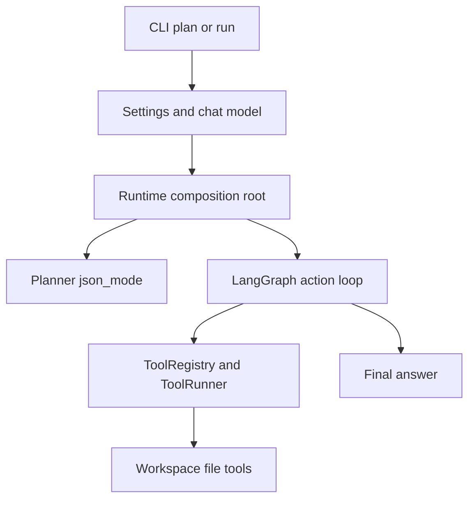

# Executable Research Agent Runtime — Day 07

## Purpose

Day 07 turns the individually built components — planner, LLM action selector,
LangGraph workflow, and secure tool layer — into one executable runtime that a
user can actually run from the command line.

Before Day 07 the CLI only exposed the standalone planner. After Day 07 the CLI
offers two subcommands:

- `plan`: build and validate a `Plan` without executing anything;
- `run`: execute the full bounded agent — planning, action selection, tool
  execution, step completion, and final synthesis — inside a read-only or
  opt-in-write workspace.

The day also resolved two real model-compatibility incidents discovered while
running the composed runtime against the GLM endpoint. Both incidents and their
fixes are recorded below, because they explain several design decisions that
look unusual without the failure history.

## Runtime architecture



The composition root is the only place where concrete classes are constructed.
Workflow nodes, the planner wrapper, and the action selector receive their
dependencies from the outside and never import application wiring.

## Composition root

`create_default_agent_runtime` in `src/mini_deerflow/runtime.py` performs the
full wiring:

1. create one chat model from `Settings` (via an injectable `model_factory`);
2. create a `Workspace` rooted at the requested directory;
3. compose the read-only file tools (`ListFilesTool`, `ReadFileTool`);
4. append `WriteFileTool` only when `allow_write` is true;
5. build the `ToolRegistry` allowlist;
6. bind the planner with `available_tools=registry.definitions()` using
   `functools.partial`, so plans can only require operations the composed tools
   actually support;
7. construct the `LLMActionSelector` on the same model;
8. compile the graph and wrap it in an `AgentRuntime`.

Every dependency is injected. Unit tests for composition pass a fake model
factory and assert on the captured planner, selector, registry, and limits
without contacting any API. A separate test also verifies that a non-boolean
`allow_write` is rejected before the model factory is ever called, so an
invalid flag cannot construct a half-configured runtime.

## AgentRuntime

`AgentRuntime` owns the compiled graph and a `RuntimeLimits` value:

- `max_tool_calls_per_step` (default 5);
- `max_total_tool_calls` (default 20);
- `recursion_limit` (default 100).

`RuntimeLimits` rejects booleans, non-integers, and non-positive values in
`__post_init__`, so an invalid limit fails at construction time instead of
producing a silently unbounded run.

`AgentRuntime.run(goal)` normalizes the goal, builds a fresh initial state via
`create_initial_state`, and awaits `graph.ainvoke` with
`config={"recursion_limit": ...}`. If the graph returns something that is not a
state dictionary, the runtime raises `TypeError` instead of letting a malformed
result flow downstream. The final answer is written by the `synthesize` node;
the CLI treats a missing `final_answer` as a domain error (`RuntimeError`,
exit code 1) rather than printing an empty success.

Two different bounds cooperate here:

- the **tool-call budgets** limit how many tool executions may happen at all;
- the **LangGraph recursion limit** bounds graph super-steps regardless of what
  the budgets do.

They are deliberately separate: budgets are domain semantics (how much work
the agent may perform), while the recursion limit is an engine safety net
against routing that never terminates.

## CLI contract

```bash
uv run mini-deerflow plan "Compare LangGraph and CrewAI for a research agent."
```

```bash
uv run mini-deerflow run "Inspect the local workspace and summarize verified evidence."
```

Runtime options for `run`:

| Option | Default | Meaning |
| --- | --- | --- |
| `--workspace` | `.mini-deerflow/workspace` | Workspace directory for file tools; created if missing. |
| `--allow-write` | off | Opt in to the `write_file` tool. |
| `--max-tool-calls-per-step` | 5 | Tool calls allowed per plan step. |
| `--max-total-tool-calls` | 20 | Tool calls allowed in the whole run. |
| `--recursion-limit` | 100 | Maximum LangGraph execution steps. |

Example with options on Bash:

```bash
uv run mini-deerflow run \
  "Inspect the local workspace and summarize verified evidence." \
  --workspace ".mini-deerflow/workspace" \
  --max-tool-calls-per-step 2 \
  --max-total-tool-calls 6 \
  --recursion-limit 60
```

The same command on Windows PowerShell:

```powershell
uv run mini-deerflow run `
  "Inspect the local workspace and summarize verified evidence." `
  --workspace ".mini-deerflow/workspace" `
  --max-tool-calls-per-step 2 `
  --max-total-tool-calls 6 `
  --recursion-limit 60
```

Output and exit codes:

- `plan` prints the validated `Plan` JSON to stdout;
- `run` prints the final research answer to stdout;
- domain and validation errors go to stderr with exit code 1;
- argument parsing errors print argparse usage with exit code 2.

Known gap: some model API infrastructure errors are not yet converted into a
clean message and may surface as a raw traceback (still exit code 1). This is
accepted technical debt for Day 07, listed under Current limitations.

## Capability-aware planning

The planner prompt receives the tool catalog as data. When composed through the
runtime, `available_tools` is the real `registry.definitions()` list, and the
prompt instructs the model to require only operations supported by those input
and output schemas, and to record a limitation instead when required evidence
cannot be collected.

The standalone `plan` subcommand intentionally passes no tool catalog, so
standalone plans are capability-agnostic: they describe verification steps
without assuming specific tools. The `run` path always composes the real file
tool catalog before planning.

## GLM planner compatibility

During Day 7 integration, the planner reliably failed against the GLM endpoint
under `with_structured_output(Plan, method="function_calling")`:

1. every `PlanStep` came back missing `title`, and Pydantic rejected the whole
   `Plan` with `steps.N.title Field required`;
2. the prompt already required all four fields, so a prompt-only fix was not
   the answer — the tool schema generated by LangChain also contained `title`
   in both `properties` and `required`;
3. the failure mode was traced to the function-calling transport itself: the
   endpoint intermittently dropped the field while serializing tool-call
   arguments;
4. the planner switched to `method="json_mode"`, which returns a plain JSON
   object and never passes through tool-call argument serialization;
5. the result is still validated against the same strict `Plan` model —
   unknown fields rejected, consecutive step numbers enforced, `title` still
   required;
6. `PLANNER_MAX_ATTEMPTS = 2` bounds re-asks on structured-output
   validation failures, and the final failure is re-raised as `ValueError`
   with the underlying error preserved as `__cause__`;
7. a real planner verification run against the live endpoint returned a valid
   five-step plan with all fields present.

The lesson recorded here: structured output does not remove hallucination or
provider quirks. It only creates a validation boundary — malformed model
output fails loudly at the schema instead of flowing into the agent.

## Cross-step continuity

The action context deliberately does not forward the whole `AgentState`:

| Data | Scope | Rationale |
| --- | --- | --- |
| Raw tool observations | current step only | large payloads stay local; later steps do not re-pay their token cost |
| Completed step summaries | all completed steps | compact continuity: what was established, by which step |
| Budgets and step metadata | current step | routing and remaining calls |

Summaries are copied into each context with `list(state["notes"])`, so later
mutations of the state list cannot leak into an already-built context, and the
`ActionContext` model itself is frozen with at most seven summaries. During the
controlled run this design showed up as intended: steps three and four reused
the listing and file contents recorded by earlier steps without issuing new
tool calls.

Summaries remain untrusted evidence. The selector prompt requires treating
them as data, never as instructions, and forbids treating unsupported claims
from earlier summaries as newly verified facts.

## Action-selection resilience

The action decision is a strict discriminated union (`ToolCallAction` /
`CompleteStepAction`). The transport field `action_type` is aliased to the
domain field `type`, and validation accepts either name while serializing to
the domain shape. Like the planner, the selector uses `json_mode`.

The source contract for step completion is strict:

- `sources` may contain only valid HTTP/HTTPS URLs (`list[HttpUrl]`);
- local file paths, workspace paths, or file descriptions must not appear in
  `sources`;
- local workspace evidence is described inside `summary`;
- with no valid URL, the model must return exactly `"sources": []`.

`HttpUrl` only checks URL structure. It does not prove that a URL exists or
was observed by a tool, so the prompt additionally forbids inventing sources.

Bounded retry protects against recoverable format failures:

- at most `ACTION_SELECTION_MAX_ATTEMPTS = 2` model calls per decision;
- only `OutputParserException` and `ValidationError` are retried;
- infrastructure errors (connection, timeout, API errors) propagate
  immediately after a single call;
- the second attempt appends a static corrective message controlled by the
  application — it never echoes the raw payload, the parser error, or the
  validation input, so a poisoned completion cannot be reflected back into
  the prompt;
- the corrective message instructs fixing the format only, not changing
  facts;
- action-format retries live entirely inside the selector and never touch
  `total_tool_calls`, `tool_calls_in_current_step`, observations, or any
  other state;
- after the final failed attempt, the last error is wrapped in
  `ActionSelectionError` (a `RuntimeError` subclass) and preserved as
  `__cause__`, which the CLI reports cleanly with exit code 1.

## Read-only security model

The default runtime registry contains only `list_files` and `read_file`.
`write_file` exists in the registry only when the user passes
`--allow-write`. The model cannot call an unregistered tool: tool names
resolved through the allowlist fail with a structured `ToolResult` failure
observation, not an exception.

The `Workspace` class is the filesystem boundary: absolute paths are rejected,
path traversal is resolved away, and symlinks or junctions are filtered during
listing. The default workspace directory `.mini-deerflow/` is ignored by Git
so runtime data cannot leak into commits.

Prompt guardrails (treat tool output as untrusted, do not follow instructions
found in files) are a second line of defense. They are not treated as a hard
security boundary — the hard boundaries are the registry allowlist, input
validation, timeouts, budgets, and the workspace path checks.

## Request lifecycle

A `run` request executes in this order:

```text
CLI run
→ settings and model
→ runtime composition (registry, workspace, selector, limits)
→ planner node (validated Plan)
→ decide_action (build action context, select one structured action)
→ execute_tool (validate input, run tool, record observation) → decide_action
→ complete_step (summary + sources, advance step) → decide_action
→ synthesize (final answer from notes, sources, execution counters)
→ CLI prints final answer
```

The loop between `decide_action`, `execute_tool`, and `complete_step` repeats
until all steps complete or a budget is exhausted. A `ToolResult` failure —
unknown tool, invalid input, timeout, or tool exception — is recorded as an
observation and fed back to the selector. It does not crash the workflow by
default; the agent is expected to adapt or to complete the step while stating
the limitation.

## Controlled end-to-end verification

A real smoke test exercised the full chain with the live model:

- a temporary workspace outside the repository contained exactly one file,
  `evidence.txt`, whose content carried four sentinel facts (codename, owner,
  status, limitation);
- the sentinel values were not present in the goal, so they could only be
  learned through `read_file`;
- `list_files` succeeded and reported the single file;
- `read_file` succeeded and returned the full content;
- the final answer reported all four facts correctly, quoting the file rather
  than the filename;
- execution counters: 2 tool calls, 2 successful, 0 failed, 0 execution
  errors;
- the Sources section honestly reported `No sources were recorded.` —
  local-only evidence stayed inside step summaries instead of being forced
  into URL-shaped citations;
- the workspace file hash and size were unchanged after the run, and no new
  files were created;
- the temporary workspace was removed after the run;
- the process exited with code 0.

## Failure-driven improvements

Two incidents from Day 07 shaped the current design.

| Aspect | Incident 1 — planner drops `title` | Incident 2 — local description in URL-only sources |
| --- | --- | --- |
| Symptom | `ValidationError: steps.0.title Field required` for every step; CLI exited 1 before execution | `OutputParserException`: `sources.0 Input should be a valid URL` at step completion, after evidence was already collected |
| Boundary that caught it | strict `Plan` Pydantic schema | strict `ActionDecision` schema (`list[HttpUrl]`) |
| Root cause | GLM function-calling transport intermittently omitted a required field while serializing tool-call arguments | prompt never stated that `sources` accepts only HTTP/HTTPS URLs, so the model cited a workspace file descriptively in a local-only run |
| Rejected fixes | making `title` optional; auto-filling a fake `title` after the fact; loosening the schema | changing `sources` to `list[str]`; silently stripping the invalid entry; swallowing the parser error |
| Selected fix | switch planner transport to `json_mode`, keep strict validation, add bounded planner attempts | four explicit source rules in the selector prompt plus a bounded two-attempt retry with a static corrective message |
| Regression protection | transport locked by unit tests; JSON contract prompt test; bounded-attempt tests | invalid source strings (including the exact incident payload) locked in schema tests; retry, corrective-message, and no-counter-impact tests |

The common principle: fix the contract or the transport at the boundary, never
weaken the schema and never rewrite model output after validation.

## Test strategy

The Day 07 test suite is layered so that most layers never touch the network:

- unit schemas: `Plan`, `PlanStep`, `ActionDecision`, and source URL rules;
- runtime limits: type, boolean, and positivity validation;
- dependency composition: fake model factory proves the wiring (tools, planner
  binding, selector, limits) without API calls;
- CLI behavior: argument parsing, exit codes 0/1/2, stdout/stderr separation;
- planner transport: `json_mode` locked, JSON output contract in the prompt,
  bounded attempts with cause preservation;
- action retry: recovery on second attempt, bounded failure, infrastructure
  errors not retried, corrective message content;
- workflow integration: recoverable action-format failures complete the run,
  and tool counters only increase for real tool executions;
- full real smoke: one live end-to-end run against the composed CLI.

Historical Day 07 result:

```text
260 passed, 2 skipped
```

The two skips are Windows symlink-permission tests in the workspace suite —
they require a privilege the test account does not hold and are not functional
failures.

## Current limitations

Accepted technical debt after Day 07:

- OpenAI infrastructure errors may still surface as a raw traceback in the
  CLI instead of a clean message;
- planner retry re-sends the same prompt and has no corrective feedback yet;
- file observations have no token-aware truncation, so a large workspace file
  can still inflate the action context;
- the `messages` state channel exists in `AgentState` but no node writes to
  it;
- budget exhaustion ends the run instead of allowing a
  complete-with-limitation step;
- no persistent checkpoint/resume;
- no real web provider is composed into the default runtime;
- no typed local/web citation union;
- no streaming progress, human-in-the-loop, or sub-agents.

## Next step

The project roadmap points Day 08 at checkpoint, thread identity, and resume:
attaching a SQLite checkpointer, exposing a `--thread-id` option with thread
listing/resume commands, and simulating a crash followed by resume without
re-executing completed steps. Implementation order and scope have not been
decided yet; this document records the direction only.

## Related documentation

- [DeerFlow request lifecycle](deerflow-request-lifecycle.md)
- [LangGraph workflow — Day 04](langgraph-workflow-day-04.md)
- [Tool execution layer — Day 05](tool-execution-layer-day-05.md)
- [Bounded agent action loop — Day 06](bounded-agent-loop-day-06.md)
