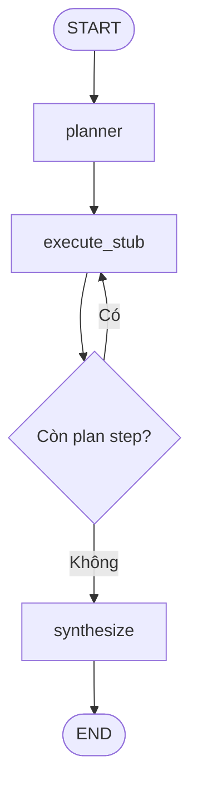

# LangGraph Workflow — Day 04

## Purpose

Ngày 4 chuyển Mini DeerFlow từ một structured planner gọi LLM một lần
thành một workflow nhiều node có state, reducer, conditional edge và
recursion limit.

Executor hiện tại là deterministic stub. Workflow chưa gọi tool thật và
chưa phải Deep Agent hoàn chỉnh.

## Workflow



Call flow:

```text
START
    → planner
    → execute_stub
    → execute_stub
    → ...
    → synthesize
    → END
```

Mỗi lần `execute_stub` chỉ xử lý một plan step.

## Agent state

| Field          | Type               | Update behavior |
| -------------- | ------------------ | --------------- |
| `goal`         | `str`              | Replace         |
| `messages`     | `list[AnyMessage]` | `add_messages`  |
| `plan`         | `Plan \| None`     | Replace         |
| `current_step` | `int`              | Replace         |
| `notes`        | `list[str]`        | `operator.add`  |
| `sources`      | `list[str]`        | `operator.add`  |
| `final_answer` | `str \| None`      | Replace         |
| `errors`       | `list[str]`        | `operator.add`  |

Fields representing current values use replace semantics. Fields representing
accumulated history use reducers.

## Initial state

Every workflow run starts from a complete state:

```python
{
    "goal": normalized_goal,
    "messages": [],
    "plan": None,
    "current_step": 0,
    "notes": [],
    "sources": [],
    "final_answer": None,
    "errors": [],
}
```

A factory function creates new lists for every run so mutable state is not
shared between runs.

## Node responsibilities

### Planner

The planner receives the research goal and returns a validated `Plan`.

```text
goal → planner → Plan
```

The planner is injected into the graph as a callable:

```python
Callable[[str], Plan]
```

Production can inject an LLM planner, while tests inject a deterministic fake
planner.

### Execute stub

The executor reads:

```python
plan.steps[current_step]
```

It emits one observation and increments `current_step`.

```python
{
    "notes": ["Stub observation ..."],
    "current_step": current_step + 1,
}
```

The executor includes guards for:

- missing plan;
- negative step index;
- step index outside the plan.

### Execution router

After every executor invocation, the router evaluates:

```python
current_step < len(plan.steps)
```

If true, execution returns to `execute_stub`. Otherwise it moves to
`synthesize`.

### Synthesize

The deterministic synthesizer combines the goal and accumulated notes into
`final_answer`.

It does not call an LLM yet.

## State updates and final state

With `stream_mode="updates"`, LangGraph returns only the delta emitted by each
node.

Example executor delta:

```python
{
    "current_step": 2,
    "notes": ["Stub observation for step 2"],
}
```

The final state contains all observations because the `notes` field uses the
list addition reducer.

## Observed transitions

The verified three-step workflow produced:

```text
1. planner
2. execute_stub
3. execute_stub
4. execute_stub
5. synthesize
```

The resulting state had:

```text
current_step = 3
notes count = 3
errors count = 0
final_answer = present
```

## Recursion limit

Workflow invocation supplies a recursion limit:

```python
config = {"recursion_limit": 10}
```

This protects the runtime from an accidental infinite graph loop. It is a
technical safety boundary, not the business completion condition.

The actual completion condition is:

```python
current_step >= len(plan.steps)
```

## Current limitations

This workflow is not a complete Deep Agent because:

- executor does not select or call tools;
- observations are generated by a stub;
- synthesizer does not reason over real evidence;
- no replanning exists;
- no checkpoint or persistence exists;
- no human-in-the-loop approval exists.

The tool layer will replace the stub in later milestones while preserving the
state and graph boundaries established here.