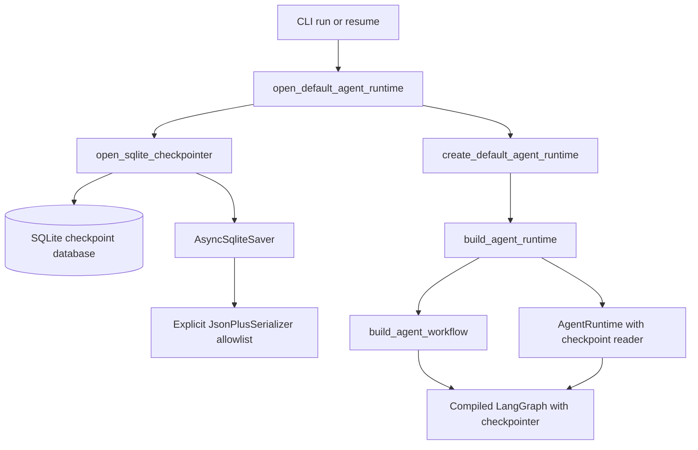
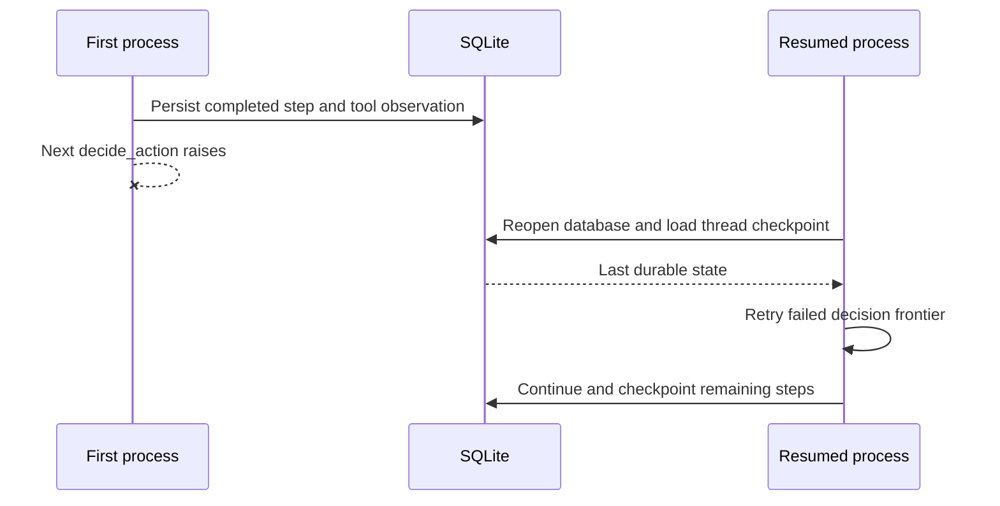

# Persistent Thread Runtime — Day 08

## Purpose

Day 08 changes Mini DeerFlow from a bounded runtime whose in-memory state is
lost with the process into a bounded runtime that can persist and resume one
research thread. The implementation adds local SQLite checkpoints, stable
thread identity, duplicate-thread protection, thread listing, and explicit
persistence errors without weakening the tool-call and recursion limits built
on earlier days.

This is an MVP persistence layer, not a production storage system. Its purpose
is to make interruption and continuation observable and testable while keeping
the implementation small enough to study.

The main terms used in this document are:

- A **checkpoint** is a durable snapshot written by LangGraph after successful
  graph progress. It contains enough graph state and execution metadata to
  continue later.
- A **thread** is one logical graph execution identified by a stable
  `thread_id`.
- A **checkpoint namespace** is the pair of a checkpoint database and a
  `thread_id`. The same identifier in another database names a different
  thread.
- A **resume frontier** is the first graph work that is not represented by the
  latest successful checkpoint. That work may run when the thread resumes.
- A **serializer allowlist** is the explicit set of application types that the
  checkpoint deserializer may reconstruct as Python objects.
- An **async context manager** is an `async with` boundary that acquires a
  resource and guarantees cleanup when control leaves the block.

## What changed from Day 07

Day 07 composed the planner, selector, bounded LangGraph loop, workspace, and
tools into `AgentRuntime`. A call to `AgentRuntime.run(goal)` always created a
new in-memory state and invoked the graph. If the process stopped, there was no
durable state to reopen.

Day 08 makes four contract-level changes:

1. `AgentRuntime.run` now requires a keyword-only `thread_id` and treats the
   invocation as creation of a new thread.
2. `AgentRuntime.resume` continues a checkpointed thread without constructing
   a new initial state.
3. The compiled graph can receive an injected LangGraph checkpointer.
4. The CLI grows `resume` and `threads`, while `run` gains required thread
   identity and a configurable SQLite database path.

The existing bounds remain in force. `RuntimeLimits` still controls per-step
tool calls, total tool calls, and LangGraph recursion. Persistence makes state
durable; it does not make execution unbounded.

For the earlier non-persistent design, see
[Executable Research Agent Runtime — Day 07](executable-agent-runtime-day-07.md).

## Persistence architecture

Persistence is introduced through dependency injection rather than through
global state. `build_agent_workflow` accepts an optional
`BaseCheckpointSaver[str]` and passes it to `builder.compile`. The same saver is
also held through the narrower `AsyncCheckpointReader` protocol by
`AgentRuntime`, which needs checkpoint lookup for create-versus-resume checks.



The concrete responsibilities are separated as follows:

- `src/mini_deerflow/persistence.py` owns thread validation, checkpoint path
  preparation, serializer construction, SQLite saver lifecycle, persistence
  errors, and thread listing.
- `src/mini_deerflow/runtime.py` owns new-run and resume semantics and injects
  the saver into the graph.
- `src/mini_deerflow/agent_workflow.py` remains responsible for graph nodes and
  routing; it only passes the optional saver to LangGraph at compile time.
- `src/mini_deerflow/cli.py` owns command parsing, resource scopes, output, and
  process exit behavior.

`langgraph-checkpoint-sqlite` is a direct project dependency because the
application imports and constructs its `AsyncSqliteSaver`. `aiosqlite` is also
a direct dependency, rather than an accidental transitive dependency, because
production code imports it directly to create the connection.

## Thread identity and checkpoint namespace

`normalize_thread_id` strips surrounding whitespace and validates the result
with this contract:

```text
^[A-Za-z0-9][A-Za-z0-9._-]{0,127}$
```

The identifier must therefore start with an ASCII letter or number, contain
only letters, numbers, dots, underscores, or hyphens, and be at most 128
characters. Empty identifiers, path traversal such as `../another-thread`,
slashes, spaces, and identifiers that start with punctuation are rejected as
`InvalidThreadIdError`.

`create_thread_config` places the normalized value in the LangGraph runtime
configuration:

```python
{
    "configurable": {
        "thread_id": "research-001",
    },
    "recursion_limit": 60,
}
```

The `thread_id` is not a filesystem path and does not select a database. The
checkpoint path selects the SQLite database; `configurable.thread_id` selects
one logical execution inside that database. Consequently, `research-001` in
`checkpoints-a.sqlite` and `research-001` in `checkpoints-b.sqlite` are separate
namespaces.

## SQLite checkpointer lifecycle

`resolve_checkpoint_path` expands a home marker if present, resolves the path
without requiring the database to exist, rejects an existing directory, and
creates the parent directory with `parents=True` and `exist_ok=True`. Filesystem
failures are converted into `CheckpointPathError`.

`open_sqlite_checkpointer` is an async context manager. Its lifecycle is:

1. normalize the requested database path;
2. open an `aiosqlite` connection;
3. wrap the connection in `_NormalizingAsyncSqliteSaver`, a subclass of
   `AsyncSqliteSaver`;
4. attach the explicit checkpoint serializer;
5. yield the saver to the caller;
6. close the connection in `finally`, including when runtime execution raises.

`open_default_agent_runtime` nests runtime construction inside this context.
The runtime and compiled graph therefore share the same live saver, and the
connection remains available for the entire `run` or `resume` operation. Tests
verify that the SQLite tables are initialized and that attempting to use the
connection after the context exits reports that there is no active connection.

## Checkpoint serializer allowlist

Mini DeerFlow constructs `JsonPlusSerializer` with
`allowed_msgpack_modules=_ALLOWED_CHECKPOINT_TYPES`. It does not pass the
wildcard value `True`, and it does not enable `pickle_fallback`. The application
allowlist contains exactly these domain types:

- `Plan`;
- `ToolObservation`;
- `CompleteStepAction`;
- `ToolCallAction`.

This list is sufficient for the current state shape. LangGraph's Pydantic v2
serialization records the allowlisted outer model and the result of its
`model_dump()`. That dump recursively represents nested fields as ordinary
data. When the outer model is reconstructed, Pydantic validates its declared
field types and rebuilds them:

- `Plan` rebuilds each dictionary in `steps` as a `PlanStep`;
- `ToolObservation` rebuilds its nested `result` as `ToolResult` and its
  `action` as `ToolCallAction`.

`PlanStep` and `ToolResult` therefore do not appear as independent msgpack
extension objects in this state path and do not need separate allowlist
entries. The round-trip tests assert the restored outer and nested types. The
strict-mode integration test reopens a real SQLite checkpoint with
`LANGGRAPH_STRICT_MSGPACK=true` and observes neither an unregistered-type
warning nor a blocked-deserialization warning.

An unregistered custom model is intentionally not reconstructed as that custom
class. It is returned as ordinary data and produces the expected blocked-type
warning in the focused negative test. This boundary limits which application
constructors the serializer may invoke, but it is not authentication or
integrity protection for the database itself.

## `run`, `resume`, and `threads`

The three persistence-aware operations have deliberately different semantics.

| Operation | Input state | Existing checkpoint required? | Model/runtime construction |
| --- | --- | --- | --- |
| `run` | Fresh state from `create_initial_state(goal)` | Must not exist | Yes |
| `resume` | `None` passed to the compiled graph | Must exist | Yes |
| `threads` | No agent state | Database may be empty | No |

`run` creates a validated thread config, checks for an existing checkpoint,
and then calls `graph.ainvoke(initial_state, config=config)`.

`resume` validates the same thread config, requires a configured checkpoint
reader, confirms that a checkpoint exists, and calls:

```python
await graph.ainvoke(None, config=config)
```

Passing `None` is important: LangGraph resumes from the persisted state rather
than receiving a new goal or a replacement initial state. In particular, the
planner is not deliberately invoked again by runtime setup.

`threads` calls `list_research_threads`, which opens only the SQLite saver and
delegates to `list_thread_ids`. The persistence API iterates checkpoints with
`checkpointer.alist(None)`, collects string thread identifiers into a set, and
returns a sorted tuple. This provides unique, deterministic output. The CLI
handles `threads` before it constructs `RuntimeLimits`; it does not construct
`Settings`, a chat model, a workspace, or `AgentRuntime`.

## Duplicate-thread protection

Before a new run invokes the graph, `AgentRuntime.run` reads the latest
checkpoint for the requested config. If one exists, it raises
`ThreadAlreadyExistsError` before planner or graph execution. The existing
checkpoint is left unchanged and can still be resumed.

This check prevents an accidental sequential reuse of a thread identifier. It
is not an atomic cross-process reservation: two processes can both observe no
checkpoint before either writes one. Production-grade uniqueness would require
a transactional create operation or another storage-level constraint.

## Crash-resume semantics

The deterministic regression scenario interrupts execution after completed
work has already reached a checkpoint:

```text
planner
→ decide_action
→ execute_tool
→ complete_step
→ checkpoint
→ decide_action raises
→ process stops
→ reopen SQLite
→ resume(thread_id)
→ retry failed frontier
→ continue remaining steps
```



The nearest durable state is the checkpoint after the successful step. The
tests prove the following observable behavior:

- the planner call count remains one across interruption and resume;
- the completed tool call count remains one and its observation survives;
- the completed first step is not selected or executed again;
- the `decide_action` invocation that raised is retried because its result was
  never part of a later successful checkpoint;
- the remaining steps continue from the persisted state.

This is an **at-least-once boundary** at the failed frontier, not an
exactly-once guarantee. Work represented by the latest checkpoint is not
repeated in the tested flow. Work after that checkpoint may be attempted again.

## Checkpoint boundary and retry behavior

A checkpoint describes successful graph progress, not every instruction the
process started to execute. The distinction matters for retries:

- A completed node whose state update is in the latest checkpoint is durable.
- A node that raises before its update is checkpointed remains outside that
  durable state and may run again after resume.
- A tool side effect can occur before the graph writes the checkpoint that
  records its observation. If the process dies in that interval, resume may
  invoke the tool again.

The deterministic crash-resume tests place the failure at a decision node
after the earlier step and tool observation are checkpointed. They therefore
prove that completed checkpointed work is not repeated. They do not prove
exactly-once behavior for arbitrary external side effects.

The `idempotent` field in a tool contract describes tool behavior, but Day 08
does not add an idempotency key, side-effect journal, or transactional coupling
between an external system and the SQLite checkpoint.

## Persistence error boundary

`PersistenceError` is the common domain base class and is itself a subclass of
`ValueError`. This lets the existing CLI error handler print a concise
`Error: ...` message to stderr and return exit code `1` without a traceback.

| Error group | Domain behavior | Cause preservation |
| --- | --- | --- |
| Invalid thread ID | `InvalidThreadIdError` before graph execution | Direct validation error; no wrapped exception |
| Invalid checkpoint path | `CheckpointPathError` for a directory or path preparation failure | An underlying `OSError` is retained with `raise ... from error` when present |
| SQLite open failure | `CheckpointStorageError` before yielding the saver | Original `OSError` or `sqlite3.Error` is retained as `__cause__` |
| SQLite read/list/write/close failure | `CheckpointStorageError` at the saver or runtime boundary | Original `sqlite3.Error`, or close-time `OSError`, is retained as `__cause__` |
| Missing checkpointer | `CheckpointUnavailableError` from `resume` | Direct domain error |
| Thread not found | `ThreadNotFoundError` before graph invocation | Direct domain error |
| Thread already exists | `ThreadAlreadyExistsError` before graph invocation | Direct domain error |
| Planner, selector, tool, or application failure | Remains in its own validation/runtime/tool contract | It is not relabeled as a persistence failure unless the failure came from persistence |

`_NormalizingAsyncSqliteSaver` wraps the SQLite saver operations used by the
graph: `aget_tuple`, `alist`, `aput`, and `aput_writes`. `_read_checkpoint`
also translates a raw `sqlite3.Error` from any compatible checkpoint reader.
The path and connection context translate only storage-related failures.

The CLI currently catches `ValidationError`, `ValueError`, `TypeError`,
`RuntimeError`, and `TimeoutError`. Because `PersistenceError` extends
`ValueError`, persistence failures naturally use the clean exit-code-1 path.
This does not mean every error caught by the CLI is a persistence error.

## CLI contract and migration

The CLI now has four subcommands. The examples use generic paths and contain no
machine-specific location.

### Plan

Bash:

```bash
uv run mini-deerflow plan \
  "Compare two bounded agent-loop designs."
```

PowerShell:

```powershell
uv run mini-deerflow plan `
  "Compare two bounded agent-loop designs."
```

`plan` remains persistence-independent and prints validated plan JSON.

### Run a new thread

Bash:

```bash
uv run mini-deerflow run \
  "Inspect the workspace and summarize verified evidence." \
  --thread-id "workspace-audit-001" \
  --checkpoint-db "/path/to/checkpoints.sqlite" \
  --workspace "/path/to/workspace"
```

PowerShell:

```powershell
uv run mini-deerflow run `
  "Inspect the workspace and summarize verified evidence." `
  --thread-id "workspace-audit-001" `
  --checkpoint-db ".mini-deerflow\checkpoints.sqlite" `
  --workspace ".mini-deerflow\workspace"
```

### Resume a thread

Bash:

```bash
uv run mini-deerflow resume \
  --thread-id "workspace-audit-001" \
  --checkpoint-db "/path/to/checkpoints.sqlite" \
  --workspace "/path/to/workspace"
```

PowerShell:

```powershell
uv run mini-deerflow resume `
  --thread-id "workspace-audit-001" `
  --checkpoint-db ".mini-deerflow\checkpoints.sqlite" `
  --workspace ".mini-deerflow\workspace"
```

`resume` accepts no goal. The goal is part of the stored state.

### List threads

Bash:

```bash
uv run mini-deerflow threads \
  --checkpoint-db "/path/to/checkpoints.sqlite"
```

PowerShell:

```powershell
uv run mini-deerflow threads `
  --checkpoint-db ".mini-deerflow\checkpoints.sqlite"
```

`threads` prints a JSON object containing a sorted `threads` array and its
`count`.

The required stable identity is an intentional breaking CLI contract:

```text
Day 07:
mini-deerflow run "<goal>"

Day 08:
mini-deerflow run "<goal>" --thread-id "<stable-id>"
```

Python callers must similarly migrate from `AgentRuntime.run(goal)` to
`AgentRuntime.run(goal, thread_id="<stable-id>")`.

## Controlled real CLI lifecycle

A controlled lifecycle verification exercised the same database and thread
through this sequence:

```text
run → threads → duplicate rejection → resume → threads
```

The observed results were:

- the initial `run` completed and persisted one thread;
- the first `threads` call listed that thread;
- a second `run` with the same `thread_id` returned exit code `1` and did not
  overwrite the checkpoint;
- `resume` on the completed thread returned exit code `0` and the saved final
  result;
- the final `threads` call still reported exactly one thread;
- the workspace evidence hash and size were unchanged, so this lifecycle did
  not mutate the evidence file.

No API key, environment file, real checkpoint database, sentinel value, or
machine-specific path is recorded in this document.

## Test strategy

Day 08 uses several layers of deterministic tests:

- `tests/test_persistence.py` covers thread normalization, config shape, path
  handling, serializer allowlisting, custom-type rejection, SQLite setup and
  close, sorted unique listing, and cause-preserving storage errors.
- `tests/test_runtime.py` covers fresh-state invocation, pre-run duplicate
  lookup, no-input resume, missing and unknown threads, invalid checkpoint
  readers, and storage lookup normalization.
- `tests/test_runtime_composition.py` proves that the same saver is injected
  into runtime and graph and that the async runtime context owns its connection.
- `tests/test_runtime_resume.py` uses real SQLite checkpoints to prove
  crash-resume behavior, strict deserialization, duplicate rejection without
  overwrite, graph write-error normalization, and listing after reopening.
- `tests/test_cli.py` covers argument requirements, the lightweight `threads`
  path, stdout/stderr separation, and clean exit behavior.
- `tests/test_agent_workflow.py` verifies that the injected checkpointer is
  attached to the compiled graph.

Recorded verification evidence for the completed Day 08 implementation:

```text
Full Pytest: 322 passed, 2 skipped
Ruff check: passed
Ruff format check: 60 files already formatted
uv lock --check: passed
Crash-resume regression: passed
Strict mode: no serializer warning
Real lifecycle: run → threads → duplicate rejection → resume → threads passed
Duplicate run exit code: 1
Completed-thread resume exit code: 0
Final thread count: 1
Workspace evidence: unchanged
GitNexus index: up-to-date and used for impact inspection
```

The GitNexus graph was current at the documented revision. Its persistence
queries traced the CLI-to-saver, resume-to-checkpoint-read, and
CLI-to-thread-listing flows. Upstream impact inspection for `AgentRuntime`
reported one direct importer, `src/mini_deerflow/cli.py`, with low risk. This is
architecture evidence, not a replacement for the source and test assertions
listed above.

## Current limitations

The implementation intentionally retains the following limitations:

- Local SQLite is suitable for this MVP, not for production deployment.
- Thread lifecycle status is incomplete; listing returns identifiers, not
  running, interrupted, completed, or failed states.
- There is no thread delete, archive, or prune operation.
- Duplicate-thread checking is not atomic across multiple processes.
- There is no tool-call idempotency key or external side-effect journal.
- A side-effecting tool may run again if the process dies after the external
  side effect but before the corresponding checkpoint is durable.
- Checkpoint records have no application-level integrity signature or
  authentication. An attacker who can modify the database is outside the
  current trust model.
- There is no production database, remote checkpoint service, or multi-tenant
  storage isolation.
- The default runtime does not yet compose a real multi-source web provider.
- There is no reviewer/replanner or evidence-quality loop yet.
- Persistence does not provide exactly-once execution.

These constraints are why the feature is described as a persistent local MVP,
not as production-ready infrastructure.

## Architecture decisions

The Day 08 implementation makes the following explicit decisions:

1. **Inject persistence into the existing graph.** The workflow does not open
   databases itself, so graph logic remains testable with memory or fake
   checkpointers.
2. **Own resources at the composition boundary.** An async context manager
   gives the SQLite connection one visible lifetime around runtime execution.
3. **Keep direct imports as direct dependencies.** Both
   `langgraph-checkpoint-sqlite` and `aiosqlite` are declared by the project.
4. **Use stable caller-supplied identity.** Resume does not guess which run a
   user meant, and one database provides the namespace boundary.
5. **Separate create from resume.** `run` rejects existing checkpoints;
   `resume` requires one and never submits a replacement initial state.
6. **Keep listing below model composition.** Inspecting stored identifiers does
   not require credentials, a model request, or an agent runtime.
7. **Allowlist domain reconstruction.** The serializer does not use wildcard
   application imports or pickle fallback.
8. **Normalize only persistence failures as persistence errors.** Planner,
   selector, tool, and application failures retain their own meaning.
9. **Test the recovery boundary with counters.** Planner, decision, and tool
   counts make accidental repeated work visible.
10. **Document at-least-once behavior.** The implementation does not claim an
    exactly-once guarantee it cannot enforce across external side effects.

## Next step: real evidence workflow

According to the project roadmap, Day 09 is the next step: compose real web
search and fetch providers, store traceable evidence records, cross-check final
citations against observed evidence, and write the final Markdown artifact to
the workspace. That work should preserve the persistence boundary established
here so an interrupted multi-source research run can resume from durable state.

The reviewer/replanner follows on Day 10. It should evaluate evidence quality
with a bounded structured verdict and invoke replanning only when evidence is
insufficient. Persistence is a prerequisite for that longer control loop, but
Day 08 does not implement it.

## Related documentation

- [README](../README.md)
- [Executable Research Agent Runtime — Day 07](executable-agent-runtime-day-07.md)
- [Bounded Agent Action Loop — Day 06](bounded-agent-loop-day-06.md)
- [Tool Execution Layer — Day 05](tool-execution-layer-day-05.md)
- [LangGraph Workflow — Day 04](langgraph-workflow-day-04.md)
- [DeerFlow Request Lifecycle](deerflow-request-lifecycle.md)
- [14-day Deep Agent roadmap](roadmap-deep-agent-deerflow-14-ngay.md)
