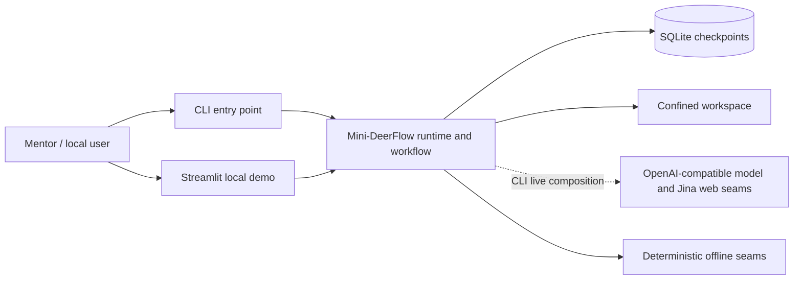
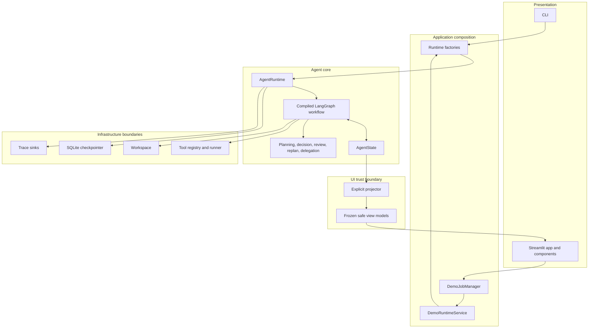
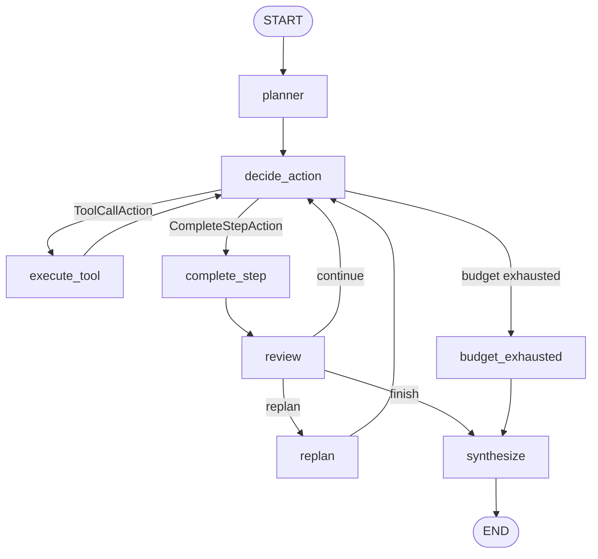
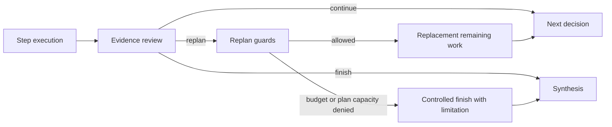
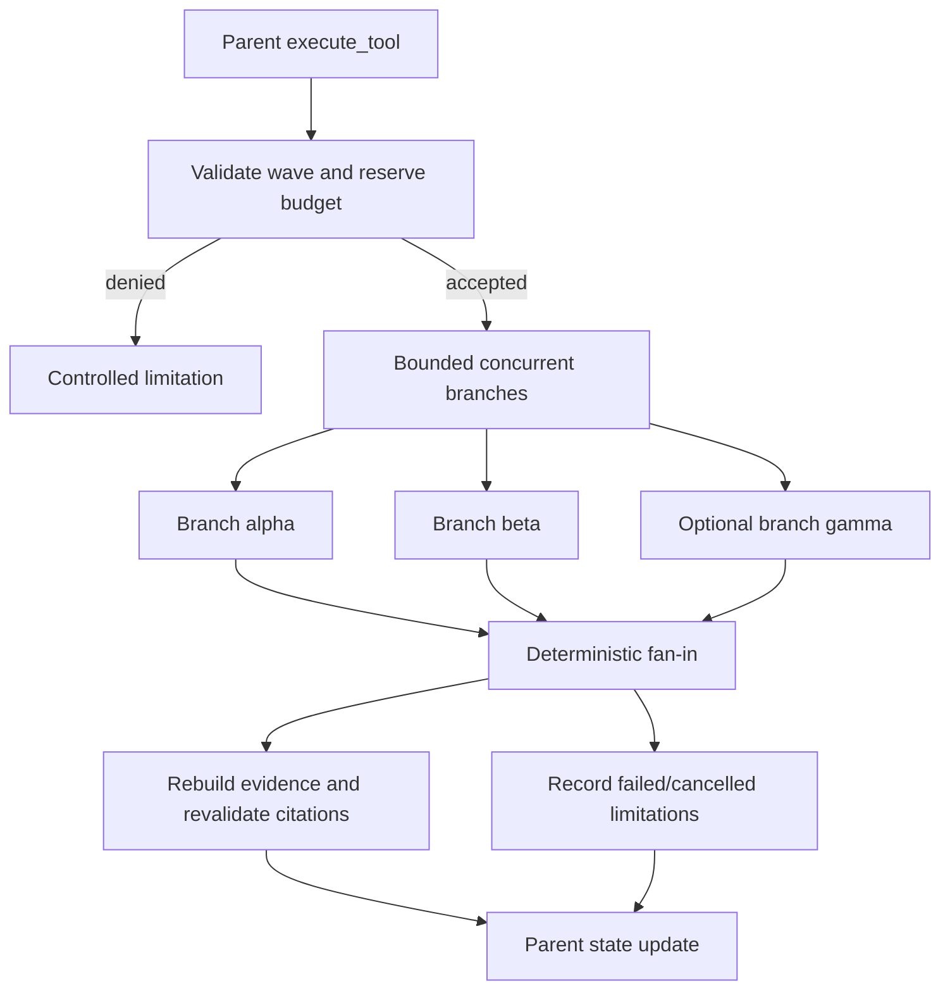
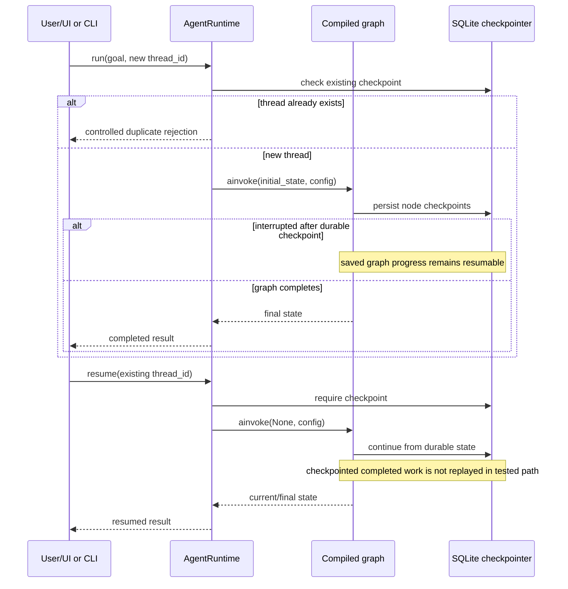
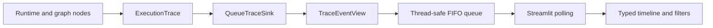
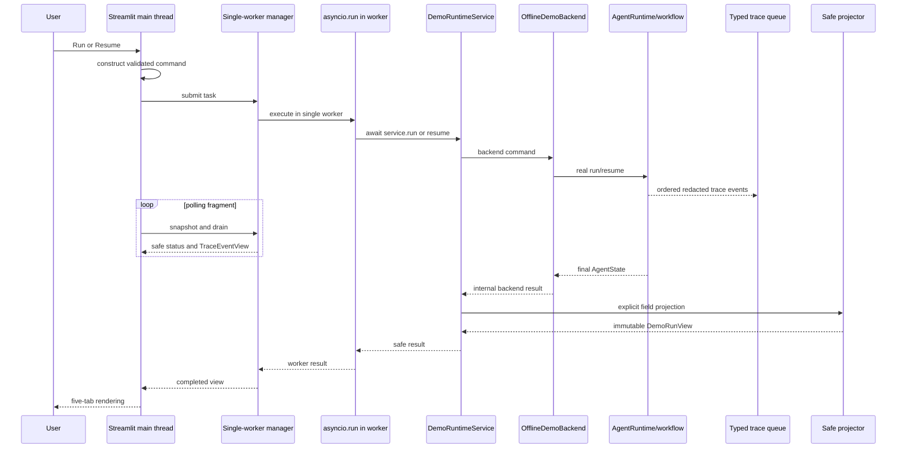
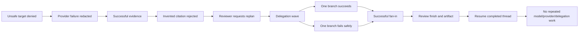

# Mini-DeerFlow — Project-Level Technical Report

> **Phạm vi chứng cứ.** Báo cáo này mô tả repository tại commit `ac70906` trên nhánh `main`. Các phát biểu kiến trúc được kiểm tra trực tiếp từ source code, test và cấu hình hiện có. Nội dung chỉ có trong tài liệu được ghi là **DOCUMENTED**; suy luận hợp lý nhưng chưa có kiểm chứng trực tiếp được ghi là **INFERRED**. Nếu không đủ bằng chứng, báo cáo dùng **NOT VERIFIED** thay vì biến giả định thành sự thật.

## 1. Executive Summary

Mini-DeerFlow là một learning MVP bằng Python để nghiên cứu cách xây dựng một research agent có giới hạn rõ ràng. Hệ thống nhận một mục tiêu, lập kế hoạch, chọn và thực thi tool, thu thập evidence, kiểm tra citation, review/replan, có thể giao các research task độc lập rồi fan-in kết quả, tổng hợp báo cáo Markdown, và lưu checkpoint để resume theo thread.

Giá trị kỹ thuật chính không nằm ở độ rộng tính năng mà ở các boundary có thể kiểm chứng:

- action loop, tool call, replan và delegation đều có budget;
- evidence khác với provider result, tool observation và citation;
- citation chỉ được chấp nhận khi URL canonical thuộc evidence thành công;
- state bền vững được checkpoint bằng SQLite và có semantics `run`/`resume` riêng;
- trace dùng schema allowlist và không chứa raw payload;
- Streamlit chỉ nhận immutable safe view model qua projector tường minh;
- demo mặc định deterministic, không cần API key, DNS, socket hay web/model thật.

Repository chứng minh một MVP phục vụ học tập và mentor demo, không chứng minh production readiness, source compatibility, behavioral equivalence hay feature parity với DeerFlow upstream.

| Trục trưởng thành | Mức hiện tại | Cách hiểu đúng |
| --- | --- | --- |
| Agent core | End-to-end learning MVP | Các contract chính có implementation và test |
| Live execution | CLI live-capable composition | Không phải validation về chất lượng provider/model thật |
| Mentor experience | Deterministic Streamlit demo | Local walkthrough, không phải production frontend |
| Persistence | SQLite checkpoint/resume | Không bảo đảm exactly-once external effects |
| Safety/observability | Application boundaries + redacted trace | Không thay network sandbox/production telemetry |

**Nguồn chính:** `README.md`, `pyproject.toml`, `src/mini_deerflow/`, `tests/test_final_acceptance.py`, `tests/test_demo_offline.py`, `evals/run_evals.py`.

## 2. Project Identity

### 2.1 Bài toán

Một agent nghiên cứu không nên chỉ là chuỗi prompt và tool call. Nó cần quản lý state, giới hạn tài nguyên, nguồn chứng cứ, failure, persistence và bề mặt trình bày. Mini-DeerFlow hiện thực một lát cắt nhỏ nhưng end-to-end của bài toán đó, đủ để quan sát các quyết định kiến trúc và kiểm thử invariant.

### 2.2 Định vị

| Thuộc tính | Trạng thái hiện tại | Mức chứng cứ |
| --- | --- | --- |
| Loại sản phẩm | Learning/demo MVP chạy local | VERIFIED |
| Backend | Python runtime và LangGraph workflow | VERIFIED |
| Giao diện | Streamlit một trang, localhost-oriented | VERIFIED |
| Chế độ demo | Offline deterministic mặc định | VERIFIED |
| Chế độ live | Có composition cho CLI; không có live-mode control trong UI | VERIFIED |
| Production service | Không có | VERIFIED |
| DeerFlow parity | Không được tuyên bố | VERIFIED qua phạm vi tài liệu/code |

Tên “Mini-DeerFlow” phản ánh nguồn cảm hứng khái niệm, không phải một fork tương thích hoặc bản thu nhỏ có parity đã được chứng minh.

## 3. Goals and Scope

### 3.1 Mục tiêu đã hiện thực

- Mô hình hóa research workflow dưới dạng state graph có checkpoint.
- Tách planning, action selection, tool execution, review, replan, delegation và synthesis.
- Đặt budget cho tool, context, replan và delegated branches.
- Giữ provenance cho evidence và chỉ render citation đã validate.
- Cho phép resume thread mà không lặp lại phần việc đã checkpoint hoàn tất.
- Cung cấp trace redacted và UI demo an toàn, deterministic.

### 3.2 Trong phạm vi

| Capability | Implementation hiện tại | Bằng chứng đại diện |
| --- | --- | --- |
| Structured planning | Plan 3–7 bước, schema frozen và `extra="forbid"` | `src/mini_deerflow/schemas.py`, `src/mini_deerflow/planner.py` |
| Bounded action loop | Per-step và total tool-call limit | `src/mini_deerflow/agent_workflow.py`, `src/mini_deerflow/runtime.py` |
| Tool execution | Registry allowlist, input validation, timeout | `src/mini_deerflow/tools/` |
| Web evidence | Search/fetch observation thành evidence có provenance | `src/mini_deerflow/evidence.py`, `src/mini_deerflow/tools/web.py` |
| Review/replan | Verdict continue/replan/finish, guard số vòng | `src/mini_deerflow/review.py`, `src/mini_deerflow/replanner.py` |
| Delegation | One-level bounded wave, partial-failure fan-in | `src/mini_deerflow/delegation.py` |
| Persistence | LangGraph SQLite checkpointer theo thread | `src/mini_deerflow/persistence.py`, `src/mini_deerflow/runtime.py` |
| Artifact | Deterministic Markdown qua workspace boundary | `src/mini_deerflow/agent_workflow.py`, `src/mini_deerflow/workspace.py` |
| Mentor UI | Safe projected Streamlit view | `src/mini_deerflow/demo/` |

### 3.3 Ngoài phạm vi

Authentication, authorization, multi-tenancy, distributed workers, durable production queue, cancellation, browser/shell execution, arbitrary file browsing, production egress enforcement, hosted artifact serving và credential management không được hiện thực.

| In Scope | Out of Scope |
| --- | --- |
| Planning và typed action loop | Authentication/authorization/multi-tenancy |
| Allowlisted tools và bounded execution | Arbitrary browser/shell/tool execution |
| Evidence, citation membership, review/replan | Semantic fact checking hoặc unlimited self-correction |
| Depth-one bounded delegation/fan-in | Distributed multi-agent platform |
| SQLite checkpoint/run/resume | Exactly-once effects, production DB lifecycle |
| Redacted trace và workspace artifact | Production telemetry/artifact serving |
| Offline deterministic Streamlit demo | Hosted/live production UI và credential management |

## 4. System Capabilities

### 4.1 Capability matrix

| Nhóm | Capability | Trạng thái | Boundary quan trọng | Mức chứng cứ |
| --- | --- | --- | --- | --- |
| Agent | Goal-to-artifact flow | Implemented | Artifact là Markdown có cấu trúc | VERIFIED |
| Agent | Planning/action loop | Implemented | Plan 3–7 bước; typed action, budget | VERIFIED |
| Tools | Exact-name tool registry | Implemented | Pydantic input, timeout, normalized failure | VERIFIED |
| Tools | File write | Implemented, conditional | Không model-selectable; synthesis path cố định | VERIFIED |
| Research | Web search/fetch | Implemented, live-capable | Fetch public-target safety; search-result schema/canonicalization | VERIFIED |
| Research | Evidence/citations | Implemented | Provenance + canonical membership, không fact check | VERIFIED |
| Review | Review/replan | Implemented | Cycle/tool/plan guards | VERIFIED |
| Delegation | Partial-failure fan-in | Implemented | Một cấp, 2–3 task/wave | VERIFIED |
| Persistence | Checkpoint/resume | Implemented | SQLite; resume khác retry | VERIFIED |
| Safety | URL/path/payload boundaries | Implemented | Không phải OS/network sandbox | VERIFIED |
| Observability | Typed redacted trace | Implemented | Local trace, không production telemetry | VERIFIED |
| Artifact | Deterministic Markdown | Implemented | Workspace confined, no hosted serving | VERIFIED |
| Frontend | Streamlit mentor walkthrough | Demo-only | Offline deterministic, local | VERIFIED |
| Evaluation | Pytest + deterministic evaluator | Implemented | Contract coverage, không chứng minh bug-free | VERIFIED |
| Context | Semantic memory/RAG | Not implemented | Deterministic projection/truncation only | VERIFIED |
| Durability | Exactly-once external effects | Not implemented | Có cửa sổ effect-before-checkpoint | VERIFIED |

## 5. System Context



Sơ đồ thể hiện hai bề mặt vào nhưng một tập domain/runtime chính. UI demo không mở credential input hoặc tự động fallback sang live provider. CLI composition có thể cấu hình model/provider thật; demo mặc định tiêm deterministic seams.

**Nguồn:** `src/mini_deerflow/cli.py`, `src/mini_deerflow/runtime.py`, `src/mini_deerflow/demo/service.py`, `src/mini_deerflow/demo/offline_scenario.py`.

## 6. Architecture Overview



Đây là layering khái niệm. Repository không được tổ chức thành các thư mục DDD `domain/application/infrastructure`; phần lớn core nằm trực tiếp trong package `mini_deerflow`. Không nên diễn giải cây vật lý thành Clean Architecture hoàn chỉnh.

### 6.1 Project structure mapping

```text
mini-deerflow/
├── src/mini_deerflow/
│   ├── cli.py, config.py, model.py       # entry/composition
│   ├── runtime.py, persistence.py        # runtime/checkpoint lifecycle
│   ├── agent_workflow.py, state.py       # canonical graph/state
│   ├── planner.py, decision.py           # plan/action policy
│   ├── review.py, llm_reviewer.py        # review
│   ├── replanner.py, delegation.py       # recovery/delegation
│   ├── evidence.py, context_budget.py    # evidence/context controls
│   ├── tracing.py, workspace.py          # observability/artifact boundary
│   ├── tools/                            # contracts, registry, runner, tools
│   └── demo/                             # Streamlit presentation/facade/jobs
├── tests/                                # unit, integration, system, UI tests
├── evals/                                # deterministic evaluator and dataset
├── docs/                                 # design/learning/demo documentation
├── pyproject.toml
└── uv.lock
```

## 7. Execution Modes

| Mode | Entry | Purpose | Persistence | Provider |
| --- | --- | --- | --- | --- |
| `plan` | `mini-deerflow plan GOAL` | Tạo và in structured plan | Không mở runtime checkpoint | OpenAI-compatible model qua Settings |
| `run` | `mini-deerflow run GOAL --thread-id ID` | Bắt đầu research thread mới | SQLite checkpoint | Live-capable model + Jina/web composition |
| `resume` | `mini-deerflow resume --thread-id ID` | Tiếp tục checkpoint hiện có, không phải retry | Đọc/ghi cùng SQLite thread | Cùng composition; completed work không replay trong tested path |
| `threads` | `mini-deerflow threads` | Liệt kê persisted thread IDs | Đọc SQLite | Không cần model/provider call |
| Streamlit offline demo | `streamlit run src/mini_deerflow/demo/app.py` | Mentor walkthrough deterministic | SQLite dưới demo root do app chọn | Scripted/fake seams; không network |

Live capability không đồng nghĩa một production backend. UI hiện không cung cấp live-mode control, API-key field hay automatic live fallback.

## 8. Backend Composition

Luồng composition đã kiểm tra:

```text
CLI main
  -> asyncio.run(...)
  -> run_research_agent / resume_research_agent
  -> open_default_agent_runtime (async context manager)
  -> open SQLite checkpointer
  -> create_default_agent_runtime
  -> build_agent_runtime
  -> build_agent_workflow
  -> compiled LangGraph + AgentRuntime
```

`create_default_agent_runtime` dựng Workspace, file/web/delegation tools và execution/action registries. Nó chuyển planner, action selector, registries, reviewer/replanner, checkpointer, limits, context budget, artifact path và tracer vào `build_agent_runtime`. Factory này gọi `build_agent_workflow`, nơi `ToolRunner` được dựng từ registry. Đây là explicit constructor/factory injection; repository không có service container.

`workflow.py` không phải canonical production graph. Nó là scaffold LangGraph nhỏ, được dùng bởi `tests/test_workflow.py`. Báo cáo này dùng `agent_workflow.py` làm nguồn sự thật cho workflow thực thi.

**Nguồn:** `src/mini_deerflow/cli.py`, `src/mini_deerflow/runtime.py`, `src/mini_deerflow/agent_workflow.py`, `tests/test_runtime_composition.py`.

## 9. Runtime Lifecycle

`AgentRuntime` sở hữu ranh giới gọi compiled graph, chứ không tự hiện thực logic node. Lifecycle chính:

1. Composition mở checkpointer và tạo graph đã compile.
2. `run` validate thread/goal, từ chối thread đã có checkpoint, tạo initial state và gọi `graph.ainvoke`.
3. LangGraph thực thi node, ghi checkpoint qua saver.
4. `resume` yêu cầu checkpoint tồn tại và gọi `graph.ainvoke(None, config)` để tiếp tục từ trạng thái bền vững.
5. Async context manager đóng SQLite resource sau phiên dùng.

CLI sở hữu event loop qua `asyncio.run`. Worker của Streamlit cũng sở hữu event loop riêng cho từng task qua wrapper async; Streamlit main thread không chạy runtime async trực tiếp.

Mỗi `run`/`resume` mở run-scoped trace context trước graph invocation; node/tool/review/checkpoint events dùng cùng run identity và sequence. Trace sink được tiêm vào runtime, còn trace data không trở thành durable `AgentState`.

`RuntimeLimits` đặt các mặc định đã xác minh: tối đa 5 tool call cho mỗi step, 20 tool call toàn run, 2 vòng replan, recursion limit 100 và delegation concurrency 2 (được validate trong khoảng 1–3).

## 10. Canonical State

Canonical state là `AgentState` trong `state.py`, một `TypedDict` dùng reducer annotations cho các field tích lũy. Container state không immutable; kỷ luật cập nhật nằm ở việc node trả về partial update để LangGraph merge.

| State field | Purpose | Durable? | UI exposed? |
| --- | --- | ---: | --- |
| `goal` | Mục tiêu research | Có | Plain text đã làm sạch |
| `messages` | Field dự phòng với `add_messages` reducer; canonical graph hiện không đọc/ghi field này | Có | Không |
| `plan` | Structured plan và trạng thái step | Có | Bounded plan projection |
| `current_step` | Step hiện tại | Có | Chỉ status/step safe |
| `pending_action` | Tool/complete action chờ xử lý | Có | Không |
| `tool_observations` | Kết quả tool đã chuẩn hóa | Có | Không raw; chỉ evidence projection |
| `tool_calls_in_current_step` | Per-step counter | Có | Budget counter |
| `total_tool_calls` | Run-wide counter | Có | Budget counter |
| `pending_review_verdict` | Verdict chờ route | Có | Không trực tiếp |
| `review_verdicts` | Review chronology | Có | Rationale/route bounded |
| `replans` | Replan history | Có | Chronology bounded |
| `delegations` | Wave/branch accounting | Có | Safe status/budget/limitations |
| `notes` | Nội dung hỗ trợ synthesis | Có | Không trực tiếp |
| `findings` | Findings tích lũy | Có | Chỉ safe artifact/evidence-related projection |
| `evidence` | Evidence có provenance | Có | Bounded evidence cards |
| `sources` | Accepted citation sources | Có | Accepted citations only |
| `final_answer` | Exact final Markdown | Có | `st.code`/download qua safe view |
| `artifact_path` | Filesystem location nội bộ | Có | Không |
| `errors` | Controlled workflow errors | Có | Không raw; safe limitations/status only |

Reducer `add_messages`, phép cộng list, `merge_evidence_records` và `merge_citation_sources` xác định cách merge. Evidence/source có merge semantics riêng để giảm trùng lặp.

State lifecycle đi từ initial goal/empty accumulators, qua planner và loop thực thi, đến final answer/artifact. Trace không nằm trong `AgentState`; nó đi qua trace sink riêng.

## 11. Workflow Graph



Graph trên là đường có reviewer, tức composition đầy đủ hiện tại. Builder cũng hỗ trợ cấu hình không reviewer: `complete_step` sẽ route tới step kế tiếp hoặc `synthesize` mà không đi qua review.

| Node | Input chính | Output/transition chính |
| --- | --- | --- |
| `planner` | goal, context | structured plan |
| `decide_action` | current step, bounded context, budgets | tool call hoặc complete-step action |
| `execute_tool` | validated action | observation, evidence, counters, delegation record |
| `complete_step` | step hiện tại | đánh dấu tiến độ/chuyển review |
| `budget_exhausted` | counters/limits | controlled limitation/error rồi synthesis |
| `review` | plan, findings, evidence, limitations | continue/replan/finish verdict |
| `replan` | verdict + current plan/state | replacement remaining work |
| `synthesize` | bounded verified state | final Markdown + optional artifact write |

**Nguồn:** `src/mini_deerflow/agent_workflow.py`, `tests/test_agent_workflow.py`, `tests/test_review_loop.py`.

## 12. Planning and Action Loop

Plan và action dùng Pydantic schema frozen, closed (`extra="forbid"`) và có field/relationship validation. Đây không phải global Pydantic strict mode: một số primitive hợp lệ có thể được Pydantic coerce. Plan có 3–7 bước, ID liên tiếp từ 1, mỗi bước có title, objective và completion criteria được giới hạn. Replan tạo `ReplacementWork` cho phần còn lại; merge giữ các step đã hoàn tất thay vì viết lại lịch sử.

Action loop không cho model gọi tool tùy ý. Selector trả về một structured action thuộc union đã biết. Graph kiểm tra budget trước và sau selection, registry kiểm tra exact tool name, runner validate arguments theo input model, áp timeout, rồi chuẩn hóa success/failure thành `ToolResult`.

Completion không có nghĩa mọi external fact đều đúng. Nó có nghĩa workflow đã đi tới route finish/budget-exhausted và synthesis từ state hợp lệ trong các guard hiện có.

## 13. Tool Architecture

### 13.1 Boundary

`ToolInput` và `ToolResult` là Pydantic model frozen, `extra="forbid"`. `ToolResult` enforce invariant giữa `success`, `data` và `error`. `Tool` là protocol; `ToolRegistry` là allowlist exact-name; `ToolRunner` xử lý validation, timeout và exception normalization.

| Tool | Model selectable? | Mục đích | Restriction |
| --- | ---: | --- | --- |
| `list_files` | Có | Liệt kê file trong workspace | Relative path, confinement, size/count limit |
| `read_file` | Có | Đọc text file | Workspace-only, path/size validation |
| `web_search` | Có | Tìm nguồn | Provider result schema + canonicalization; không dùng fetch target validator |
| `web_fetch` | Có | Lấy nội dung nguồn | Validate target và redirect/final metadata |
| `delegate_research` | Có | Chạy bounded branch wave | Một cấp, web-only child tools, reserved budget |
| `write_file` | Không | Ghi artifact | Chỉ execution registry khi `allow_write`; synthesis path cố định |

### 13.2 Real logic và fake seams

Registry, runner, workflow, evidence extraction, safety validation, budget và state transition là real runtime logic. Trong offline demo, các external decision/data seams — model, provider, resolver và researcher — được thay bằng scripted deterministic implementations; trace clock/run-ID factory cũng được tiêm để observability có identifier/thứ tự ổn định. Do đó demo không phải ảnh chụp UI giả, nhưng cũng không chứng minh chất lượng của provider/model thật.

## 14. Web and URL Safety

`web_safety.py` tạo application-level URL safety boundary cho fetch target:

- chỉ cho phép HTTP/HTTPS;
- từ chối userinfo, localhost, `.local` và host/IP không public;
- resolver trả về địa chỉ phải đều public;
- sau khi provider trả page metadata, fetch tool revalidate URL cuối và redirect chain được khai báo trước khi content được accepted thành successful `ToolResult`/evidence.

Provider error được chuyển thành failure có kiểm soát thay vì truyền raw body/header/exception vào state hoặc trace. Trajectory deterministic xác minh một `web_fetch` tới `127.0.0.1` bị chặn trước provider call.

`web_search` validate provider result bằng typed schema/`HttpUrl` rồi canonicalize khi tạo evidence, nhưng không chạy `PublicWebTargetValidator` cho từng search-result URL. Vì vậy public-address validation không nên được suy rộng từ fetch sang mọi URL do search provider trả về.

Đây không phải network sandbox. Repository chưa chứng minh DNS pinning xuyên toàn bộ request, chống DNS rebinding ở transport layer, visibility đầy đủ cho mọi intermediate redirect của provider, egress proxy production, hoặc public-address re-resolution cho search-result URLs.

**Nguồn:** `src/mini_deerflow/web_safety.py`, `src/mini_deerflow/tools/web.py`, `tests/test_web_safety.py`, `tests/test_web_tools.py`.

## 15. Context Management

Repository không có một “Context object” duy nhất. Context được biểu diễn bằng các typed projection theo tác vụ, gồm `ActionContext`, `ReviewContext`, `ReplanRequest` và `ResearchTaskContext`, cùng `ContextBudget`.

Budget mặc định đã xác minh:

- tổng serialized character: 60.000;
- mỗi item: 4.000 character;
- tối đa 30 item được giữ;
- excerpt tối đa 1.500 character;
- token estimate là `ceil(chars / 4)`, chỉ là heuristic.

Projection được serialize deterministic để đo kích thước. Khi có pressure, hệ thống omission/truncate phần context gửi tới model theo quy tắc; durable `AgentState` không bị cắt. Nếu projection không thể fit budget, operation từ chối có kiểm soát.

Không có semantic summarization, vector database, long-term memory hay automatic retrieval. Delegated branch nhận `ResearchTaskContext` tối thiểu và isolated; fan-in chỉ đưa kết quả đã chuẩn hóa trở lại parent.

**Nguồn:** `src/mini_deerflow/context_budget.py`, `src/mini_deerflow/decision.py`, `src/mini_deerflow/delegation.py`, `tests/test_context_budget.py`, `tests/test_context_pressure.py`.

## 16. Evidence Model

Evidence là record có cấu trúc được dựng từ observation thành công của `web_search` hoặc `web_fetch`; không phải mọi tool result đều trở thành evidence. Mỗi record mang URL canonical, title, excerpt, source tool và provenance gồm step/call, cùng delegation/branch khi có.

| Khái niệm | Nghĩa trong project | Có được đưa thẳng ra UI? |
| --- | --- | --- |
| Provider result | Dữ liệu từ search/fetch provider seam | Không |
| Tool observation | Kết quả chuẩn hóa của một tool call | Không ở dạng raw |
| Evidence | Subset hợp lệ được extract từ web observation thành công | Có, sau safe projection và giới hạn |
| Citation | URL model đề xuất, chỉ hợp lệ nếu membership trong evidence | Chỉ citation accepted |
| UI projection | Allowlisted representation dành cho mentor | Có |

Evidence store có giới hạn số record và độ dài excerpt. Merge logic deduplicate theo identity/canonical URL. Provenance cho biết evidence đến từ tool/step/branch nào; nó không chứng minh nội dung nguồn là đúng.

**Nguồn:** `src/mini_deerflow/evidence.py`, `src/mini_deerflow/state.py`, `tests/test_evidence.py`, `tests/test_research_pipeline.py`.

## 17. Citation Validation

`validate_citations` dùng canonical URL membership: một citation chỉ được accepted nếu URL canonical của nó đã xuất hiện trong evidence thành công. Citation do model “sáng tác” hoặc bất kỳ URL nào không có trong evidence đều bị rejected. Trong deterministic demo, unsafe citation bị reject vì nó không thuộc successful evidence; `validate_citations` tự nó không phải public-target validator. Final sources và UI chỉ dùng accepted set; demo chỉ hiển thị số lượng rejected, không render rejected URL.

Các giới hạn cần diễn đạt chính xác:

- validation xác minh provenance membership, không xác minh truth, entailment hay chất lượng học thuật;
- successful fetch/search không biến toàn bộ provider response thành fact;
- reviewer không tự thêm citation;
- deterministic Markdown renderer recheck citation trước khi tạo sources section;
- summary text do model tạo được strip URL để tránh bypass sources boundary.

Code hiện tại không được sửa trong phase báo cáo; các focused regression tests và system acceptance test vẫn là baseline cho invariant này.

**Nguồn:** `src/mini_deerflow/evidence.py`, `src/mini_deerflow/agent_workflow.py`, `tests/test_evidence.py`, `tests/test_final_acceptance.py`, `tests/test_demo_view_models.py`.

## 18. Review and Replanning

Reviewer là component qua `EvidenceReviewer` protocol; composition đầy đủ dùng `LLMReviewer`. Input là bounded review context, gồm evidence và limitations nhưng không phải raw provider payload. Output `ReviewVerdict` có route `continue`, `replan` hoặc `finish`, rationale và evidence-quality findings có schema.



Replan trigger nằm ở reviewer route. Guard kiểm tra số vòng replan, tổng tool budget và plan-size capacity. Replanner tạo work thay thế cho phần chưa hoàn tất; merge giữ completed steps. Khi không còn cycle/tool budget hoặc plan không còn capacity, route được chuyển thành kết thúc có limitation để tránh loop vô hạn. Invalid reviewer/replanner interface output bị schema/type validation từ chối; graph hiện không có general recovery biến mọi malformed output thành `finish`.

Mặc định `max_replan_cycles=2`. Reviewer đánh giá sufficiency/limitations theo context có sẵn; code không chứng minh một formal verifier cho factual correctness.

**Nguồn:** `src/mini_deerflow/review.py`, `src/mini_deerflow/llm_reviewer.py`, `src/mini_deerflow/replanner.py`, `src/mini_deerflow/agent_workflow.py`, `tests/test_review_loop.py`.

## 19. Delegation and Fan-in

Delegation là một parent-owned tool call, không tạo child LangGraph/checkpoint riêng. Một wave gồm 2–3 research task có ID duy nhất, depth cố định một cấp và branch budget 1–5. Child registry chỉ có web research tools; branch không thể nested-delegate, write artifact hay truy cập full parent state.



Admission reserve tổng branch-call budget cộng parent tool call; nếu reservation vượt phần còn lại thì wave bị từ chối trước khi chạy. Concurrency được giới hạn 1–3, mặc định 2. Branch ID và kết quả được sort để giữ determinism.

Nếu một branch fail, successful sibling vẫn được fan-in. Failure/cancellation trở thành limitation; finding của branch fail không được promote. Citation của branch thành công vẫn phải qua evidence rebuild và validation ở parent. Branch bị cancel được charge phần reserved theo policy đã hiện thực; đây là budget accounting bảo thủ.

Isolation ở đây là context/tool capability isolation trong cùng process, không phải OS/container isolation.

**Nguồn:** `src/mini_deerflow/delegation.py`, `src/mini_deerflow/agent_workflow.py`, `tests/test_delegation.py`, `tests/test_delegation_workflow.py`, `tests/test_final_acceptance.py`.

## 20. Persistence and Resume

Persistence dùng `aiosqlite` và `AsyncSqliteSaver` của LangGraph qua wrapper trong `persistence.py`. Serializer hạn chế các domain type được phép khôi phục. Thread ID được validate theo pattern; UI tạo/chọn ID nhưng không cho người dùng chọn path database/checkpoint.



### Run, resume và retry

| Operation | Semantics |
| --- | --- |
| Run | Tạo execution mới với goal; duplicate thread bị từ chối |
| Resume | Tiếp tục checkpoint hiện có, không nhận goal mới |
| Retry | Không có command/semantics riêng trong implementation |

Test chứng minh resume completed thread không lặp model/provider/delegation đã hoàn tất. Có test mở lại SQLite qua backend/runtime mới trong cùng process. Một restart xuyên OS process là kỳ vọng hợp lý từ SQLite/checkpointer nhưng **NOT VERIFIED** bằng subprocess test hiện tại.

Checkpoint không tạo exactly-once guarantee cho external side effects. Nếu process chết sau external call nhưng trước checkpoint tương ứng, effect có thể bị lặp khi resume.

**Nguồn:** `src/mini_deerflow/persistence.py`, `src/mini_deerflow/runtime.py`, `tests/test_runtime_resume.py`, `tests/test_demo_offline.py`.

## 21. Safety and Trust Boundaries

### 21.1 Runtime biết gì, UI được thấy gì

| Runtime/internal data | UI policy |
| --- | --- |
| Raw `AgentState` | Không nhận/render |
| Raw messages | Không nhận/render |
| Pending action | Không nhận/render |
| Raw observation/provider payload | Không nhận/render |
| Checkpoint/SQLite internals | Không expose |
| Prompt/model response | Không expose |
| Provider exception/body/header | Chỉ controlled error category/message |
| Credential/`.env` content | Không đọc trong offline backend; không có field UI |
| Machine/workspace/artifact path | Không đưa vào view model |
| Rejected URL | Chỉ rejected count |
| Failed-branch false finding | Không được project |
| Branch status/budget | Chỉ safe accounting projection |
| Typed runtime trace | Chỉ scalar `TraceEventView` projection |
| Accepted evidence/citation | Project field-by-field, bounded |

```text
AgentState / traces
        -> explicit project_demo_run mapping
        -> frozen, slotted safe view models
        -> Streamlit components
```

Projector map từng field thay vì gọi whole-state `model_dump()`. Goal, evidence text, review rationale và delegation limitation được coi là untrusted plain text. Projector loại control characters và URL khỏi các vùng prose không dành cho URL. Canonical URL chỉ xuất hiện trong dedicated evidence/citation fields.

Boundary `.env` phụ thuộc execution mode: live CLI `Settings` có thể đọc environment và `.env`; offline backend tạo Settings tường minh với `_env_file=None`, UI không có credential input và không fallback sang live mode. Vì vậy chỉ offline demo có guarantee không đọc `.env`, không phải toàn bộ project.

### 21.2 Các boundary khác

- Workspace từ chối absolute/traversal paths, kiểm tra confinement và symlink/junction, áp size limits.
- Tool registry ngăn arbitrary tool name/arguments ngoài schema.
- Trace schema `extra="forbid"` và không có generic payload bag.
- Error mapping không truyền raw provider exception cho UI.
- Artifact không render bằng arbitrary Markdown/HTML; dùng `st.code`.

Workspace boundary không phải OS sandbox. Streamlit là localhost-oriented qua launch command, nhưng app source không tự enforce bind address; operator phải dùng `--server.address 127.0.0.1`.

**Nguồn:** `src/mini_deerflow/workspace.py`, `src/mini_deerflow/tracing.py`, `src/mini_deerflow/demo/view_models.py`, `src/mini_deerflow/demo/components.py`, `tests/test_demo_view_models.py`.

## 22. Observability and Execution Trace

Trace model là frozen Pydantic schema, `extra="forbid"`. Event kinds gồm run, checkpoint, node, tool, context budget, delegation, review, replan, citation validation và artifact. Payload chỉ chứa identity/counter/outcome scalar allowlisted; không chứa goal, query, URL, body, excerpt, finding, artifact content/path hay exception text.

Mỗi run có sequence tăng dần qua active trace context. Trace không được checkpoint vào `AgentState`; sink có thể là null, in-memory, JSON Lines hoặc queue adapter cho UI. CLI chỉ phát JSONL redacted khi opt-in.

Trong demo, worker emit `ExecutionTrace`; `QueueTraceSink` project ngay thành `TraceEventView`, đẩy FIFO queue; main thread drain, lưu history và render typed timeline/filter. Không có generic JSON viewer.



Error trace thể hiện category/outcome an toàn, không phải debugging dump. Vì vậy trace thích hợp cho walkthrough/invariant inspection, chưa phải production telemetry với correlation, retention, metrics backend hay distributed spans.

**Nguồn:** `src/mini_deerflow/tracing.py`, `src/mini_deerflow/demo/jobs.py`, `src/mini_deerflow/demo/components.py`, `tests/test_tracing.py`, `tests/test_demo_jobs.py`.

## 23. Artifact and Workspace

Synthesis tạo deterministic research report Markdown từ state đã lọc. Renderer recheck citation membership, giữ provenance, sanitize URL và gắn nhãn `unsupported` cho finding không có validated citation. Nhãn này vẫn chỉ phản ánh canonical-URL membership, không chứng minh semantic evidence support hay factual truth. `final_answer` giữ source text trong state; khi write được bật, workflow ghi vào path artifact do composition quyết định thông qua `Workspace`. UI không cho user chọn workspace/artifact path và projector không expose `artifact_path`.

| Khái niệm | Implementation |
| --- | --- |
| Artifact content | `final_answer` Markdown đã render |
| Artifact source | Exact Markdown string được safe view model giữ |
| Workspace path | Internal, confined; không gửi UI |
| Filesystem artifact | Optional write qua workspace boundary |
| Structured preview | Các section/field allowlisted |
| UI source display | `st.code(..., language="markdown")` |
| Download | In-memory source qua `st.download_button` |

Không có `unsafe_allow_html=True`, iframe hoặc arbitrary Markdown renderer trong demo. “Safe preview” đến từ structured projection và plain/code rendering, không phải một general-purpose Markdown sanitizer.

**Nguồn:** `src/mini_deerflow/evidence.py`, `src/mini_deerflow/agent_workflow.py`, `src/mini_deerflow/workspace.py`, `src/mini_deerflow/demo/view_models.py`, `src/mini_deerflow/demo/components.py`.

## 24. Frontend Architecture

Streamlit demo là một page với sidebar, status strip và đúng năm tab: **Overview**, **Evidence & Citations**, **Delegation**, **Trace**, **Artifact**.

| Component/file | Trách nhiệm |
| --- | --- |
| `demo/app.py` | Page layout, session state, commands, polling, status |
| `demo/service.py` | Validate command, backend protocol/facade, safe error mapping |
| `demo/jobs.py` | Single-worker executor, active-job guard, trace queue/history |
| `demo/view_models.py` | Frozen allowlisted view models và explicit projector |
| `demo/offline_scenario.py` | Deterministic injected trajectory, real core runtime |
| `demo/components.py` | Renderer cho status và năm tab |

Sidebar có badge `Offline deterministic — no network`, scenario `Mentor walkthrough v1`, thread ID mới, sample goal, Run, Resume, Refresh và disclaimer. Không có API key, tool picker, checkpoint/workspace path, database browser, write toggle hoặc Cancel.

Session state giữ service/job manager, thread list/selection, last completed safe view, live trace và controlled message. Một active job mỗi session; controls disabled trong lúc chạy; double-submit bị chặn. Last completed view vẫn hiển thị khi job mới đang chạy. Khi fail, UI hiển thị thông báo ngắn có kiểm soát và không traceback/raw exception.

## 25. FE–Backend Interaction



Worker không gọi `st.*`; nó sở hữu async runtime open/close cho `run`/`resume`. Main thread tạo command, submit, poll, drain và render; thao tác refresh thread list là facade call ngắn chạy `service.list_threads()` qua `asyncio.run` trên main thread. `Future` và raw state nằm nội bộ job/backend; UI-facing run result là safe view model. Không có cancellation do semantics checkpoint/external effect chưa được thiết kế cho cancel an toàn.

**Nguồn:** `src/mini_deerflow/demo/app.py`, `src/mini_deerflow/demo/service.py`, `src/mini_deerflow/demo/jobs.py`, `tests/test_demo_app.py`, `tests/test_demo_jobs.py`.

## 26. Deterministic Demo Scenario

Offline backend tái sử dụng real workflow, SQLite, evidence/citation validation, reviewer/replanner, delegation fan-in, tracing và workspace/artifact boundary. Nó fake các external decision/data seams: model, provider, DNS resolver và delegated researcher; đồng thời tiêm deterministic trace clock và run-ID factory để thứ tự/identifier quan sát được ổn định.



Trajectory này là canonical mentor story vì nó đi qua cả happy path và failure/recovery boundary:

1. unsafe fetch tới loopback bị chặn trước provider;
2. provider error chứa canary được normalize/redact;
3. search/fetch thành công tạo evidence;
4. valid, invented và unsafe citations được phân loại; chỉ valid membership được giữ;
5. reviewer yêu cầu replan trong budget;
6. wave có alpha success và beta controlled failure với false-finding canary;
7. fan-in giữ alpha, chuyển beta thành limitation, không promote false finding;
8. review tiếp tục rồi finish, synthesis tạo artifact;
9. resume completed thread trả kết quả mà không replay seams đã hoàn tất.

Offline settings được tạo với `_env_file=None`; ID, thứ tự và output deterministic. Tests monkeypatch/chặn model, DNS, socket và real web call để chứng minh demo không cần chúng.

**Nguồn:** `src/mini_deerflow/demo/offline_scenario.py`, `tests/test_demo_offline.py`, `tests/test_final_acceptance.py`.

## 27. Testing and Evaluation

### 27.1 Test taxonomy

| Nhóm | Mục tiêu | Test đại diện |
| --- | --- | --- |
| Unit | Schema, plan, decision, registry, runner, evidence | `test_schemas.py`, `test_tool_runner.py`, `test_evidence.py` |
| Workflow integration | Node routing, budget, review loop, research pipeline | `test_agent_workflow.py`, `test_review_loop.py`, `test_research_pipeline.py` |
| Persistence/resume | SQLite lifecycle, duplicate, replay behavior | `test_persistence.py`, `test_runtime_resume.py` |
| Security/non-leakage | URL/path safety, trace schema, projector canary | `test_web_safety.py`, `test_workspace.py`, `test_tracing.py`, `test_demo_view_models.py` |
| Context pressure | Truncation/omission/refusal boundaries | `test_context_budget.py`, `test_context_pressure.py` |
| Delegation | Admission, concurrency, partial failure, fan-in | `test_delegation.py`, `test_delegation_workflow.py` |
| System acceptance | Representative end-to-end trajectory | `test_final_acceptance.py` |
| Frontend/AppTest | Controls, tabs, invalid/running/completed states | `test_demo_app.py` |
| Offline integration | Run/list/duplicate/resume/no-network | `test_demo_offline.py` |
| Deterministic evaluator | Dataset-level invariant scoring | `evals/run_evals.py`, `evals/dataset.json` |

### 27.2 Những gì test chứng minh và không chứng minh

Suite chứng minh các invariant ở process/test environment hiện tại, gồm partial failure, redaction, safe projection và resume no-replay. Nó không đo chất lượng nghiên cứu trên web mở, factual accuracy/semantic entailment với model thật, live cost/latency, tải đồng thời production, multi-user consistency, browser compatibility rộng, penetration resistance, cross-platform symlink behavior hoặc restart qua OS process.

### 27.3 Verification snapshot

Snapshot tại baseline trước khi tạo báo cáo: `526 passed, 2 skipped`; deterministic evaluator `9/9` cases và `36/36` invariants. Hai skip là symlink tests trên Windows khi môi trường không cho tạo symlink. Kết quả xác minh lại sau khi tạo report được ghi tại Appendix B.

## 28. Engineering Decisions and Trade-offs

| Decision | Problem solved | Trade-off | Production alternative |
| --- | --- | --- | --- |
| LangGraph state/checkpoint | Route và resume rõ | Coupling vào graph/checkpointer semantics | Versioned graph/state migration, operations tooling |
| Typed structured outputs | Chặn free-form action/payload | Schema evolution tốn công | Versioned contracts và compatibility policy |
| SQLite local persistence | Đơn giản, inspectable, đủ local demo | Single-host lifecycle, HA/concurrency hạn chế | Managed durable store, backup/migration/HA |
| Bounded execution budgets | Ngăn loop/cost không giới hạn | Có thể dừng trước khi đủ evidence | Adaptive policy, quota/usage service |
| Character context budget | Đo deterministic representation | Không phản ánh tokenizer chính xác | Provider-aware token accounting |
| Preserve raw durable state | Resume/audit không mất dữ liệu do compaction | Checkpoint lớn hơn | Tiered storage và lifecycle policy |
| Citation membership | Chặn invented/rejected URLs | Không kiểm tra entailment/truth | Claim-level attribution và fact/source checks |
| Depth-one delegation | Giới hạn state/cost explosion | Không giải quyết hierarchy phức tạp | Supervised multi-level orchestration |
| Deterministic fan-in | Stable ordering, partial failure rõ | Ít linh hoạt trong ranking | Policy-driven aggregation với provenance |
| Workspace confinement | Chặn path escape ở app layer | Không phải OS isolation | Container/sandbox và artifact service |
| Closed redacted trace | Giảm leak raw payload | Ít chi tiết debug | Access-controlled diagnostics + telemetry backend |
| Explicit UI projector | Ngăn raw-state leak theo allowlist | Mapping boilerplate | Versioned presentation contracts/privacy review |
| Single worker/session | State dễ hiểu, tránh double-submit | Throughput thấp, không scale | Durable queue, distributed workers, quotas |
| Real core + offline seams | Demo không phụ thuộc API/network | Không đo live quality | Contract/live staging với secret management |
| No cancellation | Tránh cancel/checkpoint semantics mơ hồ | User không dừng job dài | Cooperative cancel, compensation/idempotency |
| Plain/code artifact rendering | Tránh HTML/Markdown injection | Preview ít phong phú | Sanitizer/CSP và safe artifact serving |

## 29. DeerFlow Relationship

### 29.1 Concepts được lấy cảm hứng

Theo README/docs của project, các concept gồm planning/execution loop, tool use, research evidence, review/replan, delegation, persistence và artifact-oriented output. Mini-DeerFlow hiện thực độc lập một tập con để học các boundary này.

### 29.2 Điều repository thực sự hiện thực

- Một canonical LangGraph workflow nhỏ với state/budget rõ.
- Tool/evidence/citation/review/delegation/persistence boundaries bằng Python.
- CLI live-capable composition và offline deterministic mentor UI.
- Test/evaluator riêng cho invariant của project.

### 29.3 Đơn giản hóa hoặc chưa có

- Không có distributed multi-agent platform; delegation là bounded in-process researcher tool.
- Không có production web/browser/shell sandbox.
- Không có auth, multi-tenant, hosted service, scheduler hay production telemetry.
- Không có upstream compatibility layer hoặc conformance suite.
- Offline demo thay external dependencies bằng deterministic seams.

DeerFlow upstream source/architecture hiện tại không được audit trong task này. Vì vậy mọi so sánh sâu hơn là **NOT VERIFIED**. Không claim source compatibility, protocol compatibility, behavioral equivalence, feature parity hoặc production parity.

## 30. Limitations and Roadmap

### 30.1 Production boundary

| Capability | Current project | Production requirement |
| --- | --- | --- |
| Authentication | Không có | Identity provider, secure sessions |
| Authorization | Không có | RBAC/ABAC và resource policies |
| Multi-tenancy | Không có | Tenant isolation, quotas, data partitioning |
| Database lifecycle | Local SQLite | Migrations, backup/restore, HA, retention |
| Distributed execution | In-process | Durable queue, workers, leases, retries |
| Cancellation | Không có | Cooperative cancel và compensation |
| Live model/provider | CLI composition có seam | Credential vault, policy, rate/cost control |
| Live web access | Application validators/provider | Controlled egress, DNS/redirect enforcement, monitoring |
| Telemetry | Local typed trace sinks | Metrics/logs/traces backend, access/retention |
| Artifact serving | Local workspace/download | Object storage, ACL, malware/content controls |
| Idempotency | Checkpoint no-replay cho completed path | External idempotency keys/exact effect policy |
| UI deployment | Local Streamlit | TLS, auth, CSRF/deployment hardening, scale |

### 30.2 Technical roadmap đề xuất

| Ưu tiên | Hướng phát triển | Điều kiện trước |
| --- | --- | --- |
| 1 | Version state/checkpoint và test migration/restart subprocess | Stable persistence contract |
| 2 | Claim-level citation/entailment evaluation | Defined quality benchmark |
| 3 | Transport-level egress enforcement và redirect/DNS policy | Threat model + deploy target |
| 4 | Durable job queue, cancellation, idempotency | Service/API semantics rõ |
| 5 | Auth, tenant isolation, audit/retention | Product/deployment requirements |
| 6 | Live-mode evaluation harness | Safe credential/provider test environment |
| 7 | Production artifact/telemetry services | Operational ownership |

Roadmap là đề xuất kỹ thuật, không phải capability đã có hoặc cam kết delivery.

### 30.3 Current limitations / future direction

| Current limitation | Future direction đề xuất |
| --- | --- |
| Không auth/authz/multi-tenancy | Identity, policy và tenant-isolated data model |
| Không distributed execution/durable queue | Lease-based workers và durable orchestration |
| Không cancellation | Cooperative cancellation với checkpoint/effect semantics |
| UI chỉ offline local | Tách live frontend/backend sau khi có auth và secret boundary |
| Egress chỉ application-level | Network policy, proxy và DNS/redirect hardening |
| Trace chỉ local | Production metrics/logs/traces với access/retention |
| Artifact chỉ local/download | Access-controlled object storage và serving |
| Không OS sandbox | Process/container isolation cho untrusted tools/content |
| Chưa có migration/backup/HA | Versioned persistence lifecycle |
| Không exactly-once external effects | Idempotency keys và effect journal/compensation |
| Chưa đánh giá live quality/cost/latency | Reproducible live evaluation harness |
| Upstream comparison chưa verify | Separate evidence-based compatibility/comparison study |

## Conclusion

Mini-DeerFlow đã đạt mục tiêu của một learning/mentor MVP: nó kết nối được planning, bounded execution, evidence/citation controls, review/replan, partial-failure delegation, SQLite resume, safe tracing, deterministic artifact và Streamlit projection trong một trajectory có thể kiểm thử. Repository đồng thời thể hiện giới hạn một cách rõ ràng. Production readiness và DeerFlow upstream parity chưa được chứng minh và không nên được suy ra từ tên project hoặc từ việc demo chạy end-to-end.

## Appendix A — Source Map

| Claim/area | Source implementation | Test/document evidence |
| --- | --- | --- |
| Entry/composition | `src/mini_deerflow/cli.py`, `src/mini_deerflow/runtime.py`, `src/mini_deerflow/config.py` | `tests/test_cli.py`, `tests/test_runtime_composition.py`, `tests/test_config.py` |
| Canonical graph | `src/mini_deerflow/agent_workflow.py` | `tests/test_agent_workflow.py`, `tests/test_review_loop.py` |
| State/reducers | `src/mini_deerflow/state.py` | `tests/test_state.py`, `tests/test_execution_state.py` |
| Plan/actions | `src/mini_deerflow/schemas.py`, `planner.py`, `actions.py`, `decision.py` | `tests/test_schemas.py`, `test_planner.py`, `test_actions.py`, `test_decision.py` |
| Tool system | `src/mini_deerflow/tools/` | `tests/test_tool_contracts.py`, `test_tool_registry.py`, `test_tool_runner.py` |
| Web/provider safety | `src/mini_deerflow/web.py`, `web_safety.py`, `tools/web.py` | `tests/test_web_contracts.py`, `test_web_provider.py`, `test_web_safety.py`, `test_web_tools.py` |
| Context | `src/mini_deerflow/context_budget.py` | `tests/test_context_budget.py`, `tests/test_context_pressure.py` |
| Evidence/citation | `src/mini_deerflow/evidence.py` | `tests/test_evidence.py`, `tests/test_research_pipeline.py` |
| Review/replan | `src/mini_deerflow/review.py`, `llm_reviewer.py`, `replanner.py` | `tests/test_review.py`, `test_llm_reviewer.py`, `test_replanner.py`, `test_review_loop.py` |
| Delegation | `src/mini_deerflow/delegation.py` | `tests/test_delegation.py`, `tests/test_delegation_workflow.py` |
| Persistence/resume | `src/mini_deerflow/persistence.py`, `runtime.py` | `tests/test_persistence.py`, `tests/test_runtime_resume.py` |
| Trace | `src/mini_deerflow/tracing.py` | `tests/test_tracing.py` |
| Workspace/artifact | `src/mini_deerflow/workspace.py`, `agent_workflow.py` | `tests/test_workspace.py`, `tests/test_file_tools.py` |
| Demo facade/jobs | `src/mini_deerflow/demo/service.py`, `jobs.py` | `tests/test_demo_jobs.py`, `tests/test_demo_offline.py` |
| Safe projection/UI | `src/mini_deerflow/demo/view_models.py`, `components.py`, `app.py` | `tests/test_demo_view_models.py`, `tests/test_demo_app.py` |
| Offline trajectory | `src/mini_deerflow/demo/offline_scenario.py` | `tests/test_demo_offline.py`, `tests/test_final_acceptance.py` |
| System evaluator | `evals/run_evals.py`, `evals/dataset.json` | `evals/baseline.json` |
| Intended scope | `README.md`, `docs/threat-model.md`, `docs/streamlit-local-demo-day-15.md` | Documentation only where code is not cited |

## Appendix B — Verification Snapshot

### Baseline audited before this report

- Git branch: `main`.
- Git HEAD: `ac70906bd8e2ad5424821091cc2a125d44e436a0`.
- Tracked worktree: clean; pre-existing untracked `.claude/settings.local.json` remained user-owned and untouched.
- Full pytest: `526 passed, 2 skipped`.
- Deterministic evaluator: `9/9` cases, `36/36` invariants.
- Skips: two Windows symlink tests when symlink creation was unavailable.

### Verification rerun for this report

- Structure audit: 30 numbered sections đúng thứ tự, Conclusion, Appendices A/B/C; code fences cân bằng; ít nhất bảy Mermaid diagrams.
- Ruff check: pass.
- Ruff format check: pass, 112 files already formatted.
- Lock check: pass, 83 packages resolved.
- Full pytest: `526 passed, 2 skipped in 9.92s` trong clean rerun với temp root nằm trong workspace; hai skip vẫn là Windows symlink limitation.
- Deterministic evaluator: `9/9` cases, `36/36` invariants.
- `git diff --check`: pass.
- Không source, test, config, dependency hay lockfile nào bị sửa bởi task báo cáo.

Snapshot này chứng minh các contract đã được exercise trong môi trường chạy nêu trên; nó không phải benchmark hiệu năng hoặc bằng chứng hệ thống không có bug.

## Appendix C — Terminology

| Thuật ngữ | Nghĩa trong Mini-DeerFlow |
| --- | --- |
| Action | Structured quyết định gọi tool hoặc hoàn tất step |
| AgentState | Canonical mutable TypedDict state được LangGraph checkpoint |
| Artifact | Final Markdown và optional file được ghi qua Workspace |
| Canonical URL | URL đã normalize dùng làm identity/membership |
| Citation | URL được đề xuất làm source và phải validate với evidence |
| Evidence | Record có cấu trúc extract từ successful web observation |
| Fan-in | Gộp deterministic branch outcomes về parent sau validation |
| Finding | Nội dung kết luận/ghi nhận; không đồng nghĩa evidence |
| Observation | Structured result của tool execution |
| Plan | Structured sequence 3–7 bước với ID và completion criteria |
| Projector | Explicit allowlist mapper từ runtime data sang safe UI model |
| Review | Đánh giá evidence/progress trả route continue, replan hoặc finish |
| Replan | Thay remaining work sau reviewer verdict; không phải retry |
| Delegation | Parent-owned bounded tool call chạy research branches một cấp |
| Checkpoint | Durable graph state/progress gắn với validated thread ID |
| Resume | Tiếp tục graph từ checkpoint của thread hiện có |
| Run | Bắt đầu thread mới với initial goal; duplicate bị từ chối |
| Safe view model | Frozen/slotted dataclass chỉ chứa field UI được phép thấy |
| Tool | Allowlisted capability có typed input và normalized `ToolResult` |
| Trace event | Redacted typed operational event ngoài AgentState |
| Workspace | Boundary giới hạn path và file operation trong root được cấu hình |
