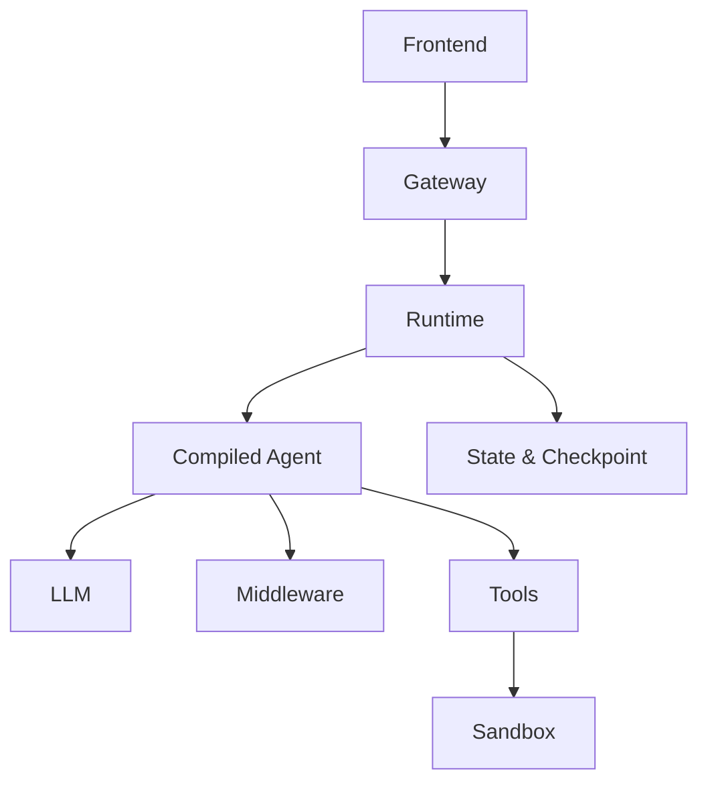

# Báo cáo Ngày 2 — Khởi chạy và kiểm chứng DeerFlow trên Windows

**Ngày:** 21/08/2026  
**Dự án:** Deep Agent MVP dựa trên ByteDance DeerFlow  
**Workspace:** `D:\ViettelDigitalTalent\VAI\projects\deep-agent`  
**Nhánh:** `feature/deep-agent-mvp`

## 1. Mục tiêu trong ngày

- Chuyển môi trường phát triển từ WSL sang Windows native.
- Chuẩn bị đầy đủ toolchain để phát triển DeerFlow bằng VS Code và Claude Code.
- Cài đặt, cấu hình và khởi chạy DeerFlow bằng Docker Desktop.
- Chạy một smoke test end-to-end để xác nhận hệ thống là một Deep Agent thực sự, không chỉ là chatbot.
- Làm quen với kiến trúc, vòng lặp điều phối và middleware của DeerFlow.

## 2. Kết quả đạt được

### 2.1. Chuẩn bị môi trường Windows

Đã kiểm tra và chuẩn hóa môi trường:

| Thành phần | Kết quả |
|---|---|
| PowerShell | 5.1 |
| Git | 2.55.0.windows.3 |
| VS Code | 1.133.0 |
| Node.js | 24.19.0 |
| npm | 11.17.0 |
| pnpm | 10.26.2 |
| uv | 0.12.5, bản cài chính thức qua WinGet |
| Python cho dự án | 3.12.14, do uv quản lý |
| Docker Engine | 29.5.3, Linux containers |
| Docker Compose | v5.1.4 |
| Claude Code | 2.1.198 |

Các quyết định quan trọng:

- Giữ nguyên bản `uv` thuộc Langflow Desktop và ưu tiên bản `uv` độc lập bằng User PATH.
- Cài `pnpm@10.26.2` vào npm prefix của người dùng vì Corepack không có quyền ghi vào `C:\Program Files\nodejs`.
- Dùng Python 3.12 riêng cho DeerFlow, không thay đổi Python 3.14 và các phiên bản Python có sẵn.
- Gọi Git Bash bằng đường dẫn đầy đủ để tránh nhầm với `bash.exe` của WSL.

### 2.2. Tối ưu dung lượng Docker

- Đã khởi động thành công Docker Desktop với context `desktop-linux`.
- Đã chuyển dữ liệu Docker Desktop từ ổ C sang `D:\DockerData`.
- Sau khi chuyển, dung lượng trống ổ C tăng từ khoảng **15,7 GB** lên **48,6 GB**.
- Không xóa hoặc prune các image, container và volume thuộc dự án khác.

### 2.3. Chuẩn bị repository

- Clone repository chính thức: `https://github.com/bytedance/deer-flow.git`.
- Commit nền: `a5acc25de6742b2166b3f41c97bd895822277b94`.
- Đổi tên remote `origin` thành `upstream` để chuẩn bị workflow fork sau này.
- Tạo nhánh làm việc `feature/deep-agent-mvp`.
- Kiểm tra line ending: `Makefile` và `scripts/docker.sh` vẫn dùng LF.

### 2.4. Cài đặt và cấu hình DeerFlow

Đã chạy setup wizard trực tiếp bằng Python 3.12:

```powershell
Set-Location "D:\ViettelDigitalTalent\VAI\projects\deep-agent\backend"
uv run --python 3.12 python ..\scripts\setup_wizard.py
```

Setup đã tạo virtual environment và cài 225 package. Cấu hình runtime:

- LLM provider: Other OpenAI-compatible.
- Base URL: Z.AI Coding API.
- Model: `glm-5.3`, bật reasoning.
- Web search: DuckDuckGo.
- Web fetch: Jina AI Reader.
- Execution: Container sandbox.
- Bash và công cụ ghi file: bật.
- IM channels: chưa bật.

Ba file cục bộ `.env`, `config.yaml` và `frontend/.env` đã được xác nhận là bị Git ignore; API key không được commit hoặc hiển thị ra log.

### 2.5. Health check

Do `make doctor` không tương thích đúng với shell hiện tại trên Windows, đã chạy trực tiếp:

```powershell
Set-Location "D:\ViettelDigitalTalent\VAI\projects\deep-agent\backend"
uv run --python 3.12 python ..\scripts\doctor.py
```

Các kiểm tra Python, Node.js, pnpm, uv, cấu hình, model, web search, web fetch và sandbox đều đạt. Lỗi thiếu nginx trên Windows được chấp nhận vì nginx chạy trong Docker; cảnh báo thiếu `web_capture` không ảnh hưởng MVP hiện tại.

### 2.6. Khởi chạy DeerFlow bằng Docker Desktop

- Đã tải image sandbox `all-in-one-sandbox`.
- Phát hiện script gốc yêu cầu `/var/run/docker.sock` tồn tại trên host, trong khi Git Bash trên Windows không nhìn thấy Unix socket này.
- Đã kiểm chứng Docker Desktop vẫn có thể mount socket vào Linux container.
- Đã sửa `scripts/docker.sh` để hỗ trợ Windows Git Bash:
  - Chỉ dùng fallback trên MINGW/MSYS/CYGWIN.
  - Phải kiểm tra Docker daemon bằng `docker info` trước khi tiếp tục.
  - Linux/macOS vẫn giữ kiểm tra socket nghiêm ngặt.
  - Vẫn hiển thị cảnh báo quyền root-equivalent.
- Kiểm tra cú pháp Bash thành công và line ending vẫn là LF.

DeerFlow đã chạy thành công tại:

- Ứng dụng: `http://localhost:2026`
- HTTP smoke check: **200**
- `redis`: running, healthy
- `frontend`, `gateway`, `nginx`: running

### 2.7. Smoke test Deep Agent end-to-end

Đã giao cho agent một nhiệm vụ yêu cầu:

1. Lập kế hoạch.
2. Tìm kiếm và đọc nguồn web.
3. Chạy lệnh Bash trong sandbox.
4. Tổng hợp kết quả.
5. Ghi file báo cáo và xuất artifact.

Agent đã thực hiện được:

- Tạo và cập nhật todo list.
- Chạy web search song song với Bash.
- Quan sát lỗi Jina và tự chọn fallback bằng `curl`.
- Thực thi `python --version` và `uname -a` trong sandbox.
- Đọc nguồn chính thức về AI agent/deep agent.
- Tạo `deep-agent-smoke-test.md` trong workspace sandbox.
- Sao chép file sang outputs và trình bày artifact cho người dùng.

Kết luận: đây là bằng chứng end-to-end rằng MVP hiện tại đã có vòng lặp Deep Agent cơ bản:

> **Plan → Act → Observe → Adapt → Produce artifact**

Nó không chỉ sinh câu trả lời bằng LLM mà còn lập kế hoạch, gọi công cụ, xử lý lỗi, thay đổi chiến lược và tạo sản phẩm đầu ra.

### 2.8. Sửa lỗi Jina Web Fetch

Hai vấn đề đã được phát hiện và xử lý:

1. API key Jina trong `.env` gây lỗi xác thực 401.
2. Khi chạy anonymous, Jina trả về cached fixture sai cho `example.com`.

Đã xác minh header `X-No-Cache: true` trả về nội dung thật, sau đó bổ sung tùy chọn cấu hình `no_cache`:

- `JinaClient.crawl(..., no_cache=False)`.
- Chỉ gửi `X-No-Cache: true` khi được bật.
- `web_fetch_tool` đọc `no_cache` từ cấu hình.
- Cấu hình cục bộ bật `no_cache: true`.
- `config.example.yaml` có tài liệu cho tùy chọn mới nhưng mặc định vẫn `false` để tương thích ngược.

Kết quả kiểm thử:

- **48 tests passed**.
- Ruff check: **All checks passed**.
- Ruff format: **3 files already formatted**.
- Smoke test UI trả về đúng tiêu đề `Example Domain` và nội dung thật của trang.

### 2.9. Commit trong ngày

```text
01039d46 fix(web): add Jina cache bypass option
eb9fbd67 fix(docker): support Docker Desktop socket mapping on Windows
```

Cuối ngày, working tree sạch trên nhánh `feature/deep-agent-mvp`. Chưa push lên GitHub.

## 3. Kiến thức đã học

### 3.1. Một Deep Agent được cấu thành như thế nào

Mô hình tinh thần quan trọng nhất:

> **Model + Tools + Middleware + Runtime configuration = Compiled Agent**

- **LLM/model**: hiểu mục tiêu và lựa chọn hành động có ý nghĩa tiếp theo.
- **Tools**: thực thi hành động thật như tìm kiếm web, Bash và ghi file.
- **Middleware**: bổ sung context, planning, memory, safety, giới hạn và kiểm soát vòng lặp.
- **LangGraph runtime**: giữ state và điều phối luồng model ↔ tools.
- **DeerFlow runtime**: quản lý vòng đời run, stream, checkpoint, cancel và resume.

Do đó, hệ thống là **LLM-driven nhưng runtime-governed**: LLM chọn hành động, còn runtime và middleware quyết định hành động đó được thực thi, giới hạn và lưu trạng thái như thế nào.

### 3.2. Luồng kiến trúc mức cao



Các điểm vào quan trọng đã nhận diện:

- `backend/app/gateway/app.py`
- `backend/app/gateway/routers/thread_runs.py`
- `backend/packages/harness/deerflow/runtime/runs/manager.py`
- `backend/packages/harness/deerflow/runtime/runs/worker.py`
- `backend/packages/harness/deerflow/agents/factory.py`
- `backend/packages/harness/deerflow/agents/lead_agent/agent.py`

### 3.3. Middleware quan trọng đã quan sát

- Dynamic context và durable context.
- Skill activation và skill tool policy.
- Summarization và context compaction.
- Todo/planning.
- Token usage và title.
- Memory.
- Deferred tool filter.
- Subagent limit.
- Terminal response, model-length termination và clarification.

### 3.4. Ba câu kiểm tra kiến thức

1. Quyết định fallback từ Jina sang `curl` do **LLM** đưa ra sau khi quan sát lỗi tool.
2. Lệnh `curl` được thực thi bởi **Bash tool trong AioSandboxProvider**.
3. Danh sách kế hoạch được quản lý bởi **Todo middleware**.

## 4. Vấn đề gặp phải và cách xử lý

| Vấn đề | Nguyên nhân | Cách xử lý |
|---|---|---|
| Corepack báo EPERM | Không có quyền ghi vào Program Files | Cài pnpm global vào npm user prefix |
| `make doctor` mở CMD | Make/MSYS và recipe không tương thích shell Windows hiện tại | Gọi trực tiếp `doctor.py` bằng uv |
| Git Bash không thấy Docker socket | Socket nằm trong Docker Desktop Linux VM | Thêm Windows-specific fallback có kiểm tra daemon |
| Rebuild gặp TLS timeout với GHCR | Lỗi mạng tạm thời khi resolve uv image | Giữ container cũ/chỉ recreate gateway khi có thể |
| Jina trả 401 | Project API key không hợp lệ | Để trống riêng `JINA_API_KEY` của project |
| Jina trả cached fixture sai | Snapshot cache stale | Bổ sung và bật tùy chọn `no_cache` |

## 5. Trạng thái cuối ngày

- DeerFlow chạy được trên Windows qua Docker Desktop.
- UI và gateway phản hồi HTTP 200.
- Container sandbox hoạt động.
- LLM có thể lập kế hoạch, gọi nhiều loại tool, quan sát lỗi, fallback và tạo artifact.
- Hai thay đổi mã nguồn đã có test và được commit cục bộ.
- Chưa push nhánh lên remote.
- MVP đã có lõi của một Deep Agent hoàn chỉnh; các ngày tiếp theo sẽ thu hẹp phạm vi, tùy biến và bổ sung tiêu chí nghiệm thu riêng cho sản phẩm.

## 6. Rủi ro và lưu ý vận hành

- AIO/DooD mount Docker socket vào gateway, tương đương quyền root trên Docker host. Chỉ dùng cho phát triển cục bộ, với prompt và tool đáng tin cậy; không expose DeerFlow ra Internet.
- Không commit `.env`, `config.yaml` hoặc API key.
- Không chạy `docker system prune` vì Docker Desktop đang chứa tài nguyên của các dự án khác, bao gồm `quizopia-system`.
- Trên Windows hiện tại, ưu tiên gọi script bằng Git Bash đầy đủ thay vì giả định `make` hoạt động giống Linux.
- Theo dõi dung lượng ổ D vì image sandbox và build cache Docker chiếm nhiều dung lượng.

## 7. Sơ bộ kế hoạch Ngày 3

Mục tiêu Ngày 3 là đi từ “chạy được DeerFlow” sang “hiểu và bắt đầu sở hữu luồng agent của MVP”:

1. Trace một request hoàn chỉnh từ frontend → gateway → run manager/worker → lead agent → tool → stream kết quả.
2. Phân biệt rõ thread state, checkpoint, context, memory và artifact.
3. Trace cơ chế đăng ký tool và vòng đời sandbox; xác định nơi an toàn để thêm tính năng riêng.
4. Tạo customization đầu tiên của MVP, ưu tiên một custom tool nhỏ hoặc một agent profile/system prompt có phạm vi rõ ràng.
5. Viết unit test và chạy một acceptance test end-to-end cho customization đó.

Đầu ra dự kiến cuối Ngày 3:

- Một sơ đồ request lifecycle có liên kết tới các file/hàm thực tế.
- Một customization nhỏ mang dấu ấn của dự án thay vì chỉ chạy nguyên bản DeerFlow.
- Unit test đạt và một kịch bản kiểm thử end-to-end có bằng chứng.

## 8. Đánh giá Ngày 2

**Trạng thái: Hoàn thành.**

Ngày 2 đã vượt qua mốc cài đặt đơn thuần: hệ thống chạy end-to-end, có bằng chứng Deep Agent, hai lỗi thực tế được chẩn đoán và sửa bằng test, đồng thời đã hình thành mô hình tư duy ban đầu về kiến trúc DeerFlow.
