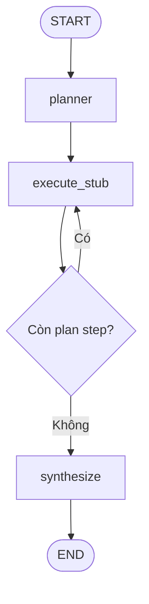

# Báo cáo Ngày 4 — Mini DeerFlow

**Ngày hoàn tất:** 26/08/2026  
**Repository:** `https://github.com/hhtuann/mini-deerflow`  
**Branch:** `main`

## Mục tiêu

Chuyển structured planner hiện tại thành workflow LangGraph đầu tiên có:

- typed state;
- reducer;
- nhiều node;
- conditional edge;
- vòng lặp có điều kiện dừng;
- recursion limit;
- executor giả;
- logging và streaming state transition.

## Công việc đã hoàn thành

### 1. Thêm LangGraph

Đã thêm dependency:

```text
langgraph 1.2.11
```

LangGraph được khai báo trực tiếp trong `pyproject.toml` và khóa phiên bản
thông qua `uv.lock`.

### 2. Xây dựng AgentState

Đã tạo `src/mini_deerflow/state.py` với các trường:

| Field          | Mục đích                  |
| -------------- | ------------------------- |
| `goal`         | Mục tiêu nghiên cứu       |
| `messages`     | Lịch sử message           |
| `plan`         | Kế hoạch hiện hành        |
| `current_step` | Chỉ số bước đang thực thi |
| `notes`        | Observation tích lũy      |
| `sources`      | Nguồn đã sử dụng          |
| `final_answer` | Kết quả cuối              |
| `errors`       | Lịch sử lỗi               |

Các trường có hai cơ chế cập nhật:

```text
Replace:
goal, plan, current_step, final_answer

Reducer:
messages, notes, sources, errors
```

`messages` sử dụng `add_messages`. Các danh sách còn lại sử dụng
`operator.add`.

### 3. Xây dựng initial state factory

Đã tạo:

```python
create_initial_state(goal)
```

Hàm này:

- loại bỏ khoảng trắng thừa khỏi goal;
- từ chối goal rỗng;
- tạo state có đầy đủ key;
- tạo mutable list độc lập cho từng run.

### 4. Xây dựng workflow đầu tiên

Đã tạo `src/mini_deerflow/workflow.py`.

Workflow:



### 5. Planner node

Planner được truyền vào workflow bằng dependency injection:

```python
Callable[[str], Plan]
```

Nhờ đó:

- production có thể sử dụng planner gọi LLM;
- unit test sử dụng fake planner;
- graph không phụ thuộc model cụ thể;
- tests không gọi API và không tốn token.

### 6. Executor stub

Mỗi lần chạy, executor chỉ xử lý một plan step:

```text
đọc plan.steps[current_step]
    → tạo stub observation
    → tăng current_step
```

Executor có guard cho:

- plan chưa tồn tại;
- step index âm;
- step index nằm ngoài plan.

### 7. Conditional routing

Sau mỗi executor invocation, router kiểm tra:

```python
current_step < len(plan.steps)
```

Nếu còn bước, graph quay lại `execute_stub`. Nếu đã hoàn thành, graph chuyển
sang `synthesize`.

### 8. Deterministic synthesis

Node `synthesize` kết hợp:

- research goal;
- toàn bộ notes đã tích lũy;

thành `final_answer`.

Node này chưa gọi LLM để workflow có thể được kiểm thử độc lập.

### 9. Streaming và logging

Đã chạy workflow bằng:

```python
graph.stream(
    state,
    stream_mode="updates",
)
```

Transitions quan sát được:

```text
1. planner
2. execute_stub
3. execute_stub
4. execute_stub
5. synthesize
```

Logging xác nhận từng node được thực thi đúng thứ tự.

### 10. Recursion limit

Workflow được chạy với:

```python
config = {"recursion_limit": 10}
```

Test với giới hạn quá thấp xác nhận LangGraph phát sinh
`GraphRecursionError`.

Recursion limit là hàng rào runtime chống vòng lặp vô hạn. Điều kiện hoàn
thành nghiệp vụ vẫn là:

```python
current_step >= len(plan.steps)
```

## Kiểm thử

Kết quả cuối ngày:

```text
ruff check: passed
ruff format --check: passed
pytest: 22 passed
```

Các test mới kiểm tra:

- initial state đầy đủ;
- goal rỗng bị từ chối;
- mutable lists không dùng chung;
- reducer tích lũy notes;
- `current_step` sử dụng replace;
- `add_messages` tích lũy messages;
- workflow thực thi đủ plan;
- planner chỉ được gọi một lần;
- streaming đúng thứ tự node;
- recursion limit hoạt động.

## Commit

```text
1b3ca32 feat: add stateful research workflow
b3f9559 docs: document stateful LangGraph workflow
```

## Kiến thức đã học

1. State là bộ nhớ làm việc dùng chung giữa các node.
2. Node trả về state delta thay vì sửa toàn bộ state.
3. Reducer quyết định cách hợp nhất giá trị cũ và update mới.
4. Dữ liệu hiện hành nên dùng replace.
5. Dữ liệu lịch sử nên dùng reducer tích lũy.
6. Conditional edge tách routing khỏi node execution.
7. Dependency injection giúp test workflow không phụ thuộc LLM.
8. Recursion limit chỉ là safety boundary, không phải completion condition.
9. `stream_mode="updates"` trả về delta, không phải toàn bộ merged state.
10. Compiled graph có thể được inspect và xuất Mermaid tự động.

## Trạng thái sản phẩm

Mini DeerFlow hiện có:

- model configuration;
- structured planner;
- CLI tạo plan;
- typed agent state;
- state reducers;
- LangGraph workflow;
- conditional execution loop;
- deterministic executor;
- deterministic synthesizer;
- recursion safety;
- unit tests và tài liệu kiến trúc.

Mini DeerFlow vẫn chưa phải Deep Agent hoàn chỉnh vì:

- chưa có tool registry;
- chưa gọi web search hoặc web fetch;
- chưa có tool result contract;
- chưa có workspace boundary;
- chưa có replanning;
- chưa có persistence và checkpoint;
- chưa có human-in-the-loop.

## Ngày 5

Ngày 5 sẽ xây tool layer và security boundary:

1. Định nghĩa tool interface và registry.
2. Chuẩn hóa `ToolResult`.
3. Xử lý validation, timeout và exception.
4. Thiết kế workspace theo `thread_id`.
5. Ngăn absolute path và path traversal.
6. Chuẩn bị web search, web fetch và file tools để thay executor stub.