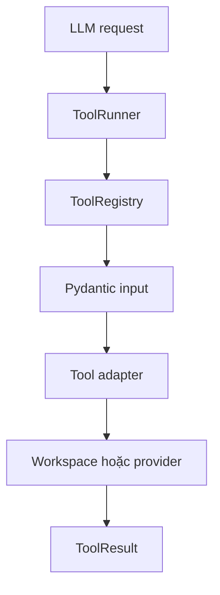

# Báo cáo ngày 05 — Mini DeerFlow

## Thông tin

- Ngày thực hiện: 27/08/2026
- Chủ đề: Secure Tool Execution Layer
- Repository: `hhtuann/mini-deerflow`
- Branch: `main`
- Trạng thái: Hoàn thành mục tiêu ngày 05

## Mục tiêu

Mục tiêu ngày 05 là xây dựng lớp thực thi tool an toàn, có thể kiểm
thử độc lập và sẵn sàng kết nối vào LangGraph workflow.

Các yêu cầu chính:

- Định nghĩa contract chung cho tool.
- Chỉ cho phép thực thi tool nằm trong allowlist.
- Validate arguments do LLM sinh ra.
- Giới hạn thời gian thực thi.
- Không để lỗi tool làm crash toàn bộ workflow.
- Không nuốt cancellation.
- Giới hạn quyền truy cập filesystem.
- Tạo file tools phục vụ nghiên cứu.
- Tách web tools khỏi provider cụ thể.
- Không gọi LLM API hoặc public network trong unit test.

## Kết quả đạt được

Đã xây dựng đầy đủ các thành phần:

- `ToolInput`
- `ToolResult`
- `Tool` protocol
- `ToolRegistry`
- `ToolRunner`
- `Workspace`
- `ReadFileTool`
- `WriteFileTool`
- `ListFilesTool`
- `WebSearchProvider`
- `WebFetchProvider`
- `WebSearchTool`
- `WebFetchTool`

Public API của package `mini_deerflow.tools` đã được hoàn thiện.

## Kiến thức đã học

### Tool không chỉ là một function

Một tool hoàn chỉnh cần có:

- Tên duy nhất.
- Mô tả cho LLM.
- Input schema.
- Output contract.
- Timeout.
- Idempotency metadata.
- Error boundary.
- Security policy.

Một Python function có thể thực hiện hành động, nhưng chưa đủ an toàn
để cho LLM điều khiển trực tiếp.

### Structured output

`ToolResult` đảm bảo hai trạng thái hợp lệ.

Thành công:

```python
success = True
data is not None
error is None
```

Thất bại:

```python
success = False
data is None
error is not None
```

Dữ liệu kết quả bị giới hạn ở các kiểu JSON-compatible để có thể:

- Serialize.
- Persist.
- Stream.
- Gửi lại cho LLM.
- Ghi vào checkpoint.

### Registry là security allowlist

LLM có thể hallucinate một tên tool như:

```text
delete_database
```

Hệ thống không được dynamic import hoặc tìm function theo tên do LLM
cung cấp.

`ToolRegistry` chỉ cho phép tên đã đăng ký từ trước. Tool lạ bị từ chối
trước khi validate arguments hoặc chạy code.

### Input validation

Arguments do LLM tạo ra chỉ là dữ liệu không đáng tin cậy.

`ToolRunner` dùng Pydantic input model tương ứng với từng tool để:

- Kiểm tra field bắt buộc.
- Từ chối field thừa.
- Kiểm tra kiểu dữ liệu.
- Chuẩn hóa chuỗi.
- Áp dụng giới hạn.

### Timeout và exception boundary

`ToolRunner` dùng `asyncio.wait_for()` để giới hạn toàn bộ thời gian
thực thi tool.

Các exception thông thường được:

- Ghi chi tiết vào server log.
- Chuyển thành `ToolResult.fail`.
- Loại bỏ thông tin hạ tầng khỏi output gửi cho LLM.

Runner bắt `Exception` nhưng không bắt `BaseException`.

Nhờ đó `asyncio.CancelledError` tiếp tục truyền lên runtime và workflow
vẫn có thể bị dừng khi người dùng yêu cầu.

### Idempotency

`write_text(path, content)` là idempotent vì chạy lại với cùng input
tạo cùng state cuối.

`append_text(path, content)` thường không idempotent vì chạy lại sẽ nối
nội dung nhiều lần.

Thông tin idempotency sẽ hữu ích khi xây retry policy.

### Workspace security boundary

Agent không được truy cập tùy ý toàn bộ filesystem.

`Workspace` chỉ cho phép path nằm dưới một root đã cấu hình và bảo vệ
khỏi:

- Absolute path.
- Parent traversal bằng `..`.
- Symlink escape.
- Windows junction escape.
- File read quá lớn.
- File write quá lớn.
- Đọc directory như file.
- Ghi đè directory như file.

Không dùng string prefix để kiểm tra path. Path được resolve và kiểm tra
bằng quan hệ filesystem.

### Giới hạn theo UTF-8 byte

Số ký tự Python không bằng số byte ghi xuống file.

Ví dụ ký tự Unicode có thể chiếm nhiều byte UTF-8. Vì vậy workspace
kiểm tra:

```python
len(content.encode("utf-8"))
```

thay vì chỉ kiểm tra `len(content)`.

### Async filesystem adapter

Filesystem API là synchronous. File tools sử dụng:

```python
await asyncio.to_thread(...)
```

để tránh block event loop trong lúc đọc, ghi hoặc liệt kê file.

### Dependency inversion cho web provider

`WebSearchTool` không phụ thuộc trực tiếp DuckDuckGo.

`WebFetchTool` không phụ thuộc trực tiếp Jina hoặc một HTTP client cụ
thể.

Hai tool nhận provider thông qua constructor. Điều này giúp:

- Thay provider mà không sửa tool.
- Dùng fake provider trong unit test.
- Không gọi public network trong test.
- Chuẩn hóa output từ nhiều vendor.

### SSRF

URL đúng cú pháp HTTP chưa chắc an toàn.

Các URL như sau vẫn phải bị network policy chặn:

```text
http://127.0.0.1/admin
http://localhost:8000
http://169.254.169.254/latest/meta-data
http://host.docker.internal
```

Pydantic `HttpUrl` chỉ validate cú pháp. SSRF protection sẽ thuộc trách
nhiệm của real fetch provider.

## Kiến trúc hoàn thành



Mỗi tầng có một trách nhiệm riêng:

| Tầng           | Trách nhiệm                        |
| -------------- | ---------------------------------- |
| Pydantic model | Cấu trúc và kiểu input             |
| Registry       | Tool allowlist                     |
| Runner         | Timeout và exception boundary      |
| Tool adapter   | Chuyển đổi domain                  |
| Workspace      | Filesystem policy                  |
| Provider       | External service và network policy |
| ToolResult     | Structured output                  |

## Files đã tạo

Source:

- `src/mini_deerflow/tools/__init__.py`
- `src/mini_deerflow/tools/contracts.py`
- `src/mini_deerflow/tools/registry.py`
- `src/mini_deerflow/tools/runner.py`
- `src/mini_deerflow/tools/files.py`
- `src/mini_deerflow/tools/web.py`
- `src/mini_deerflow/workspace.py`
- `src/mini_deerflow/web.py`

Tests:

- `tests/test_tool_contracts.py`
- `tests/test_tool_registry.py`
- `tests/test_tool_runner.py`
- `tests/test_workspace.py`
- `tests/test_file_tools.py`
- `tests/test_web_contracts.py`
- `tests/test_web_tools.py`

Tài liệu:

- `docs/tool-execution-layer-day-05.md`
- `docs/report-ngay-05-mini-deerflow.md`

## Kiểm thử

Kết quả cuối ngày:

```text
136 passed
2 skipped
```

Hai test được skip liên quan tới tạo symlink trên Windows. Máy hiện tại
không có quyền tạo symlink phù hợp.

Các security behavior quan trọng khác vẫn được kiểm thử:

- Absolute path rejection.
- Parent traversal rejection.
- Tool allowlisting.
- Invalid input rejection.
- Timeout conversion.
- Exception sanitization.
- Cancellation propagation.
- File size limits.
- Invalid provider output.
- URL syntax validation.

Không có test nào gọi:

- LLM API.
- DuckDuckGo.
- Jina.
- Public HTTP endpoint.

Do đó test suite nhanh, deterministic và không tốn token.

## Smoke tests đã thực hiện

### ToolRunner

Đã xác nhận:

- Registered tool chạy thành công.
- Unknown tool bị từ chối.
- Timeout được chuyển thành failure.
- Cancellation không bị nuốt.

### Workspace

Đã xác nhận:

```text
WRITTEN_BYTES=9
CONTENT=LangGraph
FILES=('notes/result.md',)
PATH_TRAVERSAL_REJECTED=True
```

### File tools

Đã thực hiện luồng:

```text
write_file → read_file → list_files
```

và xác nhận traversal `../.env` bị từ chối.

### Web adapters

Đã dùng fake providers để thực hiện:

```text
web_search → web_fetch
```

Kết quả được normalize và serialize đúng contract.

## Sự cố gặp phải

### PowerShell `python -c`

PowerShell 5.1 loại bỏ quote trong multiline argument truyền qua
`python -c`, gây `SyntaxError`.

Đã chuyển sang truyền script qua standard input:

```powershell
@'
print("example")
'@ | uv run python -
```

### PowerShell và dấu backtick

Ba dấu backtick Markdown bên trong double-quoted PowerShell string làm
PowerShell chuyển sang continuation prompt `>`.

Đã sửa bằng single-quoted pattern:

```powershell
-Pattern '^#|^```'
```

### Windows symlink

Hai test symlink được skip khi hệ điều hành không cho phép tạo symlink.
Đây là giới hạn môi trường test, không phải test failure.

## Commits

Source implementation:

```text
e2386b1 feat: add secure tool execution layer
```

Architecture documentation:

```text
9e9728f docs: document secure tool execution layer
```

## Hạn chế hiện tại

- Web providers mới chỉ là protocol và fake implementations.
- Chưa có HTTP provider thật.
- Chưa có SSRF network policy implementation.
- Tool layer chưa được nối vào LangGraph workflow.
- Workflow vẫn đang dùng `execute_stub`.
- Chưa có ReAct hoặc plan-execute-observe loop thật.
- Chưa có persistence cho tool observations.

## Đánh giá mục tiêu ngày 05

Mục tiêu ngày 05 đã hoàn thành.

Hệ thống hiện chưa phải deep agent hoàn chỉnh, nhưng đã có execution
boundary đủ rõ để không phải cho LLM gọi trực tiếp Python function,
filesystem hoặc provider bên ngoài.

Đây là nền tảng cần thiết trước khi thay `execute_stub` bằng tool
execution thật.

## Sơ bộ ngày 06

Ngày 06 sẽ tập trung vào agent execution loop:

1. Mở rộng state để lưu tool request và observation.
2. Cho model lựa chọn tool trong registry.
3. Parse structured tool decision.
4. Thực thi qua `ToolRunner`.
5. Đưa `ToolResult` trở lại workflow.
6. Lặp theo plan và giới hạn execution budget.
7. Thay dần `execute_stub` bằng executor thật.
8. Viết test bằng fake model và fake tools, không gọi API.