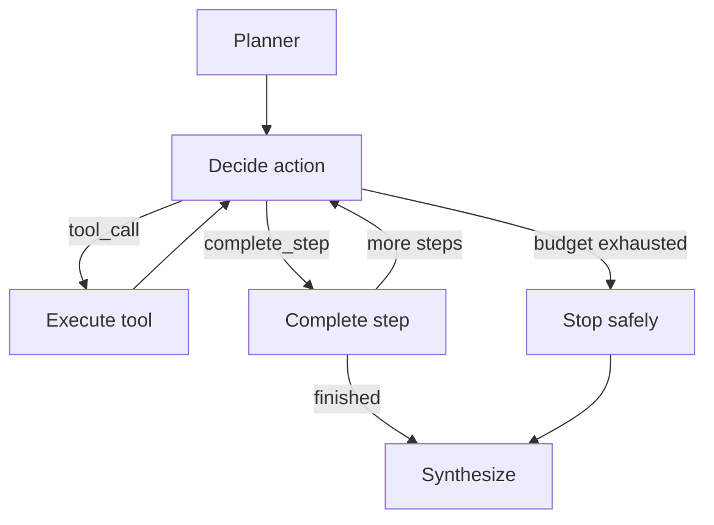

# Báo cáo ngày 06 — Mini DeerFlow

## Thông tin

- Ngày thực hiện: 2026-08-28
- Repository: `hhtuann/mini-deerflow`
- Branch: `main`
- Chủ đề: Xây dựng bounded LLM action loop
- Trạng thái: Hoàn thành

## Mục tiêu

Mục tiêu ngày 06 là thay thế execution stub bằng một vòng lặp agent có khả năng:

- nhận kế hoạch nghiên cứu;
- cho LLM chọn hành động tiếp theo;
- gọi tool thông qua secure tool layer;
- lưu kết quả tool vào state;
- hoàn thành từng plan step;
- giới hạn số lần gọi tool;
- tổng hợp kết quả cuối cùng;
- dừng an toàn khi hết budget.

Ngày 06 tập trung vào orchestration và decision loop, chưa tập trung vào chất
lượng nghiên cứu web hoặc persistence.

## Kết quả đạt được

Đã xây dựng các thành phần:

- strict action schemas;
- discriminated action union;
- action parser;
- tool observation schema;
- execution fields trong `AgentState`;
- minimized `ActionContext`;
- async `ActionSelector` protocol;
- bounded agent workflow;
- LLM-backed action selector;
- GLM structured-output compatibility;
- unit tests cho action loop;
- controlled end-to-end smoke test.

Workflow mới có thể chạy theo chu trình:



## Kiến thức đã học

### PlanStep và ToolCallAction

`PlanStep` mô tả mục tiêu cấp cao cần đạt được.

Ví dụ:

```text
Thu thập tài liệu chính thức về LangGraph.
```

`ToolCallAction` mô tả một thao tác cụ thể mà agent muốn thực hiện để tiến gần
đến mục tiêu đó.

Ví dụ:

```json
{
  "action_type": "tool_call",
  "tool_name": "web_search",
  "arguments": {
    "query": "LangGraph official documentation"
  }
}
```

Một plan step có thể cần nhiều tool call trước khi hoàn thành.

Quan hệ giữa hai khái niệm:

```text
PlanStep
  ├─ ToolCallAction
  ├─ ToolObservation
  ├─ ToolCallAction
  ├─ ToolObservation
  └─ CompleteStepAction
```

### Hai loại action

Agent chỉ được phép chọn một trong hai loại hành động.

#### ToolCallAction

Yêu cầu hệ thống gọi một tool đã đăng ký.

```python
ToolCallAction(
    type="tool_call",
    tool_name="list_files",
    arguments={"directory": "."},
)
```

#### CompleteStepAction

Thông báo rằng step hiện tại đã đủ thông tin để hoàn thành.

```python
CompleteStepAction(
    type="complete_step",
    summary="The workspace files were identified.",
    sources=[],
)
```

LLM không được tự tăng `current_step`. Workflow mới là thành phần có quyền thay
đổi tiến độ kế hoạch.

### Discriminated union

Hai action dùng một discriminator để Pydantic xác định model cần validate.

Transport payload dùng:

```json
{
  "action_type": "tool_call"
}
```

Nếu discriminator là `tool_call`, Pydantic dùng `ToolCallAction`.

Nếu discriminator là `complete_step`, Pydantic dùng `CompleteStepAction`.

Payload có discriminator không tồn tại hoặc trộn field của hai action sẽ bị từ
chối.

Cơ chế này ngăn output mơ hồ đi sâu vào workflow.

### Structured output không loại bỏ hallucination

Structured output giúp kiểm soát:

- field bắt buộc;
- kiểu dữ liệu;
- discriminator;
- field thừa;
- giới hạn độ dài;
- cấu trúc JSON.

Structured output không thể đảm bảo:

- tool mà LLM chọn là hợp lý;
- URL mà LLM sinh ra thực sự tồn tại;
- nhận định của LLM là đúng;
- arguments có ý nghĩa nghiệp vụ;
- tool output là dữ liệu đáng tin cậy.

Vì vậy hệ thống vẫn cần:

- registry allowlist;
- tool input validation;
- execution budget;
- workspace boundary;
- SSRF protection;
- source verification;
- runtime routing.

### Pending action trong state

Action được lưu vào `pending_action` trước khi thực thi.

Điều này giúp:

- checkpoint quyết định;
- debug model đã chọn gì;
- hiển thị quyết định trên UI;
- resume sau khi bị gián đoạn;
- tách decision node khỏi execution node;
- audit hành vi agent.

Nếu quyết định và thực thi nằm trong cùng một node, hệ thống khó quan sát trạng
thái ở giữa hai giai đoạn.

### Reducer trong AgentState

Các field dạng lịch sử như `tool_observations` cần append reducer.

Nếu không có reducer, update mới có thể thay thế toàn bộ list cũ.

Ví dụ mong muốn:

```text
observation 1
observation 2
observation 3
```

Không phải:

```text
observation 3
```

Ngược lại, counter như `total_tool_calls` dùng replacement semantics vì node
trả về giá trị tổng mới nhất.

### ToolObservation

Mỗi lần chạy tool tạo một observation có cấu trúc:

- step number;
- số tool call trong step;
- số tool call toàn run;
- action đã yêu cầu;
- ToolResult trả về.

Ví dụ:

```json
{
  "step_number": 1,
  "step_tool_call_number": 1,
  "total_tool_call_number": 1,
  "action": {
    "type": "tool_call",
    "tool_name": "list_files",
    "arguments": {
      "directory": "."
    }
  },
  "result": {
    "success": true,
    "data": {
      "files": ["notes/integration.txt"]
    },
    "error": null,
    "metadata": {}
  }
}
```

Observation là dữ liệu quan sát được, không phải sự thật tuyệt đối. Tool output
vẫn có thể chứa nội dung sai, độc hại hoặc không liên quan.

### ActionContext tối giản

Không truyền toàn bộ `AgentState` cho LLM.

`ActionContext` chỉ chứa:

- goal;
- step hiện tại;
- tool definitions;
- observation thuộc step hiện tại;
- budget còn lại.

Lý do:

- message history có thể rất dài;
- observation từ step cũ gây tốn token;
- dữ liệu không liên quan làm giảm chất lượng quyết định;
- giảm nguy cơ prompt injection lan truyền;
- prompt nhỏ hơn giúp dễ debug;
- quyết định dễ tái tạo hơn.

### Hai loại tool-call budget

#### Per-step budget

Giới hạn số lần gọi tool trong một plan step.

Mục đích là ngăn một step bị kẹt trong vòng lặp.

Counter này được reset khi chuyển sang step tiếp theo.

#### Total-run budget

Giới hạn tổng số tool call của cả run.

Mục đích là kiểm soát:

- tổng chi phí;
- thời gian chạy;
- tải hạ tầng;
- vòng lặp xuyên nhiều step.

Counter này không reset khi chuyển step.

### Tool thất bại vẫn tiêu thụ budget

Nếu tool timeout hoặc trả lỗi, counter vẫn phải tăng.

Tool thất bại vẫn đã tiêu thụ:

- thời gian;
- network request;
- CPU hoặc I/O;
- quota;
- tài nguyên hạ tầng.

Nếu không tăng counter khi lỗi, agent có thể gọi lại vô hạn.

### Tool failure không đồng nghĩa workflow failure

Một tool có thể thất bại nhưng workflow vẫn hoạt động bình thường.

Ví dụ:

```text
web_fetch thất bại
  → lưu ToolResult.fail
  → tạo ToolObservation
  → LLM đánh giá evidence còn lại
  → thử tool khác hoặc complete step
```

Exception dự kiến được chuyển thành `ToolResult.fail`.

Lỗi programming invariant hoặc state bị hỏng vẫn raise exception để không che
giấu bug trong code.

### Hết budget không nên làm crash

Khi budget bằng zero, model vẫn được phép chọn `complete_step`.

Model không được gọi thêm tool.

Nếu model vẫn yêu cầu tool, workflow chuyển sang safe termination và tổng hợp
kết quả một phần.

Cách này tốt hơn crash vì người dùng vẫn nhận được:

- dữ liệu đã thu thập;
- step summaries;
- error information;
- thống kê execution.

### GLM transport compatibility

Ban đầu domain model dùng discriminator:

```json
{
  "type": "tool_call"
}
```

GLM lại sinh:

```json
{
  "action_type": "tool_call"
}
```

Giải pháp là dùng Pydantic alias:

- domain field: `type`;
- transport alias: `action_type`.

Domain output:

```python
{
    "type": "tool_call",
}
```

Transport output:

```python
{
    "action_type": "tool_call",
}
```

Thiết kế này giữ domain model ổn định và cô lập khác biệt của provider tại biên
giao tiếp.

### JSON mode

Sau khi sửa alias, GLM trả đúng payload nhưng bọc nó trong một Markdown JSON
code block thay vì trả JSON thô.

Provider-native parser yêu cầu JSON thô nên thất bại trước bước Pydantic
validation.

Giải pháp đã kiểm chứng:

```python
model.with_structured_output(
    ActionDecision,
    method="json_mode",
)
```

JSON mode parse response trước, sau đó Pydantic tiếp tục validate schema.

Hệ thống không bỏ validation và không chấp nhận arbitrary text.
## Agent workflow

Workflow ngày 06 gồm các node sau.

### Planner

Tạo `Plan` có cấu trúc và reset tiến độ về step đầu tiên.

### Decide action

- tạo minimized `ActionContext`;
- gọi `ActionSelector`;
- validate action;
- lưu vào `pending_action`.

### Execute tool

- kiểm tra pending action;
- kiểm tra budget;
- gọi `ToolRunner`;
- lưu `ToolObservation`;
- tăng counter;
- xóa pending action.

### Complete step

- ghi summary;
- ghi sources;
- tăng `current_step`;
- reset per-step counter;
- xóa pending action.

### Budget exhausted

- ghi lỗi có kiểm soát;
- không cho gọi thêm tool;
- chuyển sang synthesis.

### Synthesize

Tạo kết quả cuối từ state, gồm:

- goal;
- completed step summaries;
- sources;
- tool-call statistics;
- errors.

Synthesis hiện tại deterministic và chưa gọi LLM.

## Files đã tạo

### Production source

- `src/mini_deerflow/actions.py`
- `src/mini_deerflow/agent_workflow.py`
- `src/mini_deerflow/decision.py`
- `src/mini_deerflow/llm_selector.py`

### Production source đã sửa

- `src/mini_deerflow/state.py`

### Tests

- `tests/test_actions.py`
- `tests/test_agent_workflow.py`
- `tests/test_decision.py`
- `tests/test_execution_state.py`
- `tests/test_llm_selector.py`
- `tests/test_state.py`

### Documentation

- `docs/bounded-agent-loop-day-06.md`
- `docs/report-ngay-06-mini-deerflow.md`

## Kiểm thử

Kết quả cuối ngày:

```text
219 passed, 2 skipped
```

Các test bị skip liên quan đến filesystem behavior phụ thuộc khả năng tạo
symlink hoặc junction trong môi trường Windows, không phải test failure.

Test coverage ngày 06 bao gồm:

- strict action validation;
- discriminator validation;
- transport alias;
- observation invariants;
- state reducers;
- independent initial states;
- minimized action context;
- tool definitions;
- observation filtering;
- budget calculation;
- invalid counters;
- action routing;
- successful tool call;
- failed tool call;
- unknown tool;
- per-step budget;
- total-run budget;
- completion routing;
- synthesis;
- cancellation;
- structured model contract;
- raw response validation;
- GLM JSON mode configuration.

## Smoke tests

### Action schema smoke

Kết quả:

```text
SCHEMA_DISCRIMINATOR=action_type
DOMAIN_OUTPUT={'type': 'tool_call', ...}
TRANSPORT_OUTPUT={'action_type': 'tool_call', ...}
```

### GLM JSON mode smoke

Kết quả:

```text
REAL_API_CLASS=ToolCallAction
DOMAIN_OUTPUT={'type': 'tool_call', ...}
TRANSPORT_OUTPUT={'action_type': 'tool_call', ...}
```

### LLMActionSelector smoke

Kết quả:

```text
SELECTOR_CLASS=LLMActionSelector
ACTION_CLASS=ToolCallAction
```

GLM đã chọn đúng registered tool:

```text
list_files
```

với arguments:

```json
{
  "directory": "."
}
```

### Controlled end-to-end smoke

Kết quả:

```text
REAL_MODEL_CALLS=1
DECISION_COUNT=4
CURRENT_STEP=3
TOTAL_TOOL_CALLS=1
OBSERVATION_COUNT=1
ERRORS=[]
```

Tool thật đã đọc temporary workspace và tìm thấy:

```text
notes/integration.txt
```

Final answer ghi nhận:

- ba completed step;
- một tool call;
- một tool call thành công;
- zero failed tool call;
- không có execution error.

## Sự cố gặp phải

### GLM dùng action_type

Triệu chứng:

```text
Unable to extract tag using discriminator 'type'
```

Nguyên nhân:

- domain schema và output của provider dùng tên discriminator khác nhau.

Khắc phục:

- dùng Pydantic alias;
- serialize transport bằng `by_alias=True`.

### GLM bọc JSON trong Markdown

Triệu chứng:

```text
Invalid JSON: expected value at line 1 column 1
```

Nguyên nhân:

- GLM trả một Markdown JSON code block;
- provider-native parser yêu cầu một JSON object thô;
- quá trình thất bại trước bước Pydantic validation.

Khắc phục:

- chuyển structured output sang `method="json_mode"`;
- vẫn giữ Pydantic validation.
### Test double dùng contract cũ

Triệu chứng:

```text
unexpected keyword argument 'method'
```

Nguyên nhân:

- production protocol đã thêm `method`;
- nested fake model trong test chưa được cập nhật.

Khắc phục:

- cập nhật chữ ký test double;
- giữ test tập trung vào non-runnable structured model.

### Smoke script dùng sai ActionContext field

Tên field dùng sai:

```text
current_step
remaining_tool_calls_in_step
```

Tên đúng:

```text
step
remaining_step_tool_calls
```

Pydantic đã chặn lỗi trước API call nên lần chạy sai không tốn token.

## Commits

Source và tests:

```text
2cb8e35 feat: add bounded LLM action loop
```

Tài liệu kỹ thuật:

```text
f323d85 docs: document bounded agent action loop
```

Báo cáo ngày 06 sẽ được commit riêng sau khi kiểm tra.

## Đánh giá mục tiêu ngày 06

Mục tiêu ngày 06 đã hoàn thành.

Mini DeerFlow hiện đã có các thành phần cốt lõi của một agent loop:

- plan;
- state;
- decision;
- action;
- tool execution;
- observation;
- bounded iteration;
- completion;
- synthesis.

Hệ thống hiện không còn chỉ là planner hoặc deterministic workflow. Nó đã có
khả năng để LLM quan sát context, chọn tool, nhận observation và tiếp tục quá
trình trong giới hạn runtime.

Tuy nhiên, đây vẫn chưa phải deep research agent production-ready vì chưa có:

- production composition root;
- CLI chạy toàn workflow;
- persistent checkpoint;
- full real web research run;
- citation verification;
- LLM synthesis;
- evaluation framework.

## Sơ bộ ngày 07

Ngày 07 sẽ tập trung vào runtime composition.

Dự kiến thực hiện:

1. tạo composition root;
2. khởi tạo settings và chat model;
3. khởi tạo planner và LLM action selector;
4. tạo workspace;
5. đăng ký tool;
6. build bounded agent workflow;
7. cung cấp một API chạy agent thống nhất;
8. nối runtime vào CLI;
9. thêm integration tests với fake dependencies;
10. thực hiện một CLI smoke test có giới hạn.

Mục tiêu ngày 07 là chuyển các component rời rạc thành một ứng dụng agent có thể
khởi chạy từ một entry point rõ ràng.