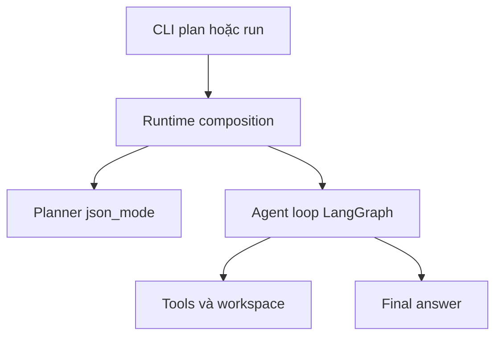

# Báo cáo ngày 07 — Mini DeerFlow

## Thông tin

- Dự án: Mini DeerFlow — bounded deep research agent prototype
- Ngày học: Ngày 07/14
- Ngày thực hiện: 2026-09-03
- Chủ đề: Composition root và executable research agent runtime
- Trạng thái: Hoàn thành
- Branch: `main` (ahead `origin/main` 3 commits tại thời điểm viết báo cáo)
- Repository: `hhtuann/mini-deerflow`

## Mục tiêu ngày 07

Các ngày 3–6 đã xây dựng từng mảnh riêng biệt: schema plan, model factory,
structured planner, LangGraph workflow, secure tool layer, bounded action loop.
Từng mảnh đều có test riêng nhưng chưa có nơi nào **ghép chúng lại thành một
chương trình chạy được**.

Mục tiêu ngày 07 là chuyển các module đó thành một **executable bounded research
agent** chạy từ CLI: người dùng gõ một lệnh, hệ thống tự lập kế hoạch, tự chọn
hành động, tự gọi tool trong workspace an toàn, và in ra final answer — với
toàn bộ guardrail đã xây dựng ở những ngày trước được kích hoạt thật.

## Kết quả đạt được

- **Composition root** `create_default_agent_runtime`: nơi duy nhất wire mọi
  dependency;
- **AgentRuntime** với `RuntimeLimits` (per-step budget, total budget,
  recursion limit) validate ngay khi khởi tạo;
- **CLI hai subcommand**: `plan` (chỉ tạo Plan JSON) và `run` (chạy toàn bộ
  agent);
- **Capability-aware planner**: planner nhận tool catalog thật khi chạy `run`;
- **Cross-step continuity**: completed-step summaries giúp step sau tái sử dụng
  kết quả step trước;
- **Structured-output resilience**: planner và action selector đều có bounded
  retry cho format/validation failure;
- **Read-only by default**: `write_file` chỉ tồn tại khi `--allow-write`;
- **Full real smoke test** với sentinel chứng minh agent đọc file thật qua
  tool;
- **README cập nhật** theo CLI mới và **tài liệu kỹ thuật ngày 07**;
- 3 commit local: feature (14 files), README, technical doc.

## Mini DeerFlow hiện đã là Agent chưa?

**Có — dưới dạng một bounded, single-agent, tool-using research prototype.**
Chưa phải hệ thống production, và chưa phải Deep Agent hoàn chỉnh.

Agent là chương trình **tự quyết định hành động kế tiếp dựa trên quan sát**,
thay vì chạy một luồng cố định. Kiểm tra bằng 10 đặc điểm có thật trong code:

1. nhận goal từ người dùng;
2. tạo plan nhiều bước có schema strict;
3. quan sát state/context hiện tại (budget, observations, summaries);
4. **tự chọn** action kế tiếp qua LLM action selector;
5. gọi tool qua registry allowlist;
6. quan sát kết quả tool (ToolObservation);
7. điều chỉnh action tiếp theo dựa trên kết quả vừa quan sát;
8. hoàn thành step bằng summary có bằng chứng;
9. tổng hợp final answer từ notes/sources/counters;
10. bị chặn bởi tool budget, recursion limit và workspace boundary.

Điểm khác với CLI planner ngày 3: planner chỉ là **hàm một chiều** — goal vào,
danh sách bước ra, không biết môi trường. Agent ngày 07 có **feedback loop**:
quyết định → môi trường (tool) → quan sát → quyết định mới. Trong lập trình
truyền thống, đây là khác biệt giữa hàm `generate_steps()` và một vòng
`while` có điều kiện dừng dựa trên kết quả I/O thật.

Vì sao **chưa** là Deep Agent hoàn chỉnh: chưa persistent, chưa resume sau
crash, chưa human-in-the-loop, chưa streaming, chưa subagents, default web
provider chưa được compose (nên chưa research nhiều nguồn), chưa rich citation,
chưa context compaction production-grade.

## Kiến trúc hoàn thành



- **CLI**: parse argument, exit code discipline, stdout/stderr tách channel;
- **Runtime composition**: tạo model, workspace, registry, selector, limits —
  một lần, ở một chỗ;
- **Planner**: goal → Plan strict, biết capability của tools khi chạy `run`;
- **Agent loop**: decide_action ⇄ execute_tool / complete_step → synthesize;
- **Tools/workspace**: allowlist + validation + timeout + boundary;
- **Final answer**: tổng hợp deterministic từ state đã ghi.

## Kiến thức đã học

### Composition root

Trong backend truyền thống, composition root là nơi duy nhất khởi tạo mọi
dependency (database, config, service) trước khi app chạy — thường là
`main.py` hoặc DI container. Mini DeerFlow ngày 07 làm đúng điều đó:
`create_default_agent_runtime` là chỗ **duy nhất** biết cách tạo model,
workspace, registry, planner, selector và ghép graph.

Vì sao không tạo dependency rải rác trong node? Nếu từng node tự tạo model
hoặc registry: (1) khó test vì không thay thế được; (2) mỗi node có thể tạo
phiên bản khác nhau; (3) không kiểm soát được thứ tự và điều kiện khởi tạo
(ví dụ từ chối `allow_write` không hợp lệ phải xảy ra **trước** khi model được
tạo). Node chỉ nhận dependency đã sẵn sàng và làm nhiệm vụ của nó.

### Dependency injection

- `model_factory` là tham số của composition root → test truyền **fake model**
  vào thay vì gọi API thật;
- planner và action selector là tham số của `build_agent_runtime` → test
  workflow truyền **fake planner / fake selector** với kịch bản cho sẵn
  (thành công, fail format, fail infra);
- hệ quả: toàn bộ 260 test chạy không tốn một token API nào, và khi đổi
  provider (GLM → OpenAI hoặc ngược lại) chỉ cần đổi factory, workflow không
  sửa gì.

Đây chính là lý do "thay provider mà không sửa workflow" — nguyên lý DI quen
thuộc áp dụng vào agent.

### Runtime và workflow khác nhau thế nào?

- **Workflow** định nghĩa *cấu trúc*: node nào tồn tại, edge nào nối, điều kiện
  route thế nào — là bản thiết kế tĩnh của graph;
- **Runtime** cung cấp *môi trường thực thi*: dependency cụ thể, initial state,
  config (recursion limit), và là nơi gọi `graph.ainvoke`.

Giống khác biệt giữa định nghĩa route (workflow) và server đã cấu hình
dependency đang serve request đó (runtime).

### Sync và async boundary

Planner ngày 07 là hàm **sync** (dùng `invoke` blocking) nhưng nằm trong node
của graph chạy **async** (`ainvoke`). Nguy cơ tưởng như phải viết lại planner
thành async. Thực tế không cần: LangGraph wrap node sync bằng cơ chế chạy
thread executor khi thực thi async, nên lời gọi HTTP blocking của planner
không đóng băng event loop. Bài học: hiểu boundary của thư viện trước khi
refactor — đọc behavior đã được xác minh trong source của thư viện thay vì
đoán.

### Capability-aware planning

Planner nhận `registry.definitions()` — danh sách tool thật với input/output
schema — và prompt buộc plan chỉ yêu cầu **thiết bị mô tả được**: không đòi
metadata mà tool không expose (ví dụ file size, thời gian sửa), không bịa
tool không tồn tại.

So sánh hai chế độ:

- `plan` standalone: không có tool catalog → plan **capability-agnostic**
  (mô tả việc cần làm, không giả sử tool cụ thể);
- `run`: composition root bind catalog thật → plan **capability-aware**,
  khớp với những gì agent thực sự làm được.

### Cross-step continuity

Trước fix, mỗi action context chỉ chứa observations của **current step**.
Step sau không thấy raw observation cũ → model có thể phủ nhận kết quả bước
trước ("chưa đọc file") hoặc gọi lại tool vừa gọi — lãng phí budget.

Fix: giữ nguyên việc lọc observations theo step (để không trả token cho payload
lớn), nhưng thêm `completed_step_summaries` — summary ngắn của các step đã
xong — vào context. Không truyền toàn bộ `AgentState`: chỉ truyền đúng lớp
thông tin cần cho quyết định kế tiếp. Trong smoke thật, hiệu ứng thấy rõ:
step 3 và 4 tái sử dụng kết quả list/read của step 1–2 mà không gọi tool lại.

Lưu ý bảo mật: summary của step trước vẫn là **untrusted data** — prompt quy
định không coi claim không có bằng chứng trong summary là fact mới. Cơ chế
copy (`list(state["notes"])`) đảm bảo context đã build không bị mutation từ
state sau này, và tối đa 7 summaries.

### Tool-call budget và recursion limit

Hai giới hạn bảo vệ hai lớp khác nhau:

- **Tool-call budget** giới hạn *tác động bên ngoài và chi phí*: per-step
  (mặc định 5) giới hạn số tool call trong một step; total-run (mặc định 20)
  giới hạn cả run — chặn agent gọi tool vô hạn hoặc đốt tiền API;
- **Recursion limit** (mặc định 100) giới hạn *số graph transition* — phòng
  khi routing logic bị lỗi tạo vòng lặp không bao giờ gọi tool.

Nếu chỉ có budget, một vòng lặp decide↔complete không gọi tool vẫn chạy mãi.
Nếu chỉ có recursion limit, agent vẫn gọi tool tới khi hết hạn mức engine.
Cần cả hai.

### Read-only by default

- `list_files` và `read_file` luôn được compose;
- `write_file` chỉ được thêm vào registry khi có `--allow-write`;
- tool không nằm trong registry thì model **không thể thực thi** — tên tool
  không hợp lệ bị reject thành structured failure observation;
- prompt guardrail ("chỉ dùng tool trong available_tools") là lớp **soft** —
  hướng dẫn hành vi;
- registry allowlist + workspace path check là lớp **hard** — kỹ thuật chặn,
  kể cả khi model bị prompt injection.

Nguyên tắc: không bao giờ coi prompt là security boundary.

### Structured output không loại bỏ hallucination

Schema (Pydantic strict) kiểm soát **hình dạng** dữ liệu: đủ trường, đúng
kiểu, không field lạ. Schema **không chứng minh nội dung đúng** — model vẫn
có thể bịa objective hay URL đẹp về cấu trúc. Cụ thể: `HttpUrl` chỉ xác nhận
chuỗi là URL hợp lệ; nó không chứng minh URL đó có thật, sống, hay từng xuất
hiện trong tool result. Vì vậy prompt phải cấm invent sources, và kiến trúc
citation sau này cần cross-check URL với observations thật.

### Bounded structured-output retry

Phân biệt hai loại lỗi format output:

- **Format/validation failure** (OutputParserException, ValidationError):
  model trả sai shape — có khả năng tự sửa nếu hỏi lại → được retry;
- **Infrastructure failure** (mất kết nối, timeout, API error): hỏi lại
  không giúp gì → propagate ngay, transport layer đã có retry riêng.

Cụ thể trong code:

- planner: tối đa `PLANNER_MAX_ATTEMPTS = 2`, lỗi cuối wrap thành `ValueError`
  và giữ `__cause__`;
- selector: tối đa `ACTION_SELECTION_MAX_ATTEMPTS = 2`, chỉ retry hai exception
  trên; lần 2 gửi kèm **corrective message tĩnh** — không phản chiếu raw
  payload hay error text của model (chống biến completion bị nhiễm thành
  payload injection lần hai); lỗi cuối wrap thành `ActionSelectionError`;
- retry nằm gọn trong selector, **không tăng** tool counters — chỉ tool chạy
  thật mới đếm.

## Hai sự cố quan trọng

### Planner bỏ trường title

- **Triệu chứng**: `uv run mini-deerflow plan` fail với
  `ValidationError: steps.0.title Field required` — mọi step thiếu `title`;
- **Giả thuyết prompt**: nghi prompt thiếu yêu cầu — nhưng prompt đã ghi rõ
  4 trường bắt buộc;
- **Prompt-only fix không thành công**: schema tool LangChain sinh ra cũng
  chứa `title` trong `properties` và `required` → dữ liệu gửi đi đã đúng,
  lỗi không nằm ở phía mình;
- **Root cause**: transport compatibility — endpoint GLM thỉnh thoảng drop
  trường khi serialize tool-call arguments (function_calling);
- **Fix**: chuyển planner sang `json_mode` (model trả plain JSON, không qua
  tool-call arguments), vẫn validate bằng **cùng** strict `Plan`;
- **Không làm title optional**, không tự điền title giả — giữ boundary;
- **Bounded attempts** cho phần variance còn lại;
- Real planner verification: PASS (plan 5 bước đủ trường, liên tiếp từ 1).

### Local evidence bị đưa vào URL sources

- Model đã đọc file thành công (đủ 4 sentinel trong summary);
- Khi complete step, model đưa **chuỗi mô tả file local** vào `sources` —
  hành vi hợp lý vì nhiệm vụ thuần local không có URL nào để cite;
- `HttpUrl` từ chối → OutputParserException → graph dừng **trước** synthesize,
  mất toàn bộ kết quả đã thu thập;
- **Không đổi `sources` thành `list[str]`** (mất hàng ràng chống citation bịa)
  và không nuốt parser error;
- Fix: 4 source rules trong prompt (chỉ URL HTTP/HTTPS; cấm path/mô tả local;
  mô tả local nằm trong summary; không URL → `sources=[]`) + bounded retry với
  corrective message tĩnh;
- Full re-verification: PASS — Sources section trung thực
  `No sources were recorded.`, evidence local nằm hết trong summaries.

Bài học chung: strict validation phát hiện lỗi **trước khi** dữ liệu không hợp
lệ chảy vào state — chậm một nhịp nhưng an toàn; và khi validation bắt lỗi,
đúng chỗ để sửa là contract/transport, không phải nới lỏng schema.

## CLI ngày 07

- `mini-deerflow plan "<goal>"`: in validated Plan JSON, exit 0;
- `mini-deerflow run "<goal>"`: chạy toàn bộ agent, in final answer, exit 0;
- domain/validation error → stderr, exit 1; argparse usage error → exit 2;
- `run` mặc định read-only; `--allow-write` opt-in;
- default workspace `.mini-deerflow/workspace` (đã được gitignore);
- flags: `--workspace`, `--allow-write`, `--max-tool-calls-per-step`,
  `--max-total-tool-calls`, `--recursion-limit`.

Ví dụ PowerShell:

```powershell
uv run mini-deerflow run `
  "Inspect the local workspace and summarize verified evidence." `
  --max-tool-calls-per-step 2 `
  --max-total-tool-calls 6 `
  --recursion-limit 60
```

## Controlled full-agent smoke test

Bằng chứng lịch sử từ run thật:

- workspace tạm ngoài repository chứa đúng một file `evidence.txt` với 4
  sentinel facts;
- sentinel (ví dụ `Cedar Lantern`) **không** xuất hiện trong goal — chỉ có thể
  biết qua `read_file`;
- `list_files` thành công (đúng 1 file); `read_file` thành công (đủ nội dung);
- final answer chứa đủ 4 facts, anchor vào nội dung file, không suy đoán từ
  filename;
- 2 tool calls — 2 successful — 0 failed — 0 execution errors;
- local-only nên Sources rỗng trung thực (`No sources were recorded.`);
- file hash và kích thước không đổi sau run; không file mới trong workspace;
- workspace tạm được dọn sạch sau run;
- CLI exit 0.

## Files đã tạo hoặc sửa

### Production source

- `src/mini_deerflow/runtime.py` (mới: RuntimeLimits, AgentRuntime,
  composition root)
- `src/mini_deerflow/cli.py` (subcommands plan/run, limit flags, exit codes)
- `src/mini_deerflow/planner.py` (json_mode, JSON contract, bounded attempts)
- `src/mini_deerflow/llm_selector.py` (source rules, bounded retry,
  corrective message)
- `src/mini_deerflow/decision.py` (completed_step_summaries trong
  ActionContext)

### Tests

- `tests/test_runtime.py` (mới), `tests/test_runtime_composition.py` (mới)
- cập nhật: `test_cli.py`, `test_planner.py`, `test_llm_selector.py`,
  `test_actions.py`, `test_agent_workflow.py`, `test_decision.py`

### Documentation and repository safety

- `README.md` (usage/architecture/security mới)
- `docs/executable-agent-runtime-day-07.md` (tài liệu kỹ thuật)
- `.gitignore` (thêm `.mini-deerflow/`)

## Kiểm thử

Kết quả lịch sử ngày 07:

```text
260 passed, 2 skipped
```

Hai skipped là test symlink của workspace cần quyền Windows không có trong tài
khoản chạy test — là điều kiện môi trường, không phải functional failure.

Các lớp test: unit schemas (Plan, ActionDecision, source rules) → runtime
limits → dependency composition (fake model factory, không gọi API) → CLI
behavior (exit codes, channels) → planner transport (json_mode lock, bounded
attempts) → action retry (recovery, bounded, infra không retry) → workflow
integration (recoverable failure hoàn thành run, counters chỉ tăng khi tool
chạy thật) → một full real smoke với model thật.

## Commits

Ba commit local tại thời điểm viết báo cáo (chưa push):

- `0d060c5` feat: add executable research agent runtime (14 files)
- `c5a7ce3` docs: update runtime usage and architecture
- `844704f` docs: document executable agent runtime

## Những quyết định kiến trúc đã chốt

| Vấn đề | Quyết định | Lý do | Giải pháp bị loại |
| --- | --- | --- | --- |
| GLM drop field `title` qua function_calling | Planner dùng `json_mode` | Bỏ qua đường tool-call arguments — nơi phát sinh lỗi; vẫn validate strict | Làm `title` optional; tự điền title giả; nới schema |
| Step sau không biết kết quả step trước | `completed_step_summaries` trong context | Continuity mà không trả token cho raw observations cũ | Truyền toàn bộ AgentState; truyền lại mọi observation |
| Citation bịa qua URL | Giữ `sources: list[HttpUrl]` strict | Hàng ràng cấu trúc duy nhất chống citation tùy ý | Đổi thành `list[str]`; lọc chuỗi sai sau validation |
| Nhiệm vụ local không có URL | Local evidence mô tả trong summary, `sources=[]` | Sources chỉ dành cho URL thật; trung thực hơn là ép buông citation giả | Ép model bịa URL; đưa path local vào sources |
| Model trả sai format thi thoảng | Bounded retry 2 attempts (planner + selector) | Hấp thụ variance ngẫu nhiên mà không nhân chi phí | Retry vô hạn; retry cả infra error; nuốt error |
| An toàn filesystem | Read-only mặc định, write opt-in | Mặc định an toàn; sai lệch đòi hành động chủ đích | Mặc định cho write; chỉ dựa vào prompt cấm |
| Khả năng test không gọi API | Dependency injection toàn đường wired | Đổi provider/fake không sửa workflow; test nhanh, rẻ | Để node tự tạo model; gọi API trong unit test |
| Vòng lặp không kiểm soát | Tool budget (per-step + total) + recursion limit | Hai lớp giới hạn hai loại vòng lặp khác nhau | Chỉ một trong hai; không giới hạn |

## Technical debt được hoãn

Các mục sau **chưa implement**, được ghi nhận để làm sau:

- CLI formatting cho OpenAI infrastructure errors (vẫn có thể traceback thô);
- planner retry chưa có corrective feedback (selector đã có);
- token-aware truncation cho file/tool observations;
- `messages` state channel tồn tại nhưng chưa node nào dùng;
- budget exhaustion hiện kết thúc cả run thay vì cho complete-with-limitation;
- source union `WebSource | WorkspaceSource` (typed citation);
- persistence/checkpoint/resume;
- streaming, human-in-the-loop, subagents.

## Đánh giá mục tiêu ngày 07

| Mục tiêu | Hoàn thành | Bằng chứng | Hạn chế |
| --- | --- | --- | --- |
| Composition root + AgentRuntime | Có | `runtime.py` + test composition/limits | Chưa config hóa qua Settings |
| CLI plan/run | Có | test CLI exit codes + usage thật | Infra error chưa format đẹp |
| Capability-aware planning | Có | test bind `available_tools` | `plan` standalone vẫn agnostic (chủ đích) |
| Cross-step continuity | Có | test decision + smoke tái sử dụng evidence | Chưa có compaction khi summaries dài |
| Structured-output resilience | Có | test retry hai tầng, cause chain | Planner chưa có corrective message |
| Read-only default | Có | test composition theo flag + smoke hash bất biến | — |
| Full real smoke | Có | 2/2 tool calls, 4 sentinel, exit 0 | Một kịch bản local, một lần chạy |
| Docs | Có | README mới + technical doc + report này | — |

Kết luận: ngày 07 đạt mục tiêu đặt ra — các module ngày trước trở thành một
agent chạy được, có bằng chứng end-to-end thật.

## Roadmap alignment

- **Ngày 7 thực tế có còn phù hợp roadmap không?** Một phần. Roadmap gốc ngày
  7 là `planner / executor / reviewer / replanner / reporter` + MVP v0.1 báo
  cáo **nhiều nguồn**. Thực tế ngày 07 làm composition root, executable
  runtime, continuity và resilience — nghĩa là milestone "agent chạy được"
  thay vì "reviewer/replanner + multi-source report". Hướng này khớp với
  nguyên tắc ưu tiên của chính roadmap khi trễ tiến độ (*correct agent loop →
  tools → workspace → checkpoint → …*), nhưng mốc "Hết ngày 7: sinh báo cáo
  nhiều nguồn từ plan nhiều bước" **chưa đạt** vì default runtime chưa compose
  web provider thật.
- **Trạng thái realignment:** mismatch trên **đã được xác nhận và xử lý xong**.
  Roadmap cũ đã được **cập nhật trực tiếp** tại
  `docs/roadmap-deep-agent-deerflow-14-ngay.md` kèm revision note ngày
  03/09/2026. Nguyên tắc áp dụng: **không viết lại lịch sử** — các ngày 1–6
  được đánh dấu hoàn thành theo đúng những gì đã làm, ngày 7 ghi nhận phạm vi
  thực tế kèm danh sách "chưa làm so với kế hoạch gốc", và toàn bộ unfinished
  scope được chuyển hẳn sang ngày mới:

  | Phạm vi chưa hoàn thành ngày 7 | Ngày mới |
  | --- | --- |
  | real web provider + multi-source evidence | Ngày 09 |
  | citation/evidence tracking | Ngày 09 |
  | reviewer/replanner | Ngày 10 |

- **Ngày 8 trong roadmap hiện là gì?** Vẫn là checkpoint, thread và resume:
  SQLite checkpointer, `--thread-id`, lệnh xem/list/resume thread, mô phỏng
  crash rồi resume không chạy lại step đã xong (kèm test deterministic, chưa
  cần production database).

- **Kết luận:** **không cần điều chỉnh thêm trước khi bắt đầu ngày 8**.
  Roadmap vừa cập nhật (ngày 8–14: checkpoint/resume → web/multi-source →
  reviewer/replanner → context management → subagents → safety/HITL/
  observability/evaluation → hardening/demo) là **baseline mới** cho toàn bộ
  nửa còn lại của lộ trình.

## Câu hỏi tự kiểm tra

1. Planner và agent khác nhau thế nào?

<details>
<summary>Đáp án</summary>

Planner là hàm một chiều: goal vào, danh sách bước ra, không quan sát môi
trường. Agent có feedback loop: tự chọn action, gọi tool, quan sát kết quả,
rồi quyết định action kế tiếp dựa trên quan sát đó.
</details>

2. Tool budget và recursion limit khác nhau thế nào?

<details>
<summary>Đáp án</summary>

Tool budget (per-step và total-run) giới hạn số lần tác động bên ngoài/chi phí
gọi tool. Recursion limit giới hạn số graph transition của engine. Budget
chặn agent đốt tiền API; recursion limit chặn vòng lặp routing không bao giờ
gọi tool. Cần cả hai vì chúng chặn hai loại vòng lặp khác nhau.
</details>

3. Vì sao không đổi `sources` thành `list[str]`?

<details>
<summary>Đáp án</summary>

Vì `list[str]` mất hàng ràng cấu trúc duy nhất phân biệt URL thật với chuỗi
bịa bất kỳ — model có thể đưa mô tả tùy ý vào làm citation, và final answer
hiển thị nguồn không kiểm chứng được. Giữ `HttpUrl` bắt lỗi này ngay tại
schema; nội dung local mô tả trong summary và trả `sources=[]`.
</details>

4. Vì sao summary bước trước vẫn untrusted?

<details>
<summary>Đáp án</summary>

Summary do model sinh ra từ evidence không tin cậy được (tool output, nội dung
file có thể chứa prompt injection). Nếu coi summary là fact tin được, lỗi hoặc
injection từ step trước sẽ lan truyền thành "bằng chứng đã kiểm chứng" ở step
sau. Prompt quy định chỉ coi claim có observation hỗ trợ là fact mới.
</details>

5. Vì sao local-only evidence dùng `sources=[]`?

<details>
<summary>Đáp án</summary>

`sources` theo hợp đồng chỉ chứa URL HTTP/HTTPS hợp lệ. Nhiệm vụ thuần local
không có URL nào, nên trung thực là trả list rỗng và mô tả evidence local
trong summary — thay vì ép buông một URL giả hoặc đưa path local vào chỗ dành
cho URL.
</details>

## Sơ bộ ngày 08

Theo roadmap, ngày 08 là checkpoint, thread và resume. Kiến thức cần chuẩn bị:

- short-term state vs long-term memory: checkpoint không đồng nghĩa lưu toàn
  bộ chat history;
- thread identity: một run gắn với một `thread_id`, resume là tiếp tục state
  của thread đó;
- durability: SQLite checkpointer của LangGraph — state graph được persist ở
  từng super-step;
- bài toán cần giải quyết thật: mô phỏng crash giữa chừng rồi resume mà không
  thực thi lại các step đã hoàn tất.

Chi tiết triển khai chưa quyết định trong báo cáo này.
