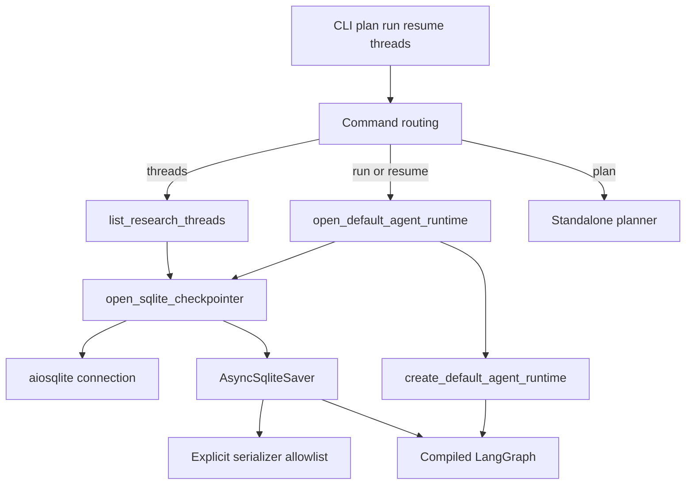
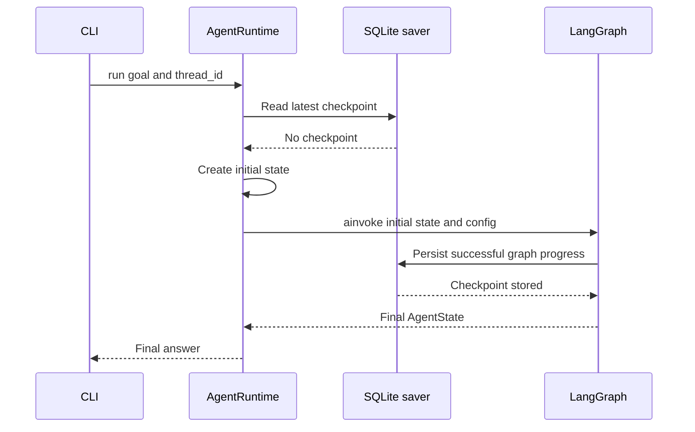

# Báo cáo ngày 08 — Mini DeerFlow

## Thông tin

- Dự án: `mini-deerflow`.
- Chủ đề: persistence, checkpoint, thread identity và resume cho bounded agent.
- Nhánh làm việc: `main`.
- Trạng thái trước khi viết báo cáo: ba commit Day 08 đã hoàn thành ở local;
  tài liệu kỹ thuật Day 08 đã được tạo nhưng chưa có commit riêng.
- Đối tượng đọc: software engineer mới học Agent AI, đã quen với API, database,
  transaction và vòng đời process trong backend truyền thống.

Trong báo cáo này, **persistence** là cơ chế giữ dữ liệu qua thời điểm process
kết thúc; **checkpoint** là ảnh chụp bền vững của state tại một mốc thực thi;
**thread identity** là định danh ổn định của một luồng thực thi; còn **resume**
là tiếp tục luồng đó từ checkpoint đã lưu.

## Mục tiêu ngày 08

Mục tiêu của Day 08 là biến runtime bounded của Day 07 từ một chương trình chỉ
sống trong memory của process thành một workflow có thể bị gián đoạn rồi tiếp
tục đúng state đã lưu.

Cụ thể, Day 08 cần đạt các điều kiện sau:

- gắn SQLite checkpointer vào LangGraph hiện có;
- dùng một `thread_id` ổn định để chọn đúng execution;
- phân biệt tạo run mới và resume run cũ;
- từ chối dùng lại một thread đã có checkpoint;
- liệt kê các thread đã persist mà không cần dựng model;
- kiểm chứng crash-resume bằng counter thay vì chỉ nhìn final answer;
- giới hạn type có thể được checkpoint serializer dựng lại;
- chuyển lỗi hạ tầng persistence thành lỗi domain sạch ở CLI.

Phạm vi này không bao gồm production database, exactly-once side effect,
reviewer/replanner hay real multi-source web research.

## Kết quả đạt được

Day 08 đã hoàn thành một vertical slice persistence chạy xuyên suốt từ CLI đến
LangGraph và SQLite:

- `langgraph-checkpoint-sqlite` và `aiosqlite` là direct dependencies;
- graph nhận một checkpointer được inject khi compile;
- `AsyncSqliteSaver` dùng connection do async context manager sở hữu;
- runtime có contract riêng cho `run` và `resume`;
- CLI có bốn lệnh `plan`, `run`, `resume`, `threads`;
- thread ID được normalize, validate và truyền qua
  `configurable.thread_id`;
- duplicate thread bị chặn trước khi planner hoặc graph chạy;
- danh sách thread unique và sorted;
- serializer dùng explicit allowlist cho domain models;
- SQLite/path errors được normalize thành `PersistenceError` hierarchy;
- regression test chứng minh completed checkpointed work không chạy lại;
- controlled lifecycle và toàn bộ test suite đều pass.

Kết quả quan trọng nhất không phải là “có một file SQLite”, mà là runtime đã có
một contract rõ về identity, ownership, recovery và failure.

## Vì sao Agent cần persistence?

Một backend request thông thường thường ngắn: nhận input, đọc/ghi database rồi
trả response. Agent workflow có thể dài hơn nhiều vì nó lập plan, gọi model,
chạy tool, quan sát kết quả và lặp qua nhiều step. Xác suất process bị dừng,
network lỗi hoặc người vận hành cần khởi động lại tăng theo độ dài workflow.

Nếu chỉ giữ state trong RAM, mọi tiến độ biến mất khi process chết. Chạy lại từ
đầu không chỉ tốn token và thời gian; nó còn có thể lặp một thao tác bên ngoài.
Persistence cung cấp một durable recovery point — mốc phục hồi bền vững — để
workflow tiếp tục từ state gần nhất đã được ghi nhận.

Tuy nhiên, persistence không đồng nghĩa với “memory của agent”. Trong Agent AI,
**memory** thường nói về thông tin được đưa vào context để model suy luận, ví dụ
lịch sử hội thoại hoặc summary dài hạn. Checkpoint của Day 08 lưu execution
state để runtime phục hồi: plan, step hiện tại, observations, counters và dữ
liệu điều khiển graph. Một checkpoint có thể chứa dữ liệu hữu ích cho memory,
nhưng mục đích chính của nó là durability và resume, không phải ghi nhớ mọi cuộc
hội thoại.

Đối chiếu với backend truyền thống:

- checkpoint gần với persisted workflow state hoặc job snapshot;
- `thread_id` gần với aggregate ID, saga ID hoặc correlation key;
- resume gần với worker nhận lại một durable job;
- checkpointer gần với repository/adapter hạ tầng;
- runtime context gần với unit-of-work quản lý connection lifetime.

## Kiến trúc Day 08



Kiến trúc giữ nguyên nguyên tắc dependency injection của Day 07. Workflow
không tự mở database. `build_agent_workflow` chỉ nhận
`BaseCheckpointSaver[str] | None` và truyền nó vào `builder.compile`. Nhờ vậy,
test có thể inject fake saver hoặc in-memory saver mà không phụ thuộc SQLite.

`src/mini_deerflow/persistence.py` là infrastructure boundary mới. Module này
chịu trách nhiệm cho thread validation, checkpoint config, path preparation,
serializer, saver lifecycle, listing và error mapping. `runtime.py` dùng
boundary đó để triển khai semantics của `run` và `resume`; `cli.py` chỉ điều
phối command và exit code.

Đây là cách tách lớp quen thuộc trong backend: domain/application layer không
tự quản chi tiết connection; adapter hạ tầng cung cấp resource qua interface
hẹp và composition root quyết định implementation cụ thể.

## Kiến thức đã học

### Checkpoint và state

**State** là dữ liệu mô tả tình trạng hiện tại của workflow. Trong Mini
DeerFlow, state gồm goal, plan, current step, pending action, tool observations,
notes, counters, errors và final answer.

Checkpoint là biểu diễn durable của state cùng metadata mà LangGraph cần để
tiếp tục execution. Không phải mọi dòng code vừa chạy đều lập tức trở thành
durable state. Chỉ phần tiến độ đã đi qua checkpoint boundary mới chắc chắn có
mặt khi mở lại database.

Điểm này giống việc cập nhật object trong RAM nhưng chưa commit transaction:
code có thể đã bắt đầu làm việc, nhưng recovery chỉ nhìn thấy phiên bản durable
gần nhất.

### Thread identity

`thread_id` không chỉ là nhãn để hiển thị. Nó là key chọn checkpoint namespace
trong một database. `create_thread_config` đặt ID đã validate vào:

```python
{
    "configurable": {
        "thread_id": "research-001",
    },
    "recursion_limit": 60,
}
```

Hai lần gọi có cùng database và cùng `thread_id` đang nói về cùng một execution
history. Cùng chuỗi đó trong database khác là namespace khác. Vì vậy identity
phải ổn định và do caller quản lý, tương tự client cung cấp job ID hoặc
correlation ID cho một long-running operation.

`normalize_thread_id` loại bỏ khoảng trắng đầu/cuối rồi chỉ chấp nhận ID bắt
đầu bằng chữ hoặc số, dài tối đa 128 ký tự, và chỉ gồm chữ, số, dấu chấm, gạch
dưới hoặc gạch ngang. Path traversal, slash và khoảng trắng bên trong bị từ
chối trước khi graph chạy.

### SQLite checkpointer

Project khai báo trực tiếp hai dependency:

- `langgraph-checkpoint-sqlite` cung cấp SQLite saver cho LangGraph;
- `aiosqlite` được production code import trực tiếp để mở async connection.

`open_sqlite_checkpointer` tạo `_NormalizingAsyncSqliteSaver`, một subclass của
`AsyncSqliteSaver`. Subclass này không thay đổi checkpoint protocol; nó bổ sung
việc map `sqlite3.Error` tại các operation đọc, list, ghi checkpoint và ghi
intermediate writes sang `CheckpointStorageError`.

Checkpoint path được expand/resolve, existing directory bị từ chối, và parent
directory được tạo với `parents=True`, `exist_ok=True`. Đây là path preparation,
không phải cơ chế sandbox hay authentication cho database.

### Async resource ownership

**Resource ownership** là câu trả lời cho ba câu hỏi: ai mở resource, resource
sống bao lâu và ai đóng nó. Day 08 trả lời bằng async context manager:

```python
async with open_sqlite_checkpointer(checkpoint_path) as checkpointer:
    # run hoặc resume dùng connection tại đây
    ...
# connection đã được đóng tại đây
```

Connection được mở trước khi saver được yield và luôn được đóng trong
`finally`, kể cả khi runtime raise exception. `open_default_agent_runtime` bao
quanh toàn bộ vòng đời runtime bằng context này, nên graph và runtime dùng cùng
một saver còn sống.

Trong backend, đây là cùng tư duy với request-scoped database session: không để
connection thành global mutable state và không bắt caller nhớ gọi `close` ở
mọi nhánh lỗi.

### Serializer allowlist

**Serializer** chuyển object thành dữ liệu có thể lưu và dựng dữ liệu đó trở
lại. **Allowlist** là danh sách type được phép dựng thành Python object. Day 08
dùng explicit allowlist gồm đúng:

- `Plan`;
- `ToolObservation`;
- `CompleteStepAction`;
- `ToolCallAction`.

Không dùng wildcard và không bật pickle fallback. `PlanStep` và `ToolResult`
không cần entry riêng trong state path hiện tại: outer model được allowlist sẽ
được dump thành dữ liệu thường; khi dựng lại `Plan` hoặc `ToolObservation`,
Pydantic validate field schema và dựng nested model tương ứng.

Allowlist giảm bề mặt deserialization bằng cách hạn chế application type có thể
được constructor lại. Nó không chứng minh checkpoint database đáng tin cậy,
không phát hiện mọi sửa đổi dữ liệu và không cung cấp integrity signature hay
authentication. Structured validation cũng không loại bỏ hallucination; nó chỉ
buộc dữ liệu đi qua contract có thể kiểm tra.

### `run`, `resume` và `threads`

Ba operation có semantics khác nhau:

| Operation | State đầu vào | Điều kiện checkpoint | Có dựng model/runtime? |
| --- | --- | --- | --- |
| `run` | `create_initial_state(goal)` | Thread chưa tồn tại | Có |
| `resume` | Không truyền initial state mới | Thread phải tồn tại | Có |
| `threads` | Không có agent state | Database có thể rỗng | Không |

`run` yêu cầu `thread_id`, tạo config, kiểm tra checkpoint chưa tồn tại rồi gọi
graph với initial state mới. `resume` kiểm tra checkpoint tồn tại rồi gọi
`graph.ainvoke(None, config=config)`. Giá trị `None` nói với graph rằng không có
input state mới thay thế state đã persist.

`threads` đi theo đường ngắn hơn: mở checkpointer, gọi `alist(None)`, lấy các
string `thread_id` vào set rồi trả tuple đã sort. CLI xử lý command này trước
khi tạo `Settings` và `RuntimeLimits`; test còn assert model/runtime không được
dựng. Listing checkpoint vì thế không cần model credential hoặc model call.

### Duplicate-thread protection

Trước khi chạy graph, `AgentRuntime.run` đọc checkpoint theo thread config. Nếu
đã có checkpoint, runtime raise `ThreadAlreadyExistsError`; planner, selector và
graph không chạy, checkpoint cũ không bị overwrite.

Đây là guard tốt cho hai invocation tuần tự nhưng chưa phải atomic create. Nếu
hai process cùng kiểm tra trước khi bên nào ghi checkpoint, cả hai có thể cùng
thấy “chưa tồn tại”. Trong backend, đây là mô hình check-then-act thiếu unique
constraint hoặc transaction bao quanh thao tác tạo.

### Crash-resume

Crash-resume là khả năng tiếp tục sau khi process dừng ngoài ý muốn. Test Day 08
không chỉ assert final answer; nó đếm planner calls, selected steps và tool
calls trước/sau khi reopen SQLite. Counter giúp phát hiện trường hợp workflow
vẫn cho kết quả đúng nhưng âm thầm chạy lại công việc cũ.

Kết quả chứng minh rằng planner chỉ chạy một lần, completed first step không
được chọn lại, completed tool call không chạy lại, observation vẫn còn, còn
decision node đã raise được retry rồi execution tiếp tục các step sau.

### At-least-once và exactly-once

**At-least-once** nghĩa là một operation có thể được thực hiện một hoặc nhiều
lần khi retry. **Exactly-once** nghĩa là tác động quan sát được chỉ xảy ra đúng
một lần dù có crash và retry.

Checkpoint không tự tạo exactly-once. Một tool có thể đã gửi request hoặc ghi
ra hệ thống bên ngoài, sau đó process chết trước khi checkpoint ghi nhận
observation. Khi resume, runtime chỉ thấy checkpoint cũ và có thể gọi tool lại.

Muốn tiến gần exactly-once cần thêm thiết kế như idempotency key, unique
constraint, outbox/inbox, deduplication hoặc transaction phối hợp với hệ thống
đích. Day 08 chưa có các cơ chế đó, nên contract đúng là at-least-once tại vùng
chưa checkpoint.

### Persistence error boundary

**Error boundary** là ranh giới chuyển lỗi hạ tầng chi tiết thành lỗi domain mà
layer gọi có thể xử lý ổn định. `PersistenceError` kế thừa `ValueError`, với các
nhánh cụ thể cho invalid thread, invalid path, storage failure, missing saver,
thread not found và thread already exists.

Các `OSError` hoặc `sqlite3.Error` phù hợp được raise lại bằng
`raise ... from error`, nên original exception vẫn nằm trong `__cause__` phục
vụ debug. CLI bắt error domain qua `ValueError`, ghi message ngắn ra stderr và
trả exit code `1` mà không in traceback.

Boundary này có chủ đích hẹp. Lỗi thông thường từ planner, selector, tool hoặc
application vẫn giữ type/meaning của chính nó; code không gắn nhãn mọi runtime
failure thành persistence failure chỉ vì run đang dùng checkpoint.

## Luồng dữ liệu của một run



Luồng chi tiết:

1. argparse validate `--thread-id` và các positive limits;
2. CLI mở persistent runtime bằng checkpoint path và workspace path;
3. context manager chuẩn bị path, mở connection và tạo saver;
4. composition root dựng model, workspace, registry, planner và selector;
5. runtime kiểm tra thread chưa có checkpoint;
6. runtime tạo initial state từ goal;
7. graph chạy bounded loop và ghi checkpoint qua saver;
8. synthesize tạo final answer;
9. CLI in kết quả, rồi context manager đóng connection.

## Luồng resume sau gián đoạn


Sequence được kiểm chứng có dạng:

```text
planner
→ decide_action
→ execute_tool
→ complete_step
→ checkpoint
→ decide_action raises
→ process stops
→ reopen SQLite
→ resume(thread_id)
→ retry failed frontier
→ continue remaining steps
```

Checkpoint sau completed step là durable state gần nhất. Planner và completed
tool call nằm phía trước checkpoint nên không chạy lại. Decision đang lỗi nằm
phía sau checkpoint nên có thể được retry. **Frontier** ở đây là ranh giới giữa
phần đã durable và phần bắt đầu nhưng chưa được checkpoint thành công.

## Hai loại resume cần phân biệt

### Resume completed thread

Một thread đã hoàn thành vẫn có checkpoint chứa final state. Khi gọi `resume`,
runtime xác nhận checkpoint tồn tại rồi gọi graph với input `None`. Graph đọc
state đã kết thúc và trả lại final result; test xác nhận selector không cần chạy
thêm. Controlled lifecycle ghi nhận completed-thread resume trả exit code `0`.

Use case này gần với “đọc lại durable job result” hơn là tiếp tục công việc.
CLI hiện chưa có endpoint riêng cho get-result nên dùng cùng `resume` contract.

### Resume interrupted thread

Một thread bị gián đoạn có checkpoint ở node/super-step thành công gần nhất.
Graph khôi phục state đó, retry frontier chưa hoàn tất và chạy tiếp các step còn
lại. Planner không chạy lại nếu plan đã nằm trong checkpoint; completed work
không tăng counter lần nữa.

Use case này mới là recovery thực sự. Nó cũng là nơi at-least-once quan trọng:
node hoặc side effect chưa có trong durable checkpoint có thể được thực hiện
lại.

## Các sự cố và cách xử lý

### Sự cố 1: serializer cảnh báo khi `threads` đọc custom types

- **Triệu chứng:** lệnh `threads` có thể phát sinh cảnh báo deserialization cho
  application Pydantic types dù mục tiêu chỉ là liệt kê ID.
- **Nguyên nhân:** `alist(None)` đọc checkpoint tuples và đi qua serializer;
  listing không phải truy vấn metadata hoàn toàn tách khỏi checkpoint payload.
  Serializer mặc định có thể gặp `Plan`, actions và observations chưa đăng ký.
- **Boundary phát hiện:** log của serializer và strict-mode integration test khi
  reopen SQLite rồi list/resume.
- **Cách sửa:** tạo một `JsonPlusSerializer` dùng explicit allowlist gồm
  `Plan`, `ToolObservation`, `CompleteStepAction`, `ToolCallAction`, rồi inject
  cùng serializer cho mọi SQLite operation.
- **Điều không làm:** không dùng wildcard, không bật pickle fallback, không tắt
  warning và không allowlist mọi module của project.
- **Verification:** domain models round-trip đúng; custom model không đăng ký bị
  block; strict mode list/resume không có unregistered hoặc blocked warning.
- **Bài học:** read-only operation vẫn có thể đi qua deserialization boundary;
  phải hiểu execution path thật thay vì suy luận từ tên command.

### Sự cố 2: storage `OSError` hoặc `sqlite3.Error` có thể lộ traceback

- **Triệu chứng:** lỗi chuẩn bị path, mở/đóng connection hoặc saver read/write
  có thể thoát ra dưới dạng exception hạ tầng không nhất quán.
- **Nguyên nhân:** lỗi có thể phát sinh ở nhiều lớp: filesystem, `aiosqlite`,
  saver methods hoặc checkpoint lookup của runtime.
- **Boundary phát hiện:** unit/integration tests inject deterministic failures
  vào parent creation, connect, close, `aget_tuple`, `alist` và `aput`.
- **Cách sửa:** map lỗi tại path/context/saver/runtime boundary sang
  `CheckpointPathError` hoặc `CheckpointStorageError`; giữ original error trong
  `__cause__`; CLI trả exit code `1` với message sạch.
- **Điều không làm:** không catch toàn bộ `Exception` rồi gọi mọi lỗi là lỗi
  persistence; planner/selector/tool failure vẫn giữ semantics riêng.
- **Verification:** tests assert error type, message, `__cause__`, không yield
  half-open saver và không in traceback ở CLI.
- **Bài học:** error translation nên đặt sát infrastructure boundary và phải giữ
  diagnostic chain cho logging/debug nội bộ.

### Sự cố 3: `run` bắt buộc `--thread-id`

- **Triệu chứng:** command Day 07 `mini-deerflow run "<goal>"` không còn hợp lệ;
  argparse trả exit code `2` vì thiếu `--thread-id`.
- **Nguyên nhân:** persistent workflow cần identity ổn định để phát hiện
  duplicate, list và resume đúng execution.
- **Boundary phát hiện:** CLI parser và migration tests.
- **Cách sửa:** biến `--thread-id` thành required argument dùng chung cho `run`
  và `resume`; document migration rõ ràng.
- **Điều không làm:** không âm thầm sinh ID ngẫu nhiên, vì caller sẽ khó tìm lại
  thread để resume và duplicate semantics trở nên mơ hồ.
- **Verification:** missing/invalid thread tests, duplicate-run test và real
  lifecycle đều pass.
- **Bài học:** thêm persistence thường làm identity trở thành một phần public
  API; breaking contract có chủ ý tốt hơn implicit identity khó vận hành.

Migration:

```text
Day 07:
mini-deerflow run "<goal>"

Day 08:
mini-deerflow run "<goal>" --thread-id "<stable-id>"
```

### Ghi chú vận hành: PowerShell native stderr và application error

- **Triệu chứng:** trong một số automation mode, PowerShell có thể biểu diễn
  stderr của native command như `NativeCommandError`, trong khi application
  chỉ đang ghi lỗi hợp lệ ra stderr và trả non-zero exit code.
- **Nguyên nhân:** đây là cách shell/host chuyển native stderr thành PowerShell
  error record, không tự động chứng minh application có traceback hoặc bug.
- **Boundary phát hiện:** phân biệt captured stdout, stderr và process exit code
  trong test/harness.
- **Cách sửa:** assertion theo exit code và nội dung channel; cấu hình harness
  phù hợp khi cần quan sát native command.
- **Điều không làm:** không đổi domain error thành success và không kết luận đây
  là lỗi Mini DeerFlow chỉ từ wrapper message của shell.
- **Verification:** CLI tests xác nhận persistence error có exit code `1`, stdout
  rỗng, stderr bắt đầu bằng `Error:` và không có traceback.
- **Bài học:** application error semantics và shell presentation là hai layer
  khác nhau; debugging cần xác định layer phát sinh triệu chứng.

## CLI ngày 08

### `plan`

Chỉ tạo validated plan, không dùng persistence:

```bash
uv run mini-deerflow plan "Compare two bounded agent designs."
```

### `run`

Tạo một thread mới:

```bash
uv run mini-deerflow run \
  "Inspect the workspace and summarize evidence." \
  --thread-id "workspace-audit-001" \
  --checkpoint-db "/path/to/checkpoints.sqlite" \
  --workspace "/path/to/workspace"
```

### `resume`

Không nhận goal mới; goal nằm trong persisted state:

```bash
uv run mini-deerflow resume \
  --thread-id "workspace-audit-001" \
  --checkpoint-db "/path/to/checkpoints.sqlite" \
  --workspace "/path/to/workspace"
```

### `threads`

Chỉ cần checkpoint database:

```bash
uv run mini-deerflow threads \
  --checkpoint-db "/path/to/checkpoints.sqlite"
```

Các ví dụ dùng placeholder chung, không dùng location của máy phát triển.

## Controlled real CLI lifecycle

Lifecycle lịch sử đã chạy theo đúng một database và một stable thread:

```text
run → threads → duplicate rejection → resume → threads
```

Kết quả quan sát:

- initial run exit code `0`;
- lần list đầu nhìn thấy một thread;
- duplicate run exit code `1` và không overwrite checkpoint;
- resume completed thread exit code `0`;
- lần list cuối vẫn có thread count bằng `1`;
- workspace trước và sau lifecycle byte-identical;
- strict mode không phát sinh serializer warning.

Smoke này kiểm tra contract CLI thực, resource lifecycle và persistence qua
nhiều process invocation. Crash-resume regression là test riêng: nó tạo failure
tại frontier có kiểm soát và assert counter để chứng minh phần đã checkpoint
không chạy lại.

## Files đã tạo hoặc sửa

### Các commit đã hoàn thành trước khi viết báo cáo

- `b030a9e` — feature persistent resumable research threads;
- `3b71f1c` — README persistent thread lifecycle;
- `d1fda59` — GitNexus agent context.

Feature commit bao gồm:

- dependencies: `pyproject.toml`, `uv.lock`;
- production source: `src/mini_deerflow/persistence.py`,
  `src/mini_deerflow/agent_workflow.py`, `src/mini_deerflow/runtime.py`,
  `src/mini_deerflow/cli.py`;
- tests: `tests/test_persistence.py`, `tests/test_agent_workflow.py`,
  `tests/test_runtime.py`, `tests/test_runtime_composition.py`,
  `tests/test_runtime_resume.py`, `tests/test_cli.py`.

README và hai GitNexus context files nằm trong hai commit riêng để lịch sử thay
đổi dễ review.

### File tài liệu hiện tại

Technical document đã tạo trước báo cáo nhưng chưa có commit riêng:

```text
docs/persistent-thread-runtime-day-08.md
```

Tài liệu đó trình bày contract kỹ thuật chi tiết. Báo cáo hiện tại tập trung vào
quá trình học, tư duy thiết kế, sự cố và liên hệ backend:

```text
docs/report-ngay-08-mini-deerflow.md
```

Báo cáo học tập này cũng chưa commit. Không có commit hash nào được tạo hoặc dự
đoán thêm cho hai tài liệu.

## Kiểm thử

Test strategy được chia thành nhiều tầng:

- persistence unit tests cho thread validation, config, path, listing,
  serializer và storage failures;
- runtime unit tests cho new-thread check, missing saver, unknown thread,
  `ainvoke(None, config)` và error mapping;
- composition test cho saver injection và connection lifetime;
- SQLite regression test cho interruption, reopen và resume;
- strict-mode subprocess test cho deserialization thực;
- CLI tests cho argument contract, stdout/stderr và exit codes;
- workflow test cho checkpointer gắn vào compiled graph;
- controlled real lifecycle cho nhiều invocation liên tiếp.

Evidence lịch sử Day 08:

```text
Full Pytest: 322 passed, 2 skipped
Ruff check: passed
uv lock --check: passed
Crash-resume regression: passed
Strict mode serializer warnings: none
Initial run exit code: 0
Duplicate run exit code: 1
Resume exit code: 0
Final thread count: 1
Workspace evidence: byte-identical
```

Hai test skipped là test phụ thuộc quyền symlink trên Windows từ workspace
suite; chúng không phải persistence regression.

GitNexus index đã được cập nhật và dùng để trace các flow CLI-to-saver,
resume-to-checkpoint-read và CLI-to-thread-listing. Source và test vẫn là bằng
chứng quyết định cho behavior cụ thể.

## Các quyết định kiến trúc đã chốt

1. **SQLite cho MVP:** đủ nhỏ để học và test durability cục bộ, nhưng không gọi
   là production storage.
2. **Caller cung cấp stable thread ID:** identity trở thành public contract thay
   vì hidden runtime detail.
3. **Tách `run` và `resume`:** create mới phải không tồn tại; resume phải tồn
   tại và không truyền initial state mới.
4. **Inject saver vào graph:** workflow không phụ thuộc concrete database.
5. **Context manager sở hữu connection:** lifetime rõ và close ở mọi exit path.
6. **`threads` đi thẳng qua persistence API:** listing không cần model/runtime.
7. **Explicit serializer allowlist:** chỉ dựng lại các outer domain types cần
   thiết cho state hiện tại.
8. **Persistence error hierarchy:** CLI có stable error contract, original cause
   vẫn giữ cho debug.
9. **Duplicate guard trước graph:** tránh overwrite tuần tự và tránh chạy
   planner vô ích.
10. **Counter-based recovery test:** phát hiện re-execution thay vì chỉ kiểm tra
    output cuối.
11. **Công bố at-least-once boundary:** không claim exactly-once khi chưa có
    idempotency/deduplication.

## Technical debt và giới hạn

- SQLite cục bộ chỉ phù hợp MVP.
- Chưa có lifecycle status đầy đủ như running, interrupted, completed, failed.
- Chưa có delete, archive hoặc prune thread.
- Duplicate check chưa atomic giữa nhiều process.
- Chưa có idempotency key cho tool calls.
- Side-effecting tool có thể bị replay nếu process chết giữa side effect và
  checkpoint.
- Checkpoint chưa có application-level integrity hoặc authentication.
- Chưa có production database, remote saver hoặc multi-tenant isolation.
- Chưa có schema migration strategy cho checkpoint state dài hạn.
- Chưa có real web provider và multi-source evidence tracking.
- Chưa có reviewer/replanner hoặc evidence-quality loop.
- Serializer allowlist không loại bỏ hallucination và không biến checkpoint
  input thành trusted data.
- Persistence không cung cấp exactly-once execution.

## Đánh giá mục tiêu ngày 08

| Tiêu chí | Kết quả | Bằng chứng |
| --- | --- | --- |
| SQLite checkpointer gắn vào graph | Đạt | Saver được inject khi compile; real SQLite tests pass |
| Stable thread identity | Đạt | Validation và `configurable.thread_id` có test |
| Run mới không overwrite thread cũ | Đạt trong single-process/sequential scope | Duplicate test và lifecycle exit code `1` |
| Resume completed thread | Đạt | Exit code `0`, không chạy selector thêm |
| Resume interrupted thread | Đạt | Crash-resume counters và state assertions pass |
| Thread listing | Đạt | Unique, sorted, không dựng model/runtime |
| Strict deserialization | Đạt trong allowlist scope hiện tại | Strict-mode warning-free test pass |
| Clean persistence errors | Đạt | Error type, cause và CLI no-traceback tests |
| Exactly-once side effects | Chưa đạt, ngoài phạm vi | Được ghi rõ là technical debt |
| Production storage | Chưa đạt, ngoài phạm vi | SQLite chỉ là MVP |

Kết luận: Day 08 đạt mục tiêu checkpoint/thread/resume của roadmap. Điều được
chứng minh là workflow có thể tiếp tục từ durable checkpoint và không lặp phần
completed đã checkpoint trong các kịch bản test. Không suy rộng kết quả này
thành exactly-once hoặc production readiness.

## Roadmap alignment

- **Day 08:** đã hoàn thành checkpoint, thread identity, duplicate protection,
  listing và resume.
- **Day 09:** dự kiến compose real web search/fetch providers, tạo multi-source
  evidence records, theo dõi provenance và cross-check citations.
- **Day 10:** dự kiến thêm reviewer/replanner và evidence-quality loop có giới
  hạn.

Day 08 chưa triển khai reviewer/replanner và chưa triển khai real multi-source
web provider. Persistence là nền tảng cho hai ngày sau vì một web research run
hoặc review/replan loop dài cần resume được sau interruption. Tuy nhiên, nền
tảng này chưa giải quyết production storage hay exactly-once; hai vấn đề đó vẫn
deferred.

Thứ tự roadmap hợp lý theo dependency: trước hết làm execution state durable,
sau đó mới đưa evidence thật vào state, rồi mới cho reviewer đánh giá evidence
và yêu cầu replan. Nếu đảo thứ tự, một loop phức tạp hơn sẽ vẫn mất toàn bộ tiến
độ khi process dừng.

## Câu hỏi tự kiểm tra

### 1. Vì sao `thread_id` không chỉ là một chuỗi để đặt tên?

<details>
<summary>Đáp án</summary>

Vì `thread_id` được LangGraph dùng trong `configurable.thread_id` để chọn đúng
checkpoint history trong một database. Nó quyết định run nào bị coi là
duplicate và state nào được resume, nên có vai trò như execution key hoặc
correlation ID chứ không chỉ là display label.

</details>

### 2. Checkpoint khác memory như thế nào?

<details>
<summary>Đáp án</summary>

Checkpoint phục vụ durability và control-flow recovery: nó lưu execution state
cần để graph tiếp tục. Memory phục vụ context cho suy luận của agent, như lịch
sử hoặc knowledge dài hạn. Hai khái niệm có thể dùng chung dữ liệu nhưng khác
mục tiêu và lifecycle.

</details>

### 3. Vì sao completed tool call không chạy lại khi resume?

<details>
<summary>Đáp án</summary>

Trong regression scenario, tool observation và completed step đã nằm trong
checkpoint durable trước khi node sau raise. Resume tải checkpoint đó và bắt
đầu tại frontier chưa hoàn tất, nên planner và tool call phía trước không chạy
lại. Counter assertions chứng minh điều này.

</details>

### 4. Tại sao crash-resume chưa chứng minh exactly-once?

<details>
<summary>Đáp án</summary>

Test chỉ chứng minh work đã checkpoint không lặp trong frontier được kiểm soát.
Nếu một external side effect xảy ra rồi process chết trước khi checkpoint ghi
observation, resume có thể gọi tool lại. Chưa có idempotency key, deduplication
hoặc transaction với hệ thống bên ngoài để ngăn replay đó.

</details>

### 5. Vì sao serializer allowlist không chứng minh checkpoint database là đáng tin cậy?

<details>
<summary>Đáp án</summary>

Allowlist chỉ giới hạn application types được dựng lại. Nó không ký dữ liệu,
không xác thực writer và không phát hiện mọi chỉnh sửa checkpoint. Database
integrity và authenticity cần cơ chế khác như access control, authenticated
storage hoặc application-level signatures.

</details>

## Sơ bộ ngày 09

Day 09 nên tận dụng runtime persistent hiện có để thêm real evidence workflow:

1. triển khai `WebSearchProvider` và `WebFetchProvider` thật sau interfaces đã
   có;
2. chỉ compose web tools khi provider config hợp lệ;
3. chuẩn hóa mỗi kết quả fetch thành evidence record có URL, title, retrieval
   time và claims;
4. cross-check URL trong final citations với evidence đã quan sát;
5. lưu Markdown artifact vào workspace;
6. test provider failure, missing configuration và citation mismatch;
7. chạy controlled smoke có search, fetch và nhiều nguồn thật;
8. xác nhận run dài vẫn resume đúng với evidence state mới.

Day 09 không nên làm reviewer/replanner sớm. Theo roadmap, quality verdict và
bounded replan thuộc Day 10, sau khi evidence record và citation provenance đã
có contract đủ rõ để reviewer đánh giá.

Tài liệu kỹ thuật chi tiết của Day 08:
[Persistent Thread Runtime — Day 08](persistent-thread-runtime-day-08.md).
