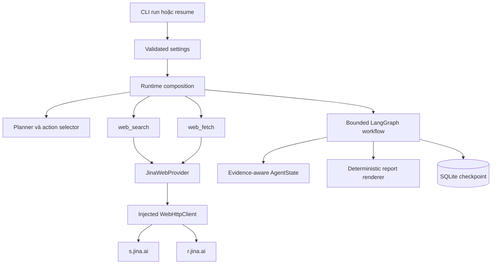

# Báo cáo ngày 09 — Mini DeerFlow

## Thông tin

| Thuộc tính | Giá trị |
| --- | --- |
| Dự án | Mini DeerFlow |
| Ngày | 09 |
| Chủ đề | Real web provider, multi-source evidence, citation tracking và deterministic artifact |
| Nền tảng kế thừa | Bounded agent runtime và SQLite checkpoint của Day 08 |
| Đối tượng đọc | Software engineer đang học cách xây dựng Agent AI có boundary rõ ràng |
| Trạng thái | Hoàn thành vertical slice Day 09; chưa phải production-ready |

Hai commit Day 09 đã được push trước khi viết báo cáo này:

- `4528ef5 feat: add web evidence and citation pipeline`
- `d876fcd docs: document web research runtime`

Báo cáo này tập trung vào điều đã học được khi biến một agent có khả năng gọi
tool thành một agent có thể giải thích citation đến từ đâu. Phần mô tả contract
chi tiết nằm trong
[tài liệu kỹ thuật Day 09](web-evidence-citation-runtime-day-09.md); báo cáo hiện
tại trình bày hành trình học, các trade-off và hai sự cố đã làm thay đổi thiết
kế.

## Mục tiêu ngày 09

Day 08 đã trả lời câu hỏi: “Nếu process dừng, agent có thể tiếp tục từ state đã
lưu không?”. Day 09 tiến thêm một bước và trả lời câu hỏi khó hơn: “Nếu agent
đưa ra một kết luận từ web, hệ thống có thể truy ngược kết luận đó về một lần
gọi tool thành công không?”.

Mục tiêu cụ thể gồm:

1. Kết nối real web search và fetch vào runtime mặc định qua một provider có
   contract rõ ràng.
2. Chuyển output web thành evidence có kiểu dữ liệu và provenance thay vì chỉ
   lưu chuỗi tự do.
3. Chỉ chấp nhận citation thuộc tập URL đã xuất hiện trong successful web
   evidence.
4. Giữ evidence qua nhiều plan step và qua SQLite resume.
5. Render report xác định từ state đã validate.
6. Cho phép ghi đúng một artifact nghiên cứu khi người dùng bật quyền ghi,
   nhưng không trao cho model quyền tự chọn thêm file.
7. Kiểm chứng toàn bộ flow bằng unit/integration tests và một controlled
   real-network smoke test.

Mục tiêu không phải là giải quyết toàn bộ bài toán web research. Reviewer,
replanner, sub-agent, browser automation và production hardening được giữ lại
cho các ngày sau theo
[roadmap 14 ngày](roadmap-deep-agent-deerflow-14-ngay.md).

## Day 09 đã xây dựng được gì?

Kết quả quan trọng nhất của Day 09 không chỉ là “agent gọi được internet”. Một
HTTP client thông thường cũng làm được điều đó. Giá trị của Day 09 nằm ở chuỗi
boundary nối từ network đến report:

- `JinaWebProvider` triển khai search qua `s.jina.ai` và fetch qua
  `r.jina.ai`;
- HTTP client được inject, có timeout và giới hạn kích thước response;
- provider failure được phân loại an toàn thay vì đẩy raw response lên trên;
- `web_search` và `web_fetch` trả `ToolResult` có schema;
- successful web observation được chuyển thành `EvidenceRecord`;
- mỗi evidence mang `EvidenceProvenance` để truy về step và tool call;
- model hoàn thành step bằng `StepFinding`, nhưng citation do workflow kiểm tra;
- evidence và citation URL được canonicalize, deduplicate và giới hạn số lượng;
- report được render xác định từ state đã validate;
- writer dùng cho artifact bị tách khỏi tập action mà model được phép chọn; và
- runtime vẫn read-only mặc định, chỉ ghi artifact khi có `--allow-write`.

Nếu nhìn bằng tư duy backend, Day 09 đã thêm một pipeline kiểu:

```text
external adapter -> validated DTO -> domain evidence -> policy check
                 -> deterministic projection -> bounded side effect
```

Đây là khác biệt giữa một demo “LLM có tool” và một runtime bắt đầu có khả năng
audit.

## Mini DeerFlow hiện xử lý research web như thế nào?

Một request research web đi qua các bước sau:

1. CLI đọc settings, tạo model, workspace và SQLite checkpointer.
2. Composition root tạo Jina provider, web tools và hai tool registry.
3. Planner tạo `Plan` có schema và số step bị giới hạn.
4. Action selector nhận current step, available tools, observation hiện tại và
   evidence tích lũy, sau đó trả đúng một structured action.
5. Nếu action là tool call, `ToolRunner` validate input rồi chạy search hoặc
   fetch trong timeout.
6. Workflow luôn ghi một `ToolObservation`, bất kể tool thành công hay thất bại.
7. Chỉ successful `web_search` hoặc `web_fetch` có shape hợp lệ mới sinh
   `EvidenceRecord`.
8. Khi model yêu cầu complete step, workflow canonicalize và đối chiếu từng URL
   trong `sources` với evidence thành công.
9. Citation hợp lệ được đưa vào `StepFinding`; URL không có evidence bị loại và
   trở thành gap có thể quan sát.
10. LangGraph reducer gộp evidence vào state và SQLite checkpoint lưu state đó.
11. Cuối run, synthesis render cùng một report cho `final_answer` và artifact.

Model tham gia chọn hành động và viết summary, nhưng model không phải authority
cuối cùng cho network response, citation membership hay artifact path. Đây là
nguyên tắc xuyên suốt của Day 09: model đề xuất; code validate và thi hành trong
boundary.

## Kiến trúc web provider

Trước khi dùng khái niệm provider, có thể liên hệ với pattern quen thuộc trong
backend: application service phụ thuộc vào một interface, còn adapter bên ngoài
triển khai interface đó cho một vendor cụ thể. Business flow không cần biết
chi tiết request của vendor.

Trong Mini DeerFlow:

- `WebSearchProvider` mô tả operation search;
- `WebFetchProvider` mô tả operation fetch;
- `WebProvider` ghép hai capability;
- `JinaWebProvider` là adapter cụ thể;
- `WebHttpClient` là transport boundary được inject; và
- `UrllibWebHttpClient` là implementation dùng standard library trong runtime
  thật.

Search gửi request đến endpoint cố định `https://s.jina.ai/`. Fetch gửi URL cần
đọc đến endpoint cố định `https://r.jina.ai/`. Model không được chọn endpoint
của provider. Search yêu cầu Jina API key; fetch có thể dùng quota anonymous
theo policy của dịch vụ.



Việc inject HTTP client đem lại lợi ích giống inject repository hoặc message
broker client trong backend test: unit test có thể cấp fake response, timeout
hoặc status code theo kịch bản mà không phụ thuộc internet, DNS, quota hay trạng
thái của Jina. Real network chỉ xuất hiện trong smoke test riêng.

Boundary này có nhiều lớp giới hạn:

- provider request timeout mặc định là 20 giây;
- raw response mặc định bị giới hạn ở 2.000.000 byte;
- client đọc thêm một byte để phát hiện response vượt giới hạn;
- `WebFetchTool` chỉ giữ tối đa 100.000 ký tự content trong `ToolResult`;
- excerpt trong một evidence bị giới hạn ở 20.000 ký tự; và
- tool runner còn có timeout ở orchestration layer.

Các giới hạn này giảm rủi ro treo request và state phình vô hạn. Chúng chưa phải
token-aware context management; phần đó thuộc technical debt của ngày sau.

Provider error được gắn category an toàn:

| Category | Ý nghĩa hiện tại |
| --- | --- |
| `configuration` | Search thiếu Jina key có giá trị; provider không được gọi |
| `authentication` | HTTP 401 hoặc 403 |
| `rate_limit` | HTTP 429 |
| `endpoint` | HTTP 404 hoặc 405 tại endpoint cố định |
| `upstream` | HTTP 5xx |
| `provider_rejection` | Non-success status còn lại |
| `transport` | Timeout, connection/OS error hoặc raw response quá lớn |
| `malformed_response` | JSON hoặc shape response không hợp lệ |
| `unknown` | Fallback cho provider-domain failure chưa có category cụ thể |

Raw response body, response header và text từ transport exception không được
đưa vào controlled error. API key được giữ bằng `SecretStr`, chỉ dùng để tạo
outbound authorization và không được xuất hiện trong log, exception, artifact
hoặc report.

## Evidence là gì và tại sao cần provenance?

Trong ngữ cảnh này, **evidence** là dữ liệu có cấu trúc mà workflow tạo ra từ
một web tool call thành công. Nó không đồng nghĩa với “sự thật tuyệt đối”. Nó
chỉ chứng minh rằng runtime đã quan sát một kết quả cụ thể qua một tool cụ thể.

**Provenance** là metadata cho biết dữ liệu đến từ đâu. Có thể liên hệ với
`trace_id`, audit log hoặc metadata của event trong hệ thống backend: cùng một
payload sẽ đáng tin và dễ debug hơn khi biết service nào tạo, ở bước nào và
trong lần gọi thứ mấy.

`EvidenceRecord` chứa:

- canonical URL;
- source tool là `web_search` hoặc `web_fetch`;
- title tùy chọn;
- excerpt có giới hạn;
- status `success`; và
- một `EvidenceProvenance`.

`EvidenceProvenance` lưu tool name, plan step, call number trong step, total
tool-call number và observation index. `StepFinding` lại là kết quả ở cấp plan
step: summary đã sanitize cùng danh sách citation đã được chấp nhận.

Bốn khái niệm dễ bị trộn lẫn được phân biệt như sau:

| Khái niệm | Nó là gì? | Được tạo khi nào? | Có tự động citable không? | Vai trò gần với backend |
| --- | --- | --- | --- | --- |
| Tool observation | Bản ghi action và toàn bộ `ToolResult`, kể cả failure | Sau mỗi tool call | Không | Execution log hoặc command result |
| Successful evidence | Record chuẩn hóa từ successful web observation có shape hợp lệ | Sau search/fetch thành công | URL đi vào tập ứng viên citable | Validated domain event |
| Citation | Canonical URL được yêu cầu và thuộc tập successful evidence URL | Khi complete step | Có, trong finding/report bình thường | Foreign key đã qua constraint |
| Finding | Summary của một plan step kèm citation đã validate | Khi step hoàn tất | Chỉ citation bên trong được render | Read model hoặc projection |

Search result có thể tạo evidence vì provider đã trả URL đó thành công, nhưng
search snippet chỉ là discovery metadata. Nó không chứng minh toàn bộ nội dung
trang đích. Fetch thành công cung cấp page content mạnh hơn cho việc đọc trang,
nhưng vẫn không tự chứng minh nguồn đúng, mới hoặc có thẩm quyền.

## Citation validation hoạt động như thế nào?

**Citation validation** ở Day 09 là kiểm tra lineage, không phải fact checking.
Workflow hỏi: “URL này có nằm trong tập URL của successful evidence mà agent đã
quan sát không?”. Nó chưa hỏi: “Nguồn này có uy tín không?” hoặc “Excerpt có
entail toàn bộ claim không?”.

Trước khi so sánh, URL được canonicalize:

- chỉ chấp nhận cấu trúc HTTP hoặc HTTPS;
- yêu cầu hostname;
- từ chối username/password nhúng trong URL;
- lowercase scheme và hostname;
- bỏ default port và fragment;
- giữ query;
- chuẩn hóa root path; và
- giữ ngoặc cho IPv6 host.

`HttpUrl` chỉ kiểm tra cấu trúc. Nó không thực hiện DNS lookup, không chứng minh
URL tồn tại, không chứng minh nội dung đúng và không phải SSRF defense.

Invariant chính là:

```text
accepted citations ⊆ canonical URLs of successful EvidenceRecord values
```

Nếu model đưa URL chưa từng xuất hiện trong evidence, workflow loại URL đó và
ghi số citation bị reject vào `errors`. Nếu model đưa local path như
`notes/result.md`, schema citation từ chối ngay vì local file không có HTTP
identity hay web provenance. Local evidence vẫn có thể được mô tả trong
summary, nhưng không được giả làm web citation.

Report renderer kiểm tra membership thêm lần nữa và tách phần citation khỏi
summary. Bare URL hoặc Markdown link do model viết trực tiếp trong summary bị
sanitize; citation thật được renderer đánh số từ state đã validate. Đây là
defense in depth: schema, workflow policy và renderer cùng bảo vệ một invariant.

## Luồng dữ liệu từ web tool đến report

```mermaid
flowchart LR
    Decision[Structured action] --> Tool[web_search hoặc web_fetch]
    Tool --> Result[ToolResult]
    Result --> Observation[ToolObservation]
    Observation --> Check{Successful web output hợp lệ?}
    Check -->|Không| Failure[Giữ failed observation]
    Failure --> NoEvidence[Không tạo evidence]
    Check -->|Có| Extract[Extract và canonicalize]
    Extract --> Evidence[EvidenceRecord và provenance]
    Evidence --> Reducer[Bounded evidence reducer]
    Reducer --> State[AgentState]
    State --> Complete[CompleteStepAction sources]
    Complete --> Subset{URL thuộc successful evidence?}
    Subset -->|Không| Gap[Reject citation và ghi gap]
    Subset -->|Có| Finding[StepFinding]
    Finding --> Render[render_research_report]
    Evidence --> Render
    Gap --> Render
    Render --> Answer[Final answer]
    Render --> Artifact[Configured artifact nếu được phép]
```



Một trace ngắn có thể đọc như sau:

```text
web_search trả URL U thành công
-> ToolObservation ghi step 1, total call 1
-> EvidenceRecord lưu canonical(U) và provenance của call 1
-> model complete step với sources=[U]
-> canonical(U) có trong successful evidence set
-> StepFinding giữ U
-> report đánh số citation và in provenance tương ứng
```

Nếu URL V chỉ xuất hiện trong câu trả lời của model mà không có successful
evidence, V dừng ở subset check và không trở thành citation.

## Multi-source evidence và cross-step continuity

**Multi-source evidence** nghĩa là state có thể chứa evidence từ nhiều URL và
nhiều lần gọi tool, thay vì chỉ giữ một nguồn cuối cùng. **Cross-step
continuity** nghĩa là step sau vẫn nhìn thấy evidence đã thu ở step trước.

`AgentState` có các channel `evidence`, `findings` và `sources`:

- evidence dùng reducer `merge_evidence_records`;
- sources dùng reducer `merge_citation_sources`;
- findings được append theo từng step.

Evidence được nhận diện bằng canonical URL. Record mới cho cùng URL thay record
cũ tại vị trí đó; URL mới được append. Evidence và source list đều bị giới hạn
ở 50 phần tử. Đây giống một bounded in-memory projection có unique key hơn là
một list append vô hạn.

Action context chỉ đưa observation của current step cho selector, giúp giảm
nhiễu cục bộ, nhưng vẫn đưa toàn bộ evidence tích lũy trong giới hạn. Vì vậy
step 2 có thể cite URL do step 1 tìm thấy. Completed summary hỗ trợ continuity,
nhưng summary không tự biến thành evidence mới.

Day 09 cũng thêm `EvidenceRecord`, `EvidenceProvenance` và `StepFinding` vào
checkpoint serializer allowlist. Integration test với SQLite làm gián đoạn run
sau khi đã có evidence, mở lại database rồi resume. Evidence và provenance cũ
vẫn có trong action context và tiếp tục được dùng cho citation validation.

Kết quả đó chứng minh persistence contract trong kịch bản đã test. Nó không
chứng minh SQLite có integrity/authentication, không ngăn checkpoint bị sửa bởi
actor có quyền filesystem và không tạo exactly-once cho side effect bên ngoài.

## Artifact boundary và quyền ghi file

**Artifact** là sản phẩm bền vững của run, ở đây là Markdown report. Vấn đề an
toàn không chỉ là “đường dẫn có traversal không?”, mà còn là “ai được quyền chọn
việc ghi file và chọn file nào?”.

Generic `WriteFileTool` vẫn cần tồn tại cho workflow khác. Tool này validate
input, dùng `Workspace.write_text`, giới hạn byte, từ chối absolute path và
path traversal, đồng thời giữ semantics ghi đè idempotent cho cùng content.
Nhưng generic writer không phù hợp để model tự do sử dụng trong pipeline tạo
research report.

Day 09 giải quyết bằng hai registry:

- **action registry** chứa `list_files`, `read_file`, `web_search`, `web_fetch`;
  đây là capability model nhìn thấy và được phép chọn;
- **execution registry** chứa action tools và chỉ thêm `write_file` khi quyền
  ghi được bật; synthesis dùng registry này từ bên trong workflow.

Cuối run, `synthesize_node` gọi `render_research_report` bằng goal, findings,
evidence, errors và counters đã có trong state. Sau đó node nội bộ gọi writer
với configured artifact path `reports/research-report.md`. Model không viết
report lần hai và không chọn filename.

Nếu model vẫn trả action `write_file`, executor đối chiếu action registry và
trả controlled `ActionToolDeniedError`. Đây là security boundary trong code,
không phải lời nhắc mềm trong prompt.

Nếu configured path cố thoát workspace, `Workspace` từ chối. Write failure trở
thành controlled tool failure; `artifact_path` giữ `None`, error được thêm vào
state và final answer được render lại với limitation. Workflow không biến lỗi
ghi dự kiến thành traceback.

## Read-only mặc định và --allow-write

Read-only ở đây nói về **workspace write capability**, không có nghĩa là agent
không thực hiện network read. Khi không có `--allow-write`, runtime vẫn có
`list_files`, `read_file`, `web_search` và `web_fetch`, nhưng không đăng ký
writer và không cấu hình artifact path. Report chỉ được trả trong
`final_answer`; workspace không đổi.

Khi có `--allow-write`, execution registry có writer nội bộ và synthesis ghi
đúng artifact chuẩn. Writer vẫn không xuất hiện trong action registry của
research pipeline.

Ví dụ Bash, dùng biến do người vận hành cấp thay vì hard-code đường dẫn runtime:

```bash
uv run mini-deerflow run \
  "Tìm tài liệu LangGraph chính thức, fetch nguồn đã tìm thấy và viết báo cáo có evidence." \
  --thread-id "day-09-learning" \
  --checkpoint-db "$CHECKPOINT_DB" \
  --workspace "$WORKSPACE_ROOT" \
  --allow-write \
  --max-tool-calls-per-step 3 \
  --max-total-tool-calls 10
```

Ví dụ PowerShell:

```powershell
uv run mini-deerflow run `
  "Tìm tài liệu LangGraph chính thức, fetch nguồn đã tìm thấy và viết báo cáo có evidence." `
  --thread-id "day-09-learning" `
  --checkpoint-db $env:CHECKPOINT_DB `
  --workspace $env:WORKSPACE_ROOT `
  --allow-write `
  --max-tool-calls-per-step 3 `
  --max-total-tool-calls 10
```

CLI flag là bước cấp quyền rõ ràng ở composition root. Tuy nhiên, flag không
được hiểu là quyền ghi tùy ý của model; nó chỉ làm cho internal synthesis có
đủ dependency để tạo artifact đã cấu hình.

## Hai sự cố quan trọng trong ngày 09

Hai sự cố của Day 09 đều cho thấy smoke test có thể phát hiện lỗ hổng ở ranh
giới giữa các component mà unit test ban đầu chưa thể hiện đầy đủ.

| Triệu chứng | Nguyên nhân | Boundary phát hiện | Cách sửa | Điều không làm | Bài học |
| --- | --- | --- | --- | --- | --- |
| Real search thất bại; thông báo cũ chỉ nói provider trả non-success | Jina search credential chưa được cấu hình, trong khi provider che toàn bộ status/category | Provider và controlled smoke precondition | Thiếu key trả `configuration`; 401/403 thành `authentication`; thêm category cho rate limit, endpoint, upstream, rejection, transport và malformed response | Không đọc/in key; không đưa raw body/header vào error; không đoán URL để fetch | Diagnostic phải đủ phân loại để vận hành nhưng không được đánh đổi bằng secret leakage |
| Workspace có thêm `langgraph_docs_report.md` ngoài artifact chuẩn | Khi bật write, generic writer từng nằm trong capability model có thể chọn | Kiểm kê workspace sau real smoke và research pipeline test | Tách action registry khỏi execution registry; synthesis dùng writer nội bộ với fixed configured path; executor chặn model-requested writer | Không xóa generic `write_file`; không chỉ sửa prompt; không nới traversal policy | Capability security phải được enforce ở composition và execution, không dựa vào việc model “nghe lời” |

Sự cố đầu tiên không yêu cầu bịa endpoint mới. Implementation được kiểm tra với
contract đang dùng: search qua `s.jina.ai`, fetch qua `r.jina.ai`. Fix tập trung
vào safe diagnostics và controlled failure.

Sự cố thứ hai cũng không dẫn đến việc phá semantics của generic writer. Thay
vì hard-code report path bên trong một tool dùng chung, policy đặc thù được đặt
ở research runtime và synthesis. Đây là cách đặt rule ở layer sở hữu use case.

## Controlled real-network smoke test

Unit test với fake network chứng minh logic xác định, nhưng không chứng minh
credential, endpoint và network policy thật phối hợp được. Vì vậy Day 09 có một
controlled smoke riêng, chạy sau khi Jina key được cấu hình.

Quy trình smoke dùng thread mới, SQLite database tạm và workspace tạm ngoài
repository, bật `--allow-write`, đặt tool-call limit hợp lý, rồi yêu cầu agent:

1. search tài liệu LangGraph chính thức;
2. chọn URL thật từ search result;
3. fetch URL đó;
4. tạo evidence và report có citation; và
5. không invent URL.

Kết quả đã xác minh:

- search thật trả 9 kết quả;
- ít nhất một URL từ search được fetch thành công với HTTP 200;
- successful web calls tạo được evidence;
- citation là subset của successful evidence URLs;
- artifact duy nhất là `reports/research-report.md`;
- report có Goal, Findings, Evidence, Citations và Gaps and limitations;
- stderr của successful run rỗng;
- không có file model tự tạo thêm;
- repository không bị thay đổi bởi smoke; và
- workspace cùng database tạm được cleanup thành công.

Smoke không được đưa vào unit test và không được retry vô hạn. Nếu search không
trả kết quả, quy trình không tự đoán URL để fetch.

Một lần smoke thành công chỉ chứng minh vertical slice hoạt động trong điều
kiện cụ thể lúc chạy. Nó không chứng minh mọi credential state, rate limit,
provider outage, redirect, proxy hay network policy đều đã được giải quyết.

## Những kiến thức đã học

### Provider boundary giống infrastructure adapter

Application không nên biết trực tiếp JSON shape, header và exception của từng
vendor. Provider dịch external contract sang domain contract. HTTP client được
inject thêm một lớp nữa để transport có thể fake trong test. Đây là cùng tư duy
với repository interface trước database adapter hoặc message publisher trước
Kafka client.

### Observation khác evidence

Observation trả lời “tool vừa làm gì và kết quả ra sao?”. Evidence trả lời
“phần nào của observation thành công đủ điều kiện đi vào tập dữ liệu có thể
cite?”. Lưu failure observation vẫn hữu ích cho retry/adaptation và audit, nhưng
không được nâng cấp thành evidence.

### Provenance là audit metadata của dữ liệu

Nếu chỉ giữ URL và excerpt, khi report sai rất khó biết record sinh ở step nào
hoặc từ search hay fetch. Provenance biến evidence thành dữ liệu truy vết được,
giống correlation metadata trong distributed systems.

### Validation có nhiều tầng

Schema validation kiểm tra shape. Canonicalization tạo identity nhất quán.
Subset validation kiểm tra lineage. Renderer sanitize output lần cuối. Mỗi lớp
trả lời một câu hỏi khác nhau; không lớp nào một mình chứng minh claim đúng.

### Capability khác configuration

`--allow-write` là configuration do người dùng chọn. Capability thực tế lại do
registry quyết định. Một flag không nên vô tình đưa toàn bộ generic writer cho
model nếu use case chỉ cần một internal write cố định.

### Deterministic projection giảm vùng tin cậy

Report giống một read model được project từ validated state. Không gọi model
lần nữa để tự viết file giúp output ổn định hơn, citation không bị thay đổi ở
bước cuối và test có thể so sánh chính xác.

### Safe diagnostics là một phần của security

Thông báo “provider failed” quá ít thông tin để vận hành, nhưng raw body/header
có thể lộ secret. Category và status code tối thiểu là điểm cân bằng: đủ phân
biệt configuration, authentication, rate limit hay upstream mà không copy dữ
liệu nhạy cảm.

## Các quyết định kiến trúc đã chốt

1. **Giữ provider contract độc lập vendor.** Jina là adapter hiện tại, không
   phải kiểu dữ liệu xuyên suốt workflow.
2. **Inject HTTP client.** Unit test không gọi internet và có thể tái tạo chính
   xác status, timeout, malformed response và oversize response.
3. **Dùng typed evidence.** URL string đơn lẻ không đủ để audit nguồn gốc.
4. **Canonical URL là identity cho dedup và citation membership.** Fragment và
   default port không làm phát sinh evidence giả khác nhau.
5. **Chỉ successful web observation sinh evidence.** Failure và local file
   observation vẫn được lưu nhưng không citable.
6. **Citation cần subset validation.** URL đúng cú pháp chưa đủ điều kiện.
7. **Renderer xác định từ validated state.** Final answer và artifact cùng một
   nguồn dữ liệu.
8. **Action registry hẹp hơn execution registry.** Internal component có thể có
   capability mà model không được chọn.
9. **Giữ generic writer cho workflow khác.** Policy fixed artifact thuộc
   research composition, không thuộc tool dùng chung.
10. **Read-only là mặc định.** Side effect cần opt-in rõ ràng.
11. **Expected provider failure là controlled tool failure.** Programming bug
    không bị che bởi broad `except Exception`.
12. **Persistence mở rộng theo type allowlist.** Evidence mới phải resume được
    mà không bật deserialization tùy ý.

## Những điều chưa làm và technical debt

Day 09 chưa giải quyết các phần sau:

- reviewer/replanner và bounded evidence-quality loop;
- sub-agent, delegation và fan-out/fan-in;
- human-in-the-loop approval cho action nhạy cảm;
- SSRF hardening đầy đủ, gồm DNS resolution, private-address policy và redirect
  revalidation;
- hard enforcement rằng mọi fetch URL phải đến từ search result trước đó;
- browser automation cho trang cần JavaScript hoặc tương tác;
- production storage, multi-tenant isolation, schema migration, integrity và
  authentication;
- crawling không giới hạn, robots policy và site-wide discovery;
- token-aware summarization cho observation dài;
- claim-level entailment, source-quality scoring, contradiction detection và
  freshness checking;
- production observability/redaction policy cho toàn ứng dụng; và
- exactly-once side-effect execution.

`HttpUrl` vẫn chỉ validate cú pháp. Provider-mediated fetch không thay thế một
network policy hoàn chỉnh. SQLite checkpoint vẫn chỉ là MVP durability; nó
không ký dữ liệu và không tạo distributed transaction giữa checkpoint với
network/filesystem side effect.

Evidence hiện lưu logical provenance nhưng chưa lưu retrieval timestamp,
content hash, immutable snapshot hay response metadata. Search snippet có thể
hữu ích cho discovery, nhưng không nên được diễn giải thành xác minh nội dung
trang.

## Kiểm thử và chất lượng

Test strategy được chia theo boundary:

- web contract tests kiểm tra model bất biến, HTTP URL và schema;
- provider tests dùng fake HTTP client cho success, missing configuration,
  401/403, 429, 5xx, timeout, malformed JSON/shape và response-size limit;
- secret-safety tests đặt dữ liệu sentinel vào key, transport error và raw body
  rồi xác nhận chúng không xuất hiện ở exception hay serialized tool failure;
- web tool tests kiểm tra input validation, result limit, content truncation và
  controlled failure;
- evidence tests kiểm tra extraction, canonicalization, dedup, bounded reducer,
  unknown citation rejection, local-path rejection và deterministic report;
- pipeline tests kiểm tra nhiều nguồn, continuity, artifact-only behavior,
  denied model write và traversal failure;
- persistence tests kiểm tra serializer allowlist cho evidence types;
- SQLite integration test kiểm tra evidence/provenance tồn tại sau interruption
  và resume; và
- generic file/workspace tests bảo vệ compatibility của `WriteFileTool`.

Unit tests không gọi real provider. Network smoke là một lớp integration riêng
để không làm test suite phụ thuộc quota hoặc internet.

Kết quả quality suite đã xác minh:

```text
347 passed, 2 skipped
```

Ruff lint, Ruff format check và whitespace checks được chạy lại sau khi viết
báo cáo. Con số test được giữ đúng theo kết quả đã ghi nhận, không suy ra thêm
số lượng test cho từng module.

## Đánh giá mục tiêu ngày 09

| Tiêu chí | Kết quả | Bằng chứng | Phạm vi không suy rộng |
| --- | --- | --- | --- |
| Real search provider | Đạt | Jina Search qua `s.jina.ai`; smoke trả 9 kết quả | Không đảm bảo mọi quota/network state |
| Fetch nguồn từ search | Đạt | Ít nhất một fetch qua `r.jina.ai` trả HTTP 200 | Không phải crawler hay browser |
| Typed multi-source evidence | Đạt | `EvidenceRecord` và bounded canonical reducer có test | Không đánh giá source quality |
| Provenance truy vết được | Đạt | Tool, step, call và observation index được lưu | Chưa có timestamp/content hash |
| Strict citation boundary | Đạt | Citation phải thuộc successful evidence URL set | Không phải fact checking |
| Cross-step continuity | Đạt | Later action context nhận evidence trước đó | Context chưa token-aware |
| SQLite resume | Đạt trong kịch bản test | Evidence và provenance tồn tại sau reopen/resume | Không có integrity/authentication/exactly-once |
| Deterministic report | Đạt | Renderer dùng validated state và sanitize model URLs | Không có reviewer chất lượng |
| Single artifact boundary | Đạt | `reports/research-report.md`; model write bị từ chối | Generic writer vẫn cần policy riêng ở workflow khác |
| Read-only default | Đạt | Không writer/artifact khi thiếu `--allow-write` | Web reads vẫn là network operations |
| Safe provider diagnostics | Đạt trong mapping hiện tại | Category/status tối thiểu, không raw body/header | Chưa phải production telemetry đầy đủ |

Kết luận: Day 09 đạt mục tiêu roadmap về real web provider, multi-source
evidence, traceable citation và Markdown artifact. “Đạt” ở đây là vertical
slice có code, tests và controlled smoke evidence; không phải tuyên bố hệ thống
đã production-ready.

## Liên hệ với roadmap

Tiến trình đến Day 09 tạo thành chuỗi dependency rõ ràng:

```text
Day 05: tool và workspace boundary
-> Day 06: bounded action loop
-> Day 07: executable runtime composition
-> Day 08: persistent thread và resume
-> Day 09: real evidence, citation lineage và artifact
-> Day 10: reviewer/replanner đánh giá evidence quality
```

Day 09 hoàn thành milestone “báo cáo nhiều nguồn có citation truy ngược được về
evidence records”. Nó cũng trả phần artifact Markdown đã được dời từ Day 06.

Việc chưa thêm reviewer trong Day 09 là chủ đích. Reviewer chỉ có ý nghĩa khi
đã có evidence contract ổn định để đánh giá. Nếu làm reviewer trước, verdict sẽ
phải dựa vào free-form observation hoặc summary thiếu provenance, làm quality
loop khó test và dễ tự xác nhận hallucination.

Các bước sau vẫn theo roadmap: Day 10 reviewer/replanner, Day 11 context
management, Day 12 bounded sub-agent, Day 13 HITL/security/evaluation và Day 14
hardening/demo. Xem thêm
[roadmap Mini DeerFlow](roadmap-deep-agent-deerflow-14-ngay.md).

## Câu hỏi tự kiểm tra

### 1. Vì sao `ToolObservation` thành công chưa tự động là một citation?

<details>
<summary>Đáp án</summary>

Observation là bản ghi execution chung cho mọi tool và cả success/failure.
Workflow còn phải xác nhận đây là `web_search` hoặc `web_fetch`, result thành
công, data có đúng shape, URL canonicalize được và sau đó model thực sự yêu cầu
URL đó trong `sources`. Citation là kết quả sau các bước validation này.

</details>

### 2. `HttpUrl` giải quyết được gì và không giải quyết được gì?

<details>
<summary>Đáp án</summary>

`HttpUrl` kiểm tra cấu trúc HTTP/HTTPS và loại các scheme không phù hợp. Nó
không chứng minh host tồn tại, trang fetch thành công, nội dung đúng, nguồn uy
tín hoặc địa chỉ an toàn trước SSRF. Những câu hỏi đó cần network policy,
successful observation và evidence-quality review riêng.

</details>

### 3. Vì sao cần canonicalize URL trước khi deduplicate và validate citation?

<details>
<summary>Đáp án</summary>

Cùng một resource có thể được biểu diễn khác nhau bởi chữ hoa ở hostname,
default port hoặc fragment. Nếu so sánh raw string, agent có thể tạo duplicate
evidence hoặc reject một citation thực chất trùng nguồn. Canonicalization tạo
identity nhất quán, nhưng không khẳng định hai query khác nhau có cùng nội dung.

</details>

### 4. Tại sao không chỉ sửa prompt để model luôn ghi đúng artifact path?

<details>
<summary>Đáp án</summary>

Prompt là hướng dẫn xác suất, không phải capability boundary. Fetched content
có thể gây prompt injection và model vẫn có thể chọn action sai. Action registry
loại writer khỏi tool model thấy; executor còn chặn writer action; synthesis
nội bộ mới được gọi writer với configured path. Rule vì vậy được enforce bằng
code.

</details>

### 5. Evidence tồn tại qua SQLite resume chứng minh điều gì?

<details>
<summary>Đáp án</summary>

Nó chứng minh evidence-domain types được serializer cho phép, state đã
checkpoint có thể được khôi phục và later steps tiếp tục nhận provenance cũ
trong kịch bản integration test. Nó không chứng minh database không bị sửa,
không cung cấp authentication và không tạo exactly-once cho external side
effect.

</details>

### 6. Vì sao search snippet không đủ để tuyên bố đã xác minh nội dung trang?

<details>
<summary>Đáp án</summary>

Snippet là metadata rút gọn do search provider trả về. Nó có thể thiếu context,
cũ hoặc không phản ánh đầy đủ trang đích. Nó chứng minh provider đã trả một
kết quả discovery, không chứng minh toàn bộ page content. Với claim quan trọng,
agent nên fetch URL đã tìm thấy và reviewer sau này cần đánh giá mức hỗ trợ của
evidence.

</details>

### 7. `--allow-write` cấp quyền gì trong research runtime?

<details>
<summary>Đáp án</summary>

Flag thêm generic writer vào execution registry và cấu hình artifact path để
internal synthesis ghi report. Nó không thêm writer vào action registry nên
không cấp cho model quyền tự chọn file. Không có flag, workspace giữ read-only
và report chỉ tồn tại trong `final_answer`.

</details>

## Sơ bộ ngày 10

Day 10 nên thêm một evidence-quality loop có giới hạn trên nền contract Day 09:

1. `reviewer` nhận plan, findings, evidence, failed observations và remaining
   budget;
2. reviewer trả structured verdict `continue`, `replan` hoặc `finish` cùng lý
   do ngắn;
3. `replanner` chỉ chạy khi verdict yêu cầu và bị giới hạn số lần;
4. evidence đã thu phải được giữ nguyên qua replan;
5. reviewer không được biến summary thành evidence;
6. citation invariant vẫn là subset của successful evidence URLs; và
7. test cần bao phủ happy path, thiếu evidence dẫn đến replan, đủ evidence sớm,
   contradictory evidence và budget exhaustion.

Tiêu chí review ban đầu có thể gồm source diversity, successful fetch cho claim
quan trọng, unsupported finding, conflict giữa excerpt và unmet success
criteria. Reviewer chưa nên kéo theo sub-agent, HITL hay browser automation;
mỗi capability đó cần boundary và budget riêng.

Tài liệu liên quan:

- [Web Evidence and Citation Runtime — Day 09](web-evidence-citation-runtime-day-09.md)
- [Persistent Thread Runtime — Day 08](persistent-thread-runtime-day-08.md)
- [Báo cáo ngày 08](report-ngay-08-mini-deerflow.md)
- [Executable Research Agent Runtime — Day 07](executable-agent-runtime-day-07.md)
- [Bounded Agent Loop — Day 06](bounded-agent-loop-day-06.md)
- [Tool Execution Layer — Day 05](tool-execution-layer-day-05.md)
- [LangGraph Workflow — Day 04](langgraph-workflow-day-04.md)
- [DeerFlow request lifecycle](deerflow-request-lifecycle.md)
- [README](../README.md)
- [Roadmap 14 ngày](roadmap-deep-agent-deerflow-14-ngay.md)
