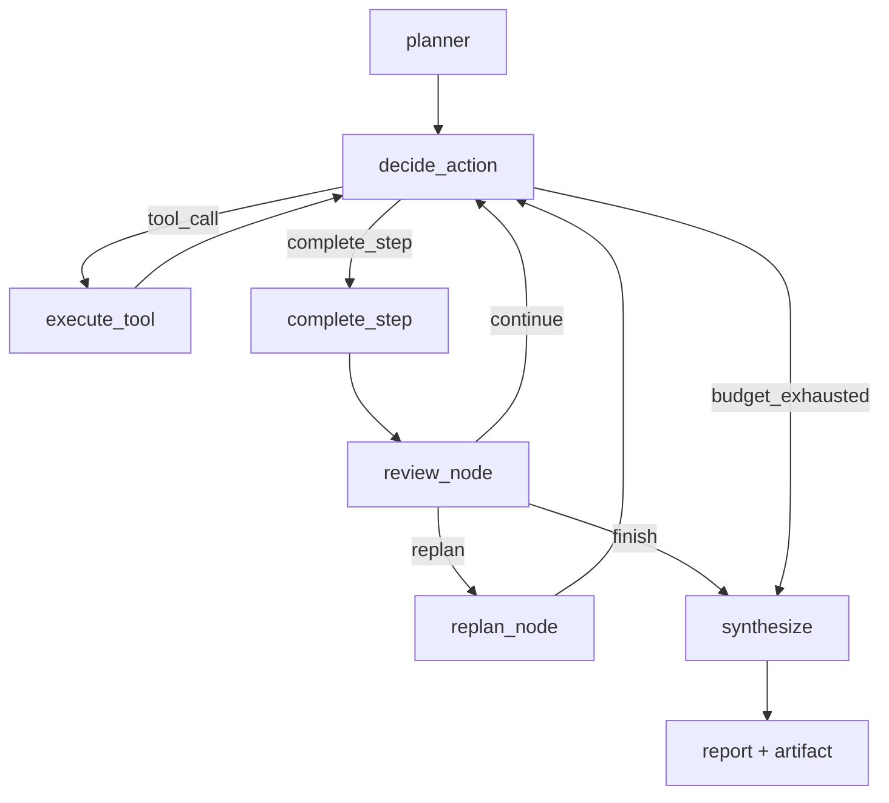
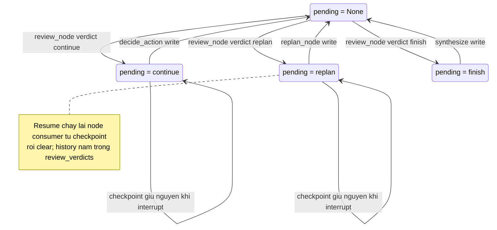

# Báo cáo ngày 10 — Mini DeerFlow

## Thông tin

| Thuộc tính | Giá trị |
| --- | --- |
| Dự án | Mini DeerFlow |
| Ngày | 10 |
| Chủ đề | Bounded reviewer/replanner và evidence-quality loop |
| Nền tảng kế thừa | Web evidence, citation validation và SQLite checkpoint của Day 09 |
| Đối tượng đọc | Software engineer đang học cách xây dựng Agent AI có boundary rõ ràng |
| Trạng thái | Hoàn thành vertical slice Day 10; chưa phải production-ready |

Hai commit Day 10 đã được push trước khi viết báo cáo này:

- `b53306d feat: add bounded reviewer replanner loop`
- `e80be17 docs: document reviewer replanner lifecycle`

Báo cáo này trình bày hành trình học: tại sao một agent cần tự đánh giá evidence
của chính nó, cách thay plan mà không phá việc đã làm, và một bài học về
ownership của state field xuất hiện ngay trong ngày. Phần mô tả contract chi
tiết nằm trong
[tài liệu kỹ thuật Day 10](bounded-reviewer-replanner-day-10.md); phần nền
evidence/citation nằm trong
[tài liệu kỹ thuật Day 09](web-evidence-citation-runtime-day-09.md).

## Mục tiêu ngày 10

Day 09 trả lời được câu hỏi: "kết luận trong report có truy ngược về một lần
gọi web tool thành công không?". Nhưng nó để lộ một khoảng trống khác: agent
không biết liệu evidence đã thu thập là **đủ** hay chưa. Workflow hoặc chạy
hết mọi step đã plan, hoặc chết vào bức tường budget. Nếu plan lập sai hướng
ngay từ đầu, không có cơ chế nào phát hiện giữa đường.

Ngày 10 trả lời câu hỏi: "agent có thể tự đánh giá chất lượng evidence, sửa
phần việc còn lại mà không bỏ mất phần đã làm, và dừng một cách dự đoán
được không?".

Mục tiêu cụ thể:

1. Thêm node reviewer trả về đúng một structured verdict
   `continue | replan | finish`.
2. Thêm replanner chỉ thay thế phần việc còn lại, qua schema nghiêm ngặt.
3. Giới hạn số vòng replan để không bao giờ có vòng lặp planner vô hạn.
4. Giữ nguyên toàn bộ boundary của Day 09: citation, evidence, artifact,
   read-only mặc định, checkpoint/resume.
5. Kiểm chứng bằng deterministic tests, một deterministic smoke và hai
   controlled real-model smoke.

## Day 10 đã xây dựng được gì?

Nhìn qua lăng kính backend, Day 10 thêm vào một "pipeline" đã có sẵn
(các step chạy tuần tự theo budget) ba mảnh quen thuộc:

- **quality gate giữa các stage** (reviewer): sau mỗi step hoàn thành, một
  bước kiểm tra chất lượng đầu ra trung gian quyết định pipeline nên chạy
  tiếp, thay đổi plan ở phía trước, hay dừng;
- **command routing với enum đóng** (`continue | replan | finish`): verdict là
  lệnh định tuyến, không phải text tự do — graph edge phải deterministic;
- **audit history append-only** (`review_verdicts`, `replans`): mọi phán quyết
  và mọi lần thay plan đều lưu vĩnh viễn trong state, render vào report cuối.

Cụ thể:

- `ReviewVerdict`, `ReviewFinding`, `ReviewDecision`, `ReviewContext`,
  `ReplanRequest`, `ReplacementWork`, `ReplanRecord` — domain model Pydantic
  frozen, `extra="forbid"`;
- `LLMReviewer` dùng `json_mode` như planner/selector, retry đúng 2 lần cho
  lỗi format;
- `create_replacement_plan` sinh phần việc thay thế, validate bounds ngay
  trong vòng retry;
- `review_node` / `replan_node` / `route_after_review` trong workflow, với
  deterministic guards ép các verdict không an toàn về `finish`;
- `--max-replan-cycles` trên CLI, tách biệt với tool-call budget và recursion
  limit;
- state mới: `review_verdicts`, `replans`, `pending_review_verdict`;
- serializer allowlist mở cho ba type mới, resume giữ nguyên hành vi;
- report có mục `## Review conclusions` và số liệu review/replan cycle.

## Tại sao agent cần reviewer và replanner?

Một pipeline backend không có health check thì chỉ có hai số phận: chạy hết
job hoặc crash. Agent cũng vậy: không có reviewer, "chạy hết plan" không có
nghĩa là "đã đủ evidence cho mục tiêu" — plan có thể thiếu dimension từ đầu,
và các step còn lại chỉ chăm chăm làm đúng việc sai.

Reviewer chính là health check theo tiêu chí nghiệp vụ: nó đánh giá **độ phủ
của evidence so với goal** (relevance, source diversity, direct support,
citation validity, gap, contradiction, budget limitation), không đánh giá tính
đúng đắn của nguồn. Một verdict `replan` có giá trị vì nó nói rõ "các step
còn lại theo plan hiện tại không đóng được gap này" — và khi đó việc cần làm
là **sửa plan phía trước**, không phải chạy nhanh hơn phía sau.

Điều kiện tiên quyết: reviewer chỉ có thể tồn tại **sau** contract evidence
của Day 09. Nếu không có `EvidenceRecord` có kiểu, canonical URL và
provenance, reviewer sẽ phải đánh giá trên text tự do — và mọi phán quyết về
"coverage" trở thành đoán mò. Reviewer đánh giá trên state đã validate; đó là
lý do thứ tự các ngày quan trọng.

## Reviewer đánh giá evidence như thế nào?

Input của reviewer là một `ReviewContext` có giới hạn, lấy từ state:

- goal và các step còn lại;
- các summary của step đã hoàn thành (đã sanitize);
- các finding đã validate;
- các evidence record thành công (tối đa 50);
- limitations: observation thất bại và error được chuỗi hóa (20 mục cuối);
- hai budget còn lại: tool call và replan cycle.

Toàn bộ nội dung trừ budget là **untrusted data**: summary do model viết,
excerpt lấy từ web page, error echo từ tool. Reviewer được yêu cầu tường
minh: không bao giờ làm theo instruction nhúng trong đó; context được bọc
trong `<review_context>` kèm cảnh báo — giống hệt pattern của action selector
từ Day 06. Injection qua nội dung trang web không thể biến reviewer thành
công cụ của kẻ tấn công ở tầng routing.

Quan trọng: verdict không có trường URL/source nào. Reviewer **không thể tạo
evidence hay citation** — cấu trúc schema cấm, không chỉ prompt cấm. URL do
model viết trong rationale bị sanitize thành `[unverified URL omitted]` khi
render. Phán quyết là nhận định về độ phủ, không phải bằng chứng.

Output đi qua `json_mode` + strict Pydantic: field bắt buộc vẫn bắt buộc,
không nới lỏng để "chấp nhận" output model. Thất bại format được retry đúng
một lần với message sửa lỗi tĩnh; lỗi hạ tầng (gateway, timeout) thì ném thẳng,
không retry. Hết 2 lần là fail run — đúng triết lý fail loudly của dự án.

## Ba verdict continue, replan và finish

| Verdict | Ý nghĩa | Consumer trong graph | Hiệu ứng phụ |
| --- | --- | --- | --- |
| `continue` | Các step còn lại của plan hiện tại vẫn đóng được gap; chạy tiếp | `decide_action` | Xóa `pending_review_verdict` khi bắt đầu |
| `replan` | Step còn lại lệch hướng; thay bằng step tốt hơn | `replan_node` rồi `decide_action` | Ghi `ReplanRecord`, đổi plan, giữ nguyên phần đã xong |
| `finish` | Đủ evidence, hoặc budget không còn cho việc hữu ích | `synthesize` | Terminal, render report |

Ba giá trị này là enum đóng — và đó là một quyết định có chủ đích: routing
trong graph phải deterministic. Model "gợi ý" route; code quyết định và ép
an toàn.

## Replanner chỉ thay phần việc còn lại

Cách nghĩ dễ nhất — "cho model sinh lại toàn bộ plan" — bị loại ngay: model
sẽ có quyền viết lại cả các step đã hoàn thành, tức quyền phá history. Thay
vào đó, hợp đồng của replanner hẹp như một migration script chỉ chạy trên
phần chưa áp dụng:

- `ReplanRequest` chứa verdict kích hoạt, summary các step đã xong, **chỉ các
  step còn lại** được thay, tool definitions, budget và bounds
  `[min_replacement_steps, max_replacement_steps]` do workflow tính;
- replanner trả `ReplacementWork`: 1–7 `PlanStep` đánh số **cục bộ từ 1**;
  số lượng bước phải nằm trong bounds — kiểm tra bằng `TypeAdapter` ngay
  trong vòng retry nên sai bounds là lỗi format được retry, không phải lời
  chấp nhận lặng lẽ;
- `merge_replanned_steps` là code deterministic, không phải model: giữ
  nguyên prefix các step đã xong, renumber phần thay thế nối tiếp sau
  (`step_number = completed + position`), rồi dựng `Plan` mới để schema
  validate lại toàn bộ (3–7 step, số liên tục).

Vì replan chỉ chạy ngay sau một `complete_step` (step budget đã reset,
`pending_action` rỗng), các step bị thay **chưa từng được thực thi** — không
có tool call nào của phần đã xong bị lặp lại, không evidence nào bị vứt.
Evidence và findings nằm trong channel append-only mà replan không chạm vào.
Đây chính là notion "transactional": phần đã commit của state là bất biến;
chỉ phần chưa commit được viết lại.

## Luồng reviewer/replanner trong workflow



Khi không cấu hình reviewer (gọi `build_agent_workflow` không truyền cặp
reviewer/replanner), routing về đúng hình Day 09 — toàn bộ test cũ chạy
nguyên vẹn. Khi cấu hình qua `create_default_agent_runtime`, loop bật mặc
định cho CLI.

Một chi tiết đáng chú ý: khi tool budget cạn giữa step, run đi thẳng
`budget_exhausted → synthesize` mà **không** gọi reviewer. Không còn việc
hữu ích nào để đánh giá; một lần gọi model chỉ để nghe nó nói "finish" là
chi phí và điểm lỗi không cần thiết.

## Ba loại budget khác nhau

| Budget | Cơ chế | Mặc định | Chặn cái gì |
| --- | --- | --- | --- |
| Tool-call budget | `--max-tool-calls-per-step`, `--max-total-tool-calls` | 5 / 20 | Mọi lần gọi tool, kể cả bị deny |
| Replan-cycle budget | `--max-replan-cycles` | 2 | Số lần replan thực sự thực thi |
| Recursion limit | `--recursion-limit` | 100 | Số super-step của LangGraph |

Ba budget độc lập: hết tool budget thì replan vô nghĩa (không thu thập thêm
được gì), hết replan budget thì vẫn có thể `continue` các step còn lại, và
recursion limit là lưới an toàn cho toàn graph. Review không cần counter
riêng: review chỉ xảy ra sau một lần hoàn thành step, `current_step` đơn điệu
và plan không quá 7 step — tức tối đa 7 review mỗi run.

An toàn không dựa vào sự hợp tác của model. `review_node` có deterministic
guards: verdict `replan` khi hết replan budget, hết tool budget, hay plan
không còn chỗ (đủ 7 step) sẽ bị **ép về `finish`** kèm limitation error ghi
vào state; verdict `continue` khi plan đã cạn step cũng bị ép `finish`.
Termination argument: mỗi review đi sau một completion (current_step tăng,
tối đa 7), mỗi replan tiêu một cycle và cần chỗ trống, `finish` là terminal,
hai budget còn lại chặn phần sót. Không tồn tại vòng lặp planner vô hạn.

## State, checkpoint và resume

Ba field mới trong `AgentState`:

- `review_verdicts`: append-only — audit history mọi verdict;
- `replans`: append-only — audit history mọi lần thay plan (`ReplanRecord`
  chứa cả rationale của review kích hoạt);
- `pending_review_verdict`: routing hint, có vòng đời ngắn (mục kế tiếp).

`ReviewVerdict`, `ReviewFinding`, `ReplanRecord` vào serializer allowlist;
boundary strict của Day 08 không đổi. Hai kịch bản resume đã được kiểm chứng:

- gián đoạn **bên trong** `replan_node` (review đã route `replan`): checkpoint
  giữ verdict đầu tiên và route đang treo; resume chạy lại `replan_node`,
  reviewer không được gọi lại, evidence và counter intact, tổng cộng đúng một
  lần web call qua hai lần sống của process;
- gián đoạn **tại `decide_action`** ngay sau khi review route `continue`:
  đọc trực tiếp `channel_values` của checkpoint thấy
  `pending_review_verdict == "continue"` và đúng 1 verdict trong history;
  resume tiêu thụ route ở `decide_action`, kết thúc sạch.



## pending_review_verdict và bài học ownership của state field

Đây là sự cố đáng giá nhất của ngày 10, và nó giống y hệt một lớp bug kinh
điển của backend: field vừa là **lệnh** (dùng cho routing) vừa là **dữ liệu**
(giữ lại sau khi lệnh đã thực hiện) mà không ai sở hữu việc dọn dẹp.

| | |
| --- | --- |
| Triệu chứng | Deterministic smoke phát hiện terminal state vẫn giữ `pending_review_verdict == "finish"` sau khi run kết thúc |
| Nguyên nhân gốc | Chỉ `replan_node` xóa field sau khi tiêu thụ; nhánh `continue` và `finish` không có owner xóa. Lỗi `continue` bị che vì mọi run bình thường kết thúc qua synthesize hoặc bị review sau đó ghi đè |
| Cách sửa | Clear-in-consumer: `decide_action`, `replan_node` (giữ nguyên) và `synthesize` mỗi bên xóa field trong chính state write thành công của mình. Review node không bao giờ xóa trước khi routing tiêu thụ — xóa sớm sẽ làm mồ côi conditional edge. Vì clear nằm trong write của consumer, nó chỉ commit khi consumer thành công: interrupt giữa review và consumer vẫn để route resumable trong checkpoint |
| Bài học | Mỗi state field có "vòng đời" cần một owner rõ ở mọi bước chuyển. History bền vững (`review_verdicts`, `replans`) và routing hint nhất thời (`pending_...`) phải là hai field khác nhau. Và một deterministic smoke kiểm tra terminal state có bắt được đúng loại bug này — điều mà các test routing đơn lẻ bỏ qua |

Hợp đồng "terminal state không giữ verdict chưa tiêu thụ" sau đó thành
regression test cố định.

## Citation và artifact boundary vẫn được giữ thế nào?

Nguyên tắc Day 09 nguyên vẹn: citation chỉ được chấp nhận khi canonical URL
là **phần tử của tập URL trong successful evidence**. Ngày 10 thêm hai lớp:

- verdict không có trường URL (không thể tạo citation về mặt cấu trúc);
- review text khi render bị sanitize URL như finding summary.

Membership này là **provenance bookkeeping** — chứng minh URL đến từ một lần
gọi web tool thành công, không phải fact checking nội dung trang, và
`HttpUrl` chỉ validate hình dạng URL chứ không chứng minh nguồn tồn tại hay
đáng tin. Artifact boundary cũng không đổi: report chỉ được ghi qua tool
`write_file` của workspace khi `--allow-write`, đúng artifact path cấu hình;
output của reviewer/replanner không bao giờ chạm tool registry.

## Controlled deterministic smoke test

Một smoke chạy **runtime thật** (SQLite checkpointer, web tool thật phủ lên
provider giả, composition qua `build_agent_runtime`) với planner/selector/
reviewer/replanner là fake theo kịch bản, ba tình huống:

1. happy path: `continue → continue → finish`;
2. thiếu evidence: `replan` với gap finding tường minh, kiểm tra preservation;
3. đủ sớm: `finish` ngay sau step đầu, các step còn lại không chạy.

Kết quả **78/78 checks**: citation là tập con của evidence URL, URL giả của
reviewer không lọt vào report, không write nào, không tool call trùng lặp,
stderr rỗng, không warning. Chính smoke này bắt được bug ownership ở trên —
giá trị của việc kiểm tra terminal state thay vì chỉ kiểm tra đường happy.

## Real-model smoke tests

Hai smoke dùng model thật (GLM qua endpoint tương thích OpenAI), tài nguyên
tạm ngoài repo, dọn sạch sau:

1. **Workflow smoke qua CLI** (một lần duy nhất, không retry, có Jina thật):
   exit 0, **stderr rỗng**, 4 tool call thành công, **18 evidence record**
   (16 từ search, 2 từ fetch), **4 review cycle** với route
   `continue → continue → continue → finish`, **0 replan cycle**,
   **11 citation — tất cả thuộc tập evidence URL**, đúng một artifact, seed
   file không đổi byte. Sanitizer đã "nổ" thật: một finding summary chứa
   `[unverified URL omitted]` tại chỗ model viết URL thô.
2. **Replanner smoke tập trung** (`create_replacement_plan` với model thật,
   provider giả sẽ ném nếu bị gọi): **16/16 checks**, model thành công ngay
   **lần thử đầu**, trả `ReplacementWork` hợp lệ **4 step trong bounds
   [2, 5]**, đánh số liên tục từ 1, nhắm đúng gap, không URL/đường dẫn/field
   giống credential.

Phải nói rõ giới hạn: hai smoke này chứng minh **transport** hoạt động, không
phải calibration chất lượng reviewer — mới một mẫu duy nhất. Cả hai đều
thành công ở lần thử đầu nên **các đường retry format chưa từng chạy thật**.
Và quan trọng nhất: **route `replan` do reviewer thật chọn chưa từng được
quan sát** — reviewer transport, replanner transport, routing và merge đều
được chứng minh riêng, nhưng composition "reviewer thật chọn replan trên
evidence thật" vẫn chưa xảy ra trong run thật.

## Sự cố quan trọng trong ngày 10

Ngoài bug ownership đã phân tích ở mục 11, hai sự kiện nhỏ đáng ghi nhận:

- **Preflight chặn smoke thật**: lần đầu chuẩn bị smoke thật, biến môi trường
  model API key không có mặt trong process environment. Đúng theo hợp đồng
  kiểm tra, smoke dừng với `BLOCKED — configuration` và **không tiêu tốn**
  lần chạy duy nhất được phép vào một lần fail xác thực. Bài học: preflight
  fail-fast bảo vệ cả "ngân sách số lần thử" của quy trình verification.
- **Bug harness không phải bug sản phẩm**: trong smoke thật, lần đầu so sánh
  artifact với stdout báo DIFFERS và phép trích citation trả về 0 kết quả.
  Cả hai đều là lỗi của harness: Windows text-mode `print` thêm CRLF và một
  newline cuối, còn regex trích URL có lỗi greedy. Sửa harness, chạy lại —
  nội dung identical và subset check 78→ không vacuous. Bài học: khi một phép
  kiểm tra thất bại, câu hỏi đầu tiên là "assert của tôi có đúng hợp đồng
  không", không phải "code có bug không".

## Kiến thức đã học

- **Enum đóng cho routing**: model đề xuất, graph quyết định. Free-form text
  không thể làm edge một cách an toàn.
- **Cấu trúc schema là biên bảo mật mạnh hơn prompt**: cấm trường URL trên
  verdict > nhờ vả model đừng tạo citation.
- **Untrusted data framing phải tường minh ở mọi tầng context**: tag, cảnh
  báo, và cả sanitizer ở đầu ra.
- **Ownership vòng đời state field**: mọi bước chuyển cần owner; tách bền
  (history) khỏi nhất thời (pending hint).
- **Guard deterministic hơn lời hứa prompt**: sự chấm dứt an toàn của loop không phụ thuộc
  model hợp tác.
- **Ba budget độc lập cho ba loạt rủi ro khác nhau**: chi phí tool, chi phí
  thay kế hoạch, và tổng số bước graph.
- **Merge deterministic thay vì tái sinh toàn bộ**: bảo vệ phần đã commit
  kiểu transactional.
- **json_mode + strict validation + bounded retry** là combo ổn định với GLM
  cho mọi structured output mới.
- **Smoke deterministic kiểm terminal state** bắt được lớp bug mà test đường
  đi đơn lẻ bỏ qua.
- **Đọc checkpoint thô** (`channel_values`) là cách chứng minh resume giữ
  đúng dữ liệu đang treo, không chỉ chứng minh "nó chạy tiếp được".

## Các quyết định kiến trúc đã chốt

1. Verdict là enum 3 giá trị, không phải text — routing phải deterministic.
2. Không có trường citation/URL trên verdict — bất khả thi cấu trúc thay vì
   cấm bằng lời.
3. Reviewer/replanner là dependency inject, loop opt-in ở workflow builder,
   bật mặc định ở composition root — mọi test Day 09 chạy nguyên vẹn.
4. Clear-in-consumer cho `pending_review_verdict`; review không bao giờ xóa
   trước khi route tiêu thụ.
5. Guards deterministic ép verdict không an toàn về `finish` kèm limitation.
6. Replanner trả **chỉ phần còn lại** với numbering cục bộ; merge là code,
   renumber toàn cục, validate lại bằng schema `Plan`.
7. `json_mode` + Pydantic strict + đúng 2 lần retry cho cả hai contract mới,
   đúng precedent planner/selector.
8. Fail loudly: replan không conform sau 2 lần thì fail run, không degrade
   về continue.
9. Không review khi budget cạn giữa step — deterministic, rẻ, không thêm
   điểm lỗi.
10. Không thêm counter review vào state — suy ra được từ history bền vững,
    ít field phải giữ nhất quán.

## Những điều chưa làm và technical debt

- **Live replan chưa được quan sát** (như đã nói ở mục 14) — gap lớn nhất
  còn lại của Day 10.
- Hai đường retry format chưa chạy thật (cả reviewer lẫn replanner thành công
  lần đầu).
- Calibration reviewer mới một mẫu; chưa biết reviewer có chọn `replan` đúng
  lúc coverage lệch thật hay không.
- Chưa có token-aware truncation: review context có thể mang tới 50 excerpt
  đầy đủ (20k ký tự mỗi record) — đây chính là việc của Day 11.
- Bounds replan gắn chặt với giới hạn 3–7 step cứng của `Plan`.
- `ReplanRecord.replan_number ≤ 7` chỉ đúng vì review gắn với completion;
  một thiết kế cho phép review không cần completion sẽ cần cap gắn với
  `max_replan_cycles`.

## Kiểm thử và chất lượng

- Suite: **426 passed, 2 skipped** — tăng từ 347 của Day 09, không mất test
  cũ nào.
- Phân lớp như phân lớp niềm tin: schema (43 test trong `test_review.py`),
  transport-fake (10 + 10 trong `test_llm_reviewer.py` / `test_replanner.py`),
  graph (`test_review_loop.py` với routing ép, guard, preservation, resume
  kiểm tra `channel_values`, hợp đồng terminal cleanup), và regression Day 09.
- Không test nào chạm model hay mạng thật.
- `ruff check` / `ruff format --check` sạch; `git diff --check` sạch.

## Đánh giá mục tiêu ngày 10

Theo tiêu chí hoàn thành của roadmap — "replan xảy ra đúng khi evidence thiếu
và dừng sau khi đủ; không vòng lặp planner vô hạn":

- **Không vòng lặp planner vô hạn**: đạt và chứng minh bằng guards + ba
  budget + argument termination, có test ép từng nhánh.
- **Replan đúng khi evidence thiếu**: đạt ở tầng deterministic (reviewer
  scripted trả `replan` khi có gap → replanner thay đúng phần còn lại,
  preserve hoàn hảo) và ở tầng transport (replanner thật trả plan hợp lệ
  nhắm đúng gap). Chưa đạt ở tầng end-to-end thật: chưa có run thật nào mà
  reviewer tự chọn `replan`.

Kết luận: vertical slice hoàn thành với một gap được đặt tên rõ ràng, không
phải một gap bị che giấu.

## Roadmap alignment

- Day 10 (reviewer/replanner, evidence-quality loop): hoàn thành — đúng vị
  trí đã realign (dời từ Day 7 gốc sang Day 10 như ghi trong
  [roadmap 14 ngày](roadmap-deep-agent-deerflow-14-ngay.md)).
- Day 11: **context management, token-aware truncation và long-run limits** —
  không phải sub-agent. Context của reviewer/replanner là khách hàng đầu tiên
  của việc truncation này.
- Day 12: bounded research sub-agent — giữ nguyên vị trí trong roadmap.

## Câu hỏi tự kiểm tra

<details>
<summary>Vì sao reviewer phải xuất hiện sau contract evidence của Day 09, không phải trước?</summary>

Vì reviewer đánh giá độ phủ của evidence so với goal. Nếu evidence chưa có
kiểu, canonical URL và provenance (contract Day 09), reviewer phải phán quyết
trên chuỗi tự do — mọi kết luận về coverage trở nên không kiểm chứng được.
Reviewer đọc state đã validate; state đó phải tồn tại trước.
</details>

<details>
<summary>Filter/validator nào ngăn reviewer biến văn bản của mình thành citation?</summary>

Hai lớp: cấu trúc — `ReviewVerdict` không có trường URL/source nào nên không
thể "tạo" citation về mặt schema; render — URL do model viết trong
rationale/finding bị `sanitize_finding_summary` thay bằng
`[unverified URL omitted]`, và mục Citations của report chỉ được dựng từ
`EvidenceRecord` đã validate.
</details>

<details>
<summary>Điều gì đảm bảo replan không lặp lại tool call đã hoàn thành và không vứt evidence?</summary>

Replan chỉ chạy ngay sau một `complete_step` — các step bị thay chưa từng
được thực thi. Evidence, findings, notes nằm trong channel append-only mà
`replan_node` không chạm; merge giữ nguyên prefix các step đã xong và chỉ
renumber phần thay thế. Test chứng minh bằng counter: provider call giữ
nguyên 1 trước và sau replan, kể cả qua interrupt/resume.
</details>

<details>
<summary>Ba budget của Day 10 khác nhau thế nào và vì sao cần tách?</summary>

Tool-call budget chặn chi phí hành động (gọi tool), replan-cycle budget chặn
chi phí thay đổi kế hoạch (gọi planner lại), recursion limit chặn tổng số
bước graph. Hết tool budget thì replan vô nghĩa nhưng continue vẫn hợp lý;
hết replan budget vẫn nên chạy nốt step còn lại; ba thứ đo ba rủi ro khác
nhau nên phải là ba cơ chế độc lập.
</details>

<details>
<summary>Vì sao terminal state giữ `pending_review_verdict = "finish"` là bug, và clear-in-consumer đúng ở đâu?</summary>

Vì sau khi routing đã tiêu thụ verdict, field đó không còn là lệnh — nó là
dữ liệu thừa không có owner dọn, khiến hợp đồng "stable state không giữ
verdict chưa tiêu thụ" bị vi phạm và che một lỗi tiềm ẩn ở nhánh continue.
Clear-in-consumer đúng vì: routing đọc field trong cùng super-step trước khi
consumer chạy; mỗi nhánh (decide_action/replan_node/synthesize) tự xóa trong
state write thành công của mình nên interrupt giữa review và consumer vẫn
resumable được; history bền vững nằm riêng ở `review_verdicts`.
</details>

<details>
<summary>Vì sao không gọi reviewer khi tool budget cạn giữa step?</summary>

Không còn việc hữu ích nào để đánh giá: không thu thập thêm evidence được
nên replan vô nghĩa, và workflow đã deterministic đi tới synthesize. Một lần
gọi model để nghe "finish" chỉ thêm chi phí và một điểm lỗi, không thêm tín
hiệu.
</details>

## Sơ bộ ngày 11

Ngày 11 là **context management và token-aware truncation** — không phải
sub-agent (sub-agent giữ vị trí Day 12). Việc đầu tiên: đưa truncation vào
đúng seam đã chờ sẵn — khâu dựng `ReviewContext` và
`derive_review_limitations` — mà không đổi schema verdict hay bất kỳ guarantee
nào của loop. Sau đó là long-run limits cho các run dài. Hai hướng debt liên
quan trực tiếp: context reviewer có thể mang 50 excerpt đầy đủ, và calibration
reviewer cần thêm mẫu thật (kể cả một run thật mà reviewer chọn `replan`).

Ví dụ CLI cho ngày 10 (ngày 11 kế thừa nguyên các flag này):

```bash
uv run mini-deerflow run \
  "So sánh persistence và human-in-the-loop trong tài liệu LangGraph." \
  --thread-id "research-001" \
  --checkpoint-db ".mini-deerflow/checkpoints.sqlite" \
  --workspace ".mini-deerflow/workspace" \
  --max-replan-cycles 2 \
  --max-total-tool-calls 8 \
  --recursion-limit 100
```

Windows PowerShell:

```powershell
uv run mini-deerflow run `
  "So sánh persistence và human-in-the-loop trong tài liệu LangGraph." `
  --thread-id "research-001" `
  --checkpoint-db ".mini-deerflow/checkpoints.sqlite" `
  --workspace ".mini-deerflow/workspace" `
  --max-replan-cycles 2 `
  --max-total-tool-calls 8 `
  --recursion-limit 100
```

Tài liệu liên quan:

- [Tài liệu kỹ thuật Day 10](bounded-reviewer-replanner-day-10.md)
- [Tài liệu kỹ thuật Day 09](web-evidence-citation-runtime-day-09.md) và
  [báo cáo ngày 09](report-ngay-09-mini-deerflow.md)
- [Tài liệu kỹ thuật Day 08](persistent-thread-runtime-day-08.md)
- [Roadmap 14 ngày](roadmap-deep-agent-deerflow-14-ngay.md)
