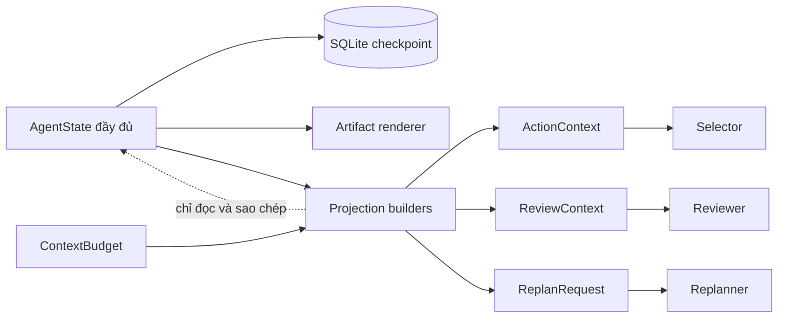
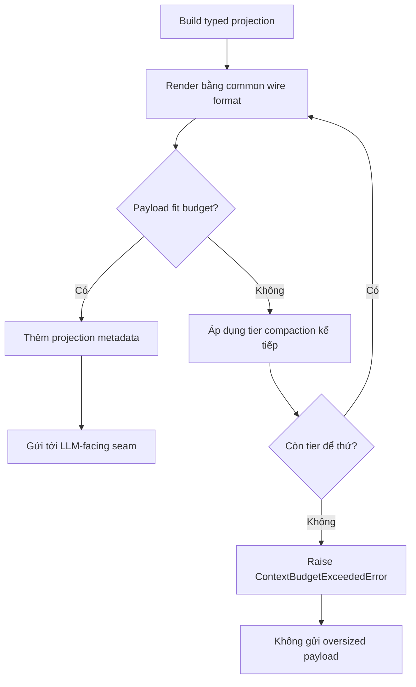

# Báo cáo ngày 11 — Mini DeerFlow

## Thông tin

| Thuộc tính | Giá trị |
| --- | --- |
| Dự án | Mini DeerFlow |
| Ngày | 11 |
| Chủ đề | Bounded context management cho selector, reviewer và replanner |
| Nền tảng kế thừa | Evidence/citation Day 09 và reviewer/replanner Day 10 |
| Đối tượng đọc | Software engineer đang học kiến trúc Agent AI |
| Trạng thái | Hoàn thành vertical slice xác định; chưa phải production-ready |

Báo cáo này tập trung vào bài học kiến trúc và cách tư duy bằng các phép so
sánh quen thuộc trong backend. Contract, thứ tự compaction và các seam cụ thể
được mô tả chi tiết hơn trong
[tài liệu kỹ thuật Day 11](bounded-context-management-day-11.md).

## Mục tiêu ngày 11

Sau Day 10, Mini DeerFlow đã biết review evidence, replan phần việc còn lại và
dừng theo budget. Tuy nhiên, một run vẫn có thể tích lũy rất nhiều nội dung:
trang web dài, observation dài, lỗi dài, summary, finding, review rationale và
tool schema. Số tool call hữu hạn không đồng nghĩa payload gửi tới model luôn
nhỏ.

Mục tiêu Day 11 là tạo một boundary riêng cho context:

1. giữ nguyên state đầy đủ để audit, checkpoint, resume và render report;
2. chỉ thu gọn read model gửi tới ba seam dùng LLM;
3. đo đúng chuỗi JSON thực sự được các seam sử dụng;
4. compact theo thứ tự xác định, có marker trung thực;
5. từ chối an toàn nếu phần bắt buộc vẫn không thể fit; và
6. chứng minh behavior bằng test và smoke không gọi model/provider thật.

## Day 11 đã xây dựng được gì?

Day 11 bổ sung một lớp quản lý context ở runtime, gồm:

- `ContextBudget` với bốn giới hạn ký tự đã validate;
- các projection builder cho evidence, observation, summary, finding,
  limitation, review và phần plan bị thay;
- `ProjectionMetadata` ghi số item bị omit, truncate và lượng token ước tính;
- `render_llm_payload` làm wire-format renderer chung;
- `fit_context_to_budget` áp dụng compaction theo tier và kiểm tra hard bound;
- `ContextBudgetExceededError` cho trường hợp không thể fit;
- truyền `context_budget` qua runtime composition tới workflow; và
- regression test cùng deterministic context-pressure smoke cho selector,
  reviewer, replanner, SQLite resume, citation và artifact.

Điểm quan trọng không phải là “cắt text”. Điểm quan trọng là đặt việc cắt text
đúng chỗ: projection tạm thời ở consumer boundary, không phải dữ liệu gốc.

## Vì sao context là một runtime resource?

Trong backend, connection pool, memory, request body và thời gian CPU là bốn
resource khác nhau. Giới hạn số query không tự động giới hạn kích thước từng
response. Tương tự, tool-call budget không kiểm soát được một web page dài bao
nhiêu, còn recursion limit không biết một review rationale chiếm bao nhiêu ký
tự.

Context là resource của từng quyết định model:

- selector cần đủ dữ liệu để chọn action kế tiếp;
- reviewer cần đủ evidence để đánh giá coverage; và
- replanner cần đủ gap, budget và phần plan còn lại để tạo replacement work.

Mỗi consumer cần một payload khác nhau. Vì vậy context management thuộc về
runtime composition và context builder, giống middleware kiểm soát request
size trước khi request đi vào service. Đẩy trách nhiệm này xuống web tool sẽ
quá sớm; đẩy lên checkpoint sẽ phá dữ liệu bền vững; chỉ nhắc model “hãy đọc ít
thôi” thì không tạo được hard bound.

## Raw state và context projection khác nhau thế nào?

Phép so sánh backend hữu ích nhất là **database source-of-record và read
model**.

- `AgentState` giống bảng dữ liệu chuẩn: lưu evidence đầy đủ, citation đã chấp
  nhận, observation, finding, note, error, review history, replan history,
  counter và plan.
- `ActionContext`, `ReviewContext` và `ReplanRequest` giống read model theo use
  case: chỉ mang dữ liệu consumer cần, có thể rút gọn để phục vụ một lần đọc.

Một read model không được quay lại ghi đè source-of-record bằng phiên bản đã
truncate. Đây cũng là tinh thần của append-only audit history: review cũ và
replan cũ vẫn tồn tại để giải thích “vì sao workflow đi đến trạng thái này”, dù
không phải mọi chi tiết cũ đều cần xuất hiện trong prompt tiếp theo.



Khi projection bỏ một evidence cũ, evidence đó chỉ biến mất khỏi read model
của lần gọi hiện tại. Nó vẫn còn trong state, checkpoint và report cuối.

## ContextBudget: budget thứ tư của agent

Trước Day 11, agent đã có budget cho tool call, replan cycle và graph recursion.
`ContextBudget` là budget thứ tư vì nó đo một rủi ro khác: kích thước dữ liệu đi
vào LLM-facing seam.

| Budget | Câu hỏi nó trả lời |
| --- | --- |
| Tool-call budget | Agent còn được thực hiện bao nhiêu action có tool? |
| Replan-cycle budget | Agent còn được thay phần plan chưa chạy bao nhiêu lần? |
| Recursion limit | Graph còn được đi qua bao nhiêu super-step? |
| Context budget | JSON context của quyết định hiện tại có được phép gửi không? |

Bốn giá trị mặc định của `ContextBudget`:

| Trường | Mặc định | Ý nghĩa |
| --- | ---: | --- |
| `max_total_chars` | `60000` | Trần cứng cho context JSON đã render |
| `max_item_chars` | `4000` | Trần cho text của một item thông thường |
| `retained_recent_items` | `30` | Số evidence/observation gần nhất giữ ở projection ban đầu |
| `max_excerpt_chars` | `1500` | Trần riêng cho evidence excerpt |

Budget này hiện chỉ inject được bằng code qua composition boundary. CLI chưa
có flag để đổi bốn giá trị trên. Việc tách riêng giúp operator không hiểu nhầm
rằng tăng recursion limit cũng làm context window lớn hơn.

## Đếm ký tự, ước lượng token và giới hạn thực tế

Hard bound Day 11 dùng **ký tự**, không dùng token. Runtime lấy
`len(render_llm_payload(context))` và so với `max_total_chars`. Cách đo này ổn
định, deterministic và không phụ thuộc model đang online hay tokenizer nào
được cài.

`estimated_tokens` chỉ là:

```text
ceil(số ký tự / 4)
```

Đây là ước lượng bảo thủ để quan sát, không phải exact GLM tokenizer
accounting. Một từ tiếng Việt, JSON punctuation hay chuỗi URL có thể được
tokenizer thật chia khác hoàn toàn. Vì thế số ước lượng không được dùng như
bằng chứng rằng provider chắc chắn còn đủ context window.

Cũng cần phân biệt phạm vi: hard bound áp dụng cho context JSON do renderer
chung tạo ra. Static system prompt, role wrapper và protocol overhead của
provider nằm ngoài phép đo này. Day 11 đạt một contract cục bộ đo được; chưa
giải quyết toàn bộ bài toán token của request thật.

## Selector, reviewer và replanner nhận context ra sao?

Ba consumer không nhận một “mega context” giống nhau:

| Consumer | Dữ liệu chính | Identity phải còn |
| --- | --- | --- |
| Selector | Step hiện tại, tool definitions, observation của step, evidence, summary, tool budget còn lại | Step number, tool name, call coordinates và budget |
| Reviewer | Remaining steps, summary, finding, evidence, limitation, tool/replan budget | Plan position, finding step, evidence provenance và budget |
| Replanner | Triggering review, completed summary, replaced steps, tools, replacement bounds | Verdict, related step, tool name, step number/title và bounds |

Selector giống command handler cần current aggregate và capability list.
Reviewer giống quality gate đọc read model rộng hơn để quyết định pipeline.
Replanner giống migration planner: nó chỉ được mô tả phần chưa áp dụng và
constraints, không được viết lại history đã commit.

Mỗi context được build ngay trước seam tương ứng. Nếu vừa có evidence mới,
selector/reviewer lần sau nhìn thấy projection mới; nếu resume từ checkpoint,
runtime dựng lại projection từ raw state thay vì tái sử dụng một bản text cũ.

## Chính sách ưu tiên và compaction xác định

Compaction không chọn ngẫu nhiên và không gọi LLM để summarize. Chính sách ưu
tiên là **current/recent first**:

1. giới hạn từng excerpt và từng item, đồng thời chỉ lấy evidence/observation
   gần nhất theo retention;
2. nếu tổng vẫn lớn, bỏ evidence cũ trước;
3. bỏ observation cũ nhưng cố giữ observation mới nhất;
4. thay summary và finding cũ bằng marker có identity tối thiểu;
5. bỏ limitation cũ, giữ lỗi mới nhất ở dạng ngắn khi có thể;
6. bỏ phần input schema dài của tool nhưng giữ name/description; và
7. thay objective/success criteria của replaced step bằng marker, vẫn giữ step
   number/title.

Ví dụ marker nói rõ nội dung đã bị `truncated` hoặc `omitted` và ghi độ dài ban
đầu. `ProjectionMetadata` cộng thêm số item đã truncate/omit. Consumer không bị
đánh lừa rằng nó đã đọc đầy đủ dữ liệu.

Tính deterministic có lợi giống canonical serialization trong backend: cùng
state, cùng registry và cùng budget thì projection tạo lại giống nhau. Test có
thể so exact payload, còn resume không phụ thuộc một lần model summarize ngẫu
nhiên trước đó.

## Provenance, citation và prompt-injection boundary

Compaction chỉ được phép làm phép biến đổi “trừ”: copy, rút ngắn, thay bằng
marker hoặc omit. Nó không có operation để tạo `EvidenceRecord`, thêm URL mới
hay biến summary thành evidence.

Với evidence còn trong projection, canonical URL và provenance của tool call
vẫn được giữ. URL xuất hiện trong projection phải là tập con của URL evidence
thành công trong raw state. Citation validation sau đó vẫn kiểm tra membership
trên evidence thật; local path hay URL chỉ xuất hiện trong text không thể tự
trở thành citation.

Prompt injection cũng giữ nguyên trust boundary. Nội dung web, observation,
summary, finding và review rationale vẫn là untrusted data sau khi bị cắt.
Truncate một instruction độc hại không biến nó thành system instruction.

Non-claim bắt buộc: provenance/citation membership **không xác minh source là
sự thật**. Nó chứng minh workflow đã quan sát URL qua evidence thành công và
có lineage, không chứng minh nguồn đúng, mới, đáng tin hay thật sự entail claim.

## Khi context không thể fit: fail an toàn

Hãy xem `fit_context_to_budget` như admission control trước một API có payload
limit. Gateway không nên gửi request biết chắc vượt trần rồi chờ downstream
trả lỗi; nó từ chối ngay tại boundary với lỗi phân loại rõ.

Sau tất cả tier compaction, nếu mandatory fields vẫn lớn hơn
`max_total_chars`, Mini DeerFlow raise `ContextBudgetExceededError`. Selector,
reviewer hoặc replanner ở seam đó không được gọi bằng payload quá lớn.

Đây không phải model error, provider error hay tool error. Model chưa nhận
request, provider chưa có cơ hội phản hồi, và retry output format không thể
làm goal/current step nhỏ đi. Gọi đúng tên lỗi giúp vận hành biết đây là vấn đề
admission/configuration thay vì đổ nhầm cho downstream.



## State, checkpoint và resume

Raw state hoạt động như append-only audit history kết hợp current aggregate.
Evidence, notes, findings, errors, review verdicts và replan records không bị
projection ghi đè. SQLite checkpointer vì vậy lưu bản đầy đủ, không phải bản
prompt đã cắt.

Khi resume, LangGraph đọc state đã checkpoint rồi context builder dựng lại
read model phù hợp với node hiện tại. Nếu inputs và budget không đổi, thuật
toán deterministic tái tạo cùng bounded projection. Artifact renderer vẫn đọc
raw evidence nên report có thể chứa phần cuối của excerpt mà selector trước đó
không được gửi vì giới hạn.

Guarantee này hẹp nhưng quan trọng: context compaction không làm mất dữ liệu
audit/resume. Nó không tự giải quyết exactly-once side effect hay mọi vấn đề
persistence khác.

## Controlled deterministic context-pressure smoke

Smoke Day 11 không gọi model thật, Jina hay external provider. Fakes chỉ được
inject tại planner, action selector, reviewer, replanner và web-provider seam.
Phần còn lại đi theo integration path thật: runtime composition, LangGraph
workflow, SQLite checkpointer, `WebSearchTool`, evidence extraction, citation
validation, routing và deterministic artifact rendering.

**Scenario A — fitting pressure:** dùng budget `15.000` ký tự. Dữ liệu dài ở
evidence, observation, failed observation, summary/finding, review rationale,
replacement plan và tool schema buộc nhiều tier compaction hoạt động. Route đã
chạy là:

```text
web search ở step 1
  -> replan
  -> continue với replacement work
  -> finish
```

Workflow hoàn thành, các payload selector/reviewer/replanner nằm trong hard
bound, còn raw state/checkpoint vẫn giữ dữ liệu dài để resume và render.

**Scenario B — irreducible pressure:** dùng budget hợp lệ nhưng không thể fit
`1.026` ký tự. Runtime raise `ContextBudgetExceededError` trước model seam;
không có oversized captured payload và không có model/provider call sau điểm
fail.

Kết quả tổng: deterministic hard-bound/context-pressure smoke pass. Đây là
bằng chứng integration xác định, không phải bằng chứng cho behavior của model
thật dưới context pressure.

## Sự cố quan trọng trong ngày 11

Day 11 phát hiện một bug under-measurement thật: logic có thể đánh giá một
representation nhỏ hơn trong khi seam gửi một wire representation khác hoặc
có thêm metadata. Như kiểm tra request size trên DTO nhưng network client lại
serialize JSON theo cách khác, kết quả “đã pass limit” không còn đáng tin.

| Triệu chứng | Root cause | Correction | Bài học |
| --- | --- | --- | --- |
| Projection được xem là đã fit nhưng exact payload tại seam có thể lớn hơn hard bound | Measurement và wire serialization chưa dùng chung một canonical renderer; metadata cuối cũng chiếm chỗ | Dùng `render_llm_payload` chung cho measurement, selector, reviewer và replanner; chừa metadata slack; kiểm tra hard bound sau compaction | Hard limit phải được chứng minh tại consumer boundary trên đúng representation được gửi |

Regression test chuyển từ kiểm tra kích thước gần đúng sang kiểm tra chuỗi do
renderer thật tạo. Fix này không làm compaction “thông minh hơn”; nó làm
contract đo lường trung thực hơn.

## Kiến thức đã học

1. **Durable state và model context không phải một thứ.** Một cái tối ưu cho
   audit/resume; cái kia tối ưu cho quyết định hiện tại.
2. **Resource budget phải gắn với resource nó đo.** Tool call, graph step,
   replan và context size không thay thế nhau.
3. **Representation là một phần của contract.** Object fit không có nghĩa JSON
   wire payload fit.
4. **Compaction cần semantics.** Recent observation, current step và remaining
   budget quan trọng hơn một evidence cũ chỉ vì chúng gần quyết định kế tiếp.
5. **Omission phải quan sát được.** Marker và metadata tốt hơn im lặng xóa.
6. **Provenance phải sống ngoài prose.** Truncate text không được phép tạo hoặc
   sửa identity của evidence.
7. **Fail trước downstream là behavior an toàn.** Admission control rõ nguyên
   nhân tốt hơn gửi request sai rồi đoán lỗi provider.
8. **Determinism giúp resume và test.** Không cần snapshot một summary do model
   tạo ngẫu nhiên để tái dựng context.

## Các quyết định kiến trúc đã chốt

1. Raw `AgentState` là source-of-record; projection không ghi ngược vào state.
2. Context budget là budget độc lập thứ tư, không gộp vào `RuntimeLimits` của
   tool/replan/recursion.
3. Character count là hard contract hiện tại; token estimate chỉ để báo cáo.
4. Một common wire-format renderer được dùng ở cả measurement và ba seam.
5. Current/recent material được ưu tiên; older/lower-priority material bị
   compact theo tier cố định.
6. Truncation/omission luôn có marker hoặc metadata, không giả vờ dữ liệu còn
   nguyên.
7. URL và provenance không được chế tạo trong projection; citation membership
   vẫn kiểm tra từ successful evidence.
8. Irreducible projection fail trước model seam bằng lỗi domain riêng.
9. Cấu hình budget mới chỉ đi qua programmatic composition boundary; chưa thêm
   CLI flag.
10. Không dùng LLM-generated summary cho old context trong Day 11.

## Những điều chưa làm và technical debt

- Chưa tích hợp tokenizer của GLM hay tokenizer theo model động.
- Chưa đo hard bound của toàn bộ provider request gồm static prompt và protocol
  overhead.
- Chưa có LLM summarization cho history cũ; hiện tại chỉ truncate, marker và
  omit xác định.
- Chưa expose bốn context limit qua CLI.
- Chưa chạy real-model context-pressure smoke.
- Chưa chứng minh calibration của model khi context bị omit mạnh.
- Provenance membership chưa kiểm tra source truth, freshness hoặc claim-level
  entailment.
- Chưa có production telemetry, multi-tenant isolation hay policy tự chọn
  budget theo context window của model.
- Chưa có live sub-agent, delegation hay fan-out/fan-in.

Các gap này được ghi rõ để không biến deterministic smoke thành claim
production readiness.

## Kiểm thử và chất lượng

Suite hiện tại: **459 passed, 2 skipped**.

Coverage Day 11 gồm:

- validate default, kiểu và quan hệ giữa bốn limit;
- truncate deterministic và marker đúng;
- recent-item retention cho evidence/observation;
- giữ provenance, citation và failure identity;
- raw input/state không bị mutate;
- áp lực qua toàn bộ compaction tier;
- exact wire payload không vượt `max_total_chars`;
- irreducible projection raise đúng domain error;
- workflow selector/reviewer/replanner nhận bounded context;
- programmatic injection đi xuyên runtime composition; và
- deterministic smoke với real SQLite, evidence/citation path và resume.

Ruff check, Ruff format check, full pytest, lock check và whitespace check đều
là quality gate bắt buộc khi chốt báo cáo này. Không test nào trong suite cần
gọi model hay web provider thật.

## Đánh giá mục tiêu ngày 11

Day 11 đạt vertical slice đã định nghĩa ở tầng deterministic:

- có hard character bound trên exact rendered projection;
- có priority-based compaction và metadata trung thực;
- raw state/checkpoint/artifact không mất dữ liệu;
- citation/provenance boundary không bị nới;
- Scenario A chứng minh workflow dài vẫn hoàn thành qua replan/continue/finish;
- Scenario B chứng minh fail an toàn khi mandatory context không thể fit.

Tuy nhiên, mục tiêu “không vượt context window của model thật” mới chỉ được
tiếp cận bằng character budget bảo thủ. Vì chưa có tokenizer integration và
chưa chạy real-model context-pressure smoke, không thể kết luận model-specific
window đã được bao phủ hoàn toàn. Kết luận đúng là: hard-bound runtime
projection đã hoàn thành và được kiểm chứng xác định; production behavior chưa
được chứng minh.

## Roadmap alignment

Roadmap đặt Day 11 ở context management, token-aware truncation và long-run
limits. Implementation hiện tại hoàn thành phần bounded context và long-run
pressure theo **ký tự**, đồng thời cung cấp token estimate. Phần exact
token-aware vẫn là debt, vì không có tokenizer integration.

Day 11 không thay planner/selector schema và không thêm sub-agent. Day 12 vẫn
là **bounded sub-agent/delegation**: task boundary, fan-out/fan-in, concurrency
cap, timeout và partial failure. Day 12 không phải một vòng nữa chỉ để làm
context compaction.

## Câu hỏi tự kiểm tra

<details>
<summary>Vì sao không truncate trực tiếp evidence trong AgentState?</summary>

Vì `AgentState` là source-of-record cho audit, checkpoint, resume và artifact.
Nếu ghi bản đã truncate trở lại state, hệ thống mất dữ liệu bền vững chỉ để tối
ưu một lần gọi model. Projection tách mục đích đọc khỏi dữ liệu gốc.
</details>

<details>
<summary>ContextBudget khác tool-call budget ở điểm nào?</summary>

Tool-call budget giới hạn số action có thể đi tới tool; context budget giới hạn
kích thước JSON của một quyết định model. Một tool call duy nhất vẫn có thể tạo
response rất dài, nên hai budget không suy ra nhau.
</details>

<details>
<summary>Tại sao chars/4 không thể được gọi là exact token count?</summary>

Tokenizer chia text theo vocabulary và encoding của model; tiếng Việt, JSON,
URL và punctuation có tỷ lệ token/ký tự khác nhau. `ceil(chars/4)` chỉ là
heuristic để quan sát, không phải kết quả từ tokenizer GLM.
</details>

<details>
<summary>Common wire-format renderer đã sửa loại bug nào?</summary>

Nó loại bỏ under-measurement do đo một representation nhưng gửi một
representation khác. Budget và ba seam cùng dùng chuỗi JSON từ
`render_llm_payload`, nên assertion kiểm tra đúng payload context thực tế.
</details>

<details>
<summary>Marker omission có giá trị gì ngoài việc tiết kiệm ký tự?</summary>

Marker cho model và người debug biết dữ liệu đã bị giảm, giữ identity tối thiểu
như step/tool/finding liên quan, và ngăn việc hiểu nhầm rằng projection là toàn
bộ history. Metadata còn cho biết tổng số item bị omit/truncate.
</details>

<details>
<summary>Vì sao ContextBudgetExceededError không phải provider failure?</summary>

Vì admission control raise lỗi trước khi oversized payload được gửi. Provider
chưa nhận request, model chưa chạy và retry output không thể sửa kích thước
mandatory fields. Đây là lỗi fit context ở runtime boundary.
</details>

<details>
<summary>Citation có provenance có đồng nghĩa nguồn đúng không?</summary>

Không. Membership chỉ chứng minh URL thuộc successful evidence và có lineage
về tool call. Nó không kiểm tra source truth, độ mới, độ tin cậy hay entailment
giữa excerpt và claim.
</details>

## Sơ bộ ngày 12

Day 12 chuyển sang bounded sub-agent và delegation. Bài toán mới không chỉ là
“gọi nhiều agent”, mà là thiết kế task boundary, giới hạn concurrency, timeout,
partial failure và merge kết quả có provenance.

Bài học Day 11 là điều kiện đầu vào cho thiết kế đó:

- mỗi branch cần raw state/audit riêng và projection riêng;
- lead agent chỉ nên nhận bounded read model của branch results;
- summary từ sub-agent không tự trở thành evidence hay citation;
- concurrency budget không thay thế context/tool budget; và
- branch fail phải được biểu diễn như limitation, không làm biến mất kết quả
  thành công của branch khác.

Day 12 cần chứng minh fan-out/fan-in bằng fake agents trước. Live sub-agent
support chưa tồn tại ở cuối Day 11 và không được giả định từ context machinery
vừa hoàn thành.

Tài liệu liên quan:

- [Tài liệu kỹ thuật Day 11](bounded-context-management-day-11.md)
- [Tài liệu kỹ thuật Day 10](bounded-reviewer-replanner-day-10.md)
- [Báo cáo ngày 10](report-ngay-10-mini-deerflow.md)
- [Tài liệu kỹ thuật Day 09](web-evidence-citation-runtime-day-09.md)
- [Tài liệu kỹ thuật Day 08](persistent-thread-runtime-day-08.md)
- [Roadmap 14 ngày](roadmap-deep-agent-deerflow-14-ngay.md)
