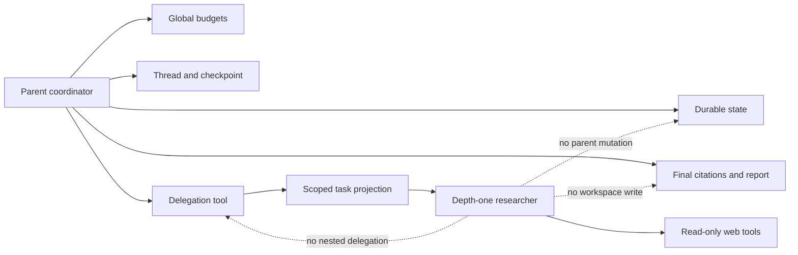

# Báo cáo ngày 12 - Mini DeerFlow

## Thông tin

| Thuộc tính | Giá trị |
| --- | --- |
| Dự án | Mini DeerFlow |
| Ngày | 12 |
| Chủ đề | Bounded researcher delegation |
| Nền tảng kế thừa | Citation và artifact Day 09, review/replan Day 10, bounded context Day 11 |
| Đối tượng đọc | Software engineer đang học kiến trúc Agent AI |
| Trạng thái | Hoàn thành MVP xác định; chưa phải production-ready |

Báo cáo này dùng các phép so sánh quen thuộc trong backend để giải thích cách
Mini DeerFlow giao một phần việc nghiên cứu cho các researcher branch. Trọng tâm
không phải là lý thuyết multi-agent nói chung, mà là những boundary đã thật sự
được triển khai và kiểm thử trong Day 12. Chi tiết contract ở mức source nằm
trong [tài liệu kỹ thuật Day 12](bounded-researcher-delegation-day-12.md).

## Mục tiêu ngày 12

Day 11 đã giới hạn context tại các seam dùng model, nhưng toàn bộ công việc vẫn
đi qua một action loop của parent. Day 12 đặt ra câu hỏi tiếp theo: làm thế nào
để chạy vài hướng nghiên cứu độc lập mà không nhân quyền hạn, ngân sách và state
của parent lên theo số branch?

Mục tiêu được chốt thành một vertical slice nhỏ:

1. parent có thể tạo đúng một wave gồm từ 2 đến 3 task có `branch_id` duy nhất;
2. các task chạy song song trong concurrency cap hữu hạn;
3. mỗi branch chỉ được nghiên cứu web trong context và tool budget riêng;
4. fan-in hợp nhất kết quả theo cách xác định, giữ provenance và citation;
5. lỗi cục bộ trở thành limitation thay vì phá hủy mọi kết quả tốt; và
6. SQLite resume dùng lại delegation đã hoàn tất và được checkpoint.

Depth của delegation cố định ở `1`. Researcher không được tạo wave con. Đây là
bounded delegation, không phải một scheduler đệ quy.

## Day 12 đã xây dựng được gì?

Nếu ví parent là một backend coordinator, Day 12 bổ sung một worker pool rất
nhỏ và có hợp đồng chặt:

- `ScopedResearchTask` mô tả một job hẹp;
- `DelegationInput` gom đúng 2-3 job thành một wave;
- `BoundedResearcherSubagent` chạy vòng chọn action và gọi web tool trong giới
  hạn của branch;
- `DelegateResearchTool` làm admission control, giữ semaphore, áp timeout và
  tạo `DelegationRecord`;
- fan-in sắp thứ tự, hợp nhất evidence và biến lỗi branch thành limitation;
- workflow parent tích hợp record vào `AgentState`, sau đó review và render như
  trước; và
- runtime cùng CLI truyền cấu hình concurrency từ entry point tới orchestration.

Điểm mới là khả năng thực thi phân nhánh. Các trust boundary cũ không bị thay
thế: evidence vẫn đến từ kết quả tool có cấu trúc, citation vẫn phải được kiểm
tra, reviewer vẫn quyết định `continue`, `replan` hoặc `finish`, và artifact vẫn
do parent tạo.

## Sub-agent khác gì với gọi thêm model?

Một lần gọi thêm model chỉ tạo thêm một response. Một sub-agent có boundary rõ
ràng còn cần nhiều thành phần hơn:

| Khía cạnh | Gọi thêm model | Researcher branch Day 12 |
| --- | --- | --- |
| Input | Prompt hoặc message | Task contract và context projection đã validate |
| Quyền | Thường phụ thuộc prompt | Registry chỉ có web capability đọc |
| Thực thi | Một inference | Vòng action-tool-observation hữu hạn |
| Ngân sách | Dễ bị tính riêng lẻ | Được reserve trước vào ngân sách parent |
| Output | Prose | `BranchResult` có status, observation, finding và accounting |
| Hợp nhất | Nối hoặc summarize text | Fan-in xác định, deduplicate và validate citation |
| Khôi phục | Tùy caller tự xử lý | Record hoàn tất được lưu trong state và checkpoint |

Phép so sánh backend phù hợp là: gọi model giống gọi một service; sub-agent
giống chạy một job handler trong worker pool có DTO, ACL, timeout, quota và
result envelope. Model có thể là một seam bên trong handler, nhưng bản thân
model call chưa tạo nên orchestration an toàn.

## Parent và researcher: ai sở hữu quyền gì?

Parent là authority duy nhất của run. Branch là worker tạm thời nhận một phần
việc, không phải một agent ngang quyền.

| Trách nhiệm hoặc quyền | Parent | Researcher branch |
| --- | --- | --- |
| Goal, plan và durable state | Sở hữu | Không nhận toàn bộ state |
| Per-step và total tool budget | Sở hữu, admission toàn wave | Chỉ thấy budget cục bộ đã cấp |
| Thread và SQLite checkpoint | Sở hữu | Không truy cập |
| Web search/fetch | Có thể sử dụng | Chỉ capability đọc được phép |
| Workspace write và artifact | Parent quyết định và thực thi | Không có quyền |
| Final citation validation | Sở hữu | Chỉ đề xuất citation từ evidence của branch |
| Review và replan | Sở hữu | Không có reviewer/replanner riêng |
| Delegation | Có `delegate_research` | Không được delegate tiếp |
| Final report | Tổng hợp và render | Chỉ trả structured result |



Dashed edge biểu diễn capability bị từ chối. Boundary được tạo bằng composition
và validation, không chỉ bằng lời nhắc trong prompt.

## Task delegation là một contract

Trong hệ thống queue, producer không nên đẩy một chuỗi tùy ý rồi hy vọng worker
hiểu đúng. Nó gửi một message theo schema. Day 12 áp dụng cùng nguyên tắc cho
delegation.

Một task có identity, objective, success criteria, tool-call budget và depth.
Wave có identity riêng và danh sách task. Kết quả branch có identity khớp task,
status hữu hạn, observation có cấu trúc, số call đã dùng, finding hoặc lỗi bị
giới hạn. Các model đều validate chặt và không nhận field ngoài contract.

Nhờ vậy, orchestration có thể trả lời bằng code thay vì suy đoán từ prose:

- task có trùng ID hay không;
- wave có đúng 2-3 branch hay không;
- branch có cố delegate sâu hơn hay không;
- số call đã dùng có vượt số đã reserve hay không; và
- kết quả có hợp lệ với status đã khai báo hay không.

Contract này là control plane. Nội dung trang web và summary là data plane
không đáng tin; chúng không được quyền thay đổi contract.

## Fan-out và concurrency cap

Fan-out bắt đầu bằng validation. Một wave chỉ hợp lệ khi có đúng 2 hoặc 3 task,
mọi `branch_id` đều duy nhất và mọi task đều có depth bằng `1`. Sau đó task được
sắp theo `branch_id` trước khi dispatch.

`asyncio.Semaphore` giới hạn số researcher được chạy đồng thời. Concurrency cap
có miền hợp lệ từ `1` đến `3`, mặc định là `2`. CLI expose cùng cấu hình qua
`--max-delegation-concurrency`. Giá trị tối đa bằng chính kích thước wave tối
đa, nên đây không phải một worker pool mở rộng vô hạn.

Trong backend, thao tác này giống consumer nhận một batch ba job nhưng connection
pool chỉ có hai slot. Tạo ba coroutine không có nghĩa cả ba được vào critical
section cùng lúc. Cap bảo vệ tài nguyên; việc sort bảo vệ tính xác định. Hai
trách nhiệm đó không thay thế nhau.

## Fan-in: hợp nhất kết quả như thế nào?

Kết quả hoàn thành theo timing không được quyết định thứ tự state. Fan-in luôn
sắp `BranchResult` theo `branch_id`, rồi mới hợp nhất. Vì thế một branch phản
hồi nhanh hơn không làm đổi thứ tự finding, limitation hoặc evidence trong
record.

Quy trình hợp nhất có ba lớp:

1. chỉ đọc observation có cấu trúc của các branch;
2. canonicalize URL và deduplicate evidence trùng nhau; và
3. chỉ chấp nhận citation thuộc tập evidence thành công đã hợp nhất.

Nếu `alpha` và `beta` cùng tìm thấy một canonical URL, parent không tạo hai
nguồn logic khác nhau. Nếu summary có một URL tự chèn nhưng URL đó không đến từ
successful evidence, URL không trở thành citation. Parent còn thực hiện lại
việc trích xuất và validation khi đưa delegation record vào state; fan-in
không phải đường tắt để branch tự ghi trust decision.

## Partial failure và timeout không làm hỏng cả nghiên cứu

Delegation wave không dùng semantics “một lỗi thì rollback toàn bộ”. Cách phù
hợp hơn giống batch processing có per-item status: kết quả tốt vẫn hữu ích,
nhưng lỗi phải xuất hiện công khai trong output.

| Tình huống | Cách biểu diễn | Điều parent giữ lại |
| --- | --- | --- |
| Branch thành công | `success` | Observation, evidence, finding và citation hợp lệ |
| Lỗi dự kiến hoặc đã normalize | `controlled_failure` | Observation đã có và limitation bị giới hạn |
| Vượt branch timeout | `cancelled` | Limitation/error và accounting bảo thủ |
| Citation không có evidence | Citation bị từ chối | Evidence hợp lệ khác vẫn còn |
| URL trùng giữa branch | Canonical deduplication | Một evidence identity hợp lệ |

Timeout được áp tại orchestration boundary cho từng researcher. Nó không được
đổi thành evidence, cũng không xóa evidence của sibling đã thành công. Báo cáo
cuối có thể là partial answer trung thực: có kết quả dùng được và có limitation
giải thích phần chưa hoàn tất.

## Budget reservation: chống vượt ngân sách tổng

Concurrency tạo ra một lỗi accounting quen thuộc: ba worker cùng nhìn thấy
“còn 5 call” có thể cùng tiêu 5 call nếu chỉ kiểm tra sau khi chạy. Day 12 dùng
reservation trước dispatch, tương tự reserve inventory hoặc credit limit trước
khi xử lý nhiều lệnh song song.

Tổng `tool_call_budget` của mọi task là `reserved_tool_calls`. Wave chỉ được
admit khi tổng này nằm trong phần còn lại của cả per-step và total parent
budget, sau khi chừa một call cho chính action `delegate_research`.

Ba số không được đánh đồng:

| Số đo | Ý nghĩa |
| --- | --- |
| Reserved | Trần branch work đã được parent chấp thuận trước dispatch |
| Used | Số observation thực tế branch trả về |
| Charged | Phần parent phải tính vào budget sau kết quả |

Branch thành công hoặc controlled failure được charge theo usage đã ghi nhận.
Branch bị cancel được charge bảo thủ tới mức reservation của branch, vì parent
không thể chứng minh external effect đã dừng ở đâu. Reservation vì vậy ngăn
tổng công việc song song lách qua global limit; actual usage vẫn cho biết mức
tài nguyên đã quan sát được.

## Context bounded của từng branch

Branch không nhận bản sao `AgentState`. Nó nhận `ResearchTaskContext`, một read
model hẹp gồm task hiện tại, định nghĩa web tool được phép, local remaining
budget và metadata của projection.

Bên trong action loop, selector của researcher tiếp tục nhận `ActionContext`
được dựng từ objective, synthetic step, observation/evidence cục bộ và budget
còn lại. Cả hai lớp đều đi qua cơ chế projection và hard limit của Day 11.

Phép so sánh backend là CQRS: durable parent state là source-of-record, còn
branch context là read model theo use case. Việc truncate hoặc omit ở read
model không ghi ngược vào source-of-record. Nội dung dài hoặc độc hại vẫn là
untrusted data và không tự tạo evidence, citation hay quyền mới.

## Evidence, citation và artifact boundary

Day 12 mở rộng đường thực thi nhưng không mở rộng trust chain của Day 09:

```text
successful structured web result
-> evidence có provenance
-> canonical merge
-> citation membership validation
-> parent report và artifact
```

Summary do branch trả về chỉ là nội dung không đáng tin. Evidence phải được
trích từ kết quả web tool thành công có schema phù hợp. Citation phải thuộc tập
URL evidence đã chấp nhận. Membership này chứng minh lineage trong run, không
chứng minh nguồn đúng, mới hoặc support claim ở mức ngữ nghĩa.

Parent là thành phần duy nhất render final report và artifact. Branch không có
workspace tool, không nhận artifact path và không thể tạo file riêng. Sau khi
fan-in, Day 10 vẫn hoạt động: reviewer đánh giá state đã hợp nhất, có thể
`continue`, yêu cầu `replan` phần chưa chạy, hoặc `finish` trong các limit hiện
có. Delegation không bỏ qua review/replan.

## State, checkpoint và resume

`AgentState` giữ delegation history dưới dạng các `DelegationRecord` typed.
Record chứa task, kết quả đã sắp thứ tự, fan-in summary và số liệu accounting.
SQLite serializer biết các model này nên state bền vững không bị hạ thành prose
khó kiểm tra.

Mốc quan trọng là checkpoint sau khi delegation result đã được workflow tích
hợp. Nếu run bị gián đoạn sau mốc đó, runtime mới mở lại cùng thread sẽ thấy
record hoàn tất và tiếp tục từ durable state. Branch đã hoàn tất không bị
dispatch lại.

```mermaid
sequenceDiagram
    participant P as Parent
    participant D as Delegation tool
    participant R as Researchers
    participant S as SQLite checkpoint
    P->>D: Admit one bounded wave
    D->>R: Dispatch scoped tasks
    R-->>D: Ordered structured results
    D-->>P: Delegation record and fan-in
    P->>S: Persist integrated parent state
    Note over P,S: Interruption after checkpoint
    P->>S: Resume same thread in fresh runtime
    S-->>P: Restore completed delegation record
    Note over P,R: Reuse record; do not redispatch branches
    P->>P: Review and render final output
```

Resume ở đây giống khôi phục một state machine từ transaction log đã commit,
không giống chạy lại toàn bộ request từ đầu.

## Exactly-once và giới hạn thực tế

Checkpoint chỉ chứng minh những gì đã được ghi bền vững. Nếu external effect đã
xảy ra nhưng process dừng trước parent checkpoint, hệ thống không có một
transaction phân tán để atomically commit cả provider effect lẫn SQLite state.
Vì vậy Day 12 không tuyên bố exactly-once cho khoảng cửa sổ này.

Điều đã được bảo đảm hẹp hơn: completed delegation record đã checkpoint được
dùng lại khi resume. Điều chưa được bảo đảm: mọi external side effect trước
checkpoint chỉ xảy ra đúng một lần. Timeout cũng được charge bảo thủ vì cùng
lý do bất định này.

Đây là khác biệt giữa “resume deterministic từ state đã lưu” và “exactly-once
distributed effects”. Hai khái niệm thường bị gộp nhầm trong agent runtime.

## Controlled deterministic delegation smoke

Smoke Day 12 dùng fake tại các seam được phép và giữ orchestration, ToolRunner,
evidence/citation path, SQLite checkpoint, review routing và artifact rendering
trên đường tích hợp thực. Không có model hoặc web provider thật được gọi.

Kết quả đã xác minh:

| Quan sát | Kết quả |
| --- | --- |
| Branch IDs | Chính xác `alpha`, `beta`, `gamma`, không trùng |
| Concurrency | Cap `2`, peak quan sát được `2` |
| Thành công | Hai branch |
| Timeout | Một branch bị cancel qua delegation timeout path |
| Fan-in | Thứ tự theo branch ID và evidence thành công được deduplicate |
| Citation | Chỉ giữ URL thuộc successful merged evidence |
| Resume | SQLite dùng lại completed delegation work, không dispatch lại |
| Artifact | Chỉ parent sở hữu artifact |

Smoke chứng minh contract xác định trong môi trường kiểm soát. Nó không phải
benchmark model quality, provider latency, network cancellation hay production
throughput. Chưa có real-model/provider delegation smoke.

## Kiến thức đã học

1. **Parallelism không được nhân authority.** Thêm worker không có nghĩa thêm
   owner cho state, budget hoặc artifact.
2. **Sub-agent cần contract, không chỉ prompt.** Schema, ACL, timeout, quota và
   result envelope mới tạo thành boundary thực thi.
3. **Admission phải đi trước fan-out.** Kiểm tra budget sau completion là quá
   muộn khi nhiều branch chạy đồng thời.
4. **Determinism cần chủ động thiết kế.** Sort theo identity giúp timing không
   làm thay đổi state và output.
5. **Partial success phải vừa hữu ích vừa trung thực.** Giữ evidence tốt nhưng
   không che failure của sibling.
6. **Trust được xây lại ở owner boundary.** Parent không nhận citation do
   branch tự khai như một sự thật.
7. **Resume guarantee phụ thuộc checkpoint boundary.** Durable reuse không kéo
   theo exactly-once cho external effect.
8. **Các budget đo các rủi ro khác nhau.** Concurrency, tool calls, context và
   graph recursion không thay thế nhau.

## Các quyết định kiến trúc đã chốt

1. Chỉ hỗ trợ depth one; researcher không delegate.
2. Một wave luôn có 2-3 task với `branch_id` duy nhất.
3. Parent giữ goal, global budgets, state, thread/checkpoint, review, final
   citation, report và artifact.
4. Researcher registry chỉ chứa web capability đọc; không tái sử dụng toàn bộ
   parent registry.
5. Tổng branch budget phải được reserve trước dispatch.
6. Concurrency là bound `1..3`, mặc định `2`, cấu hình được từ CLI.
7. Task và result được sắp theo branch ID trước fan-in.
8. Evidence trùng được canonical-deduplicate; citation được validate lại tại
   parent boundary.
9. Failure/cancellation là dữ liệu có cấu trúc và limitation, không phải lý do
   tự động xóa sibling success.
10. Resume chỉ reuse work đã hoàn tất và checkpoint; không tuyên bố exactly-once
    ngoài boundary đó.

## Những điều chưa làm và technical debt

| Incident hoặc limitation | Ảnh hưởng hiện tại | Hướng xử lý sau Day 12 |
| --- | --- | --- |
| Chưa chạy real model/provider | Chưa biết quality, latency và throttling thực | Tạo evaluation riêng có policy và telemetry |
| External effect trước checkpoint | Có thể không đạt exactly-once | Cân nhắc idempotency và effect journal theo provider |
| Mọi branch cùng một researcher role | Chưa có specialist hoặc critic role | Chỉ mở rộng sau khi có capability profile rõ |
| Chỉ một wave depth one | Không xử lý scheduling phân cấp | Giữ bound; chưa thêm nested scheduler |
| Timeout cấu hình bằng composition | Operator chưa đổi timeout qua CLI | Đánh giá nhu cầu vận hành trước khi expose |
| Citation chỉ kiểm tra membership | Chưa chứng minh truth hoặc entailment | Bổ sung evaluation chất lượng claim-evidence |
| SQLite là checkpoint cục bộ | Chưa có distributed coordination | Đánh giá failure model trước khi đổi storage |

Không có claim production-ready, heterogeneous-role orchestration, nested hoặc
unbounded scheduling, live-model benchmark hay exactly-once external side
effects.

## Kiểm thử và chất lượng

Full suite đã xác minh: **473 passed, 2 skipped**.

Coverage Day 12 gồm contract validation, capability registry, bounded branch
context, fan-out ordering, semaphore cap, aggregate reservation, timeout,
partial failure, evidence deduplication, citation rejection, workflow
integration, typed persistence và SQLite resume. Deterministic smoke bổ sung
bằng chứng end-to-end cho wave ba branch với peak concurrency hai.

Các test và smoke dùng fake tại seam; chúng không gọi model hay provider thật.
Vì vậy kết luận đúng là implementation contract đã được kiểm tra xác định,
không phải chất lượng nghiên cứu thực tế đã được benchmark.

## Đánh giá mục tiêu ngày 12

Mục tiêu MVP đã đạt ở mức bounded vertical slice:

- có task contract và capability boundary;
- có fan-out nhỏ, concurrency cap và aggregate budget admission;
- có deterministic fan-in, provenance và partial-failure semantics;
- có parent-owned review, citation, report và artifact;
- có typed checkpoint state và completed-work reuse khi resume; và
- có test cùng deterministic smoke không phụ thuộc dịch vụ ngoài.

Mục tiêu chưa bao gồm production readiness. Không có dữ liệu để kết luận về
model quality, provider behavior, distributed fault tolerance hoặc exactly-once
effect. Việc nêu rõ non-claim là một phần của đánh giá, không phải ghi chú phụ.

## Roadmap alignment

Day 12 khớp với mốc bounded sub-agent/delegation trong
[roadmap 14 ngày](roadmap-deep-agent-deerflow-14-ngay.md): task boundary,
fan-out/fan-in, concurrency, timeout, partial failure và budget isolation đã có
vertical slice kiểm thử được.

Nó đồng thời giữ nguyên các mốc trước:

- Day 09: evidence provenance, citation membership và parent artifact;
- Day 10: reviewer/replanner routing cùng các execution limit; và
- Day 11: raw state tách khỏi bounded context projection.

Roadmap alignment không biến deterministic smoke thành production benchmark.
Các gap vận hành được chuyển rõ sang Day 13 thay vì nới scope delegation.

## Câu hỏi tự kiểm tra

<details>
<summary>Vì sao ba branch không được mỗi branch tự dùng toàn bộ remaining budget?</summary>

Vì các branch chạy đồng thời có thể cùng nhìn một số dư và tổng usage vượt giới
hạn parent. Parent phải reserve tổng budget của wave trước khi dispatch, giống
giữ hạn mức cho cả batch trước khi các worker xử lý.
</details>

<details>
<summary>Sort branch ID giải quyết vấn đề gì mà semaphore không giải quyết?</summary>

Semaphore chỉ giới hạn số task chạy đồng thời. Sort theo `branch_id` làm thứ tự
record và fan-in không phụ thuộc timing hoàn thành, nhờ đó state và output có
tính xác định.
</details>

<details>
<summary>Tại sao summary có URL vẫn chưa phải evidence?</summary>

Summary là prose không đáng tin. Evidence chỉ được trích từ successful
structured web observation; citation chỉ được chấp nhận nếu canonical URL nằm
trong tập evidence đó.
</details>

<details>
<summary>Branch timeout có làm mất evidence của sibling thành công không?</summary>

Không. Branch bị timeout trở thành `cancelled` và tạo bounded limitation. Fan-in
vẫn giữ observation, evidence và citation hợp lệ của các branch thành công.
</details>

<details>
<summary>Vì sao researcher không được nhận toàn bộ AgentState?</summary>

Toàn bộ state mang nhiều dữ liệu và authority hơn task cần. Projection hẹp giảm
context pressure, tránh shared mutation và không lộ thread, checkpoint,
artifact hoặc global counters cho worker.
</details>

<details>
<summary>Resume đã chứng minh exactly-once chưa?</summary>

Chưa. Resume chỉ dùng lại delegation record đã hoàn tất và checkpoint. External
effect xảy ra trước khi parent checkpoint vẫn có thể nằm ngoài transaction của
SQLite.
</details>

<details>
<summary>Điểm khác nhau cốt lõi giữa sub-agent và một model call là gì?</summary>

Sub-agent có task/result contract, capability registry, vòng tool hữu hạn,
budget, timeout, accounting và merge semantics. Model call chỉ là một hoạt
động có thể nằm bên trong boundary đó.
</details>

## Sơ bộ ngày 13

Day 13 không nên thêm role, branch depth hay scheduler mới. Handoff rõ ràng là
**safety, observability và evaluation** trên boundary Day 12 đã ổn định.

- Safety: kiểm tra policy tại capability boundary, prompt-injection handling,
  cancellation window và chiến lược idempotency cho external effect.
- Observability: đo queue time, branch duration, timeout, reservation
  utilization, evidence overlap, citation rejection và resume reuse.
- Evaluation: xây bộ scenario đo answer quality, coverage, limitation honesty
  và claim-evidence alignment; tách deterministic contract test khỏi live
  provider evaluation.

Chỉ sau khi có dữ liệu ở ba hướng này mới nên cân nhắc heterogeneous roles hoặc
scheduling rộng hơn. Thêm delegation feature ngay sẽ làm tăng state space trước
khi hệ thống đo được độ an toàn và chất lượng của boundary hiện tại.

Tài liệu liên quan:

- [Tài liệu kỹ thuật Day 12](bounded-researcher-delegation-day-12.md)
- [Báo cáo ngày 11](report-ngay-11-mini-deerflow.md)
- [Tài liệu bounded context Day 11](bounded-context-management-day-11.md)
- [Tài liệu reviewer/replanner Day 10](bounded-reviewer-replanner-day-10.md)
- [Tài liệu evidence/citation Day 09](web-evidence-citation-runtime-day-09.md)
- [Roadmap Mini DeerFlow 14 ngày](roadmap-deep-agent-deerflow-14-ngay.md)
