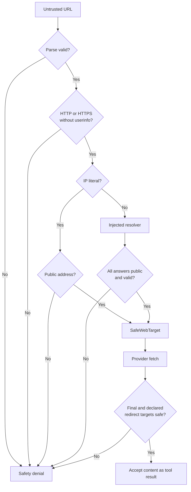
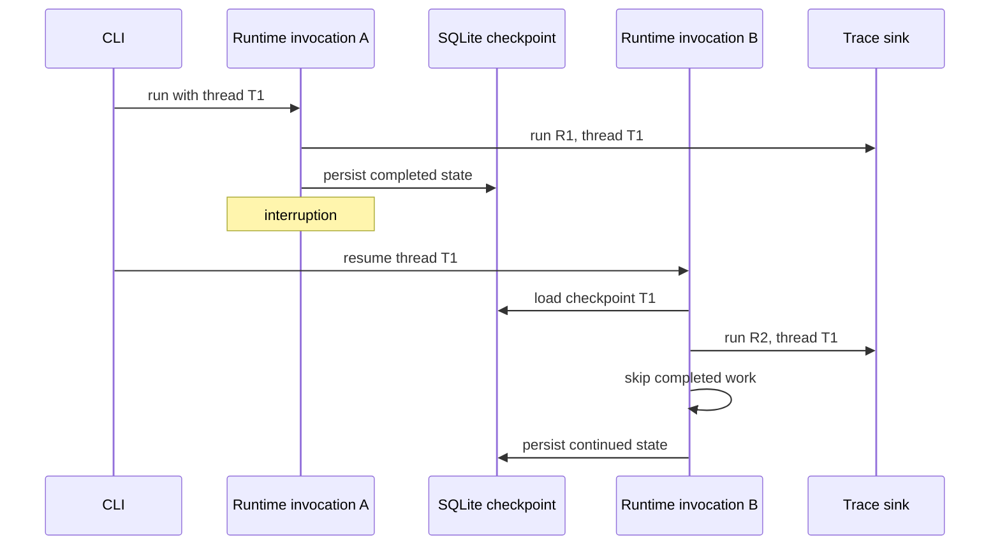

# Báo cáo ngày 13 — Mini DeerFlow

## Thông tin

| Thuộc tính | Giá trị |
| --- | --- |
| Dự án | Mini DeerFlow |
| Ngày | 13 |
| Chủ đề | Safety boundary, observability và deterministic evaluation |
| Nền tảng kế thừa | Evidence/citation Day 09, review/replan Day 10, context budget Day 11, delegation Day 12 |
| Đối tượng đọc | Software engineer đang học kiến trúc Agent AI |
| Trạng thái | Hoàn thành learning MVP; không phải hệ thống production-ready |

Báo cáo này giải thích Day 13 bằng các khái niệm quen thuộc trong backend và
security: request admission, validated DTO, audit event, error envelope và
executable contract. Trọng tâm là lý do cần boundary, không lặp lại danh mục API
trong [ghi chú kỹ thuật Day 13](safety-observability-evaluation-day-13.md) hay
[threat model](threat-model.md).

## Mục tiêu ngày 13

Sau Day 12, Mini DeerFlow đã dùng được tool, tạo evidence, kiểm tra citation,
review/replan, phân nhánh, ghi artifact và resume. Capability tăng lên đồng nghĩa
blast radius cũng tăng. Day 13 cần trả lời bốn câu hỏi:

- URL do model tạo có được phép đi tới network hay không?
- Operator có thể phân loại lỗi mà không nhìn thấy secret hoặc payload không?
- Trace có nối được node, budget, review và artifact của một run không?
- Evaluation bằng fake chứng minh chính xác contract nào?

Mục tiêu là thêm một control plane nhỏ cho learning MVP. Đây không phải chứng
nhận bảo mật production và cũng không phải benchmark độ thông minh của model.

## Day 13 đã xây dựng được gì?

Day 13 bổ sung ba lớp độc lập:

1. <code>PublicWebTargetValidator</code> biến URL chưa tin cậy thành
   <code>SafeWebTarget</code> hoặc từ chối bằng policy error có kiểm soát.
2. <code>ExecutionTracer</code> phát domain event từ runtime/workflow mà không
   đưa payload vào trace hoặc checkpoint.
3. Evaluator chạy tám case cố định và tính pass/fail từ 26 invariant công khai.

Ba lớp bao quanh flow Day 09–12, không đổi quyền sở hữu cũ. Evidence vẫn đến từ
successful web observation; citation vẫn phải thuộc evidence; reviewer chỉ chọn
route; parent vẫn render artifact; context vẫn compact hoặc refuse; checkpoint
vẫn lưu <code>AgentState</code>; delegation vẫn fan-in theo contract.

Nếu agent là một backend service, Day 09–12 xây business flow, còn Day 13 thêm
API gateway policy, structured audit events và contract test suite.

## Safety boundary không phải prompt instruction

Một prompt như “không truy cập localhost” chỉ là lời nhắc cho model. Model có
thể hiểu sai, bị prompt injection hoặc sinh output ngoài dự kiến. Lời nhắc không
phải enforcement.

Safety boundary phải nằm tại nơi capability sắp được gọi. Với
<code>web_fetch</code>, URL được parse và kiểm tra trước khi provider nhận
request. Provider chỉ nhận <code>SafeWebTarget</code>, tương tự service nội bộ
chỉ nhận principal đã qua authentication middleware thay vì tự tin vào bearer
token thô.

<code>SafeWebTarget</code> giống validated DTO hoặc capability token: nó chứng
minh target đã qua policy tại seam cụ thể. Web content sau khi fetch vẫn là dữ
liệu chưa tin cậy; đường truyền an toàn không biến content thành instruction.

## URL safety và SSRF: chặn gì, chưa chặn gì?

Policy chỉ cho phép target HTTP/HTTPS công khai. Nó từ chối:

- URL sai cú pháp hoặc scheme khác <code>http</code>/<code>https</code>;
- URL có userinfo;
- localhost, tên miền local và IPv6 có zone identifier;
- IP literal thuộc private, loopback, link-local, multicast, unspecified hoặc
  reserved;
- hostname trả tập DNS rỗng, address sai format, quá giới hạn hoặc có cả public
  lẫn non-public address.

Đây là request admission chống một nhóm SSRF phổ biến, không phải giải pháp
SSRF production hoàn chỉnh.

| Nguy cơ | Mitigation Day 13 | Control còn deferred |
| --- | --- | --- |
| Model tạo URL tới mạng nội bộ | Validate trước provider; mọi DNS answer phải public | Egress proxy và network policy |
| DNS đổi giữa validate và connect | Từ chối answer non-public tại lần kiểm tra | DNS pinning và DNS-rebinding defense |
| Redirect sang target nội bộ | Validate final URL và redirect được khai báo trước khi nhận content | Quan sát mọi hop ẩn trong remote reader |
| Provider error chứa secret/body | Static message và controlled category/code | Audit logging của SDK và hạ tầng |
| Web content chứa prompt injection | Giữ content là untrusted evidence | Content scanning và policy chuyên sâu |

Day 13 chưa giải quyết TLS policy, malware scanning, domain reputation, proxy
behavior hoặc mọi biến thể bypass ngoài contract đã kiểm thử.

## Resolver, redirect và transport boundary

Resolver được inject qua protocol. Production composition có thể dùng system
resolver, nhưng deterministic test dùng resolver cố định và không gọi DNS thật.
Cách làm giống inject repository giả vào service test: policy logic tách khỏi
hạ tầng không ổn định.

Với hostname, validator yêu cầu tập address hữu hạn, không rỗng, parse được và
toàn bộ đều public. Chỉ một address private trong tập cũng làm request bị từ
chối. IP literal được kiểm tra trực tiếp, không cần DNS.

Initial target bị từ chối trước provider/transport. Sau fetch, final URL và các
redirect target mà provider khai báo phải được kiểm tra trước khi content trở
thành successful tool result.

Giới hạn được ghi rõ: validator chưa bind DNS answer đã duyệt vào socket thật,
chưa chống hoàn chỉnh DNS rebinding và không thể tự quan sát mọi redirect hop
bên trong một remote reader opaque. Direct transport production cần policy
riêng cho DNS, redirect và egress.

## Diagnostic an toàn và redaction

Diagnostic vận hành phải đủ để phân loại lỗi nhưng không được thành kênh
exfiltration. Day 13 dùng error envelope nhỏ:

- policy denial: <code>safety / url_denied</code>;
- provider failure: <code>provider / web_provider_failure</code>;
- transport failure có category/code riêng;
- message qua tool và CLI là static text.

Diagnostic không chứa URL, hostname, response body, API key, authorization
header, raw exception message, exception chain hoặc traceback. Tool runner chỉ
cần tool identity và exception class ở boundary không mong đợi.

Analogy phù hợp là HTTP problem response: client cần code ổn định, không cần
stack trace của database driver hay nguyên request body. Redaction ở đây là data
minimization bằng schema, không phải regex cố che secret sau khi đã log.

## Observability: trace trả lời câu hỏi gì?

Logging thường trả lời “đã in dòng text nào?”. Trace Day 13 trả lời câu hỏi về
trajectory:

- run nào thuộc thread nào;
- node nào bắt đầu, kết thúc hoặc thất bại;
- tool bị policy từ chối hay provider gặp lỗi;
- budget và context ở trạng thái nào khi quyết định được đưa ra;
- reviewer chọn continue, replan hay finish;
- delegation thành công một phần ra sao;
- bao nhiêu evidence/citation được chấp nhận hoặc từ chối;
- artifact được ghi, thất bại hay không được yêu cầu;
- resume đã dùng checkpoint hay chưa.

Trace vì thế gần domain event stream hơn debug log. Nó mô tả transition bằng
vocabulary đóng để test và operator cùng nói một ngôn ngữ.

## ExecutionTrace và dữ liệu không được ghi

<code>ExecutionTrace</code> là Pydantic model đóng và cấm extra field. Nhóm dữ
liệu được phép gồm:

- run/thread identity và sequence;
- kind, phase, outcome, node, tool và route có kiểm soát;
- duration khi có thể đo xác định;
- step/tool/replan budget;
- branch status và accounting count;
- context omitted/truncated count cùng token estimate;
- evidence/citation/rejected-citation/artifact count;
- error category/code thuộc enum.

Schema cố ý không có generic metadata hoặc payload. Nó cũng không có field cho
goal, prompt, query, URL, hostname, header, body, excerpt, finding, artifact
content/path, checkpoint payload, exception text hoặc traceback.

Đây là allowlist ở tầng dữ liệu. Caller không thể tùy tiện “ghi thêm để debug”
mà không làm schema validation thất bại.

## Trace JSONL và CLI compatibility

Flag <code>--trace-json</code> là opt-in cho CLI run/resume. Khi bật:

- report bình thường vẫn đi ra stdout;
- mỗi event là một JSON object độc lập trên stderr;
- sequence tăng đơn điệu trong một invocation;
- downstream consumer không phải parse log prose.

Khi không bật flag, CLI không tạo trace stream và không mở trace file. Việc giữ
stdout tương thích giống thêm metrics endpoint mà không đổi response body của
API đang có. Storage, retention và access control cho telemetry vẫn là quyết
định production deferred, không bị chọn ngầm bởi MVP.

## Evaluation khác gì với smoke test?

| Khía cạnh | Smoke test | Deterministic evaluation |
| --- | --- | --- |
| Câu hỏi | Vertical slice có chạy xuyên boundary không? | Từng invariant công khai có giữ không? |
| Phạm vi | Một vài trajectory đại diện | Dataset case cố định, chạy độc lập |
| Kết quả | Pass/fail cho kịch bản | Pass rate cho case và invariant |
| Giá trị | Bắt lỗi wiring/composition | Theo dõi regression contract |
| Không chứng minh | Bao phủ mọi nhánh | Factual quality hoặc calibration |

Smoke giống health check end-to-end. Evaluation giống acceptance contract có
rubric minh bạch. Không được dùng một run đẹp để suy ra agent “thông minh” hoặc
an toàn trong production.

## Bộ deterministic evaluation 8 case

Baseline Day 13 có đúng tám case:

1. Safe evidence/citation/artifact run.
2. Từ chối citation được bịa nhưng không có trong evidence.
3. Từ chối unsafe URL trước provider/transport.
4. Chuẩn hóa provider failure mà không lộ diagnostic nhạy cảm.
5. Context-budget refusal trước model seam.
6. Reviewer đi qua replan rồi finish.
7. Delegation partial failure và deterministic fan-in.
8. SQLite checkpoint/resume không lặp completed work.

Tổng cộng có 26 invariant. Baseline đạt **8/8 case** và **26/26 invariant**.

<code>case_pass_rate</code> là số case pass chia tổng case.
<code>invariant_pass_rate</code> là số invariant thuộc các case pass chia tổng
invariant. Case fail nhận zero invariant credit; evaluator không suy diễn
partial credit từ test output.

Các số này chỉ chứng minh deterministic contract compliance. Chúng không đo
factual correctness, claim-evidence entailment, benchmark superiority, model
calibration, live latency hoặc real cost.

## Safety, citation, artifact và context cùng hoạt động ra sao?

Các boundary tạo chuỗi phòng thủ, không phải một super-validator:

1. Context projection giới hạn dữ liệu vào model seam; nếu không thể fit thì
   refuse trước model.
2. Action schema và registry giới hạn capability được yêu cầu.
3. URL policy kiểm tra target trước provider.
4. Provider output chỉ thành evidence nếu tool result thành công và đúng schema.
5. Citation validation chỉ nhận canonical URL thuộc successful evidence.
6. Reviewer có thể yêu cầu replan nhưng không được tự tạo citation.
7. Parent render report từ validated state và tự quyết định artifact write.
8. Trace chỉ ghi outcome/count, không sao chép payload.

Citation membership chứng minh provenance membership, không chứng minh nguồn
đúng hoặc claim được hỗ trợ ở cấp entailment. Tương tự, URL public chỉ nói target
qua network policy, không nói content đáng tin.

## Checkpoint/resume và trace identity

<code>thread_id</code> đại diện cho công việc bền vững;
<code>run_id</code> đại diện cho một invocation. Runtime mới resume cùng thread
nhưng tracer tạo run identity mới.

Hai run identity giúp điều tra retry và latency của từng invocation. Stable
thread identity nối chúng vào cùng business process. Trace không nằm trong
<code>AgentState</code>, nên checkpoint không phình vì telemetry và resume
không replay trace cũ như domain state.

## Controlled deterministic Day 13 smoke

Smoke chạy qua CLI/runtime composition thật với fake chỉ tại model, provider,
resolver và researcher seam. Không có model API, Jina, DNS, network hoặc
external service.

Kịch bản an toàn đi qua web evidence, citation validation, reviewer
replan/finish và artifact rendering. Kết quả:

- report stdout hợp lệ và không đổi khi bật trace;
- 54 JSONL event đều validate bằng <code>ExecutionTrace</code>;
- sequence đơn điệu;
- một evidence, một citation hợp lệ và một artifact;
- trace không chứa raw query/excerpt, URL/hostname, secret, authorization text,
  temp path hoặc checkpoint content;
- trace-disabled run có stderr rỗng;
- raw và persisted <code>AgentState</code> không có trace data.

Denial smoke xác nhận unsafe initial target không gọi provider, unsafe
final/redirect target không tạo accepted evidence và provider exception chứa
sentinel được đổi thành diagnostic tĩnh. Resume smoke xác nhận cùng thread,
khác run, step đã xong chỉ xuất hiện một lần và trace vẫn ở ngoài checkpoint.

Đây là controlled smoke của learning MVP, không phải pentest hoặc live-service
certification.

## Kiến thức đã học

- Capability safety phải được enforce bằng code tại execution boundary.
- Validated DTO tốt hơn boolean rời rạc vì policy result trở thành type.
- Mọi DNS answer đều là input chưa tin cậy.
- Safe diagnostic bắt đầu từ data minimization, không bắt đầu từ scrub log.
- Trace hữu ích khi mô tả transition bằng schema ổn định.
- Thread identity và run identity giải quyết hai bài toán khác nhau.
- Evaluation bằng fake kiểm tra invariant, không đo model quality.
- Evidence provenance, citation validity và factual truth là ba mức bảo đảm.

## Các quyết định kiến trúc đã chốt

1. Chỉ <code>SafeWebTarget</code> đi qua fetch-provider boundary.
2. Resolver/validator là injectable seam; deterministic test không dùng DNS.
3. Initial và reported final/redirect targets đều được validate.
4. Trace schema dùng allowlist field, không dùng metadata map tự do.
5. CLI trace là opt-in JSONL trên stderr; stdout giữ tương thích.
6. Trace là observability data, không phải durable <code>AgentState</code>.
7. Safety, provider và transport failure có category/code riêng.
8. Evaluator công khai case, invariant và công thức metric.
9. Ownership của evidence/citation/artifact/context/delegation được giữ.
10. Shell, code execution, browser automation và container tiếp tục deferred.

## Những điều chưa làm và technical debt

Day 13 chưa có:

- DNS pinning từ validation tới socket connect;
- DNS-rebinding defense đầy đủ;
- enforcement cho từng redirect hop ẩn trong remote reader;
- production egress proxy, firewall policy hoặc domain allowlist vận hành;
- TLS hardening, malware scanning và reputation service;
- distributed trace backend, sampling, retention và access policy;
- encrypted production database hoặc multi-tenant persistence;
- authentication, authorization và deployment control;
- factual-quality, entailment hoặc model-calibration evaluation;
- human-in-the-loop approval UI;
- shell/code-execution tool, browser automation hoặc sandbox container.

Technical debt cần nằm trong backlog có tên. Claim đúng chỉ là public-target
policy của learning MVP đã được kiểm thử xác định.

## Kiểm thử và chất lượng

| Kiểm tra | Kết quả |
| --- | --- |
| Ruff check | Pass |
| Ruff format check | Pass |
| Full pytest | **508 passed, 2 skipped** |
| Lock check | Pass |
| Git diff check | Pass |
| Deterministic evaluator | **8/8 case, 26/26 invariant** |
| Focused Day 13 smoke | **12/12 contract test** |

Test dùng fake tại model/provider/resolver/researcher seam và không gọi DNS,
network hoặc service thật. Chất lượng được chứng minh ở đây là reproducibility
và contract enforcement, không phải answer quality.

## Đánh giá mục tiêu ngày 13

Mục tiêu learning MVP đã đạt:

- safety boundary thật trước web fetch;
- diagnostic phân loại được mà không lộ payload;
- structured trace tại composition boundary;
- CLI opt-in không phá output cũ;
- baseline evaluator xác định;
- smoke cho happy path, denial, redaction và resume;
- threat model cùng danh sách residual risk.

Mục tiêu production readiness chưa đạt và không được tuyên bố. Approval gate
human-in-the-loop trong roadmap gốc chưa được triển khai; scope realigned chốt
deterministic URL boundary và tiếp tục deferred approval workflow.

## Roadmap alignment

Day 13 khớp phần safety, observability và evaluation trong
[roadmap 14 ngày](roadmap-deep-agent-deerflow-14-ngay.md): web target có
allow/deny rule, diagnostic được redact, run có identity/trace, evaluator có
baseline lặp lại được, threat model ghi residual risk và shell/container vẫn
không được bật.

So với roadmap ban đầu, approval UI được ghi rõ deferred thay vì mô tả như đã
hoàn thành. Vertical slice nào có code/test thì ghi hoàn thành; capability nào
chưa có thì chuyển backlog.

Các mốc cũ vẫn giữ nguyên: Day 08 resume, Day 09 evidence/citation/artifact,
Day 10 review/replan, Day 11 context projection và Day 12 bounded delegation.

## Câu hỏi tự kiểm tra

Vì sao prompt “không truy cập localhost” chưa phải safety boundary?

Vì prompt chỉ ảnh hưởng model; enforcement phải nằm trước capability
invocation. Model output vẫn phải đi qua parser, policy và typed boundary.

Tại sao một DNS answer public chưa đủ để cho phép hostname?

Resolver có thể trả nhiều address. MVP dùng all-address policy: toàn bộ answer
phải parse được và public; chỉ một answer non-public cũng bị từ chối.

Validate initial URL đã ngăn mọi redirect SSRF chưa?

Chưa. Final URL và redirect được khai báo cũng phải validate. Remote reader còn
có thể follow hop mà client không thấy; production cần direct transport hoặc
egress control quan sát được từng hop.

Vì sao trace không chứa raw excerpt để debug dễ hơn?

Excerpt là content chưa tin cậy, có thể lớn, chứa secret hoặc prompt injection.
Count, outcome và controlled code đủ cho nhiều câu hỏi vận hành; payload cần
kênh riêng với access/retention policy rõ ràng.

Citation thuộc evidence có chứng minh câu trả lời đúng không?

Không. Membership chỉ chứng minh URL xuất hiện trong successful evidence và có
provenance. Nó chưa chứng minh nguồn đúng hoặc excerpt hỗ trợ claim.

Vì sao resume dùng run identity mới nhưng thread identity cũ?

Thread biểu diễn công việc bền vững; run biểu diễn một lần process thực thi.
Tách hai identity giúp quan sát retry riêng mà vẫn nối lịch sử cùng task.

8/8 case và 26/26 invariant cho phép kết luận gì?

Chỉ kết luận contract xác định trong dataset đang giữ với fake seam. Không được
suy ra factual quality, benchmark superiority, model calibration hoặc độ an
toàn production.

## Sơ bộ ngày 14

Handoff Day 14 tập trung đóng learning MVP, không mở thêm capability:

1. **Stabilization:** xử lý debt nhỏ, đặc biệt CLI formatting cho infrastructure
   error và complete-with-limitation khi budget cạn.
2. **End-to-end demo:** chạy lặp lại happy path, tool failure và resume after
   interruption.
3. **Comparison:** so Mini DeerFlow với DeerFlow về lead agent, middleware,
   sandbox, persistence, sub-agent và tracing; so eval cuối với baseline Day 13.
4. **Documentation:** hoàn thiện README về setup, architecture, demo, decision,
   security, limitation và backlog 30 ngày.
5. **Deferred production work:** giữ rõ DNS pinning/rebinding, redirect-hop
   enforcement, egress, auth, multi-tenancy, distributed persistence,
   telemetry backend, shell sandbox và UI trong backlog phù hợp.

Definition of Done là demo Deep Agent MVP ổn định, test xanh và ranh giới sản
phẩm được mô tả trung thực. Nó vẫn không phải tuyên bố production-ready.
