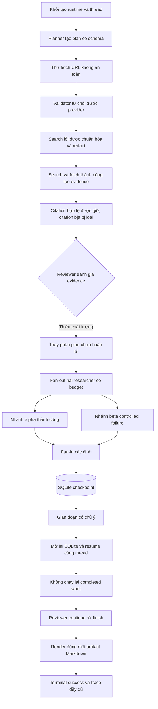

# Báo cáo ngày 14 — Mini DeerFlow

## Thông tin

| Thuộc tính | Giá trị |
| --- | --- |
| Dự án | Mini DeerFlow |
| Ngày | 14 |
| Chủ đề | Ổn định MVP, acceptance end-to-end xác định và tổng kết lộ trình |
| Nền tảng kế thừa | Runtime Day 07, checkpoint Day 08, evidence Day 09, review Day 10, context Day 11, delegation Day 12, safety và evaluation Day 13 |
| Đối tượng đọc | Software engineer đang học cách xây dựng Agent AI có boundary rõ ràng |
| Trạng thái | Learning MVP hoàn thành; không phải hệ thống production-ready |

Day 14 không mở rộng sản phẩm theo chiều ngang. Công việc chính là nối các
vertical slice của những ngày trước vào một luồng kiểm chứng duy nhất, làm cho
demo có thể chạy lại hoàn toàn offline, và ghi rõ ranh giới giữa một MVP học tập
đã hoàn thành với một hệ thống có thể vận hành trong production.

Các tài liệu nền nên đọc cùng báo cáo này:

- [Roadmap 14 ngày](roadmap-deep-agent-deerflow-14-ngay.md);
- [tài liệu kỹ thuật Day 14](mvp-stabilization-demo-comparison-day-14.md);
- [báo cáo Day 13](report-ngay-13-mini-deerflow.md);
- [threat model](threat-model.md).

## Mục tiêu ngày 14

Mục tiêu cuối ngày không phải là thêm nhiều feature. Mục tiêu là chứng minh rằng
những capability đã xây dựng có thể cùng hoạt động trong một execution thật của
Mini DeerFlow, kể cả khi có dữ liệu xấu, nhánh thất bại và tiến trình bị gián
đoạn.

Day 14 tập trung vào năm kết quả:

1. Có một final acceptance scenario chạy qua composition thật của runtime.
2. Scenario hoàn toàn xác định và offline, không cần model hoặc network thật.
3. Những invariant quan trọng được assert bằng code thay vì kiểm tra thủ công.
4. CLI và cách demo được mô tả đủ an toàn cho phạm vi MVP.
5. Capability được so sánh theo khái niệm DeerFlow-style nhưng không tuyên bố
   tương đương upstream DeerFlow.

Điều kiện hoàn thành vì vậy là một bằng chứng kỹ thuật có thể lặp lại: test xanh,
evaluation xanh, artifact xác định, resume không lặp completed work, và mọi phần
chưa đủ cho production được ghi rõ là deferred.

## Deep Agent MVP đã hoàn thành những gì?

Mini DeerFlow cuối lộ trình là một bounded research agent chạy cục bộ với các
thành phần sau:

- planner sinh plan có schema và số bước giới hạn;
- action selector chỉ chọn action có schema trong allowlist capability;
- tool runner kiểm tra input, timeout, workspace và budget;
- web search/fetch đi qua provider boundary và tạo evidence có provenance;
- citation chỉ được chấp nhận khi thuộc successful evidence;
- reviewer trả `continue`, `replan` hoặc `finish` theo chất lượng evidence;
- replanner chỉ thay phần công việc chưa hoàn tất và có cycle budget riêng;
- context builder tạo projection có hard character bound cho từng LLM seam;
- researcher delegation có depth một, concurrency cap, timeout, reservation và
  deterministic fan-in;
- LangGraph state được checkpoint theo `thread_id` trong SQLite;
- trace có schema đóng, được redact và nằm ngoài `AgentState`;
- parent render một báo cáo Markdown xác định trong workspace khi được cấp quyền
  ghi;
- evaluator chạy các contract case cố định mà không cần dịch vụ ngoài.

Đây là một deep-agent vertical slice vì nó có vòng lặp
`plan → act → observe → review → replan/continue → synthesize`, có tool use,
durable state, recovery và delegation. Nó vẫn là learning MVP vì phạm vi tool,
storage, safety control, orchestration và giao diện đều được giới hạn có chủ ý.

## Final acceptance scenario: vì sao cần một luồng tích hợp?

Unit test trả lời tốt câu hỏi “component này có giữ contract riêng không?”. Nó
không tự động trả lời được câu hỏi “các contract có còn đúng khi đi qua cùng một
graph, cùng state reducer, cùng checkpoint và cùng budget không?”.

Một agent có nhiều boundary dễ gặp lỗi chỉ xuất hiện khi tích hợp:

- evidence hợp lệ ở tool layer nhưng bị mất provenance khi merge vào state;
- reviewer yêu cầu replan nhưng routing hint không được tiêu thụ đúng;
- context đã truncate nhưng code đo một representation khác payload thực gửi;
- các branch riêng lẻ đúng budget nhưng tổng reservation vượt parent budget;
- resume tạo final answer đúng nhưng âm thầm gọi lại provider hoặc delegation;
- trace hữu ích nhưng vô tình lưu raw payload hay bị nhét vào durable state;
- artifact trông đúng nhưng được ghi hai lần sau interruption.

Vì vậy Day 14 dùng một executable acceptance test thay cho script demo ad hoc.
Test gọi `open_default_agent_runtime`, chạy graph thật, dùng SQLite checkpointer
thật và đi qua tool, evidence, review, projection, delegation, tracing và
artifact code thật. Fake chỉ nằm ở bốn seam có side effect hoặc tính bất định:
model, provider, researcher và resolver.

Cách bố trí này giữ scenario nhanh và lặp lại được, đồng thời vẫn kiểm tra phần
composition mà người học cần hiểu. Nó không gọi model thật, Jina, network hay
DNS, không đọc `.env`, và không phụ thuộc trạng thái bên ngoài máy chạy test.

## Luồng end-to-end đã được chứng minh

Scenario final đi qua một trajectory thống nhất:



Các điểm được chứng minh bằng assertion, không bằng mắt thường:

- run kết thúc thành công trong giới hạn tool, replan và recursion;
- mọi `ToolObservation` lịch sử đều nằm trong per-step và total budget;
- URL citation cuối là tập con của URL trong successful evidence;
- evidence dài vẫn còn nguyên trong raw state với provenance;
- payload thực tại các LLM seam không vượt context budget;
- nhánh thất bại không được nâng thành verified finding;
- chỉ có một artifact ở đúng đường dẫn dự kiến;
- resumed run không phát event tool hoặc delegation cho phần đã checkpoint;
- trace giải thích cả run thất bại do interruption và run resume thành công;
- không có trace field trong `AgentState`.

Scenario này gộp happy path, controlled failure và resume-after-interruption vào
một câu chuyện duy nhất. Các focused evaluation case vẫn giữ vai trò chỉ ra
boundary nào thất bại nếu một invariant riêng bị phá vỡ.

## Evidence, citation và artifact ở bản MVP cuối

Ba khái niệm này có quan hệ nhưng không đồng nhất:

| Khái niệm | Vai trò | Authority |
| --- | --- | --- |
| Observation | Kết quả thô đã chuẩn hóa của một tool call | Tool runner và tool schema |
| Evidence | Dữ liệu web thành công kèm canonical URL và provenance | Workflow integration |
| Citation | Tham chiếu được chấp nhận trong finding hoặc report | Citation validator dựa trên evidence |
| Artifact | Cách trình bày xác định từ state đã kiểm tra | Parent renderer và workspace boundary |

Một URL do model viết ra không tự trở thành citation. Citation chỉ hợp lệ khi
canonical URL của nó đã xuất hiện trong evidence sinh từ một observation web
thành công. URL không an toàn, URL model tự bịa, kết quả provider thất bại và
finding từ branch thất bại đều không đi qua trust boundary này.

Provenance trả lời các câu hỏi: evidence đến từ tool nào, ở step nào, URL nào và
observation nào. Nó giúp audit nguồn gốc; nó không chứng minh nguồn đó đúng hoặc
claim đã được entail hoàn toàn bởi nội dung nguồn.

Artifact cũng không do model tự chọn đường dẫn. Parent sở hữu final rendering và
chỉ ghi trong workspace khi runtime được cấp `--allow-write`. Acceptance test
assert cả ba điều: đúng một file tồn tại, đường dẫn đúng dự kiến, và nội dung file
bằng final answer. Nhờ vậy “artifact thành công” có nghĩa cụ thể hơn “model đã
trả về một chuỗi Markdown”.

## Review/replan, context và delegation cùng hoạt động thế nào?

Ba capability này giải quyết ba loại rủi ro khác nhau:

- review/replan kiểm soát chất lượng và hướng đi của plan;
- context projection kiểm soát kích thước dữ liệu đưa vào model;
- delegation kiểm soát việc phân tách và hợp nhất công việc song song.

Sau khi một step hoàn tất, reviewer đọc một bounded read model của state. Nếu
evidence còn thiếu, reviewer trả `replan`; replanner chỉ tạo replacement cho
suffix chưa chạy. Completed steps, evidence, observation, counter và history
không bị viết lại. Replan cycle có budget độc lập để tránh vòng lặp planner vô
hạn.

`AgentState` là source of record. `ActionContext`, `ReviewContext`,
`ReplanRequest` và context của researcher là các projection tạm thời theo nhu cầu
consumer. Khi pressure tăng, projection có thể omit hoặc truncate item theo thứ
tự xác định và ghi metadata; raw state cùng provenance vẫn đầy đủ. Hard bound
hiện đo chuỗi JSON bằng ký tự. Số token chỉ là ước lượng, không phải kết quả từ
tokenizer chính xác của model.

Delegation được admit trước khi fan-out. Parent dành trước aggregate branch
budget, giới hạn concurrency và chỉ cấp web-read capability cho researcher.
Researcher không được ghi artifact, thay parent state hay delegate tiếp. Fan-in
sắp kết quả theo branch ID, hợp nhất successful evidence, kiểm tra lại citation
và chuyển failure/cancellation thành limitation.

Trong acceptance scenario, một branch thành công cung cấp evidence; branch còn
lại trả controlled failure cùng một finding không đáng tin. Raw delegation
record vẫn giữ dữ liệu để audit, nhưng finding đó không xuất hiện trong verified
findings hoặc report. Report chỉ nói rõ limitation. Đây là partial success trung
thực, không phải biến thất bại thành một “sự thật đã xác minh”.

## Safety, tracing và evaluation ở bản MVP cuối

Safety của MVP nằm ở code boundary, không chỉ ở prompt:

- tool name và input đi qua schema và allowlist;
- file path bị giới hạn trong workspace;
- write capability là opt-in;
- fetch target được kiểm tra là public HTTP(S) trước provider transport;
- provider error được chuẩn hóa thành envelope nhỏ;
- citation phải thuộc successful evidence;
- branch chỉ nhận capability hẹp;
- tool, replan, recursion, context và concurrency đều có bound.

Trace là một luồng event ngoài state. Mỗi event có identity và outcome có kiểm
soát để giải thích run, checkpoint, tool, context compaction, review, replan,
delegation, citation và artifact. Trace không lưu raw provider payload, prompt,
evidence body, exception tùy ý hay machine path. Vì trace không nằm trong
`AgentState`, checkpoint không phình lên vì observability và model cũng không
nhìn thấy trace như context nghiên cứu.

Evaluation biến các safety và workflow claim thành executable contracts. Day 13
có 8 case với 26 invariant. Day 14 thêm final acceptance case gồm 10 invariant,
đưa baseline lên **9/9 case và 36/36 invariant**. Đây là kết quả về deterministic
contract compliance, không phải benchmark factual quality, model intelligence,
latency hay cost ngoài đời thật.

## Checkpoint, interruption và resume

SQLite checkpoint mang lại durability cục bộ theo `thread_id`. `run` tạo một
execution mới; `resume` mở state đã checkpoint và tiếp tục từ node chưa hoàn
tất. `threads` cho phép liệt kê thread đã lưu mà không gọi model.

Acceptance scenario ngắt tiến trình ngay sau khi delegation node đã hoàn tất và
checkpoint được ghi. Sau đó test đóng runtime, mở lại cùng SQLite database và
resume bằng một run identity mới. Snapshot call trước và sau resume chứng minh
completed provider, resolver, planner, replanner và delegation work không bị gọi
lại. Trace của resumed run cũng không có event tool hoặc delegation tương ứng
với phần đã xong.

Guarantee này có phạm vi chính xác: **completed graph work đã checkpoint không bị
replay**. Nó không phải exactly-once cho external side effect. Nếu một external
request đã xảy ra nhưng tiến trình chết trước khi checkpoint commit, SQLite và
provider không có distributed transaction để biết effect đó đã hoàn tất. Hệ
thống production cần idempotency key, outbox/inbox, deduplication hoặc protocol
phù hợp với từng side effect.

## CLI và cách demo an toàn

Final acceptance và evaluator là cách demo lặp lại được, không cần credential:

```powershell
uv run pytest -q tests/test_final_acceptance.py::test_final_mvp_acceptance_survives_interruption_and_resume
uv run python evals/run_evals.py
```

CLI hiện có bốn command. `plan` chỉ tạo plan có validation:

```powershell
uv run mini-deerflow plan "So sánh hai cách quản lý context cho agent."
```

`run` tạo thread mới. Nên dùng thread ID riêng, SQLite và workspace tương đối,
đồng thời đặt budget rõ ràng:

```powershell
uv run mini-deerflow run `
  "So sánh hai cách quản lý context cho agent." `
  --thread-id "day14-demo-001" `
  --checkpoint-db ".mini-deerflow/day14.sqlite" `
  --workspace ".mini-deerflow/workspace" `
  --max-tool-calls-per-step 4 `
  --max-total-tool-calls 12 `
  --max-replan-cycles 1 `
  --max-delegation-concurrency 2 `
  --recursion-limit 100
```

Mặc định runtime read-only. Chỉ thêm `--allow-write` khi chủ động cho phép ghi
artifact trong workspace. Đây là capability grant của MVP, không phải approval
workflow production.

Resume phải dùng lại cùng thread, checkpoint database, workspace và operational
limits:

```powershell
uv run mini-deerflow resume `
  --thread-id "day14-demo-001" `
  --checkpoint-db ".mini-deerflow/day14.sqlite" `
  --workspace ".mini-deerflow/workspace" `
  --max-tool-calls-per-step 4 `
  --max-total-tool-calls 12 `
  --max-replan-cycles 1 `
  --max-delegation-concurrency 2 `
  --recursion-limit 100
```

Liệt kê thread không gọi model:

```powershell
uv run mini-deerflow threads --checkpoint-db ".mini-deerflow/day14.sqlite"
```

Với `run` hoặc `resume`, `--trace-json` ghi JSON Lines đã redact ra stderr;
final answer vẫn ở stdout. Nếu cần lưu, phải tách hai stream. Concurrency của
delegation chỉ nhận `1`, `2` hoặc `3`; nó không thay thế per-step và total tool
budgets.

Các CLI command có model/provider thật không phải offline acceptance demo. Chỉ
chạy chúng khi môi trường đã được cấu hình có chủ ý và chấp nhận external calls.

## So sánh với DeerFlow-style architecture

Bảng dưới dùng DeerFlow như một vocabulary kiến trúc để đối chiếu learning
outcome, không dùng làm tuyên bố feature parity.

| DeerFlow-style concept | Mini DeerFlow MVP | Boundary hoặc khác biệt chính |
| --- | --- | --- |
| Lead agent | Một LangGraph parent sở hữu plan, action loop, review, synthesis và budget | Graph nhỏ, một vai trò chính, không có full upstream harness |
| Middleware và tool policy | Registry typed, validation, counter, workspace và URL checks | Composition cục bộ, không phải middleware platform tổng quát |
| Sandbox | Workspace confinement và không có shell tool | Không có container hoặc process sandbox |
| Persistence | SQLite checkpoint theo `thread_id` với `run`, `resume`, `threads` | Không có multi-tenant lifecycle hay distributed coordination |
| Context management | Projection xác định theo character budget, giữ provenance | Không có exact tokenizer hoặc memory platform |
| Sub-agent orchestration | Depth-one web researcher fan-out/fan-in, concurrency 1–3 | Không nested agent, dynamic scheduler hay heterogeneous role |
| Evidence và citation | Canonical evidence có provenance, citation membership validation | Không tự chứng minh source truth hoặc semantic entailment |
| Tracing | Event schema đóng, redact, có run/thread identity, nằm ngoài state | Không phải production telemetry stack |
| Evaluation | Offline deterministic contract suite có baseline | Không đo live model quality, latency hoặc cost |
| Artifact ownership | Parent render một Markdown report trong workspace | Không phải artifact service tổng quát |

Điểm tương đồng có giá trị học tập là cách chia responsibility: parent giữ
authority, tool chạy qua policy, state có durability, context có projection,
researcher có scope hẹp, và output phải truy ngược được về evidence. Điểm khác
biệt cho thấy vì sao một MVP nhỏ không nên mượn danh tính của hệ thống upstream.

## Những gì không được tuyên bố tương đương DeerFlow

Mini DeerFlow không tuyên bố:

- tương thích source code, protocol hoặc behavior với upstream DeerFlow;
- có cùng middleware ecosystem, agent harness hoặc orchestration breadth;
- có sandbox tương đương container/process isolation;
- có browser automation, shell execution hay general-purpose computer use;
- có production persistence, tenancy, deployment hoặc operations lifecycle;
- có memory system hoặc context engineering ngang một platform hoàn chỉnh;
- có cùng model quality, benchmark score, latency hay cost;
- có security posture tương đương một hệ thống đã production-hardening;
- có exactly-once external side effects;
- có feature parity chỉ vì tên module hoặc sơ đồ khái niệm trông tương tự.

Cách diễn đạt đúng là: Mini DeerFlow là một implementation độc lập, nhỏ và có
boundary rõ, được xây để học các concept kiểu DeerFlow qua code và test có thể
giải thích được.

## MVP complete vs deferred production work

```mermaid
flowchart LR
    subgraph MVP[Learning MVP đã hoàn thành]
        M1[Plan và bounded action loop]
        M2[Evidence, citation và artifact]
        M3[Review, replan và context projection]
        M4[Delegation có budget và partial failure]
        M5[SQLite resume, trace và offline eval]
    end

    Gate{Production boundary}

    subgraph Deferred[Production work còn deferred]
        D1[Auth, authorization và multi-tenancy]
        D2[UI, API và deployment]
        D3[Production database và operations]
        D4[Egress policy, DNS pinning và rebinding defense]
        D5[Browser automation và container sandbox]
        D6[Exact tokenizer và live quality benchmark]
        D7[Exactly-once external side effects]
    end

    MVP --> Gate
    Gate -. Không được suy diễn đã có .-> Deferred
```



| MVP complete | Deferred production work |
| --- | --- |
| Strict planning và bounded plan/action/review loop | Authentication, authorization và multi-tenancy |
| Allowlisted tools, validation và workspace confinement | UI, API surface và deployment architecture |
| SQLite interruption/resume cho completed checkpointed work | Production database, migration, retention, backup và distributed locking |
| Successful evidence provenance và citation-subset validation | Production egress policy, DNS pinning/rebinding defense và redirect enforcement độc lập |
| Character-bounded LLM projections với raw state đầy đủ | Exact tokenizer và model-specific context accounting |
| Depth-one delegation, concurrency cap và deterministic fan-in | Browser automation, general orchestration và nested/heterogeneous agents |
| Redacted out-of-state trace và deterministic contract eval | Production telemetry, alerting và live model-quality/latency/cost benchmark |
| Write opt-in, không có shell execution | Container sandbox và shell/process isolation |
| Không replay completed graph nodes sau checkpoint | Exactly-once external side effects qua crash window |

“MVP complete” nghĩa là scope học tập đã có contract, implementation, test và
tài liệu khép kín. Nó không có nghĩa production backlog bằng không.

## Hành trình Day 01 đến Day 14

| Day | Capability chính | Learning quan trọng |
| ---: | --- | --- |
| 01 | Chốt phạm vi và kiến trúc mục tiêu | Phân biệt chatbot, workflow, agent và deep-agent harness |
| 02 | Chạy DeerFlow reference có kiểm soát | Nhìn request lifecycle và vai trò model, tool, middleware, sandbox |
| 03 | Lõi Mini DeerFlow, config và strict plan schema | Tách reference implementation khỏi MVP; structured output vẫn phải validate |
| 04 | Typed `AgentState` và LangGraph đầu tiên | Node, reducer, conditional edge và recursion là execution semantics |
| 05 | Tool registry, runner và workspace boundary | Tool là capability có DTO, timeout và policy, không chỉ là hàm Python |
| 06 | Bounded action loop | Termination cần hard counter; không lưu chain-of-thought |
| 07 | Runtime composition và CLI `plan`/`run` | Composition root, dependency injection và capability-aware planning |
| 08 | SQLite checkpoint, thread và resume | Durability cần identity, ownership và recovery contract |
| 09 | Web provider, evidence, citation và artifact | Provenance và canonical identity tách observation khỏi verified citation |
| 10 | Reviewer và replanner | Quality loop cần verdict typed, state lifecycle và cycle budget |
| 11 | Bounded context projection | Raw source of record khác LLM read model; đo đúng wire representation |
| 12 | Bounded researcher delegation | Fan-out cần admission, quota, timeout, ACL và deterministic fan-in |
| 13 | URL safety, redacted trace và evaluator | Safety là runtime boundary; evaluation là executable contract |
| 14 | Final acceptance, resume proof và honest comparison | Giá trị cuối nằm ở failure, recovery, invariant và giới hạn được nói thật |

Lộ trình tiến từ module nhỏ sang composition, rồi từ happy path sang failure và
recovery. Mỗi ngày sau không thay thế invariant của ngày trước; nó buộc invariant
cũ phải sống được trong một hệ thống phức tạp hơn.

## Các sự cố quan trọng và bài học

### Structured output không đồng nghĩa provider behavior hoàn hảo

Ở Day 07, endpoint model có lúc làm mất trường bắt buộc trong tool-call
arguments. Việc làm trường đó optional sẽ che lỗi contract. Giải pháp đúng là
đổi compatibility mode, giữ strict validation và giới hạn số lần thử. Bài học:
schema ở phía client vẫn là authority cuối.

### Routing hint cần owner vòng đời rõ ràng

Day 10 phát hiện terminal state còn giữ `pending_review_verdict`. Field này vừa
phục vụ routing vừa dễ bị hiểu như durable history. Cách sửa là clear tại
consumer sau khi route được tiêu thụ, còn review/replan history nằm ở field bền
vững riêng. Bài học: mỗi state field phải có owner tạo, owner tiêu thụ và thời
điểm kết thúc vòng đời.

### Context phải đo đúng representation thực gửi

Day 11 phát hiện nguy cơ under-measurement khi logic kiểm tra một object nhưng
LLM seam nhận chuỗi serialize khác. Acceptance Day 14 vì vậy kiểm tra độ dài raw
serialized payload thực. Bài học: hard limit phải đặt tại boundary gần wire
format nhất.

### Concurrency làm budget accounting khó hơn

Day 12 cho thấy kiểm tra quota sau khi branch chạy là quá muộn. Parent phải
reserve aggregate budget trước dispatch và charge bảo thủ cho cancellation. Bài
học: concurrency cần admission control, không chỉ semaphore.

### Assertion có thể xanh nhưng chưa chứng minh đúng claim

Review Day 14 phát hiện hai assertion yếu: chỉ kiểm tra counter của step cuối và
kiểm tra một false-fact sentinel chưa từng được inject. Test được tăng cường để
kiểm tra mọi observation lịch sử và thật sự đưa false finding vào failed branch.
Bài học: test phải tạo ra điều kiện nguy hiểm trước khi khẳng định nó bị chặn.

### Môi trường test cũng là một dependency

Full pytest từng gặp lỗi quyền truy cập thư mục tạm của Windows dù code không
sai. Evaluator và lệnh xác minh cuối dùng temporary root nằm trong vùng làm việc
được kiểm soát. Kết quả sau isolation là **509 passed, 2 skipped**. Bài học:
determinism cần kiểm soát filesystem boundary, không chỉ fake model và network.

## Kiến thức đã học

Sau 14 ngày, người học cần tự giải thích được:

1. Vì sao deep agent là một runtime harness chứ không phải một prompt dài.
2. Vì sao model proposal phải đi qua typed schema và deterministic policy.
3. Vì sao budget tool, replan, recursion, context và concurrency là các trục
   khác nhau.
4. Vì sao evidence cần provenance và citation cần membership validation.
5. Vì sao source truth không thể được suy ra chỉ từ URL hợp lệ.
6. Vì sao reviewer/replanner là quality-control loop, không phải thêm model call
   cho có.
7. Vì sao raw state và LLM projection phải tách nhau.
8. Vì sao sub-agent cần task contract, ACL, quota, timeout và result envelope.
9. Vì sao checkpoint resume khác retry và khác exactly-once side effect.
10. Vì sao tracing nên dùng closed schema và data minimization.
11. Vì sao deterministic eval bổ sung chứ không thay thế live quality eval.
12. Vì sao một kiến trúc tốt phải mô tả cả capability lẫn điều nó chưa bảo đảm.

## Các quyết định kiến trúc cuối cùng

Các quyết định được giữ ở cuối MVP:

1. LangGraph là state machine chính; transition quan trọng phải kiểm thử được.
2. Một composition root wire model, provider, workspace, checkpointer, policy và
   graph.
3. Pydantic model là boundary cho plan, action, verdict, evidence, delegation và
   trace.
4. Runtime read-only mặc định; quyền ghi được cấp rõ ràng.
5. Không cung cấp shell tool hoặc arbitrary path access.
6. Successful evidence là authority cho citation membership.
7. Parent sở hữu final citation validation và artifact rendering.
8. Reviewer có ba verdict typed; replanner chỉ thay unfinished suffix.
9. Raw `AgentState` đầy đủ; LLM chỉ nhận bounded projection theo consumer.
10. Delegation depth một, branch web-only, concurrency 1–3 và fan-in xác định.
11. SQLite là MVP checkpoint store; `thread_id` là durable execution identity.
12. Trace nằm ngoài state, có schema đóng và chỉ lưu metadata/outcome cần thiết.
13. Acceptance và eval dùng fake tại external/nondeterministic seam, không thay
    fake cho orchestration đang được kiểm chứng.
14. Production gaps được ghi như deferred, không được che bằng wording mơ hồ.

## Những hạn chế còn lại

MVP còn các giới hạn chủ ý:

- public-target validation chưa phải production egress enforcement;
- chưa có DNS pinning, rebinding defense hoặc guarantee cho mọi redirect bên
  trong remote reader;
- không có authentication, authorization, tenant isolation hoặc quota theo user;
- SQLite không có distributed coordination, production backup hay retention;
- character budget không phải exact tokenizer;
- citation membership không chứng minh factual truth hoặc semantic entailment;
- delegation chỉ depth một và chỉ có web-research role;
- không có UI, API server, deployment layer hoặc streaming progress surface;
- không có browser automation, shell tool hoặc container sandbox;
- trace local không thay thế telemetry, alerting và incident response;
- deterministic fakes không đo live model quality, latency, cost hoặc provider
  reliability;
- resume không bảo đảm exactly-once external side effects.

Những giới hạn này không làm giảm giá trị của learning MVP. Chúng làm cho phạm
vi bằng chứng trở nên chính xác và giúp backlog production bắt đầu từ failure
model thật thay vì một danh sách feature chung chung.

## Kiểm thử, evaluation và chất lượng

Quality gate cuối Day 14:

| Kiểm tra | Kết quả | Ý nghĩa |
| --- | --- | --- |
| Focused final acceptance | **1 passed** | Luồng tích hợp cuối chạy xác định |
| Full pytest | **509 passed, 2 skipped** | Giữ regression Day 09–13 và toàn suite |
| Deterministic evaluation | **9/9 case, 36/36 invariant** | Baseline contract cuối không có case fail |
| Ruff check | **Pass** | Không có lint error |
| Ruff format check | **Pass** | Python source đúng formatter |
| Lock check | **Pass** | Lockfile hiện tại, 56 package được resolve |
| `git diff --check` | **Pass** | Không có whitespace error |

Hai test bị skip là trạng thái có chủ ý của suite, không phải failure bị che.
Final acceptance không cần API key thật và không gọi model, Jina, network hoặc
DNS. Evaluation cũng chạy các node test cố định bằng subprocess với temporary
directory được cô lập trong workspace.

Kết quả **9/9 và 36/36** chỉ cho phép kết luận các invariant đã khai báo đều đạt
trong môi trường deterministic. Nó không cho phép kết luận agent trả lời hay hơn
model khác, nguồn web luôn đúng, hoặc hệ thống chịu được production load.

## Đánh giá mục tiêu cuối khóa

| Mục tiêu | Đánh giá | Bằng chứng |
| --- | --- | --- |
| Hiểu deep-agent lifecycle | Đạt | Graph có plan, act, observe, review, replan và artifact |
| Xây bounded executable agent | Đạt | Runtime composition, tool policies và nhiều budget độc lập |
| Có persistence/resume | Đạt ở mức MVP | SQLite interruption/resume không replay completed work |
| Có evidence/citation | Đạt ở mức contract | Provenance và citation-subset validation |
| Có context management | Đạt ở mức MVP | Character-bounded projections, raw state không bị cắt |
| Có bounded delegation | Đạt | Depth một, reservation, concurrency, partial failure và fan-in |
| Có safety/observability/eval | Đạt ở mức MVP | URL checks, redacted trace và 9-case evaluator |
| Có demo cuối lặp lại được | Đạt | Final acceptance test hoàn toàn offline |
| Production-ready | Không phải mục tiêu đã đạt | Production backlog được ghi rõ deferred |
| DeerFlow parity | Không tuyên bố | Chỉ so sánh concept DeerFlow-style |

Mục tiêu học tập cuối khóa đã đạt: có thể giải thích, chạy và kiểm chứng một
Deep Agent MVP end-to-end với boundary cụ thể. Mục tiêu production readiness
không đạt và cũng không được dùng làm tiêu chí đánh tráo cho kết quả học tập.

## Roadmap alignment cuối cùng

Day 14 khép mốc cuối của [roadmap](roadmap-deep-agent-deerflow-14-ngay.md): demo
end-to-end ổn định, test xanh, evaluation cuối so với Day 13, README cập nhật và
deferred work được liệt kê rõ.

Có hai realignment cần nói thẳng:

- yêu cầu ba demo tách rời trong roadmap được đáp ứng mạnh hơn bằng một coherent
  acceptance trajectory chứa happy path, tool/provider failure và interruption/
  resume; các focused eval case vẫn cô lập từng failure contract;
- release hoặc tag không được tạo vì phiên làm việc Day 14 chủ ý yêu cầu không
  stage, commit, tag, release hay push.

UI/API mỏng là tùy chọn trong roadmap và được giữ deferred. Không có capability
mới ngoài hardening, acceptance và documentation. Do đó alignment được đánh giá
theo outcome kỹ thuật, không theo việc đánh dấu mọi checkbox bằng một feature.

## Câu hỏi tự kiểm tra

<details>
<summary>Vì sao final acceptance phải dùng runtime composition thật nhưng vẫn dùng fake?</summary>

Mục tiêu là kiểm tra wiring và invariant của Mini DeerFlow, không kiểm tra độ ổn
định của dịch vụ ngoài. Vì vậy graph, tools, evidence, reviewer, context,
delegation, trace, workspace và SQLite đều là implementation thật; model,
provider, researcher và resolver là các seam được điều khiển để trajectory lặp
lại được và không cần external call.
</details>

<details>
<summary>Raw state đầy đủ nhưng prompt bị truncate có mâu thuẫn không?</summary>

Không. Raw state là source of record phục vụ checkpoint, audit và final render.
Prompt chỉ là read model tạm thời cho một consumer. Truncate hoặc omit ở
projection không được ghi ngược vào state, nên provenance vẫn còn đầy đủ.
</details>

<details>
<summary>Tại sao failed branch có finding nhưng report không được coi đó là fact?</summary>

Status của branch là một trust boundary. Chỉ successful result mới được tích hợp
thành verified finding và evidence. Dữ liệu của failed branch có thể giữ trong
raw delegation record để audit, nhưng public report chỉ nêu limitation, không
nâng nội dung chưa tin cậy thành kết luận.
</details>

<details>
<summary>Resume không lặp completed work có đồng nghĩa exactly-once không?</summary>

Không. Nó chỉ chứng minh graph node đã checkpoint không bị chạy lại. Crash sau
external effect nhưng trước checkpoint vẫn có thể tạo duplicate khi resume.
Exactly-once cần protocol bổ sung như idempotency key hoặc transaction/outbox
phù hợp với external system.
</details>

<details>
<summary>9/9 case và 36/36 invariant cho phép kết luận gì?</summary>

Chỉ kết luận toàn bộ deterministic contract đã khai báo đang pass. Nó không đo
factual quality của model thật, semantic entailment của mọi claim, latency, cost,
khả năng chịu tải hoặc production security.
</details>

<details>
<summary>Vì sao trace không nên nằm trong AgentState?</summary>

Trace và domain state có lifecycle khác nhau. Đặt trace ngoài state tránh làm
checkpoint phình, tránh đưa diagnostic vào LLM context, và cho phép áp dụng
schema/redaction riêng. State vẫn giữ dữ liệu nghiệp vụ cần để resume.
</details>

<details>
<summary>Điểm giống DeerFlow nào có giá trị nhất cho việc học?</summary>

Không phải số feature mà là cách chia authority: lead agent sở hữu goal và final
artifact; tool đi qua policy; persistence giữ execution state; context được quản
lý tại seam; sub-agent nhận capability hẹp; trace và eval giải thích behavior.
</details>

## Hướng phát triển sau khóa học

Backlog nên đi theo rủi ro và failure model, không chỉ theo độ hấp dẫn của
feature:

1. Xây production egress layer với DNS pinning, rebinding defense, redirect
   policy và network-level enforcement.
2. Thiết kế authentication, authorization, tenant isolation, quota và audit theo
   principal trước khi mở API.
3. Định nghĩa storage lifecycle: migration, retention, backup, encryption,
   distributed locking và recovery objective.
4. Thêm idempotency protocol cho từng external side effect; không hứa
   exactly-once bằng checkpoint đơn lẻ.
5. Tích hợp exact tokenizer theo model và đo context/cost trên payload thật.
6. Xây live evaluation riêng cho factuality, claim-evidence entailment, model
   quality, latency, reliability và cost; giữ deterministic suite làm regression
   gate.
7. Chỉ thêm UI/API sau khi authority, streaming, cancellation và error contract
   đã rõ.
8. Đánh giá browser automation hoặc shell trong container sandbox như capability
   mới có threat model và approval boundary riêng.
9. Mở rộng delegation chỉ khi có use case chứng minh lợi ích so với chi phí,
   không biến depth hoặc concurrency thành mục tiêu tự thân.
10. Bổ sung production telemetry, metrics, alerting và runbook vận hành.

Phản tư cuối: Day 14 đóng lộ trình học 14 ngày vì MVP đã có một câu chuyện kỹ
thuật hoàn chỉnh, có failure, recovery và bằng chứng lặp lại được. Nó không đóng
production backlog. Sự trưởng thành quan trọng nhất của bản cuối không phải có
thêm nhiều tool, mà là biết chính xác hệ thống đã chứng minh điều gì và chưa có
quyền tuyên bố điều gì.
