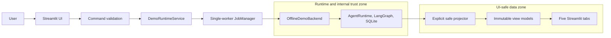
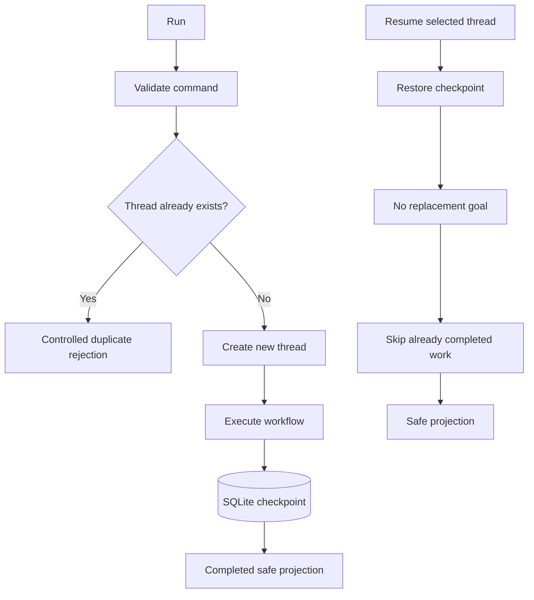
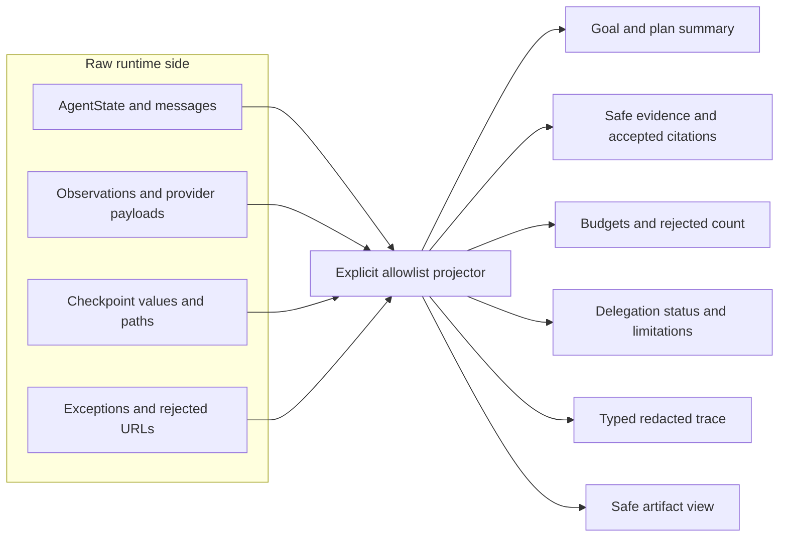

# Báo cáo ngày 15 — Mini DeerFlow

## Thông tin

| Thuộc tính | Giá trị |
| --- | --- |
| Dự án | Mini DeerFlow |
| Ngày | 15 |
| Chủ đề | Local deterministic Streamlit mentor demo |
| Nền tảng kế thừa | Learning MVP đã hoàn thành ở Day 14 |
| Đối tượng đọc | Software engineer học Agent AI, orchestration, stateful workflow và safe UI boundary |
| Trạng thái | Post-roadmap learning/demo extension; không phải production UI |
| Commit triển khai Day 15 | `f2181af7b0fe3fa4456a2ac6416af667c7d0c0cb` |

Day 15 thêm một lớp quan sát và trình bày cho runtime đã được kiểm chứng, không
định nghĩa lại learning MVP. Tài liệu liên quan trực tiếp gồm [báo cáo Day
14](report-ngay-14-mini-deerflow.md), [hướng dẫn Streamlit
demo](streamlit-local-demo-day-15.md) và [README](../README.md).

## Mục tiêu ngày 15

Mục tiêu là biến các capability khó quan sát từ CLI thành một walkthrough cục
bộ, lặp lại được và đủ an toàn để giải thích cho mentor trong 5–7 phút. Giao
diện phải cho thấy cả happy path lẫn failure/safety path trong cùng một
trajectory:

```text
unsafe-target denial
→ redacted provider failure
→ successful evidence
→ invented citation rejection
→ reviewer requests replan
→ partial delegation failure
→ deterministic safe fan-in
→ completed artifact
→ Resume completed thread without replaying completed work
```

Điều kiện quan trọng hơn vẻ ngoài của UI là: Streamlit không được trở thành một
đường vòng bỏ qua validation, budget, citation, context, delegation, workspace
hoặc trace-redaction boundary của Day 08–14.

## Day 15 đứng ở đâu sau roadmap 14 ngày?

Day 14 đã đóng roadmap gốc và chứng minh Deep Agent learning MVP end-to-end.
Day 15 là phần mở rộng sau roadmap, nhằm làm hệ thống đã chứng minh trở nên dễ
quan sát và dễ giảng giải hơn.

| Concern | Day 14 | Day 15 |
| --- | --- | --- |
| Workflow correctness | Final acceptance ghép toàn bộ trajectory | Hiển thị trajectory qua safe view |
| Persistence | SQLite interruption/resume được kiểm chứng | Chọn thread và Resume qua service |
| Safety | URL, citation, delegation và trace boundary | Giữ nguyên boundary khi đưa dữ liệu lên UI |
| Observability | Typed redacted trace và evaluator | Timeline có filter, không có raw log viewer |
| Mentor usability | Test/CLI cần giải thích kỹ | Walkthrough một trang, năm tab |
| UI | Chủ ý deferred | Streamlit localhost deterministic demo |
| Production readiness | Không tuyên bố | Vẫn không tuyên bố |

Tóm tắt vai trò của hai mốc:

```text
Day 14: prove the Deep Agent learning MVP end-to-end
Day 15: make that proven system observable and teachable through a safe local UI
```

## Vì sao cần một giao diện mentor demo?

CLI và test rất tốt để chứng minh invariant, nhưng khó kể nhanh mối liên hệ giữa
plan, budget, evidence, review, delegation, trace và artifact. Một mentor demo
cần cho người xem chuyển giữa các read model mà không phải đọc checkpoint hay
log nội bộ.

Một demo xác định mạnh hơn screenshot vì người xem có thể tự tạo thread, quan
sát failure có kiểm soát, kiểm tra artifact, rồi Resume để thấy checkpoint
semantics. Nó cũng buộc thiết kế phải trả lời câu hỏi quan trọng: dữ liệu nào
được phép đi qua UI boundary, dữ liệu nào phải ở lại runtime.

## Kiến trúc Streamlit demo cuối cùng

Luồng triển khai là:

```text
Streamlit UI
→ validated command
→ DemoRuntimeService
→ single-worker background job
→ OfflineDemoBackend
→ real runtime/workflow/SQLite/safety/citations/review/delegation/trace
→ explicit immutable projector
→ safe view models
→ Streamlit renderer
```



Projector là trust boundary: raw workflow state chỉ tồn tại phía runtime; UI
chỉ nhận immutable allowlisted view model.

| Component | Responsibility | Must not do |
| --- | --- | --- |
| [`app.py`](../src/mini_deerflow/demo/app.py) | Wiring Streamlit, session state, sidebar, polling và năm tab | Chạy workflow dài trực tiếp, nhận raw state, cho chọn path |
| [`service.py`](../src/mini_deerflow/demo/service.py) | Validate command, façade backend, project kết quả, map lỗi an toàn | Trả provider exception hoặc checkpoint internals |
| [`jobs.py`](../src/mini_deerflow/demo/jobs.py) | Một worker, lifecycle job, FIFO typed trace queue, chống double-submit | Gọi `st.*`, hứa cancellation không có contract |
| [`view_models.py`](../src/mini_deerflow/demo/view_models.py) | Dataclass bất biến, allowlist field, explicit projection và bounding | Whole-state serialization, lộ raw observation/payload |
| [`offline_scenario.py`](../src/mini_deerflow/demo/offline_scenario.py) | Compose runtime thật với bốn deterministic seams | Gọi model/web/DNS thật hoặc đọc cấu hình bí mật |
| [`components.py`](../src/mini_deerflow/demo/components.py) | Render native Streamlit từ safe view models | Render HTML tùy ý, iframe, generic JSON viewer |

## DemoRuntimeService và application boundary

`DemoRuntimeService` là application boundary giữa framework UI và domain
runtime. `RunDemoCommand` validate goal cùng thread identifier trước khi backend
được gọi; `ResumeDemoCommand` chỉ chứa thread identifier và không có goal thay
thế. Service nhận internal backend result, gọi projector, rồi mới trả
`DemoRunView`.

Cách tách này giữ Streamlit khỏi `AgentRuntime`, SQLite và `AgentState`. Một
backend live có thể được bổ sung sau qua protocol hiện có, nhưng Day 15 không có
credential management, automatic fallback hoặc control bật live mode. Error
mapper biến lỗi domain thành thông báo ngắn, có kiểm soát; provider text và
traceback không đi tới UI.

## Background job manager và bài toán non-blocking

Streamlit rerun script theo tương tác. Nếu script thread trực tiếp sở hữu một
async workflow dài, UI khó phản hồi, event loop và resource lifecycle dễ bị
nhầm giữa các lần rerun. Day 15 dùng `ThreadPoolExecutor` một worker cho mỗi
session demo:

- một active job tối đa trong session;
- worker tự sở hữu event loop, runtime, SQLite connection và workspace
  lifecycle;
- worker không gọi `st.*`;
- Streamlit thread poll job snapshot do future-backed manager quản lý và drain
  typed trace qua thread-safe queue;
- control có thể thay đổi state bị disable khi job đang chạy;
- manager vẫn tự từ chối racing double submission;
- safe view hoàn tất gần nhất có thể tiếp tục hiện trong khi job mới chạy;
- trace đang chạy mang thread/run identity riêng, không trộn với trace cũ.

Không có nút Cancel vì runtime chưa cung cấp cancellation/checkpoint contract
trung thực. Thêm một nút chỉ ngắt UI nhưng để external work tiếp tục sẽ tạo cảm
giác kiểm soát sai, không phải một thiếu sót trang trí nhỏ.

## Offline deterministic backend

`OfflineDemoBackend` không mock toàn bộ ứng dụng. Nó dùng thật:

- `AgentRuntime` và LangGraph workflow;
- SQLite checkpointer và thread lifecycle;
- tool registry, tool runner và workspace/artifact boundary;
- evidence model và citation validation;
- reviewer/replanner và bounded context;
- bounded delegation cùng deterministic fan-in;
- redacted `ExecutionTrace`;
- Run và Resume semantics.

Chỉ bốn seam bất định hoặc có external side effect được thay bằng fixture xác
định: model, web provider, researcher và hostname resolver. Backend cấp toàn bộ
Settings cần thiết bằng giá trị nội bộ, không phụ thuộc file môi trường hoặc
biến môi trường sẵn có, đồng thời không đọc `.env`. Các test chặn model
constructor, DNS và socket để chứng minh walkthrough mặc định không cần API key,
không gọi model thật, web provider thật hay network thật.

Bảo đảm này chỉ dành cho mentor scenario mặc định. Repository vẫn có runtime
thật có thể dùng networking khi người vận hành chủ động cấu hình mode khác.

## Run, thread và duplicate protection

Run tạo một thread mới được SQLite backing. Thread identifier đi qua
normalization/validation; identifier đã tồn tại bị từ chối trước workflow
execution thay vì ghi đè checkpoint.

UI liệt kê persisted thread identifier thông qua `DemoRuntimeService`. Người
dùng không chọn SQLite file, checkpoint namespace, workspace hoặc artifact
path; backend cố định các vị trí lưu cục bộ bên trong phạm vi demo. UI cũng
không duyệt raw record hay SQLite channel value.



## Resume và checkpoint semantics

Resume không inject goal mới. LangGraph khôi phục selected thread từ
checkpoint, tiếp tục node còn dang dở hoặc trả persisted result của completed
thread qua runtime path bình thường. Test kiểm tra model/provider/tool/
delegation work đã checkpoint không bị replay, kể cả khi tạo backend mới trên
cùng local demo storage.

Cần phân biệt rõ:

```text
checkpoint/resume correctness
```

với:

```text
general exactly-once distributed side effects
```

Checkpoint chứng minh graph work đã persist không chạy lại. Nó không thể tạo
distributed transaction với external service. Crash sau external effect nhưng
trước checkpoint vẫn cần idempotency key, outbox/inbox hoặc deduplication riêng
trong một hệ thống production.

## Safe view model và explicit projector

Các view model là frozen dataclass có slots. Projector ánh xạ từng field cụ thể:
goal đã bound, plan summary, budget counter, successful evidence, accepted
citation, rejected count, review chronology, safe delegation status, typed
trace và artifact view.



Đây là quyết định security và maintainability, không chỉ là formatting. Khi
domain state có thêm field nội bộ, field đó mặc định không xuất hiện ở UI cho
đến khi projector chủ động xem xét và allowlist.

## Vì sao UI không được nhận raw AgentState?

Raw `AgentState` chứa dữ liệu phục vụ orchestration, checkpoint và audit, không
phải một public presentation contract. Nó có thể chứa messages, prompt-facing
context, structured model response, pending action, raw tool observation,
result payload, error nội bộ, artifact path và delegation record chi tiết.

Một shortcut như sau sẽ phá vỡ boundary:

```python
state.model_dump()
```

Whole-state serialization khiến mọi field hiện tại và tương lai có khả năng đi
vào session state, dataframe, log hoặc generic JSON viewer. Day 15 loại trừ rõ:
raw `AgentState`, messages, prompts, structured model responses, pending
actions, raw observations/results, checkpoint internals, SQLite channel values,
provider body/header/exception, credentials, file-environment content, machine
path, `.env`, arbitrary filesystem path, rejected URL, failed-branch false finding và
arbitrary tool arguments.

## Evidence và citation trên giao diện

Tab evidence chỉ project successful bounded evidence. Mỗi card có title,
excerpt đã bound, canonical URL dưới dạng text và logical provenance như tool,
step và call number. Accepted citation là tập con của URL thuộc successful
evidence; citation do model tự tạo nhưng không có membership bị loại.

UI chỉ hiển thị số citation bị loại, không hiển thị rejected URL. Cách này vẫn
chứng minh validator đã hành động nhưng không tái phát tán target không được tin
cậy. Structural citation validation cũng không chứng minh nguồn đúng hoặc claim
được nội dung nguồn entail; nó chỉ chứng minh citation có provenance trong
evidence contract.

## Review, replan và bounded context trên giao diện

Chronology hiển thị route `continue`, `replan`, `finish`, rationale đã bound,
finding category và các step liên quan. Replan view cho thấy step nào bị thay và
replacement title nào được đưa vào unfinished suffix; completed work không bị
viết lại.

Bounded context vẫn được runtime thật thực thi. Raw durable state giữ evidence
và provenance; action selector, reviewer, replanner chỉ nhận projection theo
consumer với hard character bound. Trace có thể báo compaction bằng counter an
toàn, nhưng UI không mở prompt hay model payload để “chứng minh” context. Đây là
ví dụ observability không cần disclosure dữ liệu thô.

## Delegation và partial failure trên giao diện

Delegation bị giới hạn depth, concurrency và parent budget. UI cho thấy wave,
branch status, `reserved / used / charged`, số nhánh thành công/thất bại/hủy và
fan-in limitation. Fan-in sắp thứ tự xác định, canonical-deduplicate evidence và
revalidate citation.

Nếu một branch thất bại, finding của branch đó không được project thành verified
finding. UI chỉ nêu limitation có kiểm soát; successful sibling evidence vẫn
được giữ. Raw branch observation, error payload và false finding không qua safe
view boundary.

## Trace an toàn và typed timeline

Trace tab được dựng từ closed, redacted `ExecutionTrace` schema rồi project sang
`TraceEventView`. Timeline giữ thứ tự và cho filter theo run, kind, outcome. Các
counter an toàn có thể giải thích budget, evidence, citation, delegation và
context compaction.

Thread identity là durable workflow identity; run identity phân biệt từng lần
Run/Resume. Vì vậy trace của active execution không được trộn với trace của
completed view trước đó. UI không có generic JSON viewer, log viewer,
checkpoint viewer, prompt viewer hay payload viewer: các viewer “tiện lợi” này
sẽ làm schema đóng mất ý nghĩa.

## Artifact preview và Markdown boundary

Artifact được tạo qua workspace/artifact boundary thật; UI không nhận hoặc cho
chọn arbitrary filesystem path. Offline trajectory kết thúc với đúng một
Markdown artifact xác định.

Structured preview được dựng lại từ safe finding, accepted citation và
limitation trong view model. Exact Markdown source được hiển thị bằng `st.code`
và có thể download dưới tên cố định. Đây là **hiển thị source Markdown đã sinh**,
không phải **thực thi hoặc render arbitrary active Markdown/HTML**. Day 15 không
tuyên bố có general sanitizer hay secure file-serving service.

## Năm tab của mentor demo

UI có đúng năm tab:

| Tab | What the mentor sees | Concept demonstrated | Deliberately hidden |
| --- | --- | --- | --- |
| Overview | Goal text, plan/current step, budgets, limitation | Stateful plan và independent bounds | Messages, prompts, raw state |
| Evidence & Citations | Bounded evidence, provenance, accepted citations, rejected count, review/replan | Evidence authority và quality loop | Raw observation, rejected URL, provider payload |
| Delegation | Wave/branch status, reserved-used-charged, fan-in limitation | Bounded fan-out/fan-in và partial success | Failed-branch finding, raw branch output |
| Trace | Filtered ordered typed timeline | Redacted observability với run/thread identity | Generic log/JSON, checkpoint, prompt |
| Artifact | Structured preview, exact Markdown source, download | Parent-owned deterministic artifact | Arbitrary path, active HTML/iframe |

Sidebar có badge `Offline deterministic — no network`, label `Mentor walkthrough
v1`, new thread ID, sample goal, Run, Resume selected thread, Refresh threads và
disclaimer localhost/non-production/non-parity.

Không có API-key field, credential editor, model selector, arbitrary tool
picker, checkpoint/path selector, workspace selector, database browser, write
toggle, Cancel button hoặc live-mode switch.

## Security và non-leakage boundary

Goal text, evidence text, review rationale, delegation limitation, canonical URL
string và generated artifact đều là untrusted content. Policy render là:

- plain text có bound ở nơi phù hợp;
- không dùng `unsafe_allow_html=True`;
- không iframe hay arbitrary custom browser component;
- URL hiển thị như text, không âm thầm fetch/embed;
- rejected target chỉ được biểu diễn bằng count;
- exact Markdown nằm trong code block;
- structured preview chỉ dùng safe projected fields;
- error UI ngắn và không có raw exception hay traceback.

Boundary này là application-layer data minimization, không phải OS sandbox.
Demo vẫn ghi dữ liệu cục bộ vào SQLite/workspace nội bộ do backend chọn; nó
không có container/process isolation. Cấu hình launch bind loopback, nhưng app
không có production-grade localhost enforcement, authentication hay
authorization nếu người vận hành tự thay đổi cách khởi chạy.

## Những gì Day 15 cố ý không triển khai

Day 15 không triển khai authentication, authorization, multi-tenancy, public
deployment, production storage lifecycle/retention, distributed locking,
durable cross-process queue, cancellation contract hoặc exactly-once external
effects.

Nó cũng không có live credential management, automatic live fallback,
live-mode UI, browser/shell execution, arbitrary tool configuration,
production telemetry/alerting, cost/latency benchmark, general Markdown/HTML
sanitizer, general secure artifact serving hay upstream DeerFlow parity. Đây là
những bài toán kiến trúc độc lập; nhiều mục cần principal model, durable job
protocol, network policy và storage lifecycle ngoài phạm vi Streamlit.

## Kiểm thử Streamlit và offline runtime

Day 15 có 17 focused test: 10 Streamlit AppTest, 3 job-manager test, 3 offline
integration test và 1 projector/non-leakage test. Test bao phủ controls/tabs,
invalid input, disabled running state, live trace identity, failure view không
trộn stale progress, usage telemetry off, FIFO trace, double-submit, safe error,
environment isolation, no-network seams, fresh-backend resume (mô phỏng
process restart) và kiểm tra
non-leakage.

Các quality gate không mở socket đã được rerun khi đóng tài liệu và khớp với
closeout implementation. Riêng startup smoke được giữ như bằng chứng của
closeout implementation, vì nhiệm vụ tài liệu hiện tại chủ ý cấm mở socket:

| Kiểm tra | Kết quả closeout | Ý nghĩa |
| --- | --- | --- |
| Day 15 focused tests | **17 passed** | 10 AppTest + 3 jobs + 3 offline + 1 projector |
| Full pytest | **526 passed, 2 skipped** | Regression suite toàn repository xanh |
| Day 14 final acceptance | **1 passed** | Trajectory tích hợp cũ vẫn xanh |
| Deterministic evaluator | **9/9 cases, 36/36 invariants** | Baseline contract giữ nguyên |
| Ruff check | **Pass** | Không có lint error |
| Ruff format check | **Pass** | Python source đúng formatter |
| Lock consistency | **Pass** | Dependency và lock đồng bộ |
| `git diff --check` | **Pass** | Không có whitespace error |
| Headless Streamlit startup | **Pass tại implementation closeout; không rerun trong task tài liệu** | Lần closeout đã nhận health `200`; task hiện tại không mở socket |

Các số trên là bằng chứng contract trong môi trường deterministic, không phải
benchmark factual quality, production load, latency, cost hay live-provider
reliability.

## Regression với Day 14

Day 15 bảo toàn thay vì thay thế các guarantee đã hoàn thành: SQLite resume,
evidence provenance, citation validation, reviewer/replanner, bounded context,
bounded delegation, URL safety, redacted tracing, deterministic artifact và
deterministic final acceptance/evaluator.

`validate_citations`, runtime core và workflow core không bị sửa cho Day 15. UI
đi vào qua façade mới và tái sử dụng public composition boundary. Vì vậy Day 14
final acceptance tiếp tục là system-level baseline; AppTest không bị nhét vào
evaluator vì widget layout là presentation contract, không phải domain
invariant ổn định.

## GitNexus và impact của thay đổi

Trước khi sửa code, impact analysis được chạy trên các boundary hiện hữu có độ
ảnh hưởng cao như runtime composition, state, tracing và settings. Một số symbol
hiện hữu được đánh giá critical vì nằm trên nhiều execution flow; chiến lược là
tái sử dụng, không chỉnh sửa chúng. `validate_citations`, runtime và workflow
không bị thay đổi.

Các symbol mới như `DemoRuntimeService` và projector có upstream impact LOW và
cục bộ trong demo/tests. Một giới hạn thực tế được phát hiện: khi file Day 15 còn
untracked, aggregate change detection ban đầu không thấy toàn bộ surface. Sau
khi các file intended được stage trong closeout implementation, staged
`detect_changes` báo risk CRITICAL với **16 files, 367 symbols và 37 flows** do
demo tích hợp vào runtime flows. Kết quả này được inspect thay vì bỏ qua; mức
risk phản ánh integration breadth, không phải bằng chứng tự động rằng thay đổi
sai hoặc an toàn.

Bài học là graph analysis cần kết hợp đúng change scope và direct review. Zero
result trên untracked files không phải all-clear; high/critical result cũng
không được waive chỉ vì code mới nằm trong package demo.

## Luồng demo mentor 5–7 phút

| Thời gian | Thao tác | Điểm cần giải thích |
| --- | --- | --- |
| 0:00–0:40 | Chỉ badge offline và disclaimer | Local learning demo, không phải production/parity |
| 0:40–1:20 | Nhập thread mới, giữ sample goal, bấm Run | Validated command, duplicate protection, non-blocking job |
| 1:20–2:00 | Mở Trace khi job chạy | Unsafe-target denial và provider failure chỉ hiện outcome đã redact |
| 2:00–2:40 | Mở Overview | Plan/current step và các budget độc lập |
| 2:40–3:30 | Mở Evidence & Citations | Evidence provenance, accepted citation, rejected count; không lộ target |
| 3:30–4:20 | Xem review/replan chronology | Reviewer yêu cầu replan mà completed work vẫn giữ |
| 4:20–5:10 | Mở Delegation | Một branch fail, successful sibling fan-in, false finding không được promote |
| 5:10–5:50 | Mở Artifact | Structured preview và exact Markdown inert trong code block |
| 5:50–6:40 | Refresh thread rồi Resume completed thread | Checkpoint restore, không replacement goal |
| 6:40–7:00 | Filter trace của resume | Không có provider/tool/delegation replay cho work đã checkpoint |

Trajectory có cả thành công và failure/safety outcome nên mentor thấy được
boundary vận hành, không chỉ một màn hình “thành công” được chuẩn bị trước.

## Các sự cố, rủi ro và bài học Day 15

Closeout review tìm và sửa năm vấn đề đáng chú ý:

1. Timed Streamlit fragment drain trace nhưng tabs nằm ngoài fragment, khiến
   timeline không redraw trong lúc chạy. Fix đưa status và năm tab vào active
   fragment.
2. Job mới thất bại sau một job thành công có thể hiện operation/thread mới
   nhưng progress cũ. Fix tách status/trace của failed execution khỏi safe view
   cũ được giữ lại.
3. Backend mới Resume interrupted thread từng phụ thuộc cursor response trong
   process cũ. Fix làm deterministic model response suy ra từ persisted context
   để một backend mới mở lại checkpoint đúng; regression này mô phỏng restart
   nhưng không spawn một OS process riêng.
4. Chỉ đặt `_env_file=None` chưa chặn OS environment source. Fix truyền rõ toàn
   bộ Settings offline và thêm poisoned-environment regression.
5. Streamlit usage statistics mặc định có thể tạo external telemetry. Fix tắt
   bằng project config và launch flag, kèm test cấu hình.

Bài học chung: offline claim phải bao gồm framework telemetry và settings
source, không chỉ business provider; active UI state phải mang đúng execution
identity; fixture deterministic cũng phải tương thích checkpoint semantics.

## Kiến thức đã học

- UI là một trust boundary khác, không phải cửa sổ vô hại nhìn vào state.
- Serialization là security decision; allowlist an toàn hơn whole-state dump.
- Application service ngăn framework coupling với runtime/domain model.
- Background execution cần ownership rõ cho event loop, resource và state.
- Deterministic executable demo mạnh hơn screenshot hoặc kịch bản thủ công.
- Demo tốt phải cho thấy safety failure, không chỉ happy path.
- Checkpoint/resume semantics nên được quan sát trực tiếp bằng run identity.
- Ẩn control chưa có contract tốt hơn giả vờ rằng control hoạt động.
- Observability không đòi hỏi lộ prompt, payload hoặc checkpoint.
- Thêm UI không được làm yếu runtime invariants đã kiểm chứng.

## Các quyết định kiến trúc Day 15

1. Một page, sidebar, status strip và đúng năm tab.
2. Offline deterministic backend là mặc định duy nhất của UI.
3. `DemoRuntimeService` là façade; Streamlit không gọi raw runtime API.
4. Command typed/validated trước background submission.
5. Một worker và một active job mỗi session; manager chống double-submit.
6. Worker không gọi Streamlit và sở hữu async/resource lifecycle.
7. Trace đi qua typed queue; không đi qua generic payload channel.
8. Frozen allowlisted view model là contract duy nhất cho renderer.
9. Error text được map; raw exception không render.
10. Artifact source dùng `st.code`, không render arbitrary Markdown/HTML.
11. SQLite/workspace/artifact location do backend cố định, không phải UI input.
12. Không Cancel cho đến khi có cancellation/checkpoint contract thật.
13. Live backend chỉ có protocol seam; không có live controls hoặc credentials.

## Mini DeerFlow hiện có thể demo được những gì?

Mentor có thể chạy một trajectory từ plan tới artifact, quan sát budget và
workflow status, kiểm tra evidence/citation membership, thấy reviewer yêu cầu
replan, xem delegation partial failure được chuyển thành limitation, đọc trace
đã redact và Resume completed thread mà không replay completed work.

Demo chạy localhost bằng Python/Streamlit, không cần API key hoặc external
service cho scenario mặc định. Nó dùng runtime, LangGraph, SQLite, safety,
review, context, delegation và artifact boundary thật nên có giá trị học kiến
trúc cao hơn một UI fixture tĩnh.

## Những gì vẫn chỉ là learning MVP

Persistence vẫn là SQLite cục bộ; job manager ở trong process; one-worker scope
là mỗi Streamlit session chứ không phải distributed scheduler. Workspace là
logical path boundary, không phải OS/container sandbox. Citation membership
không chứng minh factual truth. Context bound theo ký tự, không hứa exact
tokenizer. Trace là schema cục bộ, không phải production observability stack.

Giao diện không tự cung cấp auth, tenant isolation, network policy, backup,
retention, cross-process durability hay incident response. Nếu operator expose
app ra ngoài loopback, Day 15 không tự biến nó thành một public service an
toàn.

## MVP demo vs production UI

| Capability | Day 15 demo | Production work still required |
| --- | --- | --- |
| Identity/access | Không có; localhost learning use | Authentication, authorization, tenant isolation |
| Job execution | Một in-process worker mỗi session | Durable queue, worker fleet, leases, distributed locking |
| Persistence | Fixed local SQLite/workspace | Migration, backup, retention, encryption, lifecycle |
| Cancellation | Chủ ý không có | Cooperative cancellation và checkpoint protocol |
| External effects | Checkpoint no-replay cho completed work | Idempotency và exactly-once strategy theo integration |
| Live providers | Không có UI/live fallback | Secret management, policy, quotas, error contract |
| Rendering | Plain text, safe fields, Markdown source code | General sanitizer và secure artifact serving nếu cần |
| Observability | Typed redacted local timeline | Metrics, logs, alerts, retention, incident response |
| Concurrency | Bounded local demonstration | Capacity planning và production-scale coordination |
| Security isolation | Application boundary, không shell/browser | OS/container sandbox và production egress controls |
| Product equivalence | DeerFlow-style learning concepts | Không có kế hoạch mặc định để tuyên bố upstream parity |

## Roadmap alignment sau Day 15

Day 15 không sửa lịch sử “Day 14 incomplete”. Nó thực hiện phần UI tùy chọn sau
khi roadmap gốc đã đóng, theo thứ tự ưu tiên đúng: core agent loop và invariant
trước, presentation sau.

| Day | Capability | Learning |
| --- | --- | --- |
| 01 | Chốt Deep Agent concepts và phạm vi | Phân biệt chatbot, workflow, agent, harness |
| 02 | Chạy DeerFlow reference | Quan sát lifecycle và boundary ở hệ thống tham chiếu |
| 03 | Mini DeerFlow core, config, plan schema | Independent implementation và typed contract |
| 04 | LangGraph state/workflow | State transition, node, edge, reducer |
| 05 | Tool layer và workspace boundary | Allowlist, validation, timeout, path safety |
| 06 | Bounded action loop | Act/observe, termination và failure handling |
| 07 | Runtime composition và CLI | Dependency injection, executable vertical slice |
| 08 | SQLite checkpoint, thread, Resume | Durable identity và checkpoint replay semantics |
| 09 | Web evidence, citations, artifact | Provenance và output authority |
| 10 | Reviewer/replanner | Evidence-quality feedback loop có budget |
| 11 | Bounded context projection | Durable state khác model-facing context |
| 12 | Bounded delegation | Capability scope, reservation, partial failure, fan-in |
| 13 | URL safety, trace, evaluation | Defense boundary và executable invariant |
| 14 | Final acceptance và MVP closure | Chứng minh end-to-end, failure và recovery |
| 15 | Streamlit deterministic mentor demo | UI safety boundary, async lifecycle, projection/non-leakage và demoability không làm yếu runtime |

Alignment đúng nhất là: Day 14 hoàn thành learning MVP; Day 15 làm kết quả đó
observable và teachable. Production backlog vẫn là một workstream khác.

## Câu hỏi tự kiểm tra

<details>
<summary>Vì sao không đưa raw AgentState thẳng vào Streamlit session state?</summary>

Vì raw state là orchestration/audit contract, không phải presentation contract.
Nó có thể chứa message, observation, pending action, error và path. Session state
sẽ biến các field đó thành dữ liệu UI-accessible ngoài allowlist và làm field mới
tự động bị lộ.
</details>

<details>
<summary>Vì sao whole-state model_dump nguy hiểm dù hiện tại chưa thấy secret?</summary>

Nó tạo denylist ngầm: mọi field hiện tại và tương lai đều được serialize trừ khi
ai đó nhớ loại bỏ. Explicit projector tạo allowlist, nên field mới mặc định ở lại
phía runtime cho đến khi được review.
</details>

<details>
<summary>Vì sao worker không được gọi st.*?</summary>

Streamlit API và render lifecycle thuộc script thread/session context. Worker chỉ
sở hữu workflow và phát typed trace; main thread mới poll, cập nhật session state
và render. Như vậy ownership và thread-safety rõ ràng.
</details>

<details>
<summary>Vì sao one-worker phù hợp cho demo cục bộ nhưng không phải kiến trúc production?</summary>

Nó đơn giản hóa ordering, SQLite/resource ownership và chống double-submit cho
một mentor session. Nó không có durable queue, multi-process coordination, lease,
retry policy hay horizontal scaling cần cho production.
</details>

<details>
<summary>Run khác Resume ở authority nào?</summary>

Run nhận validated goal và tạo thread mới sau duplicate check. Resume chỉ nhận
persisted thread identity, không thay goal, rồi để LangGraph restore state từ
checkpoint.
</details>

<details>
<summary>Vì sao hiển thị rejected citation count nhưng ẩn rejected URL?</summary>

Count đủ để chứng minh validator đã từ chối dữ liệu. Hiển thị URL sẽ tái phát tán
untrusted/unsafe target không cần thiết và làm rộng presentation surface mà
không tăng giá trị học tập.
</details>

<details>
<summary>Vì sao partial delegation failure trở thành limitation?</summary>

Failed branch không vượt qua success boundary nên finding của nó không có
authority để thành verified fact. Limitation giữ tính trung thực về coverage,
trong khi successful sibling evidence vẫn có thể fan-in.
</details>

<details>
<summary>Vì sao Cancel không xuất hiện?</summary>

Runtime chưa có cooperative cancellation và checkpoint contract bảo đảm resource
cleanup cùng resume semantics. Nút UI đơn thuần không thể trung thực cam kết work
đã dừng, nên capability này được deferred có chủ ý.
</details>

<details>
<summary>Offline deterministic demo khác production live mode thế nào?</summary>

Offline mode thay bốn external/nondeterministic seam để trajectory lặp lại và
không cần secret/network, nhưng giữ orchestration thật. Live mode cần credential
management, egress policy, provider reliability, quota, cost và error handling;
Day 15 chỉ để sẵn backend protocol, không triển khai chúng.
</details>

<details>
<summary>No replay sau checkpoint có đồng nghĩa exactly-once side effect không?</summary>

Không. Nó chỉ nói work đã checkpoint không được graph chạy lại. External effect
có thể xảy ra trước khi checkpoint commit; exactly-once tổng quát cần idempotency
hoặc transaction protocol với hệ thống bên ngoài.
</details>

## Hướng phát triển tiếp theo

Nếu tiếp tục, nên ưu tiên theo failure model thay vì thêm control vào UI:

1. Thiết kế authentication, authorization, tenancy và principal-scoped audit.
2. Tách durable job service với lease, retry và cooperative cancellation.
3. Xây production database lifecycle: migration, backup, retention và recovery.
4. Thêm idempotency strategy theo từng external side effect.
5. Xây live-provider mode riêng với secret manager, egress policy, quota và
   explicit operator opt-in; không auto-fallback.
6. Thêm production telemetry/alerting mà vẫn giữ closed-schema redaction.
7. Đánh giá general Markdown sanitizer và artifact service nếu use case thật cần.
8. Chỉ thêm browser/shell capability sau threat model và OS/container sandbox.
9. Đo live quality, latency và cost tách biệt khỏi deterministic regression.

Đây là backlog sau Day 15, không phải Day 16 được khởi động trong báo cáo này.

## Tổng kết Day 15

Day 14 đã đóng roadmap học tập gốc. Day 15 không mở lại định nghĩa core MVP; nó
đặt một lớp mentor-facing an toàn, xác định và quan sát được lên runtime đã được
chứng minh.

Kết quả dễ demo và dễ giảng hơn vì người xem thấy được plan, evidence, replan,
delegation, trace, artifact và Resume trong một trajectory lặp lại được. Giá trị
kỹ thuật chính không nằm ở widget, mà ở application boundary, background
lifecycle và explicit projection ngăn UI làm yếu các invariant cũ. Production
engineering vẫn là backlog riêng, không phải phần “polish” đã gần hoàn tất.
