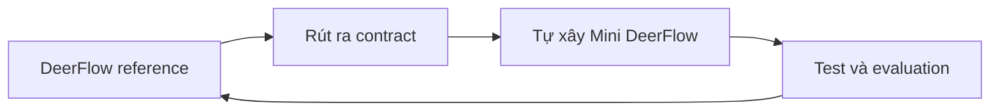
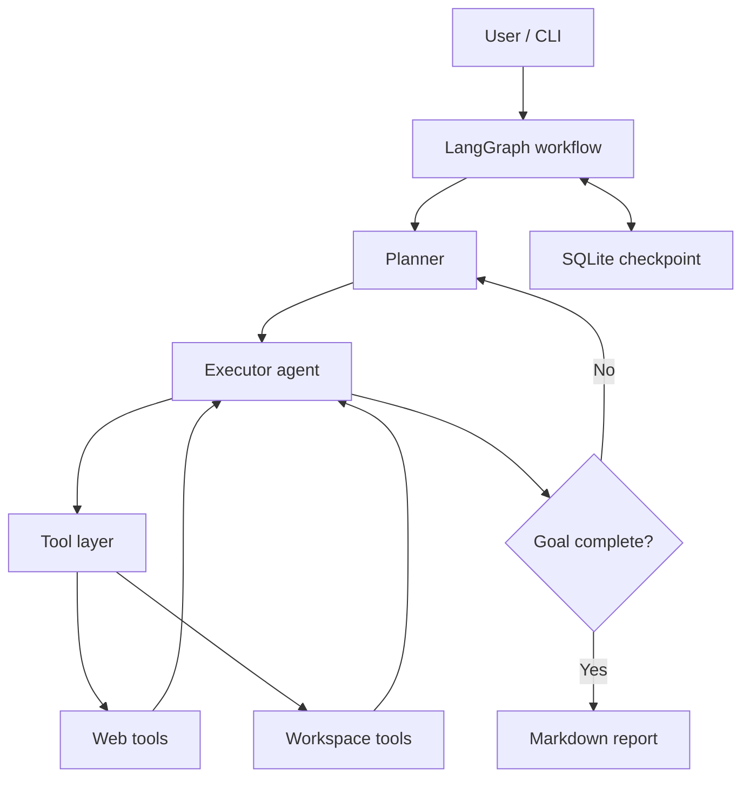

# Roadmap 14 ngày xây dựng Deep Agent đơn giản dựa trên DeerFlow

> **Cập nhật ngày 24/08/2026, sau khi hoàn thành Ngày 2 và khởi động Ngày 3.**  
> Điều chỉnh quan trọng: DeerFlow được dùng làm **reference implementation và test oracle**. Mini DeerFlow là một **Git repository độc lập** do chúng ta tự xây bằng Python, không nằm trong và không phụ thuộc mã nguồn DeerFlow upstream.

## 1. Mục tiêu cuối khóa

Sau 2 tuần, xây được một **Mini DeerFlow** bằng Python có thể:

1. Nhận một yêu cầu nghiên cứu kỹ thuật tương đối dài.
2. Phân tích mục tiêu và tạo kế hoạch nhiều bước.
3. Tự chọn và gọi công cụ tìm kiếm/đọc nội dung web.
4. Ghi và đọc file trong workspace riêng của phiên làm việc.
5. Lặp lại quá trình `plan → act → observe → re-plan` cho đến khi hoàn thành.
6. Sinh báo cáo Markdown có nguồn tham khảo.
7. Lưu checkpoint để tiếp tục một thread cũ.
8. Theo dõi được model call, tool call, token, thời gian và lỗi.
9. Chạy qua CLI; nếu còn thời gian, có API FastAPI hoặc UI Streamlit tối giản.

Đây là dự án **học kiến trúc qua việc tự xây một phiên bản nhỏ**. Repository DeerFlow đã cài ở Ngày 2 chỉ dùng để chạy baseline, trace implementation và đối chiếu hành vi. Code MVP nằm trong sibling repository riêng tại `D:\ViettelDigitalTalent\VAI\projects\mini-deerflow`.

## 2. Phạm vi và tiêu chí thành công

### Use case duy nhất trong MVP

> “Nghiên cứu một chủ đề kỹ thuật từ nhiều nguồn và tạo báo cáo Markdown có trích dẫn.”

Ví dụ kiểm thử cuối khóa:

> So sánh LangGraph và CrewAI để xây agent nghiên cứu; phân tích kiến trúc, persistence, human-in-the-loop và đưa ra khuyến nghị cho một nhóm Python 3 người.

### Definition of Done

- Chạy được một lệnh như `python -m app "<question>"`.
- Agent tạo plan có từ 3–7 bước.
- Có ít nhất 3 tools: `web_search`, `fetch_page`, `workspace_file`.
- Tool input/output dùng schema rõ ràng và được log.
- Có giới hạn vòng lặp, timeout và xử lý lỗi tool.
- Báo cáo cuối có liên kết nguồn, không bịa URL.
- Dừng giữa chừng và resume bằng `thread_id` được.
- Có ít nhất 10 unit tests và 5 evaluation cases.
- Có README mô tả kiến trúc, cách chạy và giới hạn hệ thống.

### Chưa làm trong 2 tuần

- Multi-tenant production, authentication và phân quyền hoàn chỉnh.
- Kubernetes hoặc autoscaling.
- Browser automation đầy đủ.
- Vector database/RAG phức tạp.
- Nhiều loại agent chuyên môn và điều phối động phức tạp.
- Clone đầy đủ frontend, gateway, message channels và toàn bộ middleware của DeerFlow.

### Chiến lược triển khai đã chốt



- **Không tiếp tục tùy biến DeerFlow thành sản phẩm chính.** Hai patch ở Ngày 2 chỉ giúp reference system chạy đúng trên Windows và web fetch trả dữ liệu chính xác.
- Hai repository có vòng đời Git độc lập:
  - `D:\ViettelDigitalTalent\VAI\projects\deep-agent`: DeerFlow reference, remote `upstream`.
  - `D:\ViettelDigitalTalent\VAI\projects\mini-deerflow`: sản phẩm MVP, branch `main` và GitHub repository riêng.
- Mỗi thành phần của Mini DeerFlow sẽ được code ở mức tối giản nhưng có schema, test và bằng chứng chạy được.
- Chỉ quay lại đọc DeerFlow khi cần trả lời một câu hỏi kiến trúc cụ thể hoặc cần baseline để so sánh.
- Definition of Done không giảm: vẫn phải có planning/re-planning, tool loop, workspace, checkpoint/resume, context management, error recovery, tracing/evaluation và ít nhất một sub-agent.

## 3. Kiến trúc mục tiêu



### Ánh xạ sang DeerFlow

| Mini DeerFlow | DeerFlow hiện tại | Điều cần học |
| --- | --- | --- |
| LangGraph workflow | Lead Agent | State, node, edge, vòng lặp agent |
| Planner/executor | Lead Agent + todo middleware | Tách lập kế hoạch khỏi thực thi |
| Tool registry | Built-in/community/MCP tools | Schema, dispatch, error handling |
| Local workspace | Per-thread sandbox workspace | Cô lập dữ liệu và kiểm soát quyền |
| SQLite checkpoint | Persistence/checkpointer | Thread, resume, durable state |
| Context trimming | Summarization middleware | Token budget và context engineering |
| Optional researcher sub-agent | Subagent executor/registry | Delegation và concurrency |
| Logs/traces | Tracing integrations | Quan sát và đánh giá agent |

DeerFlow hiện dùng một lead agent LangGraph, chuỗi middleware, tools, sandbox theo thread, persistence, memory và sub-agent. Ta chỉ chọn phần cốt lõi cần thiết cho một vertical slice.

## 4. Stack đề xuất

- Python 3.12+
- `uv` để quản lý môi trường và dependency
- LangChain + LangGraph
- Một model hỗ trợ tool calling (bắt đầu bằng model API bạn đã có)
- Pydantic cho state/config/tool schema
- SQLite cho checkpoint
- `httpx` + một search provider cho web tools
- `BeautifulSoup` hoặc extractor đơn giản để lấy nội dung trang
- `pytest`, `ruff`, `mypy`
- LangSmith hoặc structured JSON logs cho observability
- FastAPI/Streamlit chỉ là phần mở rộng, sau khi core chạy ổn

## 5. Quy ước học mỗi ngày

Thời lượng gợi ý: **3–4 giờ/ngày**.

- 45–60 phút: học khái niệm.
- 90–150 phút: implement.
- 30–45 phút: test, trace và ghi nhật ký.
- Cuối ngày commit code và viết `docs/day-XX.md`: đã học gì, quyết định gì, lỗi gì, ngày mai làm gì.

Mỗi ngày chỉ kết thúc khi có một đầu ra chạy hoặc kiểm chứng được.

## 6. Kế hoạch 14 ngày

### Ngày 1 — Nền tảng Deep Agent và quyết định kiến trúc — ĐÃ HOÀN THÀNH

**Học:** LLM, message roles, token/context window, tool calling, agent loop; khác nhau giữa chatbot, workflow và deep agent.

**Đã làm:**

- Phân biệt chatbot, workflow, agent và deep agent.
- Xác định DeerFlow là một agent harness gồm lead agent, tools, middleware, sandbox, persistence, context, memory và sub-agent.
- Chốt stack Mini DeerFlow: Python 3.12, `uv`, LangGraph, Pydantic, CLI và GLM-5.3 qua OpenAI-compatible Z.AI.
- Khảo sát môi trường WSL, sau đó chủ động dọn sạch để chuyển sang Windows native.

**Đầu ra:** `report-ngay-01-deerflow.md` và quyết định phạm vi MVP.

**Checkpoint kiến thức:** giải thích được vì sao DeerFlow là harness chứ không chỉ là một prompt.

### Ngày 2 — Dựng DeerFlow reference trên Windows và smoke test — ĐÃ HOÀN THÀNH

**Học:** kiến trúc runtime của DeerFlow; quan hệ giữa model, tools, middleware và runtime; vòng lặp `plan → act → observe → adapt → artifact`.

**Đã làm:**

- Chuẩn hóa Windows toolchain, Docker Desktop, Python 3.12, `uv` và `pnpm`.
- Clone DeerFlow tại `D:\ViettelDigitalTalent\VAI\projects\deep-agent`, tạo nhánh `feature/deep-agent-mvp`.
- Cấu hình GLM-5.3, DuckDuckGo, Jina Reader và AIO container sandbox.
- Khởi chạy DeerFlow tại `http://localhost:2026` và xác nhận HTTP 200.
- Chạy smoke test end-to-end có planning, web tools, Bash sandbox, fallback và artifact.
- Sửa tương thích Docker Desktop socket trên Windows và thêm tùy chọn Jina `no_cache`; 48 test liên quan đều đạt.

**Đầu ra:** `report-ngay-02-deep-agent.md`, smoke-test artifact và hai commit cục bộ `eb9fbd67`, `01039d46`.

### Ngày 3 — Chốt contract và tạo lõi Mini DeerFlow

**Học:** request lifecycle của DeerFlow ở mức vừa đủ; model client, structured output, typed state và ranh giới giữa reference code với code MVP.

**Làm:**

- Trace một request theo tuyến `gateway → run manager/worker → lead agent → model/tool → streamed result`; không đọc lan sang toàn repository.
- Tạo Git repository sibling độc lập `projects\mini-deerflow` bằng `uv`, cấu hình Python 3.12 và secrets qua environment.
- Viết model factory OpenAI-compatible cho GLM-5.3.
- Định nghĩa Pydantic schema `Plan`/`PlanStep` và yêu cầu model sinh plan 3–7 bước.
- Viết unit test cho config và validation của plan.

**Đầu ra:** CLI in plan JSON hợp lệ, test xanh và tài liệu ngắn ánh xạ request lifecycle DeerFlow sang Mini DeerFlow.

### Ngày 4 — LangGraph state và workflow đầu tiên

**Học:** typed state, node, conditional edge, reducer, recursion limit; LangGraph khác một chuỗi hàm thông thường ở đâu.

**Làm:**

- Định nghĩa `AgentState`: messages, goal, plan, current_step, notes, sources, final_answer, errors.
- Tạo graph `START → plan → execute_stub → synthesize → END`.
- Vẽ graph và log state transition.

**Đầu ra:** workflow chạy end-to-end bằng executor giả.

### Ngày 5 — Tool layer và workspace boundary

**Học:** tool schema, validation, timeout, exception boundary, idempotency, least privilege và path traversal.

**Làm:**

- Tạo tool interface/registry và chuẩn hóa `ToolResult(success, data, error, metadata)`.
- Implement `web_search`, `fetch_page` và workspace file tools.
- Tạo `workspaces/{thread_id}/`, giới hạn mọi đường dẫn trong workspace.
- Test input sai, timeout, kết quả rỗng, absolute path và `..` traversal.

**Đầu ra:** ba nhóm tool bắt buộc chạy độc lập với test cho happy path và failure path.

### Ngày 6 — ReAct executor và artifacts

**Học:** vòng lặp Reason/Act/Observe, termination condition, tool hallucination, max-steps; artifact khác state như thế nào.

**Làm:**

- Thay executor giả bằng agent có tool calling.
- Cho agent chọn search/fetch, đọc observation và tiếp tục.
- Thêm `max_iterations`, tool allowlist và lỗi có thể phục hồi.
- Agent lưu notes/report trong workspace; không lưu hoặc log chain-of-thought.

**Đầu ra:** agent hoàn thành câu hỏi cần ít nhất hai tool calls và tạo artifact Markdown.

### Ngày 7 — Planner, re-planner và milestone 1

**Học:** plan-and-execute, phản hồi từ observation, tiêu chí hoàn thành, khi nào nên re-plan.

**Làm:**

- Tạo các node `planner`, `executor`, `reviewer`, `replanner`, `reporter`.
- Reviewer trả structured verdict: `continue | replan | finish` và lý do ngắn.
- Thêm budget: số bước, số model calls, số nguồn và thời gian.
- Chạy 3 bài kiểm thử end-to-end.

**Đầu ra:** MVP v0.1 tạo báo cáo nhiều nguồn; retrospective tuần 1.

### Ngày 8 — Checkpoint, thread và resume

**Học:** short-term state, checkpoint, thread identity, durability; memory không đồng nghĩa với lưu toàn bộ chat.

**Làm:**

- Gắn SQLite checkpointer.
- CLI nhận `--thread-id`; có lệnh xem/list/resume thread.
- Mô phỏng crash sau một bước rồi resume.

**Đầu ra:** tiếp tục đúng run dang dở mà không thực thi lại các bước đã hoàn tất.

### Ngày 9 — Context engineering

**Học:** context window, lost-in-the-middle, prompt injection từ web, summarization và provenance.

**Làm:**

- Tách trusted instructions khỏi untrusted web content.
- Mỗi trang được rút thành note có URL, tiêu đề, thời điểm truy cập và claims.
- Thêm token/character budget; summarize notes cũ khi vượt ngưỡng.
- Yêu cầu final report chỉ dùng nguồn thực sự đã thu thập.

**Đầu ra:** một run dài không vượt context; citations truy ngược được về source records.

### Ngày 10 — Sub-agent tối giản

**Học:** delegation, task boundary, fan-out/fan-in, giới hạn concurrency; khi nào sub-agent có lợi hoặc chỉ làm tốn token.

**Làm:**

- Tạo một `researcher` sub-agent có web tools nhưng không có quyền ghi report cuối.
- Planner chia tối đa 2–3 nhánh nghiên cứu độc lập.
- Chạy song song bằng async, sau đó lead agent tổng hợp.
- Thêm timeout, concurrency cap và partial failure handling.

**Đầu ra:** báo cáo so sánh dùng ít nhất hai nhánh research; benchmark thời gian/cost so với chạy tuần tự.

### Ngày 11 — Safety và sandbox boundary

**Học:** prompt injection, command injection, SSRF, secrets exposure, approval gates; local filesystem không phải sandbox bảo mật.

**Làm:**

- Threat model ngắn cho web + files + model.
- URL allow/deny rules, chặn localhost/private network nếu fetch tùy ý.
- Redact secrets trong logs.
- Nếu thêm shell tool, chạy trong container cô lập, allowlist command và yêu cầu approval; nếu chưa đủ thời gian, không bật shell.

**Đầu ra:** `docs/threat-model.md` và bộ security tests tối thiểu.

### Ngày 12 — Observability và evaluation

**Học:** tracing khác logging; offline eval; trajectory, task success, groundedness, latency và cost.

**Làm:**

- Gắn `run_id`, `thread_id`, node, tool, latency, token usage vào structured logs/traces.
- Tạo 5–10 eval cases cố định với rubric.
- Chấm: hoàn thành nhiệm vụ, đúng citation, coverage, số lỗi tool, thời gian và chi phí.
- Lưu baseline để so sánh thay đổi prompt/model.

**Đầu ra:** `evals/dataset.json`, evaluator script và báo cáo baseline.

### Ngày 13 — API/UI và hardening

**Học:** streaming events, cancellation, API boundary, config separation.

**Làm:**

- Giữ CLI là interface chuẩn; thêm FastAPI hoặc Streamlit mỏng.
- Hiển thị plan, bước hiện tại, tool event và link report.
- Thêm cancel, error message thân thiện và config validation.
- Chạy ruff, mypy, pytest; sửa lỗi quan trọng.

**Đầu ra:** demo có thể quan sát tiến trình; test suite xanh.

### Ngày 14 — Demo, đối chiếu DeerFlow và tổng kết

**Làm:**

- Chạy 3 kịch bản: happy path, tool failure, resume after interruption.
- So sánh Mini DeerFlow với lead agent, middleware, sandbox, persistence, sub-agent và tracing của DeerFlow.
- Viết README: setup, architecture, demo, decisions, security, limitations.
- Ghi backlog 30 ngày tiếp theo và quay demo 5–10 phút nếu cần trình bày.

**Đầu ra:** release `v0.1.0`, báo cáo eval cuối và demo hoàn chỉnh.

## 7. Cấu trúc repository mục tiêu

```text
D:\ViettelDigitalTalent\VAI\projects\
├── deep-agent\       # DeerFlow reference implementation
└── mini-deerflow\    # Deep Agent MVP tự xây
```

Cấu trúc bên trong repository MVP:

```text
mini-deerflow/
├── app/
│   ├── agents/          # planner, executor, reviewer, reporter
│   ├── graph/           # state và graph factory
│   ├── tools/           # web, files, registry
│   ├── workspace/       # thread workspace boundary
│   ├── persistence/     # checkpoint/thread helpers
│   ├── observability/   # logging/tracing
│   ├── config.py
│   └── cli.py
├── evals/
├── tests/
├── docs/
├── workspaces/          # gitignored runtime data
├── .env.example
├── pyproject.toml
└── README.md
```

## 8. Các khái niệm phải tự giải thích được sau 2 tuần

1. Vì sao tool calling chưa tự động biến chatbot thành agent?
2. State của LangGraph khác message history như thế nào?
3. Checkpoint, short-term memory, long-term memory và workspace khác nhau ở đâu?
4. Điều kiện nào khiến agent dừng, re-plan hoặc thất bại?
5. Vì sao nội dung web phải được coi là dữ liệu không đáng tin?
6. Sub-agent giúp gì và gây thêm những loại chi phí/lỗi nào?
7. Làm sao đánh giá agent khi output không hoàn toàn xác định?
8. Vì sao local directory chỉ là boundary logic, chưa phải security sandbox?
9. Middleware giải quyết cross-cutting concerns tốt hơn nhét mọi thứ vào agent prompt ở điểm nào?

## 9. Cổng kiểm tra tiến độ

| Mốc | Phải chứng minh được |
| --- | --- |
| Hết ngày 3 | Project Mini DeerFlow độc lập sinh được plan JSON hợp lệ và có unit test |
| Hết ngày 4 | Graph có typed state và chạy end-to-end bằng executor giả |
| Hết ngày 6 | Model tự gọi tool có giới hạn, xử lý lỗi và tạo artifact |
| Hết ngày 7 | Sinh báo cáo nhiều nguồn từ plan nhiều bước |
| Hết ngày 10 | Resume được và có delegation tối giản |
| Hết ngày 12 | Có trace và eval baseline định lượng |
| Hết ngày 14 | Demo ổn định, test xanh, README đầy đủ |

Nếu trễ tiến độ, ưu tiên theo thứ tự: **correct agent loop → tools → workspace → checkpoint → evaluation → sub-agent → UI**. Không hy sinh tests và safety để làm giao diện đẹp.

## 10. Backlog sau 2 tuần

- Long-term user memory có scope và confidence.
- Skills dạng thư mục/Markdown và dynamic loading.
- MCP tool integration.
- Docker sandbox thật sự cho code execution.
- Human-in-the-loop approval và clarification interrupt.
- Context compaction tốt hơn.
- Upload và xử lý PDF/Office.
- Nhiều model/provider và model routing.
- Postgres, queue, streaming bền vững và deployment.

## 11. Tài liệu gốc nên dùng

- [DeerFlow repository](https://github.com/bytedance/deer-flow)
- [DeerFlow backend architecture](https://github.com/bytedance/deer-flow/tree/main/backend)
- [DeerFlow installation guide](https://github.com/bytedance/deer-flow/blob/main/Install.md)
- [LangGraph documentation](https://docs.langchain.com/oss/python/langgraph/overview)

> Lưu ý: DeerFlow thay đổi nhanh. Khi tên thư mục hoặc lệnh khác roadmap, ưu tiên README/Install.md trên nhánh đang sử dụng và ghi lại commit hash trong nhật ký dự án.
