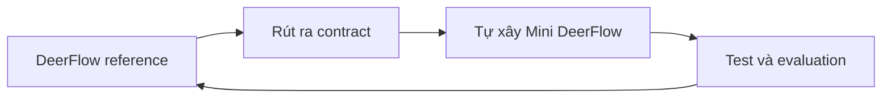
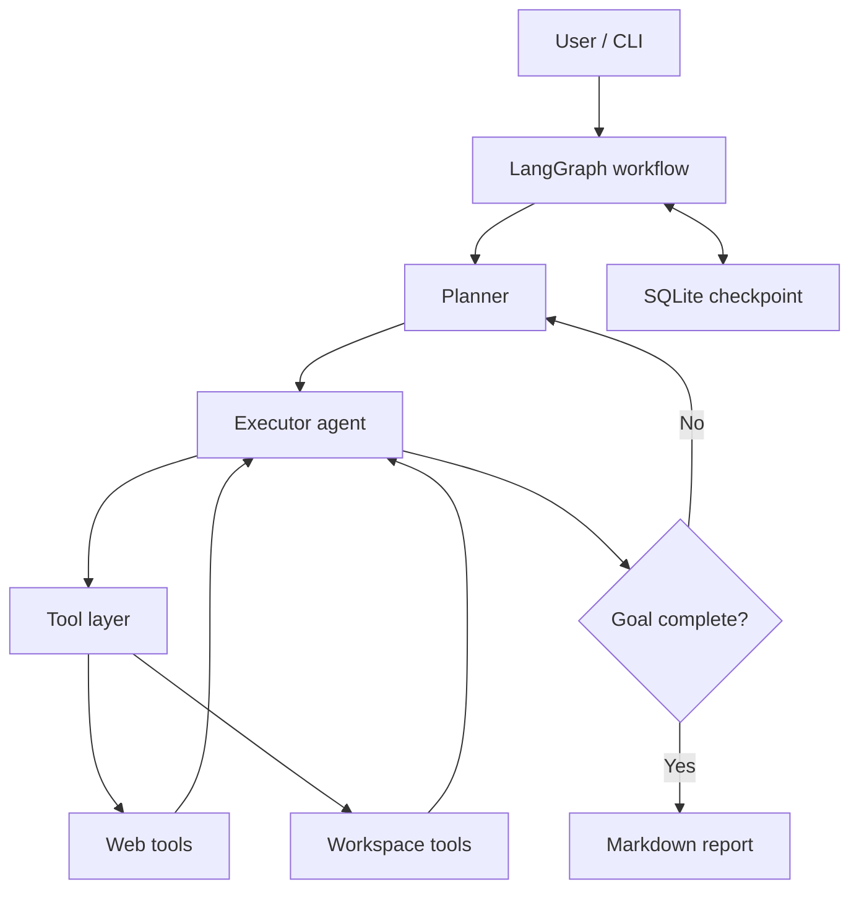

# Roadmap 14 ngày xây dựng Deep Agent đơn giản dựa trên DeerFlow

> **Cập nhật ngày 24/08/2026, sau khi hoàn thành Ngày 2 và khởi động Ngày 3.**  
> Điều chỉnh quan trọng: DeerFlow được dùng làm **reference implementation và test oracle**. Mini DeerFlow là một **Git repository độc lập** do chúng ta tự xây bằng Python, không nằm trong và không phụ thuộc mã nguồn DeerFlow upstream.

> **Cập nhật ngày 03/09/2026, sau khi hoàn thành Ngày 7 (realignment).**
>
> Ngày 7 thực tế ưu tiên **runtime composition**: composition root, `AgentRuntime`, CLI `plan`/`run`, GLM `json_mode` compatibility, cross-step continuity, bounded action-format retry và read-only default registry. Đây là **prerequisite bắt buộc** trước persistence và web research — không có runtime chạy được thì reviewer/replanner và báo cáo nhiều nguồn không có chỗ để gắn vào. Hệ quả realign:
>
> - **Reviewer/replanner** (thuộc Ngày 7 gốc) dời sang **Ngày 10**.
> - **Real web provider và báo cáo nhiều nguồn** (milestone 1 gốc) dời sang **Ngày 09**.
> - Ngày 8 giữ nguyên hướng persistence; Ngày 9–14 phân bổ lại theo dependency order.
> - Các mục chưa làm **không** bị đánh dấu hoàn thành; see "Cổng kiểm tra tiến độ" đã cập nhật.

## 1. Mục tiêu cuối khóa

Sau 2 tuần, xây được một **Mini DeerFlow** bằng Python có thể:

1. Nhận một yêu cầu nghiên cứu kỹ thuật tương đối dài.
2. Phân tích mục tiêu và tạo kế hoạch nhiều bước.
3. Tự chọn và gọi công cụ tìm kiếm/đọc nội dung web.
4. Ghi và đọc file trong workspace riêng của phiên làm việc.
5. Lặp lại quá trình `plan → act → observe → re-plan` cho đến khi hoàn thành.
6. Sinh báo cáo Markdown có nguồn tham khảo.
7. Lưu checkpoint để tiếp tục một thread cũ.
8. Theo dõi được model call, tool call, token, thời gian và lỗi.
9. Chạy qua CLI; nếu còn thời gian, có API FastAPI hoặc UI Streamlit tối giản.

Đây là dự án **học kiến trúc qua việc tự xây một phiên bản nhỏ**. Repository DeerFlow đã cài ở Ngày 2 chỉ dùng để chạy baseline, trace implementation và đối chiếu hành vi. Code MVP nằm trong sibling repository riêng tại `D:\ViettelDigitalTalent\VAI\projects\mini-deerflow`.

## 2. Phạm vi và tiêu chí thành công

### Use case duy nhất trong MVP

> “Nghiên cứu một chủ đề kỹ thuật từ nhiều nguồn và tạo báo cáo Markdown có trích dẫn.”

Ví dụ kiểm thử cuối khóa:

> So sánh LangGraph và CrewAI để xây agent nghiên cứu; phân tích kiến trúc, persistence, human-in-the-loop và đưa ra khuyến nghị cho một nhóm Python 3 người.

### Definition of Done

- Chạy được một lệnh như `python -m app "<question>"`.
- Agent tạo plan có từ 3–7 bước.
- Có ít nhất 3 tools: `web_search`, `fetch_page`, `workspace_file`.
- Tool input/output dùng schema rõ ràng và được log.
- Có giới hạn vòng lặp, timeout và xử lý lỗi tool.
- Báo cáo cuối có liên kết nguồn, không bịa URL.
- Dừng giữa chừng và resume bằng `thread_id` được.
- Có ít nhất 10 unit tests và 5 evaluation cases.
- Có README mô tả kiến trúc, cách chạy và giới hạn hệ thống.

### Chưa làm trong 2 tuần

- Multi-tenant production, authentication và phân quyền hoàn chỉnh.
- Kubernetes hoặc autoscaling.
- Browser automation đầy đủ.
- Vector database/RAG phức tạp.
- Nhiều loại agent chuyên môn và điều phối động phức tạp.
- Clone đầy đủ frontend, gateway, message channels và toàn bộ middleware của DeerFlow.

### Chiến lược triển khai đã chốt



- **Không tiếp tục tùy biến DeerFlow thành sản phẩm chính.** Hai patch ở Ngày 2 chỉ giúp reference system chạy đúng trên Windows và web fetch trả dữ liệu chính xác.
- Hai repository có vòng đời Git độc lập:
  - `D:\ViettelDigitalTalent\VAI\projects\deep-agent`: DeerFlow reference, remote `upstream`.
  - `D:\ViettelDigitalTalent\VAI\projects\mini-deerflow`: sản phẩm MVP, branch `main` và GitHub repository riêng.
- Mỗi thành phần của Mini DeerFlow sẽ được code ở mức tối giản nhưng có schema, test và bằng chứng chạy được.
- Chỉ quay lại đọc DeerFlow khi cần trả lời một câu hỏi kiến trúc cụ thể hoặc cần baseline để so sánh.
- Definition of Done không giảm: vẫn phải có planning/re-planning, tool loop, workspace, checkpoint/resume, context management, error recovery, tracing/evaluation và ít nhất một sub-agent.

## 3. Kiến trúc mục tiêu



### Ánh xạ sang DeerFlow

| Mini DeerFlow | DeerFlow hiện tại | Điều cần học |
| --- | --- | --- |
| LangGraph workflow | Lead Agent | State, node, edge, vòng lặp agent |
| Planner/executor | Lead Agent + todo middleware | Tách lập kế hoạch khỏi thực thi |
| Tool registry | Built-in/community/MCP tools | Schema, dispatch, error handling |
| Local workspace | Per-thread sandbox workspace | Cô lập dữ liệu và kiểm soát quyền |
| SQLite checkpoint | Persistence/checkpointer | Thread, resume, durable state |
| Context trimming | Summarization middleware | Token budget và context engineering |
| Optional researcher sub-agent | Subagent executor/registry | Delegation và concurrency |
| Logs/traces | Tracing integrations | Quan sát và đánh giá agent |

DeerFlow hiện dùng một lead agent LangGraph, chuỗi middleware, tools, sandbox theo thread, persistence, memory và sub-agent. Ta chỉ chọn phần cốt lõi cần thiết cho một vertical slice.

## 4. Stack đề xuất

- Python 3.12+
- `uv` để quản lý môi trường và dependency
- LangChain + LangGraph
- Một model hỗ trợ tool calling (bắt đầu bằng model API bạn đã có)
- Pydantic cho state/config/tool schema
- SQLite cho checkpoint
- `httpx` + một search provider cho web tools
- `BeautifulSoup` hoặc extractor đơn giản để lấy nội dung trang
- `pytest`, `ruff`, `mypy`
- LangSmith hoặc structured JSON logs cho observability
- FastAPI/Streamlit chỉ là phần mở rộng, sau khi core chạy ổn

## 5. Quy ước học mỗi ngày

Thời lượng gợi ý: **3–4 giờ/ngày**.

- 45–60 phút: học khái niệm.
- 90–150 phút: implement.
- 30–45 phút: test, trace và ghi nhật ký.
- Cuối ngày commit code và viết `docs/day-XX.md`: đã học gì, quyết định gì, lỗi gì, ngày mai làm gì.

Mỗi ngày chỉ kết thúc khi có một đầu ra chạy hoặc kiểm chứng được.

## 6. Kế hoạch 14 ngày

### Ngày 1 — Nền tảng Deep Agent và quyết định kiến trúc — ĐÃ HOÀN THÀNH

**Học:** LLM, message roles, token/context window, tool calling, agent loop; khác nhau giữa chatbot, workflow và deep agent.

**Đã làm:**

- Phân biệt chatbot, workflow, agent và deep agent.
- Xác định DeerFlow là một agent harness gồm lead agent, tools, middleware, sandbox, persistence, context, memory và sub-agent.
- Chốt stack Mini DeerFlow: Python 3.12, `uv`, LangGraph, Pydantic, CLI và GLM-5.3 qua OpenAI-compatible Z.AI.
- Khảo sát môi trường WSL, sau đó chủ động dọn sạch để chuyển sang Windows native.

**Đầu ra:** `report-ngay-01-deerflow.md` và quyết định phạm vi MVP.

**Checkpoint kiến thức:** giải thích được vì sao DeerFlow là harness chứ không chỉ là một prompt.

### Ngày 2 — Dựng DeerFlow reference trên Windows và smoke test — ĐÃ HOÀN THÀNH

**Học:** kiến trúc runtime của DeerFlow; quan hệ giữa model, tools, middleware và runtime; vòng lặp `plan → act → observe → adapt → artifact`.

**Đã làm:**

- Chuẩn hóa Windows toolchain, Docker Desktop, Python 3.12, `uv` và `pnpm`.
- Clone DeerFlow tại `D:\ViettelDigitalTalent\VAI\projects\deep-agent`, tạo nhánh `feature/deep-agent-mvp`.
- Cấu hình GLM-5.3, DuckDuckGo, Jina Reader và AIO container sandbox.
- Khởi chạy DeerFlow tại `http://localhost:2026` và xác nhận HTTP 200.
- Chạy smoke test end-to-end có planning, web tools, Bash sandbox, fallback và artifact.
- Sửa tương thích Docker Desktop socket trên Windows và thêm tùy chọn Jina `no_cache`; 48 test liên quan đều đạt.

**Đầu ra:** `report-ngay-02-deep-agent.md`, smoke-test artifact và hai commit cục bộ `eb9fbd67`, `01039d46`.

### Ngày 3 — Chốt contract và tạo lõi Mini DeerFlow — ĐÃ HOÀN THÀNH

**Học:** request lifecycle của DeerFlow ở mức vừa đủ; model client, structured output, typed state và ranh giới giữa reference code với code MVP.

**Làm:**

- Trace một request theo tuyến `gateway → run manager/worker → lead agent → model/tool → streamed result`; không đọc lan sang toàn repository.
- Tạo Git repository sibling độc lập `projects\mini-deerflow` bằng `uv`, cấu hình Python 3.12 và secrets qua environment.
- Viết model factory OpenAI-compatible cho GLM-5.3.
- Định nghĩa Pydantic schema `Plan`/`PlanStep` và yêu cầu model sinh plan 3–7 bước.
- Viết unit test cho config và validation của plan.

**Đầu ra:** CLI in plan JSON hợp lệ, test xanh và tài liệu ngắn ánh xạ request lifecycle DeerFlow sang Mini DeerFlow.

### Ngày 4 — LangGraph state và workflow đầu tiên — ĐÃ HOÀN THÀNH

**Học:** typed state, node, conditional edge, reducer, recursion limit; LangGraph khác một chuỗi hàm thông thường ở đâu.

**Làm:**

- Định nghĩa `AgentState`: messages, goal, plan, current_step, notes, sources, final_answer, errors.
- Tạo graph `START → plan → execute_stub → synthesize → END`.
- Vẽ graph và log state transition.

**Đầu ra:** workflow chạy end-to-end bằng executor giả.

### Ngày 5 — Tool layer và workspace boundary — ĐÃ HOÀN THÀNH

> **Thực tế so với kế hoạch:** đã hoàn thành workspace file tools và ToolRegistry/ToolRunner đầy đủ; `web_search`/`fetch_page` mới dừng ở **provider contracts và tool adapters** (test bằng fake provider) — real web provider chưa compose, dời sang Ngày 09.

**Học:** tool schema, validation, timeout, exception boundary, idempotency, least privilege và path traversal.

**Làm:**

- Tạo tool interface/registry và chuẩn hóa `ToolResult(success, data, error, metadata)`.
- Implement `web_search`, `fetch_page` và workspace file tools.
- Tạo `workspaces/{thread_id}/`, giới hạn mọi đường dẫn trong workspace.
- Test input sai, timeout, kết quả rỗng, absolute path và `..` traversal.

**Đầu ra:** ba nhóm tool bắt buộc chạy độc lập với test cho happy path và failure path.

### Ngày 6 — ReAct executor và artifacts — ĐÃ HOÀN THÀNH

> **Thực tế so với kế hoạch:** executor là **bounded LLM action loop** (model chọn `tool_call`/`complete_step` qua strict schema) thay vì ReAct tự do — chủ đích để kiểm soát termination. Phần **artifact Markdown trong workspace** chưa có, dời sang Ngày 09 cùng báo cáo nhiều nguồn.

**Học:** vòng lặp Reason/Act/Observe, termination condition, tool hallucination, max-steps; artifact khác state như thế nào.

**Làm:**

- Thay executor giả bằng agent có tool calling.
- Cho agent chọn search/fetch, đọc observation và tiếp tục.
- Thêm `max_iterations`, tool allowlist và lỗi có thể phục hồi.
- Agent lưu notes/report trong workspace; không lưu hoặc log chain-of-thought.

**Đầu ra:** agent hoàn thành câu hỏi cần ít nhất hai tool calls và tạo artifact Markdown.

### Ngày 7 — Planner, re-planner và milestone 1 — ĐÃ HOÀN THÀNH (theo phạm vi realigned)

> Kế hoạch gốc của ngày này là reviewer/replanner và báo cáo nhiều nguồn. Thực tế chuyển sang **runtime composition** vì đó là prerequisite của toàn bộ phần còn lại; xem revision note đầu tài liệu.

**Mục tiêu:** chuyển các module Ngày 3–6 thành một executable bounded research agent chạy được từ CLI.

**Học:** composition root, dependency injection, sync/async boundary của LangGraph, capability-aware planning, phân biệt soft prompt guardrail và hard runtime boundary.

**Đã làm:**

- Composition root `create_default_agent_runtime` (model, workspace, registry, planner, selector, graph — wire ở một chỗ duy nhất) và `AgentRuntime` với `RuntimeLimits`: per-step budget, total-run budget, recursion limit.
- CLI hai subcommand `plan`/`run`; exit code 0/1/2; `run` read-only mặc định, `--allow-write` opt-in.
- Capability-aware planner: nhận `registry.definitions()` khi chạy `run`; `plan` standalone là capability-agnostic.
- GLM planner compatibility: chuyển `function_calling` sang `json_mode` sau sự cố drop trường `title`; vẫn validate bằng strict `Plan`; bounded attempts.
- Cross-step continuity qua `completed_step_summaries` (tối đa 7, được coi là untrusted data).
- Bounded action-format retry (2 attempts) với corrective message tĩnh cho action selector; không retry infrastructure error.
- Controlled full-agent smoke: `list_files` + `read_file`, 2/2 tool calls thành công, 0 failed, 0 execution errors, sentinel chỉ biết được qua `read_file`, workspace hash bất biến, exit 0.

**Chưa làm so với kế hoạch gốc (dời, không đánh dấu hoàn thành):**

- Reviewer/replanner → Ngày 10.
- Real web provider composition và báo cáo nhiều nguồn → Ngày 09.
- Richer source/citation architecture → Ngày 09–10.

**Đầu ra:** executable bounded local research agent chạy end-to-end; README và tài liệu kỹ thuật Ngày 7; 260 unit tests xanh.

**Điều kiện hoàn thành:** đạt — agent chạy end-to-end từ CLI với bằng chứng smoke thật; giới hạn (chưa multi-source web) được ghi rõ.

### Ngày 8 — Checkpoint, thread và resume

**Mục tiêu:** run có thể bị gián đoạn và tiếp tục đúng chỗ dừng mà không thực thi lại các step đã hoàn tất.

**Học:** short-term state, checkpoint, thread identity, durability; memory không đồng nghĩa với lưu toàn bộ chat.

**Làm:**

- Gắn SQLite checkpointer cho graph hiện có.
- CLI nhận `--thread-id`; có lệnh xem/list/resume thread.
- Mô phỏng crash sau một bước rồi resume.

**Kiểm chứng:**

- Test deterministic: chạy N step, ghi checkpoint, tiến trình "chết", resume — assert các step đã xong không chạy lại (đếm tool calls/decisions).
- Unit test cho thread identity sai/không tồn tại.

**Không làm trong ngày này:** không cần production database hay migration phức tạp — SQLite cục bộ là đủ cho MVP.

**Đầu ra:** tiếp tục đúng run dang dở mà không thực thi lại các bước đã hoàn tất.

**Điều kiện hoàn thành:** crash-resume test chạy xanh; resume không tăng tool-call counters của các step đã xong.

### Ngày 9 — Real web providers, multi-source evidence và citation tracking

**Mục tiêu:** agent nghiên cứu được từ nhiều nguồn web thật và truy ngược citation về bằng chứng.

**Học:** provider boundary, rate limit/failure của search/fetch, provenance; tách trusted instructions khỏi untrusted web content.

**Làm:**

- Cài real `WebSearchProvider`/`WebFetchProvider` (ứng viên: DuckDuckGo và Jina Reader như DeerFlow reference đã dùng) sau các contracts có sẵn từ Ngày 5.
- Compose web tools vào runtime mặc định (chỉ khi provider được cấu hình; fail rõ ràng nếu thiếu).
- Mỗi trang fetch được rút thành evidence record: URL, tiêu đề, thời điểm truy cập, claims.
- Typed/traceable citations: cross-check URL trong `sources` với evidence records thật; URL không có bằng chứng bị từ chối.
- Lưu báo cáo Markdown cuối vào workspace (artifact còn nợ từ Ngày 6).

**Kiểm chứng:**

- Unit test citation cross-check với fake provider; smoke thật với query đơn giản.
- Test run không có provider config phải thất bại sạch, không crash.

**Không làm trong ngày này:** không làm summarization/token budget (Ngày 11), không làm reviewer (Ngày 10).

**Đầu ra:** báo cáo nhiều nguồn có citation truy ngược được về evidence records; artifact Markdown trong workspace.

**Điều kiện hoàn thành:** một run thật dùng ít nhất search + fetch, final answer chỉ cite URL có trong evidence records.

### Ngày 10 — Reviewer/replanner và evidence-quality loop

**Mục tiêu:** agent tự đánh giá tiến độ theo bằng chứng và quyết định tiếp tục, lập lại plan hoặc kết thúc.

**Học:** plan-and-execute, phản hồi từ observation, tiêu chí hoàn thành, khi nào nên re-plan (nội dung Ngày 7 gốc).

**Làm:**

- Node `reviewer` trả structured verdict `continue | replan | finish` kèm lý do ngắn, input là evidence records và plan state.
- Node `replanner` chỉ chạy theo verdict, sinh plan mới cũng qua strict schema.
- Budget tổng: số bước re-plan tối đa để tránh vòng lặp planner.
- Chạy 3 kịch bản end-to-end: happy path, thiếu bằng chứng → replan, đủ sớm → finish.

**Kiểm chứng:** unit test verdict routing; integration test vòng replan có giới hạn; smoke thật 3 kịch bản.

**Không làm trong ngày này:** không thêm sub-agent (Ngày 12), không đổi context strategy.

**Đầu ra:** evidence-quality loop hoạt động; MVP có re-planning thật.

**Điều kiện hoàn thành:** replan xảy ra đúng khi evidence thiếu và dừng sau khi đủ; không vòng lặp planner vô hạn.

### Ngày 11 — Context management, token-aware truncation và long-run limits

**Mục tiêu:** run dài không vượt context window và không đốt token vô ích.

**Học:** context window, lost-in-the-middle, summarization, provenance trong context (nội dung "context engineering" của Ngày 9 gốc).

**Làm:**

- Token/character budget cho observations: truncate nội dung file/web lớn với đánh dấu rõ (giải technical debt đã ghi nhận).
- Summarize notes cũ khi vượt ngưỡng, giữ nguyên provenance.
- Tách rõ trusted instructions khỏi untrusted evidence trong mọi prompt.
- Đóng các debt nhỏ đang hoãn nếu còn thời gian: corrective feedback cho planner retry.

**Kiểm chứng:** test run với file lớn không vượt budget context; test summarized notes vẫn giữ citation.

**Không làm trong ngày này:** không đổi planner/selector schema.

**Đầu ra:** một run dài không vượt context; notes cũ được summarize có provenance.

**Điều kiện hoàn thành:** run dài (nhiều nguồn) hoàn thành mà không lỗi context length.

### Ngày 12 — Bounded sub-agent và delegation

**Mục tiêu:** tách nhánh nghiên cứu độc lập cho sub-agent, lead agent tổng hợp.

**Học:** delegation, task boundary, fan-out/fan-in, giới hạn concurrency; khi nào sub-agent có lợi hoặc chỉ làm tốn token.

**Làm:**

- Tạo một `researcher` sub-agent có web tools nhưng không có quyền ghi report cuối.
- Planner chia tối đa 2–3 nhánh nghiên cứu độc lập.
- Chạy song song bằng async, sau đó lead agent tổng hợp.
- Thêm timeout, concurrency cap và partial failure handling (một nhánh fail không giết cả run).

**Kiểm chứng:** test fan-out/fan-in với fake agents; test partial failure; benchmark thời gian/cost so với chạy tuần tự.

**Không làm trong ngày này:** không làm HITL/eval (Ngày 13).

**Đầu ra:** báo cáo so sánh dùng ít nhất hai nhánh research; benchmark tuần tự vs song song.

**Điều kiện hoàn thành:** delegation bounded hoạt động; một nhánh fail vẫn ra report với ghi rõ nhánh thiếu.

### Ngày 13 — Safety approvals, observability và evaluation

**Mục tiêu:** có approval boundary cho thao tác nhạy cảm, trace được toàn bộ run và bộ eval baseline.

**Học:** prompt injection, SSRF, secrets exposure, approval gates; tracing khác logging; offline eval với trajectory, task success, groundedness, latency, cost.

**Làm:**

- Threat model ngắn cho web + files + model (`docs/threat-model.md`).
- URL allow/deny rules cho fetch: chặn localhost/private network; redact secrets trong logs.
- Approval gate tối giản: thao tác ghi/xóa hoặc fetch ngoài allowlist yêu cầu xác nhận qua CLI (HITL interrupt) — hoặc ghi rõ deferred nếu quá tải.
- Gắn `run_id`, `thread_id`, node, tool, latency, token usage vào structured logs/traces.
- 5–10 eval cases cố định với rubric: hoàn thành nhiệm vụ, đúng citation, coverage, số lỗi tool, thời gian, chi phí; lưu baseline.

**Kiểm chứng:** security tests tối thiểu (SSRF, redaction, allowlist); evaluator script chạy được và ra báo cáo baseline.

**Không làm trong ngày này:** không bật shell tool/container (giữ deferred theo kế hoạch cũ); API/UI vẫn deferred (xem Ngày 14).

**Đầu ra:** `docs/threat-model.md`, `evals/dataset.json`, evaluator script, báo cáo baseline.

**Điều kiện hoàn thành:** mọi run ghi được trace theo `run_id`/`thread_id`; eval baseline có số liệu so sánh được.

### Ngày 14 — End-to-end hardening, demo và tổng kết

**Mục tiêu:** đóng kỹ thuật còn lại ở mức MVP, demo ổn định và tổng kết khóa học.

**Học:** hardest part của agent không phải happy path — failure, resume, và giới hạn hệ thống.

**Làm:**

- Hardening các debt nhỏ còn lại nếu chưa xử lý ở Ngày 11: CLI formatting sạch cho API infrastructure errors; budget exhaustion cho phép complete-with-limitation thay vì cắt cụt.
- Chạy 3 kịch bản demo: happy path, tool failure, resume after interruption.
- So sánh Mini DeerFlow với lead agent, middleware, sandbox, persistence, sub-agent và tracing của DeerFlow.
- Hoàn thiện README: setup, architecture, demo, decisions, security, limitations và deferred work.
- Ghi backlog 30 ngày tiếp theo; quay demo 5–10 phút nếu cần trình bày.
- Tùy chọn (chỉ khi còn thời gian): FastAPI/Streamlit mỏng hiển thị plan/tool events — nếu không làm, ghi rõ deferred vào backlog.

**Kiểm chứng:** ruff/mypy/pytest sạch; 3 kịch bản demo chạy được lặp lại; eval cuối so với baseline Ngày 13.

**Không làm trong ngày này:** không thêm capability mới ngoài hardening và demo.

**Đầu ra:** release `v0.1.0`, báo cáo eval cuối, demo hoàn chỉnh, README đầy đủ với giới hạn và deferred work ghi rõ.

**Điều kiện hoàn thành:** Deep Agent MVP demo end-to-end ổn định — MVP hoàn thành, production hardening còn lại được liệt kê rõ là deferred.

## 7. Cấu trúc repository mục tiêu

```text
D:\ViettelDigitalTalent\VAI\projects\
├── deep-agent\       # DeerFlow reference implementation
└── mini-deerflow\    # Deep Agent MVP tự xây
```

Cấu trúc bên trong repository MVP:

```text
mini-deerflow/
├── app/
│   ├── agents/          # planner, executor, reviewer, reporter
│   ├── graph/           # state và graph factory
│   ├── tools/           # web, files, registry
│   ├── workspace/       # thread workspace boundary
│   ├── persistence/     # checkpoint/thread helpers
│   ├── observability/   # logging/tracing
│   ├── config.py
│   └── cli.py
├── evals/
├── tests/
├── docs/
├── workspaces/          # gitignored runtime data
├── .env.example
├── pyproject.toml
└── README.md
```

## 8. Các khái niệm phải tự giải thích được sau 2 tuần

1. Vì sao tool calling chưa tự động biến chatbot thành agent?
2. State của LangGraph khác message history như thế nào?
3. Checkpoint, short-term memory, long-term memory và workspace khác nhau ở đâu?
4. Điều kiện nào khiến agent dừng, re-plan hoặc thất bại?
5. Vì sao nội dung web phải được coi là dữ liệu không đáng tin?
6. Sub-agent giúp gì và gây thêm những loại chi phí/lỗi nào?
7. Làm sao đánh giá agent khi output không hoàn toàn xác định?
8. Vì sao local directory chỉ là boundary logic, chưa phải security sandbox?
9. Middleware giải quyết cross-cutting concerns tốt hơn nhét mọi thứ vào agent prompt ở điểm nào?

## 9. Cổng kiểm tra tiến độ

| Mốc | Phải chứng minh được |
| --- | --- |
| Hết ngày 3 | Project Mini DeerFlow độc lập sinh được plan JSON hợp lệ và có unit test |
| Hết ngày 4 | Graph có typed state và chạy end-to-end bằng executor giả |
| Hết ngày 6 | Model tự gọi tool có giới hạn và xử lý lỗi qua secure tool layer (artifact Markdown dời sang Ngày 09) |
| Hết ngày 7 | Executable bounded local research agent chạy end-to-end từ CLI, read-only smoke thành công (chưa có multi-source web research) |
| Hết ngày 8 | Resume được run dang dở sau gián đoạn bằng `thread_id`, không chạy lại step đã xong |
| Hết ngày 9 | Báo cáo nhiều nguồn có citation truy ngược được về evidence records |
| Hết ngày 10 | Reviewer/replanner hoạt động theo structured verdict, re-plan có giới hạn |
| Hết ngày 12 | Delegation tối giản qua sub-agent bounded, xử lý partial failure |
| Hết ngày 13 | Có trace theo `run_id`/`thread_id`, eval baseline định lượng và approval boundary tối giản |
| Hết ngày 14 | Deep Agent MVP demo end-to-end ổn định, test xanh, README và deferred work ghi rõ |

Phân biệt bắt buộc khi chốt ngày 14: **MVP phải hoàn thành** là everything trong các mốc trên; **hardening/production work còn lại** (multi-tenant, deployment bền vững, container sandbox cho shell, UI đầy đủ, context compaction tốt hơn) thuộc backlog sau 2 tuần.

Nếu trễ tiến độ, ưu tiên theo thứ tự: **correct agent loop → tools → workspace → checkpoint → evaluation → sub-agent → UI**. Không hy sinh tests và safety để làm giao diện đẹp.

## 10. Backlog sau 2 tuần

- Long-term user memory có scope và confidence.
- Skills dạng thư mục/Markdown và dynamic loading.
- MCP tool integration.
- Docker sandbox thật sự cho code execution.
- Human-in-the-loop approval và clarification interrupt.
- Context compaction tốt hơn.
- Upload và xử lý PDF/Office.
- Nhiều model/provider và model routing.
- Postgres, queue, streaming bền vững và deployment.

## 11. Tài liệu gốc nên dùng

- [DeerFlow repository](https://github.com/bytedance/deer-flow)
- [DeerFlow backend architecture](https://github.com/bytedance/deer-flow/tree/main/backend)
- [DeerFlow installation guide](https://github.com/bytedance/deer-flow/blob/main/Install.md)
- [LangGraph documentation](https://docs.langchain.com/oss/python/langgraph/overview)

> Lưu ý: DeerFlow thay đổi nhanh. Khi tên thư mục hoặc lệnh khác roadmap, ưu tiên README/Install.md trên nhánh đang sử dụng và ghi lại commit hash trong nhật ký dự án.
