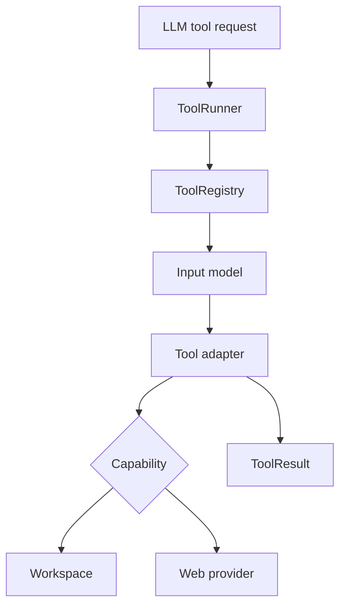

# Secure Tool Execution Layer — Day 05

## Purpose

Day 05 introduces a secure and testable tool execution layer for
Mini DeerFlow.

The layer allows the agent to:

- Execute only registered tools.
- Validate LLM-generated arguments.
- Enforce execution timeouts.
- Convert expected failures into structured results.
- Preserve cancellation signals.
- Read and write files inside an isolated workspace.
- Use provider-independent web search and fetch adapters.

Real HTTP providers are intentionally deferred. Web tools currently
depend on provider protocols and can be tested with fake providers.

## Architecture



## Component responsibilities

| Component              | Responsibility                                     |
| ---------------------- | -------------------------------------------------- |
| `ToolInput`            | Base model for strict and immutable tool arguments |
| `ToolResult`           | JSON-compatible success or failure result          |
| `Tool`                 | Runtime-checkable structural protocol              |
| `ToolRegistry`         | Allowlist of tools permitted to execute            |
| `ToolRunner`           | Validation, timeout and exception boundary         |
| `Workspace`            | Filesystem path and size security boundary         |
| File tools             | Adapt workspace operations to tool contracts       |
| Web tools              | Adapt provider operations to tool contracts        |
| Web provider protocols | Decouple tools from external vendors               |

## Tool request lifecycle

A tool request contains a registered name and raw JSON arguments.

```text
tool_name + raw arguments
    → registry lookup
    → Pydantic input validation
    → timeout-controlled execution
    → runtime result validation
    → ToolResult
```

The registry lookup happens before argument validation. This prevents
an LLM-generated tool name from triggering dynamic imports or arbitrary
code execution.

## Tool result invariants

A successful result must satisfy:

```python
result.success is True
result.data is not None
result.error is None
```

A failed result must satisfy:

```python
result.success is False
result.data is None
result.error is not None
```

`ToolResult.data` and metadata are restricted to JSON-compatible
values so results can be persisted, streamed and sent to an LLM.

## Registry as an allowlist

Tool names must follow this format:

```text
^[a-z][a-z0-9_]{0,63}$
```

Examples of valid names:

```text
read_file
write_file
web_search
web_fetch
```

Examples rejected by the registry:

```text
delete-database
../secret
WebSearch
_hidden
```

The registry rejects:

- Duplicate names.
- Missing protocol attributes.
- Invalid input models.
- Empty descriptions.
- Non-positive or non-finite timeouts.
- Non-boolean idempotency metadata.

## Execution boundary

`ToolRunner` handles five major branches:

| Branch               | Result                               |
| -------------------- | ------------------------------------ |
| Unknown tool         | Safe failure                         |
| Invalid arguments    | Safe validation failure              |
| Timeout              | Safe timeout failure                 |
| Expected tool result | Returned unchanged                   |
| Unexpected exception | Logged and converted to safe failure |

The runner catches ordinary exceptions:

```python
except Exception:
```

It does not catch `BaseException`. Therefore cancellation signals such
as `asyncio.CancelledError` can propagate to the workflow runtime.

Internal exception messages are logged but are not returned to the
LLM. This avoids exposing credentials, internal hosts, absolute paths
or stack traces.

## Workspace boundary

The workspace restricts file operations to one configured root.

```text
relative path
    → reject absolute path
    → join with root
    → resolve path
    → check filesystem relationship
    → perform operation
```

String prefix checks are not used because paths such as
`workspace-evil` can share the same textual prefix as `workspace`
without being inside it.

The workspace protects against:

- Absolute path access.
- Parent traversal using `..`.
- Existing symlink and junction escapes.
- Oversized reads.
- Oversized writes.
- Reading directories as files.
- Writing over directories.

Read and write limits are measured in UTF-8 bytes rather than Python
character count.

## File tools

The following tools are available:

| Tool         | Operation                              | Idempotent |
| ------------ | -------------------------------------- | ---------: |
| `read_file`  | Read one UTF-8 workspace file          |        Yes |
| `write_file` | Write or replace one workspace file    |        Yes |
| `list_files` | List files below a workspace directory |        Yes |

`write_file` is idempotent because writing the same content to the same
path multiple times produces the same final state.

Filesystem calls execute through `asyncio.to_thread()` so synchronous
disk I/O does not block the event loop.

Expected `WorkspaceError` failures are handled by file tools.
Unexpected filesystem failures propagate to `ToolRunner`.

## Web contracts

Search providers normalize results into:

```json
{
  "title": "LangGraph documentation",
  "url": "https://docs.example.com/langgraph",
  "snippet": "Stateful agent orchestration."
}
```

Fetch providers normalize pages into:

```json
{
  "url": "https://docs.example.com/langgraph",
  "title": "LangGraph documentation",
  "content": "Page content",
  "status_code": 200,
  "content_type": "text/html"
}
```

`WebSearchProvider` and `WebFetchProvider` are structural protocols.
Tools therefore do not depend directly on DuckDuckGo, Jina, Tavily or
another vendor.

## Web tool boundaries

`WebSearchTool`:

- Normalizes the query.
- Restricts `max_results` to the range 1–10.
- Applies the result limit even if the provider ignores it.
- Rejects invalid provider result types.

`WebFetchTool`:

- Accepts only syntactically valid HTTP or HTTPS URLs.
- Rejects invalid provider result types.
- Converts expected provider failures to safe tool failures.

HTTP URL syntax validation is not an SSRF defense. A future real fetch
provider must additionally block loopback, private, link-local and
metadata addresses and must validate redirects.

## Error ownership

| Failure                           | Owner                           |
| --------------------------------- | ------------------------------- |
| Invalid LLM arguments             | `ToolRunner`                    |
| Unknown tool                      | `ToolRegistry` and `ToolRunner` |
| Workspace policy violation        | `Workspace`                     |
| Expected workspace failure        | File tool                       |
| Expected provider failure         | Web tool                        |
| Unexpected implementation failure | `ToolRunner`                    |
| Cancellation                      | Agent runtime                   |

## Test strategy

Tests use deterministic fake tools and providers. No test requires an
LLM API or public network request.

Day 05 verification result:

```text
136 passed
2 skipped
```

The two skipped tests require Windows symlink creation privileges.
Absolute path and parent traversal protection remain covered on every
platform.

Test coverage includes:

- Tool result invariants.
- JSON serialization.
- Registry allowlisting.
- Invalid tool definitions.
- Input validation.
- Timeout handling.
- Exception sanitization.
- Cancellation propagation.
- Workspace traversal protection.
- UTF-8 byte limits.
- File-tool idempotency.
- Provider protocol validation.
- Web result normalization.
- Provider output validation.

## Current limitations

- No real search provider is connected.
- No real fetch provider is connected.
- SSRF network policy is not yet implemented.
- Filesystem thread cancellation cannot forcibly stop an operating
  system call already running in a worker thread.
- Tools are not yet connected to the LangGraph workflow.
- The current workflow still uses `execute_stub`.

## Next step

Day 06 will connect the tool layer to the agent execution loop.

The next workflow must allow the model to:

1. Select a registered tool.
2. Produce validated arguments.
3. Execute through `ToolRunner`.
4. Observe `ToolResult`.
5. Continue or stop according to workflow state and execution limits.