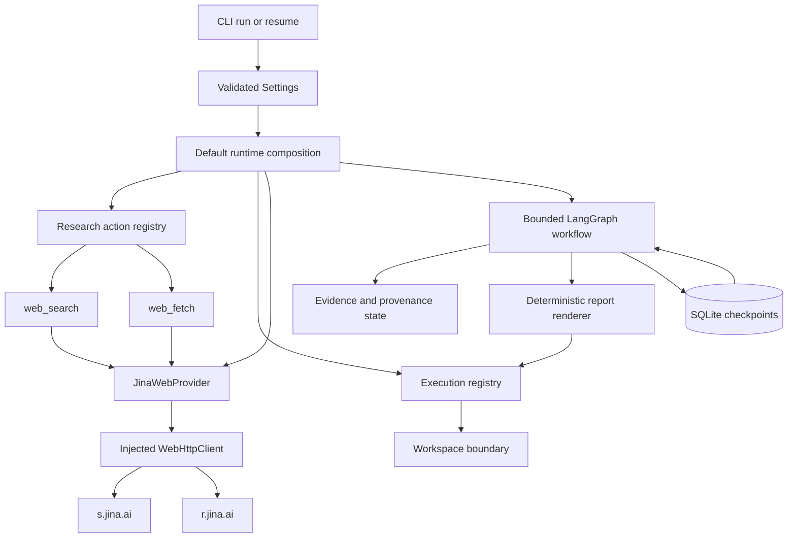
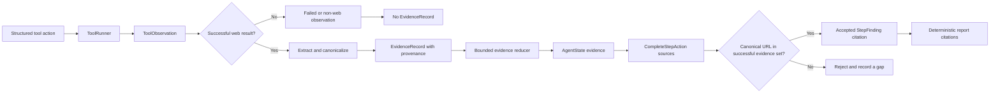
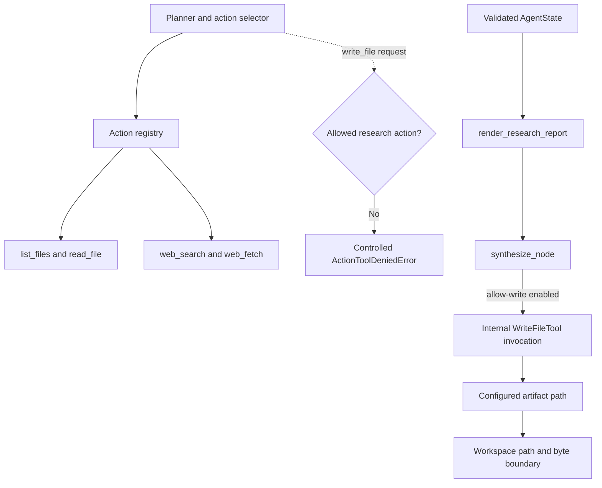

# Web Evidence and Citation Runtime - Day 09

## Purpose

Day 09 turns Mini DeerFlow's bounded, persistent agent loop into a web research
runtime whose citations can be traced back to successful tool observations. It
adds a real Jina provider, typed evidence and provenance, citation validation,
and deterministic Markdown report generation without weakening the limits and
checkpoint behavior established earlier.

This document is for software engineers learning how an agent system should
separate model decisions, network access, evidence, citations, and filesystem
side effects. It explains why each boundary exists as well as what it does not
prove. Mini DeerFlow remains a learning-oriented prototype, not a
production-ready research system.

## Day 08 baseline

Day 08 supplied the durable execution substrate described in the
[Day 08 technical document](persistent-thread-runtime-day-08.md) and
[Day 08 learning report](report-ngay-08-mini-deerflow.md):

- a bounded LangGraph plan-act-observe workflow;
- stable thread identifiers and SQLite checkpoints;
- distinct `run`, `resume`, and `threads` operations;
- a serializer allowlist for application state types;
- a read-only default workspace tool set;
- per-step, total-tool-call, and recursion limits; and
- controlled persistence errors.

The Day 08 state could survive process interruption, but it did not yet carry a
typed, multi-source web evidence model. A final answer could contain source
URLs structurally, yet the workflow had no application-level proof that a URL
came from a successful web observation. It also did not produce the research
artifact that had been deferred from Day 06.

Day 09 builds on checkpointing rather than replacing it. Persistence remains a
durability mechanism: SQLite does not authenticate checkpoint data, guarantee
its integrity, or make external tool effects exactly-once.

## Day 09 objectives

The Day 09 vertical slice has five objectives:

1. Compose concrete web search and page-fetch behavior behind the existing
   provider contracts.
2. Convert successful web observations into bounded, typed evidence with
   call-level provenance.
3. Accept citations only when their canonical URLs are members of the
   successful evidence URL set.
4. Carry evidence across plan steps and across SQLite resume.
5. Render one deterministic report from validated state, with workspace writes
   remaining an explicit capability.

The implementation deliberately does not add evidence-quality review,
replanning, autonomous crawling, or delegation. Those features need the stable
evidence contract created here before they can be introduced safely. This
ordering follows the [project roadmap](roadmap-deep-agent-deerflow-14-ngay.md).

## Web provider architecture

The provider layer in
[`src/mini_deerflow/web.py`](../src/mini_deerflow/web.py) separates domain
contracts from the concrete network adapter. `WebSearchProvider` and
`WebFetchProvider` are runtime-checkable protocols. `WebProvider` combines
them, while `SearchResult` and `FetchedPage` are frozen Pydantic models with
forbidden extra fields.

`JinaWebProvider` is the concrete implementation:

- search requests go to `https://s.jina.ai/` with a query and bounded result
  count;
- page-fetch requests go to `https://r.jina.ai/` with the requested URL;
- search requires a configured Jina API key;
- fetch can be attempted without a key and is then subject to Jina's anonymous
  service policy and quota; and
- provider responses are normalized into application-owned models before they
  reach the tool layer.

The endpoints are fixed class attributes. The model selects a search query or
page URL, not a provider endpoint. This prevents an action from redirecting
the HTTP client to an arbitrary API host, although the page URL sent to the
Reader still needs stronger network-policy controls in a future hardening
phase.



| Component | Responsibility | Input | Output |
| --- | --- | --- | --- |
| `JinaWebProvider` | Map Jina Search and Reader responses into domain models | Validated query or page URL, settings, injected HTTP client | `SearchResult` list or `FetchedPage`; typed provider failure |
| `WebHttpClient` | Isolate transport, timeout, and raw response-size handling | Fixed endpoint, JSON payload, headers, limits | `WebHttpResponse` without exposing transport internals |
| `WebSearchTool` | Validate the action input and bound search results | `WebSearchInput` | Structured `ToolResult` with query, results, and count |
| `WebFetchTool` | Validate a URL and bound page content passed to state | `WebFetchInput` | Structured `ToolResult` with page data and truncation metadata |
| `extract_evidence_records` | Promote only successful web observations | `ToolObservation` | Zero or more `EvidenceRecord` values |
| `validate_citations` | Enforce evidence membership after URL canonicalization | Requested HTTP URLs and accumulated evidence | Accepted canonical URLs and rejected count |
| `render_research_report` | Render validated state without another model call | Goal, findings, evidence, errors, counters | Deterministic Markdown string |
| `Workspace` and `WriteFileTool` | Enforce relative-path and byte limits for writes | Configured artifact path and rendered report | Structured success or controlled write failure |

## HTTP client boundary

`WebHttpClient.post_json` is injected into `JinaWebProvider`. Production uses
`UrllibWebHttpClient`; tests supply small fake clients with queued responses.
The provider therefore owns Jina-specific request and response semantics while
the client owns transport mechanics. Unit tests can exercise status mapping,
malformed JSON, timeout behavior, headers, and response limits without calling
the real internet.

The production client serializes one JSON request, performs the blocking
standard-library request in `asyncio.to_thread`, and reads at most
`max_response_bytes + 1`. Reading the extra byte makes oversize detection
unambiguous. The default provider response limit is 2,000,000 bytes and the
validated setting permits a bounded configurable value. The provider request
timeout defaults to 20 seconds. The tool runner also applies tool-level
timeouts, so transport and orchestration have separate limits.

An HTTP error is reduced to status code and an empty body at the client
boundary. Transport exceptions are normalized without copying host details,
headers, or exception text into the domain error. A successful response body
is parsed only inside the provider, and parse errors use static messages.

There is a second content bound after fetch normalization:
`WebFetchTool` retains at most 100,000 characters in its successful
`ToolResult` and records whether truncation occurred plus the original
character count. This reduces state and prompt growth, but it is character
bounding rather than token-aware context management.

## Search and fetch tools

The adapters in
[`src/mini_deerflow/tools/web.py`](../src/mini_deerflow/tools/web.py) translate
between model-facing actions and provider-facing domain calls.

`WebSearchInput` trims a non-empty query, limits it to 500 characters, and
allows between one and ten results. `WebSearchTool` calls the provider and
enforces the requested maximum even if a provider returns more. A successful
result contains normalized title, HTTP or HTTPS URL, and snippet fields.

`WebFetchInput` uses Pydantic `HttpUrl`, so schemes such as `file:` and `ftp:`
are rejected before provider execution. `WebFetchTool` returns the normalized
page URL, optional title, bounded content, status code, and content type.

`HttpUrl` proves only that a value has an accepted HTTP or HTTPS structure. It
does not prove that the host exists, that the page was retrieved, that the
content is accurate, or that the address is safe to fetch. In particular, the
current implementation does not enforce that every model-requested fetch URL
previously appeared in search results. The controlled smoke used that stricter
operational rule, but a code-level search-origin and SSRF policy remains
deferred.

Expected provider errors become failed `ToolResult` values with an opaque
message such as `Web search failed.` and safe metadata containing the error
type and category. They remain observations inside the agent loop instead of
becoming workflow tracebacks. Unexpected programming errors are intentionally
not hidden by a broad exception handler.

## EvidenceRecord and provenance

The evidence types live in
[`src/mini_deerflow/evidence.py`](../src/mini_deerflow/evidence.py):

- `EvidenceRecord` represents one citable URL extracted from a successful
  `web_search` or `web_fetch` observation. It stores the canonical URL, source
  tool, optional title, bounded excerpt, literal `success` status, and
  provenance.
- `EvidenceProvenance` records the web tool name, plan step number, call number
  within that step, total call number, and observation index.
- `StepFinding` stores a bounded step summary and up to twenty canonical HTTP
  citations accepted for that finding.

For search, each schema-shaped result becomes evidence; its snippet is the
excerpt, or its title is used when the snippet is empty. This proves that the
search provider successfully returned that result. A snippet is discovery
metadata, not verification of the destination page's full contents. For
fetch, non-empty normalized page content becomes the excerpt, capped at 20,000
characters in the evidence record.

`canonicalize_url` provides identity normalization. It validates HTTP or HTTPS
structure, requires a hostname, rejects embedded usernames and passwords,
lowercases scheme and hostname, removes default ports and fragments, preserves
the query, inserts a root path when needed, and preserves brackets around IPv6
hosts. It performs no DNS lookup or HTTP request.

## Evidence lifecycle

A request follows this short lifecycle:

1. The planner creates a validated bounded plan.
2. The selector chooses one structured action from the research action
   registry.
3. `execute_tool_node` runs the selected tool and records a `ToolObservation`
   with step and call counters.
4. `extract_evidence_records` returns evidence only for a successful,
   schema-shaped web observation.
5. The evidence reducer canonicalizes identity through the model and merges
   the additions into state.
6. When the selector completes a step, `validate_citations` filters its
   requested sources and creates a `StepFinding`.
7. LangGraph checkpoints the evolving state under the thread ID.
8. `synthesize_node` renders the report from the accumulated validated state
   and, when enabled, writes the configured artifact.

Failed web calls remain useful `ToolObservation` values for adaptation and
execution accounting, but they yield no `EvidenceRecord`. Results from local
file tools also yield no web evidence. This distinction prevents a failed
fetch, an arbitrary local string, or a filename from entering the citable URL
set.



## Citation validation

Citation validation is an application-level subset check:

```text
accepted citations subset-of canonical URLs in successful EvidenceRecord values
```

`CompleteStepAction.sources` first enforces a syntactic HTTP or HTTPS schema.
`validate_citations` then canonicalizes each requested source and compares it
with the canonical URLs in accumulated successful evidence. Unknown URLs are
rejected, duplicates are omitted, and the rejected count becomes an explicit
workflow error. This is stricter than accepting any URL-shaped model output.

The report renderer repeats the membership check when collecting citations
from findings. It also removes model-authored Markdown links and bare URLs from
finding summaries, then renders validated citations separately. This second
check is defense in depth against inconsistent state or future callers that
bypass normal step completion.

Local workspace evidence may be described in a finding summary, but paths such
as `notes/result.md` are not HTTP citations. A path has different identity,
retrieval, and trust semantics from a web source, and Pydantic rejects it from
`StepFinding.citations`.

### Evidence-to-citation trace

```text
web_search succeeds and returns URL U
  -> ToolObservation(step=1, total_call=1)
  -> EvidenceRecord(url=canonical(U), source_tool=web_search,
                    provenance={step: 1, total_call: 1, observation: 1})
  -> CompleteStepAction requests sources=[U]
  -> canonical(U) is in the successful evidence URL set
  -> StepFinding keeps canonical(U)
  -> the report assigns a citation number and prints its provenance
```

If the action requests URL V and canonical(V) is absent from evidence, V is
not rendered as a citation and the report records the rejection as a gap.

## Multi-source state and reducers

[`AgentState`](../src/mini_deerflow/state.py) adds three related channels:
`evidence`, `findings`, and `sources`. Evidence and source channels use custom
reducers; findings use append semantics.

`merge_evidence_records` identifies records by canonical URL. A newer
observation for an existing URL replaces the earlier record in place, while a
new URL is appended. Only the most recent fifty records are retained.
`merge_citation_sources` canonicalizes, deduplicates, and applies the same
fifty-entry bound. These controls support multiple sources without allowing
unbounded state growth.

The action context exposes only observations for the current plan step, which
keeps immediate decision context focused, but it exposes the accumulated
evidence list. Later steps can therefore cite a source discovered earlier.
Completed summaries provide cross-step continuity without creating new
evidence by themselves.

The checkpoint serializer allowlist includes `EvidenceProvenance`,
`EvidenceRecord`, and `StepFinding`. A SQLite-backed interrupted run can reopen
with its evidence and provenance intact, and citation validation continues
against the restored records. This demonstrates the tested resume contract;
it does not imply tamper detection, authenticated storage, or exactly-once
network or filesystem effects.

## Synthesis and report rendering

`synthesize_node` counts successful and failed tool observations, gathers the
goal, findings, evidence, errors, and counters, and calls
`render_research_report`. The renderer is an ordinary deterministic function;
it does not ask the model to write a final file or to regenerate citations.

The rendered Markdown contains these sections:

- Goal;
- Findings, labelled `verified` or `unsupported`;
- Evidence, including bounded excerpts and provenance;
- Citations, numbered from validated evidence-backed URLs;
- Gaps and limitations; and
- Execution counters.

A finding is labelled verified when it has at least one accepted citation. The
label means the finding is linked to observed web evidence, not that every
claim has been independently proven or that the source is authoritative.
Unsupported findings remain visible and are paired with a gap rather than
being silently upgraded.

Because rendering consumes typed, validated state, the answer printed by the
CLI and the artifact content are derived from the same data. This removes the
need to trust a model-selected filename or a second free-form model response.

## Artifact boundary

The research runtime uses two registries:

- the **action registry** is shown to the planner and selector and contains
  `list_files`, `read_file`, `web_search`, and `web_fetch`;
- the **execution registry** contains those tools and, only when writes are
  enabled, the generic `WriteFileTool`.

The internal synthesis node, not the model, invokes `write_file` with the
configured artifact path and the deterministic report. The default path is
`reports/research-report.md`. If a selector nevertheless returns a
`write_file` action, the executor checks the restricted action registry and
returns a controlled `ActionToolDeniedError`; it does not run the write.



`WriteFileTool` remains generic when deliberately composed into other
workflows, and tests preserve its existing idempotent replace semantics. The
research pipeline adds a narrower capability boundary around that generic
tool instead of changing its public contract.

The `Workspace` rejects absolute paths and any resolved path outside its root,
rechecks after creating parent directories, enforces byte limits, and avoids
following listed symlinks or junctions. A traversal attempt for the configured
artifact becomes a failed tool result. Synthesis then leaves
`artifact_path=None`, adds a controlled error, and regenerates the in-memory
report with that limitation.

## Read-only versus write-enabled runtime

Read-only is the default. Here, read-only describes workspace mutation, not
the absence of network requests: the runtime still has local read tools and
web search/fetch tools, but no `write_file` implementation and no configured
artifact path. Synthesis returns the report in `final_answer` without changing
the workspace.

`--allow-write` is the explicit capability grant. It adds `WriteFileTool` only
to the execution registry and gives synthesis the configured artifact path.
It does not add the writer to the model's research actions. Thus the same flag
enables the one deterministic research artifact without authorizing the model
to choose extra report filenames.

Bash example:

```bash
uv run mini-deerflow run \
  "Research official LangGraph documentation and report only observed evidence." \
  --thread-id "day-09-example" \
  --checkpoint-db ".mini-deerflow/checkpoints.sqlite" \
  --workspace ".mini-deerflow/workspace" \
  --allow-write \
  --max-tool-calls-per-step 3 \
  --max-total-tool-calls 10
```

PowerShell example:

```powershell
uv run mini-deerflow run `
  "Research official LangGraph documentation and report only observed evidence." `
  --thread-id "day-09-example" `
  --checkpoint-db ".mini-deerflow/checkpoints.sqlite" `
  --workspace ".mini-deerflow/workspace" `
  --allow-write `
  --max-tool-calls-per-step 3 `
  --max-total-tool-calls 10
```

Use a fresh thread ID for each new run in the same checkpoint database. A
resume command must use the same database, thread ID, workspace, and intended
write capability as the interrupted run.

## Error categories and safe diagnostics

`WebProviderErrorCategory` provides enough information to distinguish
configuration and provider conditions without returning raw provider data:

| Category | Trigger represented by the current provider |
| --- | --- |
| `configuration` | Search was requested without a non-empty Jina API key; no provider call is made |
| `authentication` | HTTP 401 or 403 |
| `rate_limit` | HTTP 429 |
| `endpoint` | HTTP 404 or 405 from the fixed provider endpoint |
| `upstream` | HTTP 5xx |
| `provider_rejection` | Any other non-success HTTP status |
| `transport` | Timeout, connection, OS transport failure, or oversized raw response |
| `malformed_response` | Invalid JSON, invalid top-level shape, missing result/page data, or invalid normalized page data |
| `unknown` | Safe fallback for a provider-domain error without a more specific category |

Status-aware messages include only the category-relevant status code. They do
not include the raw response body or headers. At the tool boundary even those
messages are replaced with a stable operation-level failure; only the safe
category and error type remain in metadata.

API keys are `SecretStr` values and are used only to construct the outbound
Authorization header. The HTTP error path discards response bodies, transport
exceptions are not interpolated into provider errors, and malformed-response
errors use fixed text. Tests place sentinel credentials and secret body text
in fake responses and assert they are absent from both `str` and `repr` of
exceptions and from serialized tool results. API keys, Authorization headers,
and raw secret-bearing provider bodies must never enter errors or reports.

## Real-network smoke verification

After the Jina key was configured, the controlled Day 09 smoke used the real
search and Reader endpoints with a fresh thread, an external temporary SQLite
database, an external temporary workspace, explicit `--allow-write`, and
bounded tool-call limits. It did not guess a fetch URL: fetch selected a URL
returned by the successful search.

The verified outcome was:

- real search returned 9 results;
- at least one URL returned by search was fetched successfully with HTTP 200;
- one or more `EvidenceRecord` values were created from successful web calls;
- every emitted citation was a member of the successful evidence URL set;
- the only workspace artifact was `reports/research-report.md`;
- the artifact contained Goal, Findings, Evidence, Citations, and Gaps and
  limitations;
- stderr was empty;
- repository and workspace integrity checks found no unintended changes; and
- temporary workspace and database cleanup succeeded.

This is a controlled integration observation, not a universal availability
claim. One successful run cannot prove behavior for every credential state,
provider response, network policy, redirect, quota, or future API change.

## Failed smoke attempt and corrective fix

The smoke sequence exposed two distinct failures. The first happened before a
usable Jina search credential was available. The second happened after writes
were enabled and revealed that artifact capability was too broad.

| Failure symptom | Root cause | Corrective fix | Remaining limitation |
| --- | --- | --- | --- |
| Search could not proceed and the earlier error did not distinguish the reason | The Jina search credential was missing, while provider failures had previously been collapsed into an uninformative non-success error | Missing credentials now produce `configuration`; HTTP and transport failures receive safe categories without raw body or headers | Credential validity and provider availability still depend on the external service |
| A write-enabled research run created an extra model-selected report file | The generic writer needed by synthesis was also available in the model action-selection capability set | Separate action and execution registries; keep `write_file` out of research actions; add an execution-time denial guard; let synthesis write only the configured path | Other workflows may intentionally expose the generic writer and must define their own capability policy |
| A model requests a URL absent from collected evidence as a citation | URL syntax alone cannot establish observation provenance | Canonicalize and require membership in successful evidence URLs; record rejected citations as gaps | Membership proves observation lineage, not source truth or claim-level entailment |
| A provider returns an error body containing sensitive or internal data | Passing raw HTTP bodies, headers, or transport text upward could leak secrets | Reduce HTTP failures to safe status/category messages and stable tool failures; test with sentinel secret values | Application-wide structured redaction and production telemetry policy remain future work |

The endpoint contract was checked against the implementation: Jina Search uses
`s.jina.ai`, and Jina Reader uses `r.jina.ai`. The corrective work did not
invent a replacement endpoint. It improved diagnosis and preserved provider
errors as controlled tool failures, so the agent can record the failed
observation without converting an expected provider condition into a workflow
traceback.

## Security model

Day 09 uses layered controls:

- Pydantic models reject unexpected fields and malformed tool/action inputs.
- The tool registry is an allowlist, and research actions receive a narrower
  registry than internal execution.
- Fetched content, search snippets, local files, observations, and completed
  summaries are labelled untrusted in the selector prompt.
- Prompt text tells the selector not to follow instructions embedded in tool
  output, but enforcement does not rely on prompt text for write capability or
  citation membership.
- Network request timeouts, raw byte limits, fetched-content character limits,
  tool-call budgets, and recursion limits bound resource use.
- Secrets are represented with `SecretStr` and omitted from controlled errors.
- The workspace constrains relative paths, traversal, links, and byte counts.
- Citation validation prevents model-invented URLs from being emitted as
  citations through the normal workflow.

These controls do not make the network surface complete. `HttpUrl` is a syntax
validator, not an existence or safety oracle. The runtime does not yet provide
DNS resolution checks, private-address blocking, redirect revalidation, host
allowlists, or a hard rule that fetch targets must come from a prior search.
It also lacks human approval for sensitive actions, browser isolation, and a
full logging/redaction policy. Fetched content remains untrusted even after a
successful HTTP response.

## Test strategy

Day 09 testing is deliberately layered and deterministic:

- provider tests inject fake HTTP clients to cover successful search and
  fetch, missing credentials, 401/403 authentication failures, 429 rate
  limiting, 5xx upstream failures, transport timeout, malformed responses,
  response-size bounds, and secret non-disclosure;
- web tool tests cover input schemas, result limits, fetch truncation,
  controlled provider failures, invalid provider returns, and rejection of
  non-HTTP fetch inputs before provider execution;
- evidence tests cover extraction from successful observations, exclusion of
  failed and local observations, canonicalization, deduplication, state bounds,
  citation rejection, URL sanitization, and deterministic rendering;
- pipeline tests cover multiple sources, evidence propagation to later action
  contexts, rejected invented citations, read-only behavior, the single
  artifact, denied model write attempts, traversal failure, and controlled
  write errors;
- persistence tests cover serializer round trips for evidence-domain types;
- a real SQLite interruption/resume test verifies that evidence and provenance
  survive and remain available to later citation decisions; and
- existing file-tool and workspace tests preserve generic `write_file`
  compatibility, idempotent replacement, byte limits, and path boundaries.

No unit test calls the real provider. The controlled smoke is the separate
integration check for the deployed provider contract. The full verification
baseline for this implementation is 347 passed, 2 skipped.

## Current limitations and technical debt

The following work is intentionally deferred:

- reviewer and replanner nodes with a bounded evidence-quality loop;
- bounded sub-agents and fan-out/fan-in coordination;
- human-in-the-loop approval for sensitive actions;
- browser automation and JavaScript-rendered page interaction;
- stronger SSRF and redirect controls, including DNS and private-address
  policy;
- a hard search-result allowlist for subsequent fetch actions;
- production storage, multi-tenant isolation, schema migration, integrity, and
  authentication;
- crawling, robots-policy handling, and site-wide discovery;
- token-aware context compression and claim-level evidence checking;
- production observability and systematic redaction across all logs; and
- exactly-once execution for external or filesystem side effects.

Evidence provenance currently records logical step and tool-call coordinates,
not wall-clock retrieval time, content hashes, response headers, or immutable
source snapshots. Canonical URL equality does not collapse semantically
equivalent query strings. Evidence membership also does not assess source
quality, freshness, contradiction, or whether an excerpt entails a complete
finding.

## Architectural decisions and rejected alternatives

Several decisions keep the implementation small while preserving meaningful
boundaries:

1. **Inject the HTTP client.** Embedding `urlopen` directly in every provider
   operation would couple tests to network behavior and duplicate error
   handling. One transport protocol makes fake-network testing straightforward.
2. **Keep provider and tool contracts separate.** A provider understands Jina;
   a tool understands model input and structured agent observations. Returning
   raw provider JSON would leak service-specific shape through the workflow.
3. **Store typed evidence, not only source strings.** A URL list cannot explain
   which successful call produced an item. `EvidenceRecord` and provenance make
   the relationship inspectable and checkpointable.
4. **Use application-level citation membership.** Accepting every syntactically
   valid `HttpUrl` was rejected because syntax says nothing about whether the
   workflow observed the URL.
5. **Render from state, not from another free-form model call.** Deterministic
   rendering preserves accepted citations and makes artifact tests stable.
6. **Separate model actions from internal writing.** Prompting the model to use
   one filename was rejected as a security boundary. Registry separation and
   the executor guard constrain the capability in code.
7. **Preserve the generic writer.** Hard-coding the research filename inside
   `WriteFileTool` would break its usefulness for other workflows. The narrow
   policy belongs in research runtime composition and synthesis.
8. **Keep provider failures controlled but do not catch everything.** Expected
   network and schema failures become safe categories; unexpected programming
   defects still surface for diagnosis instead of being mislabeled as provider
   failures.

## Day 10 handoff

Day 10 can add a reviewer/replanner on top of the stable evidence contract. A
reviewer should consume `Plan`, `StepFinding`, `EvidenceRecord`, recorded
failures, and remaining budgets, then return a strict verdict such as continue,
replan, or finish. Replanning must have its own finite budget and must preserve
existing evidence rather than converting prior summaries into evidence.

Useful review criteria include source diversity, presence of fetched evidence
for important claims, contradictory excerpts, unsupported findings, and unmet
success criteria. The reviewer must not weaken the invariant that citations
are a subset of successful evidence URLs. Sub-agents, HITL, browser automation,
and production hardening should remain separate follow-on boundaries rather
than being bundled into the first reviewer loop.

## Related documentation

- [Project README](../README.md)
- [14-day Mini DeerFlow roadmap](roadmap-deep-agent-deerflow-14-ngay.md)
- [Persistent Thread Runtime - Day 08](persistent-thread-runtime-day-08.md)
- [Day 08 learning report](report-ngay-08-mini-deerflow.md)
- [Executable Research Agent Runtime - Day 07](executable-agent-runtime-day-07.md)
- [Bounded Agent Loop - Day 06](bounded-agent-loop-day-06.md)
- [Tool Execution Layer - Day 05](tool-execution-layer-day-05.md)
- [LangGraph Workflow - Day 04](langgraph-workflow-day-04.md)
- [DeerFlow request lifecycle](deerflow-request-lifecycle.md)
